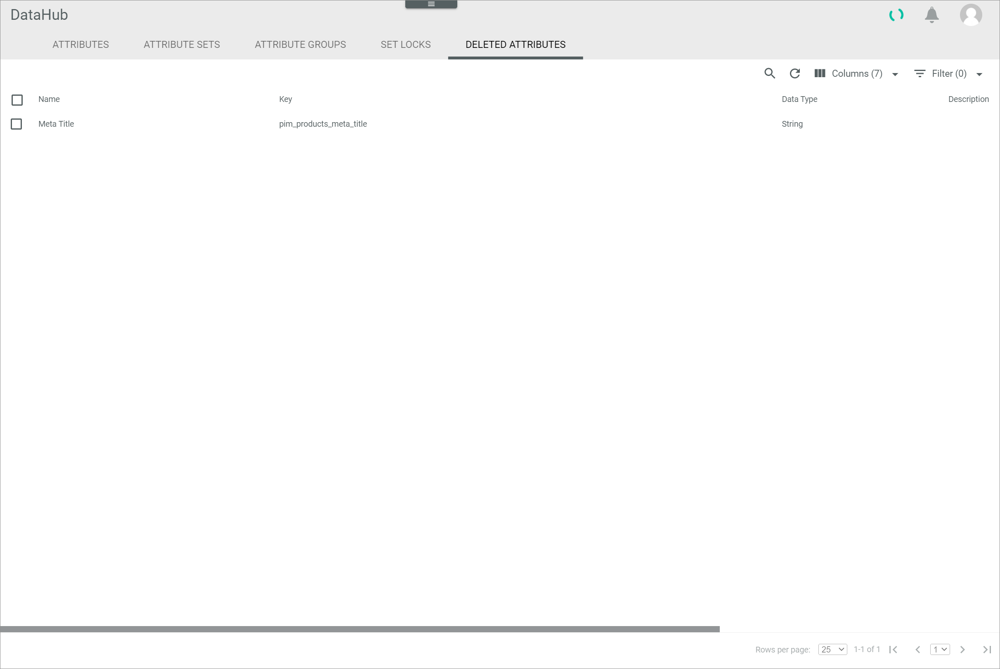

# Manage deleted attributes

Once an attribute has been deleted, it is moved to the *DELETED ATTRIBUTES* tab. However, it is not irretrievably deleted. You can recover a deleted attribute and make the deletion undone. Alternatively, you can permanently delete an attribute that is definitely no longer needed.

## Recover an attribute

Recover an attribute and undo the deletion for attributes that have been deleted by mistake.

#### Prerequisites

At least one attribute has been moved to the *DELETED ATTRIBUTES* tab, see [Delete an attribute](../Integration/01_ManageAttributes.md#edit-an-attribute).

#### Procedure

*DataHub > Settings > Tab DELETED ATTRIBUTES*

1. Select the checkbox of the attribute you want to recover in the list of deleted attributes.   
    The editing toolbar is displayed.

2. Click the [RECOVER] button in the editing toolbar.   
    The selected attribute has been recovered and is removed from the list of deleted attributes.

## Permanently delete an attribute

Permanently delete an attribute if it is no longer needed.  
There are usually dependencies on an attribute, for example through an attribute set or created products. It is recommended to deactivate an attribute instead of deleting it permanently, see [Deactivate an attribute](../Integration/01_ManageAttributes.md#deactivate-an-attribute).
Permanently deleted attributes cannot be recovered.

> [Caution] Be aware that problems may occur if you delete an attribute with existing dependencies.

#### Prerequisites

At least one attribute has been moved to the *DELETED ATTRIBUTES* tab, see [Delete an attribute](../Integration/01_ManageAttributes.md#delete-an-attribute).

#### Procedure

*DataHub > Settings > Tab DELETED ATTRIBUTES*

1. Click the checkbox of the attribute you want to permanently delete in the list of deleted attributes.    
    The editing toolbar is displayed above the attributes list.

    > [Info] If the attribute moved to the *DELETED ATTRIBUTES* tab is not yet displayed in the list of deleted attributes, click the  (Refresh) button to update the list.

2. Click the [DELETE] button in the editing toolbar.  
    The attribute has been permanently deleted. The deletion cannot be undone.

    