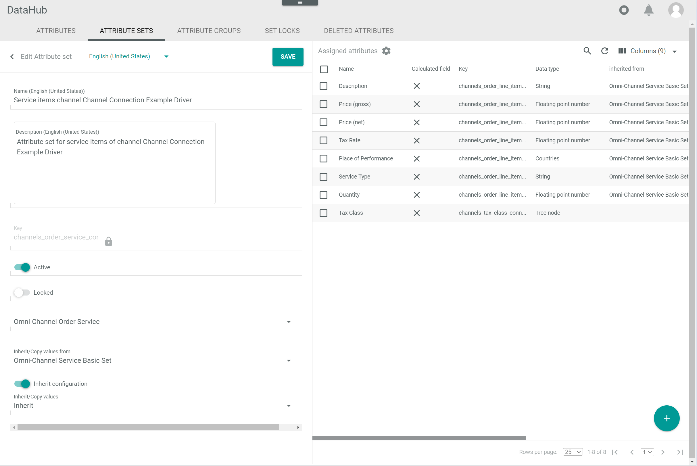
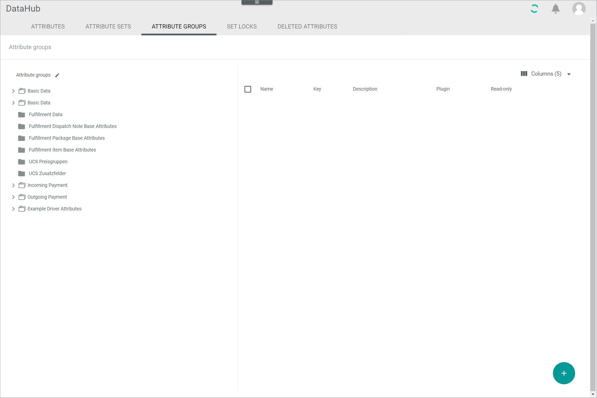

[!!Manage an attribute](../Integration/01_ManageAttributes.md)
[!!Manage an attribute set](../Integration/02_ManageAttributeSets.md)
[!!Manage an attribute group](../Integration/03_ManageAttributeGroups.md)
[!!Manage the scopes](../Integration/04_ManageScopes.md)
[!!Manage the languages](../Integration/05_ManageLanguages.md)
[!!Manage the ETL mappings](../Operation/01_ManageETLMappings.md)
[!!Data type list](../UserInterface/05_DataTypeList.md)
[!!ETL extensions list](../UserInterface/04_ETLExtensions.md)

# DataHub basics

The *Actindo Data Hub (DataHub)* module is characterized by two main points:
- The [*DataHub* data model](#data-model)
- The [*DataHub* ETL process](#etl-process)

To provide a better understanding of these particularities, both points are explained in more detail below.

## Data model

Each of the *DataHub* entity types, such as an *Omni-Channel* order, an *Omni-Channel* line item, or a product from the *Product Information Management (PIM)*, provides a highly limited set of fixed fields needed to have a functional entity type like primary identifier or stock keeping unit.   
A list of all available entities can be accessed via *Dev Tools > API > Tab DATA MODELS*. Note that not all entities listed are already based on *DataHub*.

[comment]: <> (Include link to Dev Tools when available)

By using *DataHub* you can extend those predefined fixed fields with additional fields where you can store any required data.
In the context of *DataHub*, these fields are called *Attributes*.     
For detailed information about the attributes, see [Manage an attribute](../Integration/01_ManageAttributes.md).

An attribute comes always with a *name*, a *key* and a *data type*. The latter defines the type of data an attribute can store, from a simple string to a complex price field.
The variety of data types can differ for each tenant, as every installed plugin may add its own data types.   
Nevertheless, the basic data types can be accessed in the following list, see [Data type list](../UserInterface/05_DataTypeList.md).

Attributes can be *multi-language* and/or *multi-scope*, which means that they can store a value for any combination of language and scope.   
Channels and languages can be created individually according to the custom needs, see [Manage the scopes](../Integration/04_ManageScopes.md) and [Manage the languages](../Integration/05_ManageLanguages.md).

Attributes are collected in so-called *Attribute sets*. Each entity, which is the concrete instance of a particular entity type, has exactly one attribute set that defines the available attributes.
An attribute set can only be used for a single entity type.   
For detailed information about the attribute sets, see [Manage an attribute set](../Integration/02_ManageAttributeSets.md).

Attributes are grouped in so-called *Attribute groups*. Each attribute can be assigned to exactly one attribute group.
Attribute groups are meant to organize and group the available attributes when editing an entity. They do not have any further functional meaning.   
For detailed information about the attribute groups, see [Manage an attribute group](../Integration/03_ManageAttributeGroups.md).

## ETL process

When providing fully customizable data models, also a customizable way of data exchange is required, which represents the ETL process.
ETL connects 1-n source attribute(s) to a destination attribute using a so-called *Extension*. The variety of extensions can differ for each tenant, as every installed plugin may add its own extensions.
Nevertheless, the basic ETL extensions can be accessed in the following list, see [ETL extensions list](../UserInterface/04_ETLExtensions.md).   

The values of the source attributes are extracted, transformed by the extension and loaded into the destination attribute. This connection is called *Attribute mapping*.

This process can be configured based on any required connection of a source attribute set with a destination attribute set. This connection is called *Attribute set mapping* and contains a collection of multiple attribute mappings.

For detailed information about the ETL mappings, see [Manage the ETL mappings](../Operation/01_ManageETLMappings.md).
