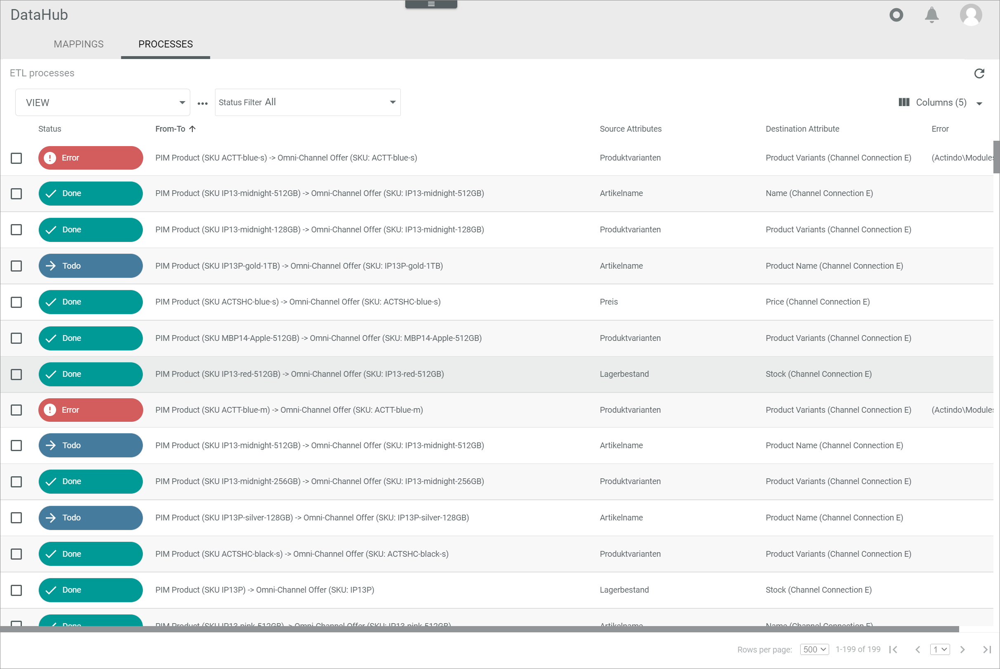
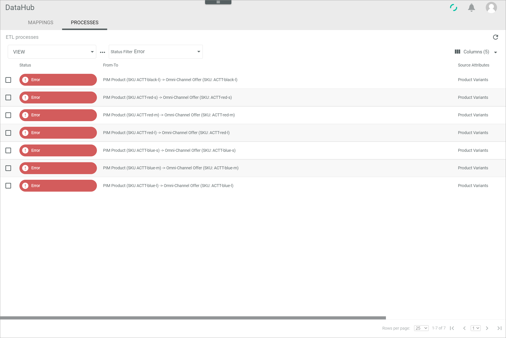

[!!Manage the ETL processes](../Operation/02_ManageETLProcesses.md)
[!!User interface ETL processes](../UserInterface/02b_ETLProcesses.md)

# Retry a faulty ETL process

If an ETL process has been canceled because of an error, the corresponding process is displayed in the *ETL PROCESSES* tab with the **Error** status. When the error has been fixed, you can restart the ETL process to rerun the corresponding mapping.

#### Error Description

An ETL process fails and the process status *Error* is displayed.

Follow the instructions below to restart the ETL process after you have fixed the cause of the error.

#### Prerequisites

The cause of the faulty ETL process has been fixed.

#### Procedure

*DataHub > ETL > Tab PROCESSES*

1. Click the *Status filter* drop-down list and select the **Error** status in the list.
    All ETL processes with the **Error** status are displayed.

    

2. Select the checkbox of the mapping you want to restart.   
    The editing toolbar is displayed above the list.

3. Click the [RETRY] button in the editing toolbar.   
    The selected mapping has been restarted. The pop-up window *Process will be retried shortly* is displayed.

    

    If the rerun is successful, the mapping status will change to **Done** and will be removed from the list of mappings with the **Error** status.

#### Was this chapter helpful?

If you need further assistance, please contact your MPS consultant.
