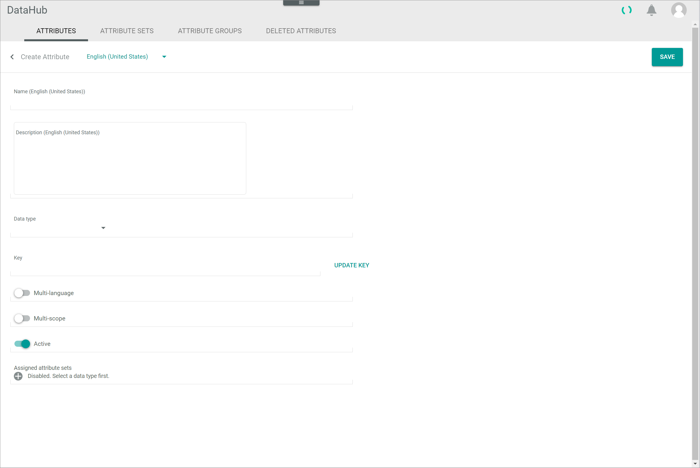
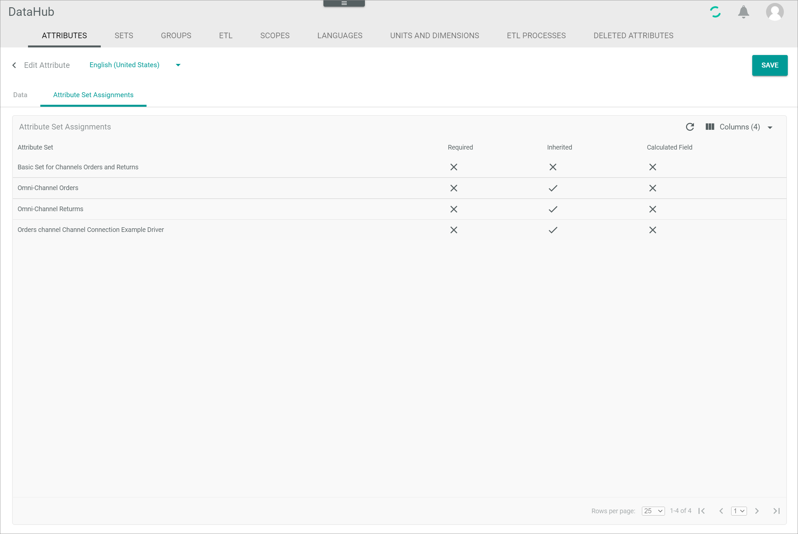
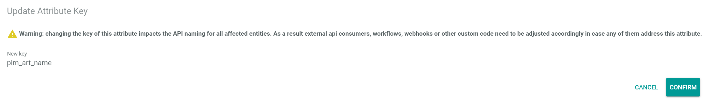

[!!Data type list](./05_DataTypeList.md)
[!!Manage an attribute](../Integration/01_ManageAttributes.md)
[!!Manage an attribute set](../Integration/02_ManageAttributeSets.md)

# Attributes

*DataHub > Data model > Tab ATTRIBUTES*

**Attribute list**   

The list displays all attributes. Depending on the settings, the displayed columns may vary. All fields are read-only.

The following functions are available for the editing toolbar:

- [x]     
    Select the checkbox to display the editing toolbar. You cannot select multiple checkboxes at once.

- [EDIT]   
    Click this button to edit the selected attribute. The *Edit attribute* view is displayed, see [Edit attribute](#edit-attribute). This button is only displayed if the checkbox of an attribute is selected. Alternatively, you can click directly a row in the list to edit an attribute.   

- [DELETE]   
    Click this button to delete the selected attribute. This button is only displayed if the checkbox of an attribute is selected.       

The following functions and fields are available in this view:

- *Name*   
    Attribute name.

- *Active*   
    Attribute status. The following statuses are available:
    -  **Active**
    -  **Inactive**   

[comment]: <> (Spalte sollte Status heißen. Kommt das hier aus den Translation files?)

- *Group*   
    Attribute group to which the attributes are assigned. If the attribute is not assigned to any attribute group, *not assigned* is displayed.

- *Key*   
    Attribute key.

- *Data type*   
    Attribute data type.   
    For detailed information about all data types, see [Data type list](./05_DataTypeList.md).

- *Description*   
    Description to the attribute.

- *Multi-language*   
    Indication whether the attribute is multi-language or not:
    -  (Checkmark): The attribute is multi-language.  
    -  (Cross): The attribute is single language.

- *Multi-scope*   
    Indication whether the attribute is multi-scope or not:
    -  (Checkmark): The attribute is multi-scope.  
    -  (Cross): The attribute is single scope.

- *Plugin*   
    Module or plugin that owns the attribute.

- *ID*   
    Attribute identification number. The ID number is automatically assigned by the system.

- *Modified on*   
    Date and time of the last modification.

- *Modified by*   
    Name and username of the user who modified the attribute.

- *Created on*   
    Date and time of the creation.

- *Created by*   
    Name and username of the user who created the attribute.

- *Name (Language)*   
    Attribute name in the selected language. A single column is displayed for the system languages *English (United States)* and *Deutsch (Deutschland)*.

- *Description (Language)*   
    Attribute description in the selected language. A single column is displayed for the system languages *English (United States)* and *Deutsch (Deutschland)*.

-  (Add)   
    Click this button to create an attribute. The *Create attribute* view is displayed, see [Create attribute](#create-attribute).   

## Create attribute

*DataHub > Data model > Tab ATTRIBUTES > Button Add*

**Create attribute**

The *Create attribute* view contains all fields and configurations that define the properties of an attribute.

- *"Language name"*   
    Click the drop-down list and select the language in which the *Name (Language)* and *Description (Language)* fields are displayed. By default, the following options are available:
    - **English (United States)**
    - **Deutsch (Deutschland)**

- [SAVE]   
    Click this button to save the attribute. The *Create attribute* view is closed.

- *Name (Language)*   
    Enter an attribute name in the selected language.

- *Description (Language)*   
    Enter a description to the attribute in the selected language.

- *Data type*   
    Click the drop-down list and select an attribute data type. The  (Add) button in the *Assigned attribute sets* field is unlocked.   

- *Key*   
    Enter an attribute key. The key is required for API access and must be system wide unique. An attribute key must fulfill the following criteria:
    - valid characters are **a-z** (upper and lower case), **0-9** and the underscore ( **_** )
    - the key must not start with a number
    - a double underscore ( **___** ) and a trailing underscore are forbidden

[comment]: <> (UPDATE KEY -> Bitte aus Create attribute view abbauen!)

-  *Multi-language*   
    Enable this toggle to create a multi-language attribute. Disable the toggle to create a single language attribute. By default, this toggle is disabled.

-  *Multi-scope*   
    Enable this toggle to create a multi-scope attribute. Disable the toggle to create a single scope attribute. By default, this toggle is disabled.

-  *Active*   
    Enable this toggle to set the attribute status to active. Disable the toggle to set the status to inactive. By default, this toggle is enabled.

-  *Contains sensitive data*   
    Enable this toggle if the potential attribute values may be sensitive. This toggle is only displayed after selecting certain data types in the *Data type* drop-down list. By default, this toggle is disabled.

- *Assigned attribute sets*   
    Click the drop-down list and select an attribute set to which the attribute is assigned after creation. All active attribute sets are displayed. This drop-down list is only displayed if you have previously clicked the  (Add) button.
    -  (Add)    
        Click this button to add an attribute set drop-down list. You can add an infinite number of attribute sets.
    -  (Delete)   
        Click this button to delete the corresponding attribute set.

    > [Info] If you do not assign the attribute to an attribute set at this point, you will have to do it afterwards in the corresponding attribute set(s), see [Add an attribute to the set](../Integration/02_ManageAttributeSets.md#add-an-attribute-to-the-set).

**CONFIGURATION**

The *CONFIGURATION* section displays the additional configuration for the selected data type. The configuration fields differ depending on the selected data type.    
As some data types have no further configuration settings, no *CONFIGURATION* section is displayed for these data types.   

## Edit attribute

*DataHub > Data model > Tab ATTRIBUTES > Select attribute > Tab Data*

**Edit attribute**

The *Edit attribute* view contains all fields and configurations that define the properties of an attribute. It consists of the following tabs:   
- [Data](#edit-attribute-–-data)
- [Attribute set assignments](#edit-attribute-–-attribute-set-assignments)

- *"Language name"*   
    Click the drop-down list and select the language in which the *Name (Language)* and *Description (Language)* fields are displayed. By default, the following options are available:
    - **English (United States)**
    - **Deutsch (Deutschland)**

- [SAVE]   
    Click this button to save the attribute. The *Edit attribute* view is closed.

### Edit attribute &ndash; Data

*DataHub > Data model > Tab ATTRIBUTES > Select attribute > Tab Data*

 

**Edit attribute**

- *Name (Language)*   
    Click the field to edit the attribute name in the selected language.

- *Description (Language)*   
    Click the field to edit the description to the attribute in the selected language.

- *Data type*   
    Attribute data type. In the *Edit attribute* view, this field is locked.    
    For detailed information about all data types, see [Data type list](./05_DataTypeList.md).

- *Key*   
    Attribute key. In the *Edit attribute* view, this field is locked.

- *UPDATE KEY*  
    Click this button to edit the attribute key. The *Update attribute key* window is displayed, see [Update attribute key](#update-attribute-key). 

-  *Multi-language*   
    This toggle indicates whether the attribute is multi-language or not. In the *Edit attribute* view, this toggle is read-only.

-  *Multi-scope*   
    This toggle indicates whether the attribute is multi-scope or not. In the *Edit attribute* view, this toggle is read-only.

-  *Active*   
    Enable this toggle to set the attribute status to active. Disable the toggle to set the status to inactive. By default, this toggle is enabled.

-  *Contains sensitive data*   
    Enable this toggle if the potential attribute values may be sensitive. By default, this toggle is disabled.

**CONFIGURATION**

The *CONFIGURATION* section displays the additional configuration for the selected data type. The configuration fields differ depending on the selected data type.   
As some data types have no further configuration settings, no *CONFIGURATION* section is displayed for these data types.     

### Edit attribute &ndash; Attribute set assignments

*DataHub > Data model > Tab ATTRIBUTES > Select attribute > Tab Attribute set assignments*

**Attribute set assignments**

The list displays all attributes. Depending on the settings, the displayed columns may vary. All fields are read-only.

- *Attribute set*   
    Assigned attribute set.

- *Required*   
    Indication whether the attribute is a required field in the attribute set or not:
    -  (Checkmark): The attribute is required.  
    -  (Cross): The attribute is optional.

- *Inherited*   
    Indication whether the attribute is an inherited attribute to the attribute set or not:
    -  (Checkmark): The attribute is inherited.  
    -  (Cross): The attribute is not inherited.

- *Calculated field*   
    Indication whether the attribute (field) value is calculated by an ETL mapping from other field(s) in the same entity to itself or not:
    -  (Checkmark): The attribute is a calculated field.   
    -  (Cross): The attribute is no calculated field.

### Update attribute key

*DataHub > Data model > Tab ATTRIBUTES > Select attribute > Tab Data > Button UPDATE KEY*

> [Caution] Changing an attribute key has far-reaching consequences. Make sure you read carefully and understand the warning in this window. For detailed information, see [Edit an attribute](../Integration/01_ManageAttributes.md#edit-an-attribute). 

- *New key*  
    Enter the new key. The current attribute key is displayed.

- [CONFIRM]  
    Click this button to confirm the new key. 

- [CANCEL]  
    Click this button to cancel updating the attribute key.