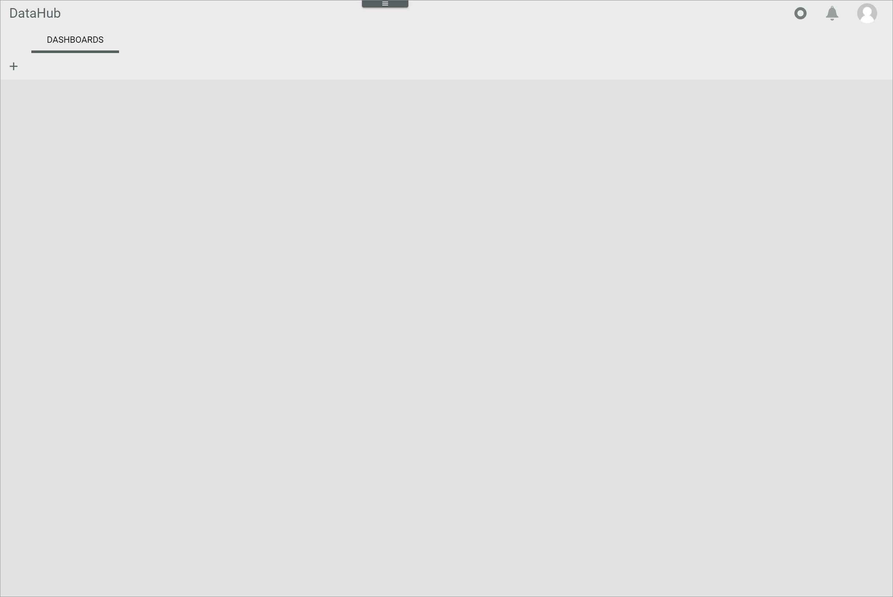
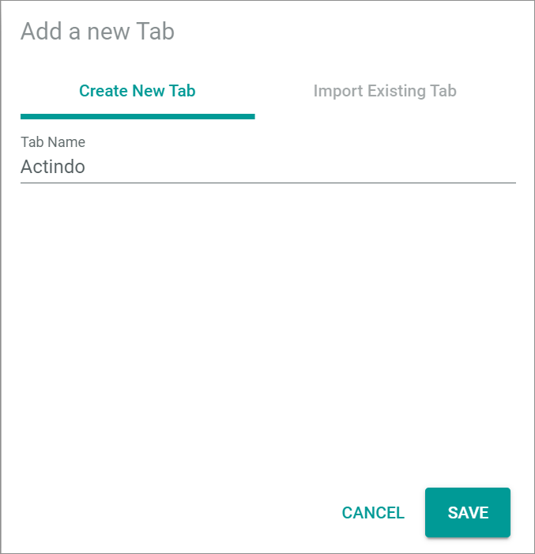
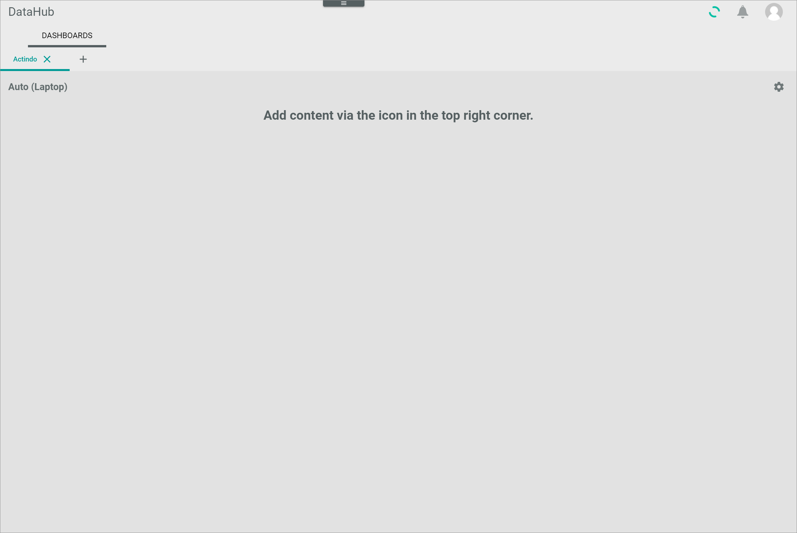
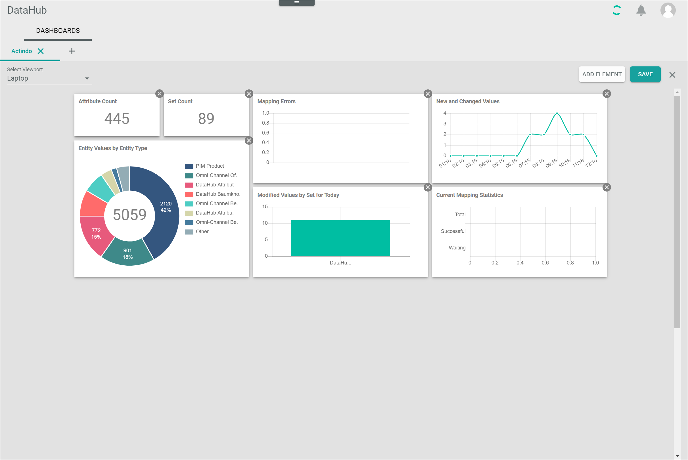

[!!Manage the dashboards](../Operation/04_ManageDashboards.md)

# Dashboards

*DataHub > Overview > Tab DASHBOARDS*

In the *DASHBOARDS* tab, the custom tabs with composable dashlets are displayed. By default no tab is created.

-  (Add)   
    Click this button to add a new tab to display different dashlets. The *Add a new tab* window is displayed.

-  (Delete)   
    Click this button to delete the selected tab. The *Confirm tab deletion* window is displayed. This button is displayed to the right of the tab name.

## Add a new tab

*DataHub > Overview > Tab DASHBOARDS > Button Add*

**Create new tab**

- *Tab Name*   
    Enter a name for the new tab.

- [CANCEL]   
    Click this button to cancel creating a tab. The *Add a new tab* window is closed.

- [SAVE]   
    Click this button to save the tab with the entered name. The *Add a new tab* window is closed. The new tab is created.

**Import existing tab**

The *Import existing tab* tab is locked. It is only available in the *Actindo Dashboard*.

[comment]: <> (Link zu Actindo dashboard einfügen sobald beschrieben)

## Confirm tab deletion

*DataHub > Overview > Tab DASHBOARDS > Button Delete*

- [CANCEL]   
    Click this button to cancel deleting the selected tab. The *Confirm tab deletion* window is closed.

- [ACCEPT]   
    Click this button to delete the selected tab. The *Confirm tab deletion* window is closed. The tab and its dashlets are deleted.

## Tab

*DataHub > Overview > Tab DASHBOARDS > Select tab*   
*DataHub > Overview > Tab DASHBOARDS > Button Add > Button Save*   

-  (Settings)   
    Click this button to edit the tab. The *Edit tab* view is displayed.  

### Edit tab

*DataHub > Overview > Tab DASHBOARDS > Select tab > Button Settings*   
*DataHub > Overview > Tab DASHBOARDS > Button Add > Button Save > Button Settings*  

- *Select Viewport*   
    Click the drop-down list to select the view to be applied to the tab. A different view can be selected for each tab. The drop-down list is only displayed in the *Edit tab* view. The following options are available:    
    - **Automatic**   
        The system automatically detects the appropriate view and applies it to the tab.
    - **Mobile**   
        The mobile view is applied to the tab.  
    - **Tablet**   
        The tablet view is applied to the tab.  
    - **Laptop**   
        The laptop view is applied to the tab.  
    - **Desktop**   
        The desktop view is applied to the tab.  

- [ADD ELEMENT]   
    Click the button to add a dashlet to the selected tab. The *Dashlet picker* window is displayed.

- [SAVE]   
    Click this button to save any changes. The changes are applied. The *Edit tab* view is closed.

-  (Cancel)   
    Click this button to cancel editing the tab. Any changes are rejected. The *Edit tab* view is closed.

- Dashlet   
    Hover over a dashlet until the cursor icon changes to the cross arrows cursor. Then move the dashlet on the predefined grid using drag and drop. To remove a dashlet from the tab, click the  (Remove) button in the upper right corner of the dashlet.  

#### Dashlet picker

*DataHub > Overview > Tab DASHBOARDS > Select tab > Button Settings > Button ADD ELEMENT*   
*DataHub > Overview > Tab DASHBOARDS > Button Add > Button Save > Button Settings > Button ADD ELEMENT*  

- [x]    
    Select a checkbox to add the selected dashlet to the tab. You can select multiple checkboxes. If you click the checkbox in the header, all dashlets in the list are selected. A toolbar indicating the number of selected dashlets is displayed above the list when you have selected at least one checkbox.   
    By default, the following dashlets are available:
    - *Attribute Count*   
        This dashlet displays the number of attributes in the *DataHub* module.
    - *Language Count*   
        This dashlet displays the number of languages in the *DataHub* module.
    -	*Set Count*   
        This dashlet displays the number of attribute sets in the *DataHub* module.
    -	*Entity Type Count*   
        This dashlet displays the number of entity types in the *DataHub* module.
    -	*Group Count*   
        This dashlet displays the number of groups in the *DataHub* module.
    -	*Channel Count*   
        This dashlet displays the number of channels in the *DataHub* module.
    -	*Entity Values by Entity Type*   
        This dashlet displays a ring chart with the distribution of entity values by entity type in the *DataHub* module.
    -	*Mapping Errors*   
        This dashlet displays a chart with the number of mapping errors in the *DataHub* module.
    -	*New and Changed Values*   
        This dashlet displays a line chart with the number of new and changed values within a certain period of time in the *DataHub* module.
    -	*Modified Values by Set for Today*   
        This dashlet displays a chart with the number of today's modified values within an attribute set in the *DataHub* module.
    -	*Current Mapping Statistics*   
        This dashlet displays a bar chart with the average and current number of mappings. These numbers are displayed for the waiting, the successful and all mappings in the *DataHub* module.
    -	*ETL Mapping History*   
        This dashlet displays a chart with the history of mapping number for the waiting, the successful and all mappings in the *DataHub* module.
    -	*DataHub Flow*   
        This dashlet displays a flow chart with connection of mappings between the different entities. By enabling the *Show Disconnected Nodes* toggle, also those entities without any mapping connection are displayed in the flow chart.  

- [CANCEL]   
    Click this button to cancel adding dashlets. The *Dashlet picker* window is closed.

- [ACCEPT]   
    Click this button to add the selected dashlets to the tab. The *Dashlet picker* window is closed. The dashlets are displayed in the tab.
