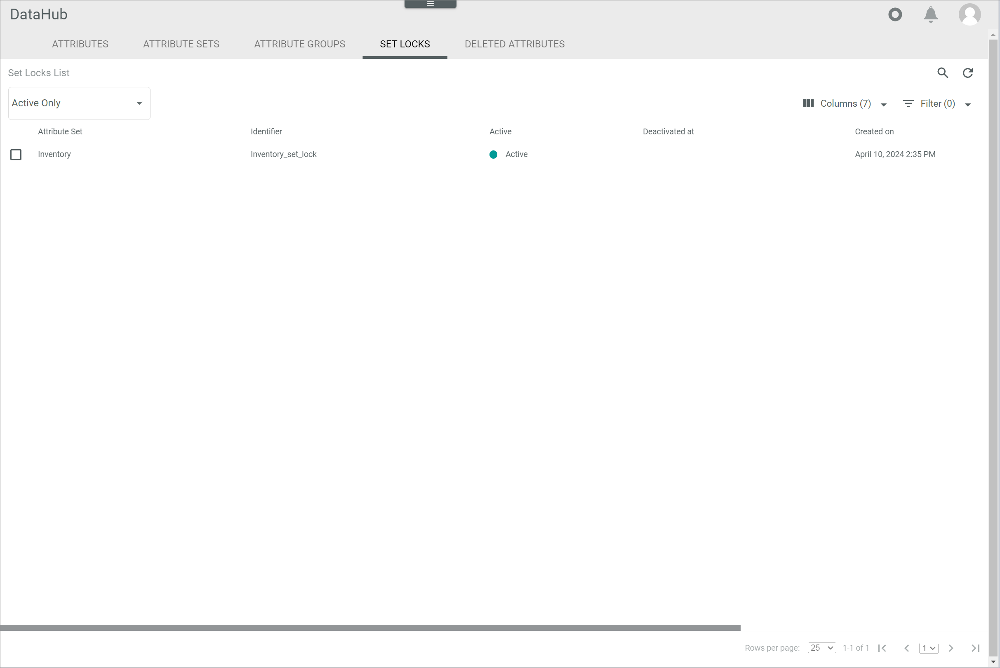

[!!Manage an attribute set](../Integration/02_ManageAttributeSets.md)

# Attribute set locks

*DataHub > Data model > Tab SET LOCKS*

**Attribute set locks list**

The attribute set locks list displays all attribute sets that have been locked for maintenance purposes. Depending on the settings, the displayed columns may vary. All fields are read-only.

- *Active only*  
    Click this drop-down list to select the display settings for the attribute set locks. The following options are available:
    -  *Active only*  
        Only the attribute set locks that are currently active are displayed.
    - *All*  
        All attribute set locks created in the system are displayed.

- *Attribute set*  
    Name of the attribute set locked for maintenance.

- *Identifier*  
    Attribute set identification number.

[comment]: <> (Was ist identifier hier? Attribute set ID oder Key? Was ist der Unterschied zwischen diesem Identifier und ID-Spalte? S. unten. Stimmt das so?)

- *Active*  
    Indication whether the attribute set lock is active or not:
    -  (Checkmark): The attribute is active.  
    -  (Cross): The attribute is not active.

- *Deactivated at*    
    Date and time of the last deactivation.

- *Deactivated by*  
    Name and username of the user who deactivated the attribute set lock.

- *Created on*   
    Date and time of the creation.

- *Created by*   
    Name and username of the user who created the attribute set lock.

- *ID*  
    Set lock identification number. The ID number is automatically assigned by the system. 

