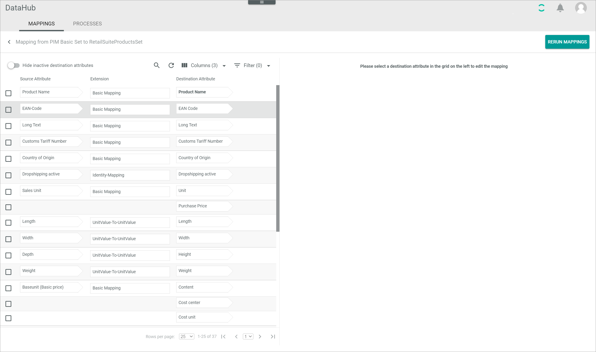
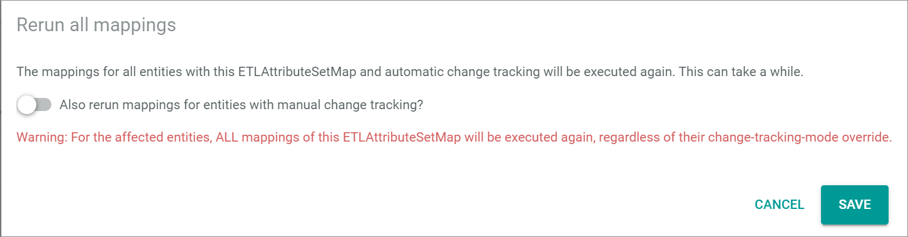

[!!ETL extensions list](./04_ETLExtensions.md)
[!!Data type list](./05_DataTypeList.md)
[!!Manage an attribute](../Integration/01_ManageAttributes.md)
[!!Manage an attribute set](../Integration/02_ManageAttributeSets.md)
[!!Manage the ETL mappings](../Operation/01_ManageETLMappings.md)

# Mappings

*DataHub > ETL > Tab MAPPINGS*

**Attribute set mappings**

The list displays all attribute set mappings. Depending on the settings, the displayed columns may vary. All fields are read-only.

The following functions are available for the editing toolbar:

- [x]     
    Select a checkbox to display the editing toolbar. You cannot select multiple checkboxes at once.

-  (Edit)   
    Click this button to edit the selected attribute set mapping. The *Mapping* view is displayed, see [Mapping](#mapping). This button is only displayed if the checkbox of an attribute set mapping is selected. Alternatively, you can click directly a row in the list to edit an attribute set mapping.

The following functions and fields are available in this view:

- *Source attribute set*   
    Name of the attribute set from which the mapping is run.

- *Destination attribute set*   
    Name of the attribute set to which the mapping is run.

- *Language*   
    Language from which the value of a multi-language attribute is taken when mapping it to a single language attribute.

- *Scope*   
    Scope from which the value of a multi-scope attribute is taken when mapping it to a single scope attribute.

- *ID*   
    Attribute set identification number. The ID number is automatically assigned by the system.

- *Modified on*   
    Date and time of the last modification.

- *Modified by*   
    Name and username of the user who modified the attribute set mapping.

- *Created on*   
    Date and time of the creation.

- *Created by*   
    Name and username of the user who created the attribute set mapping.

-  (Add)   
    Click this button to create an attribute set mapping. The *Create ETL attribute set mapping* window is displayed, see [Create ETL attribute set mapping](#create-etl-attribute-set-mapping).   

## Create ETL attribute set mapping

*DataHub > ETL > Tab MAPPINGS > Button Add*

- *Source attribute set*   
    Click the drop-down list and select the appropriate source attribute set for the mapping. All attribute sets are displayed in the drop-down list. Use the search bar in the drop-down list to search for an attribute set.

- *Destination attribute set*   
    Click the drop-down list and select the appropriate destination attribute set for the mapping. All attribute sets are displayed in the drop-down list. Use the search bar in the drop-down list to search for an attribute set. The *Copy ETL attribute set mapping* drop-down list is unlocked if any attribute set mapping with the selected destination attribute set already exists.

- *Language*   
    Click the drop-down list and select the language from which the value of a multi-language attribute will be taken when mapping it to a single language attribute. All available languages are displayed in the drop-down list.

- *Scope*   
    Click the drop-down list and select the scope from which the value of a multi-scope attribute will be taken when mapping it to a single scope attribute. All available scopes are displayed in the drop-down list.

- *Copy ETL attribute set mapping*   
    Click the drop-down list and select an ETL attribute set mapping to apply all matching attribute mappings to the new ETL attribute set mapping. All attribute set mappings whose destination attribute set matches or has inheritance relations to the selected destination attribute set are displayed in the drop-down list. If no attribute set mapping is selected, no attribute mappings are copied from another mapping. The drop-down list is locked if no attribute set mapping with the selected destination attribute set already exists.

- [CANCEL]   
    Click this button to cancel creating an attribute set mapping. The *Create ETL attribute set mapping* window is closed.

- [SAVE]   
    Click this button to save the new attribute set mapping. The *Create ETL attribute set mapping* window is closed.

## Mapping

*DataHub > ETL > Tab MAPPINGS > Select attribute set mapping*

- [RERUN MAPPINGS]   
    Click this button to rerun all attribute mappings within the attribute set mapping. The *Rerun all mappings* window is displayed, see [Rerun all mappings](#rerun-all-mappings). 

**Mapping from "Source attribute set name" to "Destination attribute set name"**

This view displays the attribute set mappings on the left side of the view. 

-  *Hide inactive destination attributes*   
    Enable this toggle to hide all inactive destination attributes in the list of attribute mappings. Disable the toggle to display all destination attributes independently on their status. By default, this toggle is disabled.

The following functions are available for the editing toolbar:

- [x]     
    Select a checkbox to display the editing toolbar. You cannot select multiple checkboxes at once.

-  (Edit)   
    Click this button to edit the mapping to the selected destination attribute. The *Settings* section is displayed, see [Settings](#settings). This button is only displayed if the checkbox of a mapping is selected. Alternatively, you can click directly a row in the list to edit the mapping to a destination attribute.

-  (Delete)   
    Click this button to delete the selected mapping to the destination attribute. This button is only displayed if the checkbox of a mapping is selected.       

- [ADD TO SOURCE SET AND MAP]   
    Click this button to add the selected destination attribute to the source attribute set and create a mapping. The *Identity mapping* extension is used to map the attributes, see [Identity mapping](./04_ETLExtensions.md#identity-mapping). The button is only displayed if no mapping to the selected destination attribute already exists and if the identical attributes are contained in both the source attribute and the destination attribute set.

- [RERUN SELECTED MAPPING]   
    Click this button to rerun the selected attribute mapping. The button is only displayed if a mapping to the selected destination attribute already exists. The *Rerun single mapping* window is displayed, see [Rerun single mapping](#rerun-single-mapping).

- [CUSTOM DESTINATION ATTRIBUTE SCOPE AND LANGUAGE]    
    Click this button to define a custom scope and/or language attribute mapping for the selected destination attribute. The *Settings* section is displayed on the right side of the *Mapping from "Source attribute set name" to "Destination attribute set name"* view with a drop-down list for the language and/or scope. The button is only displayed if the destination attribute of the selected mapping is multi-language or multi-scope.   

The following functions and fields are available on the left side of the view:

- *Source attribute*   
    Name of the source attribute which is mapped to the destination attribute. The source attribute is only displayed if a mapping to the destination attribute exists.

- *Extension*   
    Selected extension for the mapping. The extension is only displayed if a mapping exists.

- *Destination attribute*   
    Name of the destination attribute to which the source attribute is mapped.

- *ID*   
    Attribute mapping identification number. The ID number is automatically assigned by the system.

### Settings

*DataHub > ETL > Tab MAPPINGS > Select attribute set mapping > Select attribute mapping > Button Edit*

The *Settings* section on the right side of the *Mapping from "Source attribute set name" to "Destination attribute set name"* view is only displayed if you edit an attribute mapping.   
Depending on the selected row in the list of mappings, the fields displayed in the *Settings* section differ:   
- If the selected row contains only a destination attribute, the destination attribute as well as the *Extension* and *Override change tracking mode* drop-down lists are displayed.   
- If the selected row contains an attribute mapping with source, destination attribute and the extension, the destination attribute as well as the *Source attribute*, *Extension* and *Override change tracking mode* drop-down lists are displayed. The *Source attribute*, *Extension* and *Override change tracking mode* drop-down lists are preset.    
- If the selected extension requires further configuration settings, the *Configuration* section is displayed below the *Settings* section.   

The following functions and fields are available in the *Settings* section:

- [SAVE]   
    Click this button to save any changes to the attribute mapping. The *Settings* section is hidden.

- *"Destination attribute name"*   
    The selected destination attribute is displayed in the arrow box on the right side. This field is read-only.

- *Extension*   
    Click the drop-down list and select the appropriate ETL extension for the attribute mapping. The displayed extensions depend on the data type of the selected destination attribute.    

- *Override change tracking mode*   
    Click the drop-down list and select the change tracking mode of the mapping. By default, the **Use default** option is selected. The following modes are available:
    - **Use default**   
        The mapping configured in the dependency of the specific entities is applied.
    - **Automatic**   
        The initial mapping is automatically applied. All value changes or reruns are applied automatically in the mapping.  
    - **Semiautomatic**   
        The initial mapping is automatically applied. Value changes or reruns are applied after confirmation.
    - **Semiautomatic, changes must be confirmed by another user**   
        The initial mapping as well as value changes or reruns are applied after confirmation by another user.
    - **Manual**   
        The initial mapping is automatically applied. Afterwards, the changes in the mapping must be triggered manually to be applied.

- *Source attribute*   
    Click the drop-down list within the arrow box and select the appropriate source attribute for the mapping. Depending on the selected ETL extension, one or several *Source attribute* arrow boxes are displayed. The selection in the drop-down list depends on the selected ETL extension, which defines the required data type of the source attribute(s).    

**Configuration**

The *Configuration* section displays the additional configuration for the mapping. The configuration fields differ depending on the selected ETL extension.    

### Rerun all mappings

[comment]: <> (Check screenshot in terminologie-einspielen)

*DataHub > ETL > Tab MAPPINGS > Select attribute set mapping > Button RERUN MAPPINGS*

-  *Also rerun mappings for entities with manual change tracking?*   
    Enable this toggle to rerun all attribute mappings regardless of their change tracking mode. Disable the toggle to rerun the mapping excluding all mappings with a manual change tracking mode. By default, this toggle is disabled.

- [CANCEL]   
    Click this button to cancel the rerun of all mappings. The *Rerun all mappings* window is closed.

- [SAVE]   
    Click this button to rerun all attribute mappings within the attribute set. The *Rerun all mappings* window is closed.

### Rerun single mapping

[comment]: <> (Check screenshot in terminologie-einspielen)

*DataHub > ETL > Tab MAPPINGS > Select attribute set mapping > Select attribute mapping > Button RERUN SELECTED MAPPING*

-  *Also rerun mapping for entities with manual change tracking (or if the change-tracking override of this mapping is manual)?*   
    Enable this toggle to rerun the attribute mapping regardless of its change tracking mode. Disable the toggle to rerun the mapping only if the manual change tracking mode is not assigned to this mapping. By default, this toggle is disabled.

- [CANCEL]   
    Click this button to cancel the rerun of the selected mapping. The *Rerun single mapping* window is closed.

- [SAVE]   
    Click this button to rerun the selected attribute mapping. The *Rerun single mapping* window is closed.

