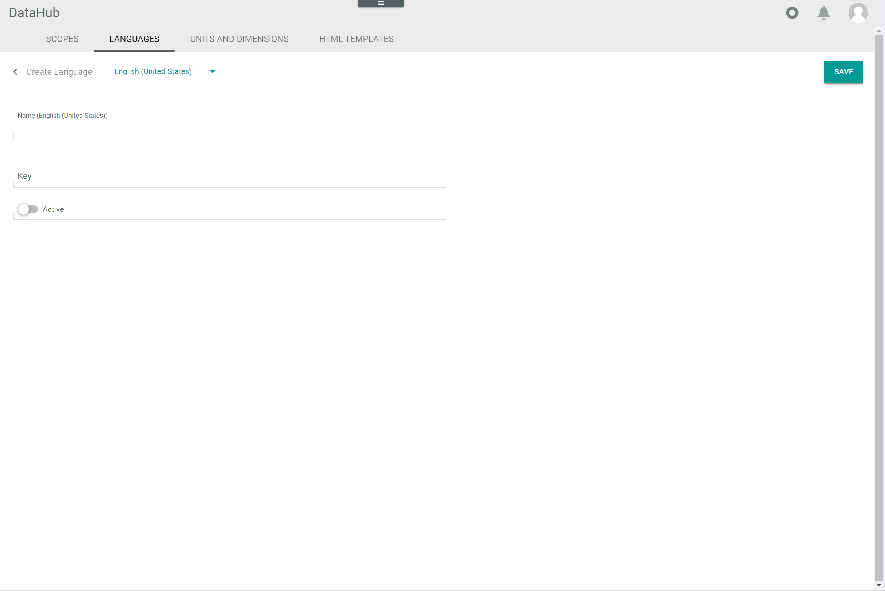

# Languages

*DataHub > Settings > Tab LANGUAGES*

**Language list**

-  (Search)   
  Click this button to display the search bar and search for a language.

-  (Refresh)   
  Click this button to update the list of languages.

-  Columns (x)   
  Click this button to display the columns bar and customize the displayed columns and the order of columns in the list. The *x* indicates the number of columns that are currently displayed in the list.

-  Filter (x)   
  Click this button to display the filter bar and customize the active filters. The *x* indicates the number of filters that are currently active.

- [x]     
  Select the checkbox to display the editing toolbar. If you click the checkbox in the header, all languages in the list are selected.

- [EDIT]   
  Click this button to edit the selected language. This button is only displayed, when a single checkbox of a language is selected. Alternatively, you can click directly a row in the list to edit a language.
  For detailed information, see [Edit a language](../Integration/05_ManageLanguages.md#edit-a-language).

- [DELETE]   
  Click this button to delete the selected language. This button is only displayed, when the checkbox of at least one language is selected.       

The list displays all language. Depending on the settings, the displayed columns may vary. All fields are read-only.

- *Key*   
  Language key.

- *Language*   
  Language name.

- *ID*   
  Language identification number. The ID number is automatically assigned by the system.

- *Modified on*   
  Date and time of the last modification.

- *Modified by*   
  Name and username of the user who modified the language.

- *Created on*   
  Date and time of the creation.

- *Created by*   
  Name and username of the user who created the language.

-  (Add)   
  Click this button to create a language. The *Create language* view is displayed.   

## Create language

*DataHub > Settings > Tab LANGUAGES > Button Add*

**Create language**

-  (Back)   
  Click this button to close the *Create language* view and return to the language list. All changes are rejected.

- Language   
  Click the drop-down list and select the language in which the *Name (Language)* field is displayed. The system languages **English (United States)** and **Deutsch (Deutschland)** are available in the drop-down list.

- [SAVE]   
  Click this button to save the language, close the *Create language* view and return to the language list.

- *Name (Language)*   
  Enter a language name in the selected language.

- *Key*   
  Enter a language key. The key is required for API access and must be system wide unique. The language key must fulfill the criteria of the language codes according to [RFC 4646](https://www.heise.de/netze/rfc/rfcs/rfc4646.shtml). For instance, keys with the following structure are valid:
  - en
  - en_US
  - en-US

-  *Active*   
  Enable this toggle to set the language status to active. Disable the toggle to set the language to inactive. By default, this toggle is disabled.

## Edit language

*DataHub > Settings > Tab LANGUAGES > Select language*

**Edit language**

-  (Back)   
  Click this button to close the *Edit Language* view and return to the language list. All changes are rejected.

- Language   
  Click the drop-down list and select the language in which the *Name (Language)* field is displayed. The system languages **English (United States)** and **Deutsch (Deutschland)** are available in the drop-down list.

- [SAVE]   
  Click this button to save the language, close the *Edit language* view and return to the language list.

- *Name (Language)*   
  Click the field to edit the language name in the selected language.

- *Key*   
  Click the field to edit the language key. It is not recommended to change the language key after creation.   
  The key is required for API access and must be system wide unique. The language key must fulfill the criteria of the language codes according to [RFC 4646](https://www.heise.de/netze/rfc/rfcs/rfc4646.shtml). For instance, keys with the following structure are valid:
  - en
  - en_US
  - en-US

-  *Active*   
  Enable this toggle to set the language status to active. Disable the toggle to set the language to inactive. By default, this toggle is disabled.
