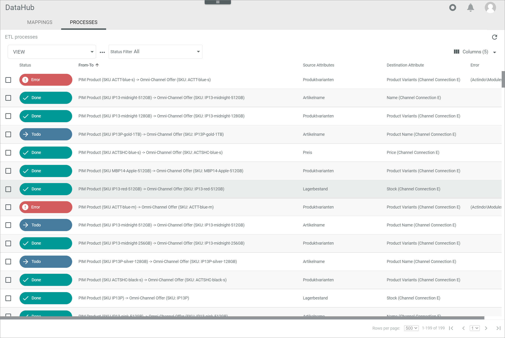
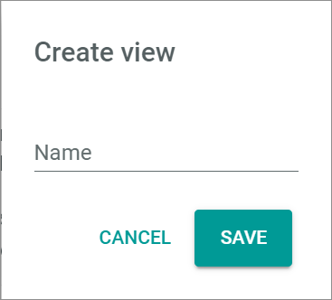
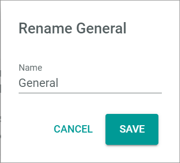

# ETL processes

*DataHub > Settings > Tab ETL PROCESSES*

**ETL processes**

- *VIEW*  
  Click the drop-down list to select the view. All created views are displayed in the drop-down list. Click the  (Points) button to the right of the *VIEW* drop-down list to display the context menu and create a view. For detailed information, see [Create view](#create-view).

  -  (Points)      
    Click this button to the right of the *View* drop-down list to display the context menu. The following menu entries are available:

    -  create  
      Click this entry to create a view. The *Create view* window is displayed.

    -  rename  
      Click this entry to rename the selected view. The *Rename view* window is displayed. This menu entry is only displayed when a view is selected.

    -  reset  
      Click this entry to reset the view to the selected views settings. This menu entry is only displayed when a view is selected and any changes are made to the views settings.

    -  publish  
      Click this entry to publish the view. This menu entry is only displayed when a view is selected and unpublished.

    -  unpublish  
      Click this entry to unpublish the view. This menu entry is only displayed when a view is selected and published.

    -  save  
      Click this entry to save the current view settings in the selected view. This menu entry is only displayed when a view is selected.

      > [Info] When the settings of a view have been changed, an asterisk is displayed behind the view name. The asterisk is hidden as soon as the changes have been saved.

    -  delete  
      Click this entry to delete the selected view. A confirmation window to confirm the deletion is displayed. This menu entry is only displayed when a view is selected.

- *Status filter*   
  Click the drop-down list to filter the ETL processes for a certain status. The following options are available:
  - **All**   
    All ETL processes are displayed. By default, this mode is selected.
  - **Todo**   
    All pending ETL processes are displayed.
  - **Error**   
    All faulty ETL processes are displayed.
  - **Done**   
    All completed ETL processes are displayed.
  - **Destination frozen**   
    All ETL processes, whose destination attribute is blocked because the corresponding entity is opened by a user, are displayed.
  - **Awaiting confirmation**   
    All ETL processes that must be confirmed are displayed.
  - **Synchronous**   
    All ETL processes that are executed synchronously are displayed for the duration of processing.
  - **Awaiting confirmation different user**   
    All ETL processes that must be confirmed by another user than the creator are displayed.
  - **Semi-automatic accepted**   
    All ETL processes have been confirmed are displayed.   

-  (Refresh)   
  Click this button to update the list of ETL processes.

-  Columns (x)   
  Click this button to display the columns bar and customize the displayed columns and the order of columns in the list. The *x* indicates the number of columns that are currently displayed in the list.

- [x]     
  Select the checkbox to display the editing toolbar. Alternatively you can click directly a row in the list to select the checkbox to the row and display the editing toolbar. You cannot select multiple checkboxes at once.

  [comment]: <> (Leere Toolbar außer bei error - ist das richtig?)

- [RETRY]   
  Click this button to restart the selected ETL process. This button is only displayed, when a single checkbox of an ETL process with the **Error** status is selected. The *Process will be retried shortly* pop-up window is displayed in the upper right corner.

  

Depending on the selection in the *VIEW* drop-down list, the ETL processes list displays all processes with the selected status. Depending on the settings, the displayed columns may vary. All fields are read-only.

- *Status*   
  Status of the ETL process. The following statuses are available:
  - **Todo**
  - **Error**
  - **Done**
  - **Destination frozen**
  - **Awaiting confirmation**
  - **Synchronous**
  - **Awaiting confirmation diff. user**
  - **Semi-automatic accepted**  

- *From-to*   
  Name of the source and the destination entity. The SKUs of the entities are indicated in brackets after the names.  

- *Source attribute*   
  Source attribute name.

- *Destination attribute*   
  Destination attribute name.

- *Error*   
  Error message. This field is only displayed for ETL processes where an error has occurred.

- *ID*   
  Process identification number. The ID number is automatically assigned by the system when the product is created.

- *Destination language*   
  Destination language to which the process is mapped.

- *Destination channel*   
  Destination channel to which the process is mapped.

- *Accepted on*   
  Date and time of the confirmation. This field is only displayed for ETL processes with the **Semi-automatic accepted** status.

- *Accepted by*   
  Name and username of the user who modified the process. This field is only displayed for ETL processes with the **Semi-automatic accepted** status.

  [comment]: <> (Stimmt das? Hatte da noch nie ne Anzeige...)

- *Created by*   
  ID of the user who created the process.

  [comment]: <> (Ganz schön umständlich, hier nur die User ID anzuzeigen - wäre es nicht einfacher, wie überall sonst auch hier den Namen und den Benutzernamen des Benutzers anzuzeigen?)

## Create view

*DataHub > Settings > Tab ETL PROCESSES > Button Points > Menu entry create*

- *Name*   
  Enter a name for the view.

- [CANCEL]   
  Click this button to cancel creating a view. The *Create view* window is closed.

- [SAVE]   
  Click this button to save the new view. The *Create view* window is closed. The view is saved and displayed in the *VIEW* drop-down list.

## Rename view

*DataHub > Settings > Tab ETL PROCESSES > Button Points > Menu entry rename*

- *Name*   
  Click this field to edit the views name.

- [CANCEL]   
  Click this button to cancel renaming the view. The *Rename view* window is closed.

- [SAVE]   
  Click this button to save the changes to the views name. The *Rename view* window is closed. The new name for the view is saved and displayed in the *VIEW* drop-down list.
