[!!Manage the ETL Mappings](../Operation/01_ManageETLMappings.md)
[!!Data type list](./04_DataTypeList.md)

# ETL extensions list

The ETL (Extract Transform Load) is used to extract data from a certain source, transform it in a specific way and load it into a defined destination. In the *DataHub* module, the attribute sets are mapped via ETL. The attributes of the source attribute set are mapped to the attributes of the destination attribute set.   
The ETL extensions are used to define how the data is transformed from the source attribute to the destination attribute. The ETL extensions provided for a mapping differ depending on the destination attribute. The data type of the destination attribute determines the available ETL extensions. The selected extension, in turn, determines the available source attributes by defining the data type of the source attribute. In addition, further settings can be defined for some ETL extensions.    
The list below describes in detail all available ETL extensions and, if available, their specific configurations. The following ETL extensions are described in detail:

- [Add prefix/suffix](#add-prefixsuffix)
- [Arithmetic extension](#arithmetic-extension)
- [Basic mapping](#basic-mapping)
- [Boolean to string](#boolean-to-string)
- [Catalog tree to tree value mapping](#catalog-tree-to-tree-value-mapping)
- [Cloudinary to string](#cloudinary-to-string)
- [Constant value](#constant-value)
- [Copy Cloudinary image value](#sopy-cloudinary-image-value)
- [Copy packaging units](#copy-packaging-units)
- [Country to X](#country-to-x)
- [Date converter](#date-converter)
- [EAN to SKU](#ean-to-sku)
- [Entity ID to generic property extension](#entity-id-to-generic-property-extension)
- [ETL PIM to UCS bundle extension](#etl-pim-to-ucs-bundle-extension)
- [HTML template](#html-template)
- [Identity mapping](#identity-mapping)
- [Image to download link](#image-to-download-link)
- [Image to image tags](#image-to-image-tags)
- [Import base price](#import-base-price)
- [Import from Cloudinary folder](#import-from-cloudinary-folder)
- [Import special price](#import-special-price)
- [Language to X](#language-to-x)
- [Mapping table](#mapping-table)
- [MySQL query](#mysql-query)
- [Next promotion base price to float](#next-promotion-base-price-to-float)
- [Next special base price to date time](#next-special-base-price-to-date-time)
- [Null coalescence extension](#null-coalescence-extension)
- [Number to string](#number-to-string)
- [Number to unit value](#number-to-unit-value)
- [PIM base price to amount (VPE value)](#pim-base-price-to-amount-vpe-value)
- [PIM base price to boolean (VPE active)](#pim-base-price-to-boolean-vpe-active)
- [PIM base price to unit](#pim-base-price-to-unit)
- [PIM base price to VPE reference unit](#pim-base-price-to-vpe-reference-unit)
- [PIM price to simple price](#pim-price-to-simple-price)
- [Preg replace extension](#preg-replace-extension)
- [Price builder](#price-builder)
- [Price to price with discount](#price-to-price-with-discount)
- [Price to tax](#price-to-tax)
- [Price to tax class](#price-to-tax-class)
- [Pricing to float](#pricing-to-float)
- [Pricing to float with fallback price](#pricing-to-float-with-fallback-price)
- [Simple pricing to float](#simple-pricing-to-float)
- [Special price with default fallback](#special-price-with-default-fallback)
- [Stock to integer](#stock-to-integer)
- [String/tree to string/tree](#stringtree-to-stringtree)
- [String and value to unit](#string-and-value-to-unit)
- [String date converter](#string-date-converter)
- [String to image](#string-to-image)
- [String concat to string](#string-concat-to-string)
- [String to absolute number](#string-to-absolute-number)
- [String to boolean](#string-to-boolean)
- [String to country](#string-to-country)
- [String to number](#string-to-number)
- [Tax class and basic price to PIM price](#tax-class-and-basic-price-to-pim-price)
- [Tax class to tax class](#tax-class-to-tax-class)
- [Tax zone to VAT ID](#tax-zone-to-vat-id)
- [Text to unit value](#tree-to-unit-value)
- [Tree and number to base price](#tree-and-number-to-base-price)
- [Tree node and basic price to PIM price](#tree-node-and-basic-price-to-pim-price)
- [Tree key to string](#tree-key-to-string)
- [Tree/string to tax class](#treestring-to-tax-class)
- [Tree to boolean](#tree-to-boolean)
- [Tree to float](#tree-to-float)
- [Tree to tree](#tree-to-tree)
- [Tree value mapping](#tree-value-mapping)
- [Unit value to number](#unit-value-to-number)
- [Unit value to text](#unit-value-to-text)
- [Unit value to unit value](#unit-value-to-unit-value)
- [Variant to string](#variant-to-string)
- [Variant value to master SKU](#variant-value-to-master-sku)
- [Variant to variant](#variant-to-variant)

## Add prefix/suffix

This extension is used to add a specific prefix and/or suffix to the destination attribute. The prefix and/or suffix to be added is defined in the configuration.

### Possible data type mappings

> [Info] The data type of the destination attribute and the selected ETL extension determine the data type of the source attribute.

| Destination attribute data type  | Source attribute data type     |
|----------------------------------|--------------------------------|
| String                           | String, Text field             |
| Text field                       | String, Text field             |

### Configuration

- *Prefix*    
  Enter the prefix to be added before the value of the destination attribute.

- *Suffix*   
  Enter the suffix to be added after the value of the destination attribute.

## Arithmetic extension

This extension is used to combine or calculate several attributes in a specified manner and map them to a destination attribute. The mapping can be used to include mathematical equations for numbers but also to combine multiple strings or numbers and units, etc. Define the equation and, if desired, fallback equations, in the configuration. At least one source attribute must be selected in the *x1* source attribute. Up to eight attributes can be selected.   

### Possible data type mappings

> [Info] The data type of the destination attribute and the selected ETL extension determine the data type of the source attribute.

| Destination attribute data type  | Source attribute data type      |
|----------------------------------|---------------------------------|
| String                           | String, Float, Integer, Boolean |
| Float                            | String, Float, Integer, Boolean |
| Integer                          | String, Float, Integer, Boolean |
| Boolean                          | String, Float, Integer, Boolean |

### Configuration

- *Equation 1*   
  Enter an equation to combine the source attributes and map them to the destination attribute, for instance **x1 + x2** to combine the values of the corresponding source attributes.

-  (Add)   
  Click this button to add another equation. When the value of the first equation is empty, the second equation is used as a fallback value. You can add an unlimited number of equations.

[comment]: <> (aktuell noch fehlerhaft: immer die letzte und nur diese angegebene equation wird gemappt -> soll geändert werden)

## Basic mapping

This extension is used to map the value from a source attribute to a destination attribute without any change. The basic mapping is the most commonly used mapping.

### Possible data type mappings

> [Info] The data type of the destination attribute and the selected ETL extension determine the data type of the source attribute.

| Destination attribute data type  | Source attribute data type     |
|----------------------------------|--------------------------------|
| String                           | String, Text field             |
| Text field                       | Text field, String             |
| Float                            | Float, Integer                 |
| Integer                          | Integer                        |
| Boolean                          | Boolean                        |
| Double float                     | Double float                   |
| Country                          | Country                        |
| Currency                         | Currency                       |
| Language                         | Language                       |
| Simple pricing                   | Simple pricing                 |
| Sales unit                       | Sales unit                     |
| Date time                        | Date time                      |
| Date field                       | Date field                     |
| JSON                             | JSON                           |

### Configuration
This ETL extension has no further configuration settings.

## Boolean to string

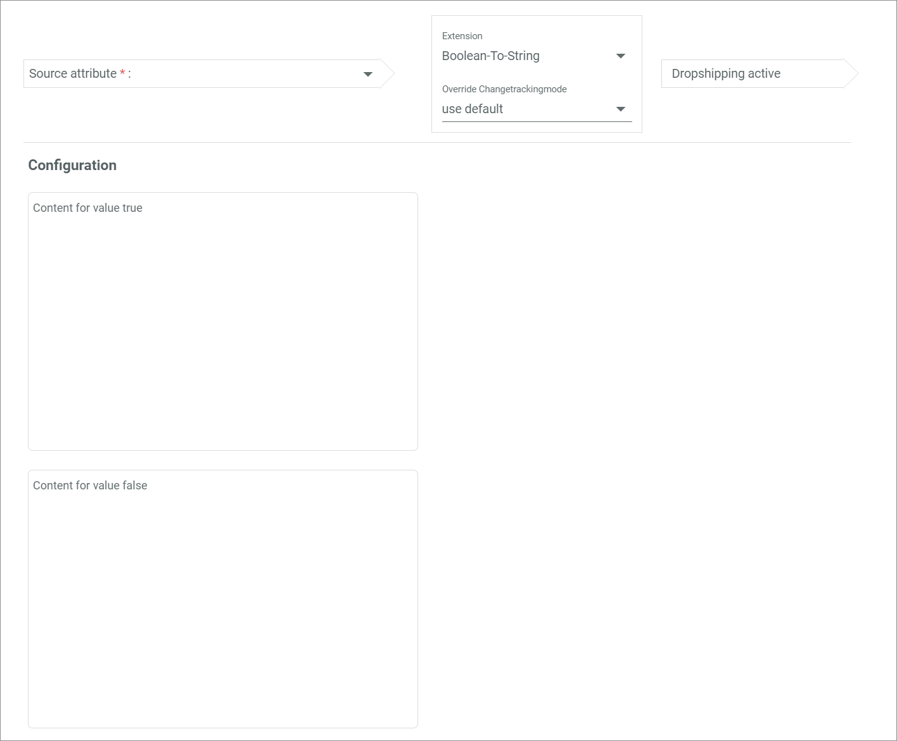

This extension is used to map a boolean attribute (checkbox or toggle) to a destination attribute. The content to be mapped to the destination attribute is defined in the configuration.

### Possible data type mappings

> [Info] The data type of the destination attribute and the selected ETL extension determine the data type of the source attribute.

| Destination attribute data type  | Source attribute data type     |
|----------------------------------|--------------------------------|
| String, Text field               | Boolean                        |

### Configuration

- *Content for value true*   
  Enter the content that is mapped to the string attribute when the boolean value equals true, which means that the checkbox is selected or the toggle is enabled.
- *Content for value false*   
  Enter the content that is mapped to the string attribute when the boolean value equals false, which means that the checkbox is not selected or the toggle is disabled.

## Catalog tree to tree value mapping

This extension is used to map a catalog attribute to a tree node attribute. It is mainly used to map the Actindo specific categories.

### Possible data type mappings

> [Info] The data type of the destination attribute and the selected ETL extension determine the data type of the source attribute.

| Destination attribute data type  | Source attribute data type     |
|----------------------------------|--------------------------------|
| Tree node                        | Catalog tree                   |

### Configuration

This ETL extension has no further configuration settings.

## Cloudinary to string

This extension is used to map a Cloudinary image to a string attribute. Select at least one and up to four Cloudinary images in the *Image* source attributes. If desired, the image transformation can also be mapped to the destination attribute in the *Transformation* source attribute. The image transformation is only mapped if the URL, but not the public ID, is exported.

### Possible data type mappings

> [Info] The data type of the destination attribute and the selected ETL extension determine the data type of the source attribute.

| Destination attribute data type  | Source attribute data type                                |
|----------------------------------|-----------------------------------------------------------|
| String                           | *Image*: Cloudinary image   *Transformation*: String  |

### Configuration

-  *Export public ID*   
  Enable the toggle to export the Cloudinary public ID. Disable the toggle to export the Cloudinary URL instead of the public ID.

  > [Info] The transformation can only be mapped if the Cloudinary URL is exported.

## Constant value

This extension is used to map a constant value to a destination attribute. The fixed source value is defined in the configuration and never changes. This extension is often used according to receipts, for instance to define the receipt type.

### Possible data type mappings

> [Info] The data type of the destination attribute and the selected ETL extension determine the data type of the source attribute.

| Destination attribute data type  | Source attribute data type     |
|----------------------------------|--------------------------------|
| String                           | -                              |
| Text field                       | -                              |
| Float                            | -                              |
| Integer                          | -                              |
| Boolean                          | -                              |
| Double float                     | -                              |
| Country                          | -                              |
| Currency                         | -                              |
| Language                         | -                              |
| Tree node                        | -                              |
| Date field                       | -                              |

### Configuration

- *Destination attribute name*   
  Enter a value that is mapped to the destination attribute.

### Constant value attribute

In addition to the *Constant value* extension, several extensions allow to set a constant value as a source attribute. In this case, the mapped data type of the constant value attribute is included in the source attribute name.  
By clicking the  (Edit) button within the source attribute, the *Enter value* window is displayed to enter the fixed value for the source attribute.

## Copy Cloudinary image value

This extension is used to copy the value from a Cloudinary image or video attribute and map it to another Cloudinary image or video attribute.

[comment]: <> (Stimmt das? Anwendungsfall?)

### Possible data type mappings

> [Info] The data type of the destination attribute and the selected ETL extension determine the data type of the source attribute.

| Destination attribute data type  | Source attribute data type    |
|----------------------------------|-------------------------------|
| Cloudinary image                 | Cloudinary image              |
| Cloudinary video                 | Cloudinary video              |

### Configuration

This ETL extension has no further configuration settings.

## Copy packaging units

This extension is used to copy the value from a packaging unit attribute and map it to another packaging unit attribute.

[comment]: <> (Stimmt das? Anwendungsfall?)

### Possible data type mappings

> [Info] The data type of the destination attribute and the selected ETL extension determine the data type of the source attribute.

| Destination attribute data type  | Source attribute data type     |
|----------------------------------|--------------------------------|
| Packaging unit                   | Packaging unit                 |

### Configuration

This ETL extension has no further configuration settings.

## Country to X

This extension is used to map the country to a destination attribute. This mapping is mainly used to transfer the Actindo *Country of origin* attribute to another system.

### Possible data type mappings

> [Info] The data type of the destination attribute and the selected ETL extension determine the data type of the source attribute.

| Destination attribute data type  | Source attribute data type     |
|----------------------------------|--------------------------------|
| String                           | Country                        |
| Text field                       | Country                        |
| Tree node                        | Country                        |

### Configuration

This ETL extension has no further configuration settings.

## Date converter

This extension is used to map a date to a destination attribute while changing its format or modifying the date. The destination date format and additional modifiers to change the date by a specific time value are defined in the configuration.

### Possible data type mappings

> [Info] The data type of the destination attribute and the selected ETL extension determine the data type of the source attribute.

| Destination attribute data type  | Source attribute data type                 |
|----------------------------------|--------------------------------------------|
| String                           | Date time, Date field                      |
| Text field                       | Date time, Date field                      |
| Date time                        | Date time, Date field, String, Text field  |                   
| Date field                       | Date time, Date field, String, Text field  |  

### Configuration

- *Destination format*   
  Enter the destination format of the date, for instance **Y-m-d**. The date must be entered in the php format, see https://www.php.net/manual/de/datetime.format.php.

- *Modifier 1*   
  Enter a value for the modifier to change the source date by a certain time value. For instance, enter **+ 7 days** to predate the date in the source attribute always by 7 days in the destination attribute. You can predate a date by using a plus sign, or backdate a date by using a minus sign. You can only enter one modification per modifier. To add further modifications, add another modifier.

-  (Add)   
  Click this button to add another modifier. Enter a further value for the modifier to change the source date by a certain time value. The modifier is additionally applied to the source date. For instance, if you enter **+ 1 month** in the first modifier and **+ 1 day** in the second modifier, the destination date is predated by 1 month and 1 day. You can add an unlimited number of modifiers.

## EAN to SKU

This extension is used to map the SKU of a source attribute to a destination attribute using the EAN of the source attribute. This mapping takes the value in the *EAN* source attribute, searches for products with this EAN and maps the corresponding SKU of this product to the destination attribute.

[comment]: <> (Stimmt das?)

### Possible data type mappings

> [Info] The data type of the destination attribute and the selected ETL extension determine the data type of the source attribute.

| Destination attribute data type  | Source attribute data type     |
|----------------------------------|--------------------------------|
| String                           | String                         |

### Configuration

This ETL extension has no further configuration settings.

## Entity ID to generic property extension

This extension is used to map the generic property of an entity attribute to a destination attribute. This mapping is often used for the data export.

### Possible data type mappings

> [Info] The data type of the destination attribute and the selected ETL extension determine the data type of the source attribute.

| Destination attribute data type  | Source attribute data type     |
|----------------------------------|--------------------------------|
| String                           | String, Text field, Integer    |
| Boolean                          | String, Text field, Integer    |

[comment]: <> (aktueller Bug: Configuration wird nur bei boolean als destination attribut angezeigt. Anwendungsfall aufzeigen! Mehr Infos)

### Configuration

- Empty drop-down list      
  Click the drop-down list to select the appropriate entity. The following options are available:
  - **Document**
  - **Document position**
  - **Customer**

- *Field name*   
  Enter the name of the property to the selected entity in the first drop-down list. The value of the selected property will be mapped to the destination attribute.

-  *Invert bool*   
  Enable the toggle to invert the boolean value after mapping. Otherwise, the boolean value will remain as mapped.

[comment]: <> (Configuration überarbeiten! Was macht die drop-down list?)

## ETL PIM to UCS bundle extension

This extension is used to map a product bundle attribute to a UCS bundle attribute. This extension is Actindo specific and is only used in the mapping from the PIM to the RetailSuite. It is mainly used to manage the stock of sets.

### Possible data type mappings

> [Info] The data type of the destination attribute and the selected ETL extension determine the data type of the source attribute.

| Destination attribute data type  | Source attribute data type     |
|----------------------------------|--------------------------------|
| UCS bundle product               | Product bundle                 |

### Configuration

This ETL extension has no further configuration settings.

## HTML template

This extension is used to map an HTML template to a destination attribute. The HTML template to be applied is selected in the configuration. This extension is selected for mappings requiring more logical assignments which cannot be mapped with the other extensions, for instance it is often used for the document export. This extension is only available when the *HTML templates for ETL* plugin is installed.  
For detailed information about HTML templates, see [Manage the HTML templates](../Operation/03_ManageHTMLTemplates.md).

### Possible data type mappings

> [Info] The data type of the destination attribute and the selected ETL extension determine the data type of the source attribute.

| Destination attribute data type  | Source attribute data type     |
|----------------------------------|--------------------------------|
| Text field                       | -                              |
| String                           | -                              |

### Configuration

- *HTML template*   
  Click the drop-down list and select the HTML template to be applied to the mapping. All available templates are displayed in the list. The HTML templates can be created in the *HTML TEMPLATES* tab, see [Create an HTML template](../Operation/03_ManageHTMLTemplates.md#create-an-html-template).

## Identity mapping

This extension is used to copy the value from the source attribute and map it to the destination attribute. In contrast to the *Basic mapping* extension, only completely identical attributes in the source and the destination attribute can be mapped.

### Possible data type mappings

This extension is mostly data type independent. All attributes with a self-mappable data type can be mapped.

[comment]: <> (Selfmappable erklären, welche datentypen sind nicht selfmappable?)

### Configuration

This ETL extension has no further configuration settings.

## Image to download link

This extension is used to map the download link of an image attribute to a destination attribute, for instance for csv exports. The image number must be indicated in the configuration. Further image settings can be defined in the configuration.

### Possible data type mappings

> [Info] The data type of the destination attribute and the selected ETL extension determine the data type of the source attribute.

| Destination attribute data type  | Source attribute data type     |
|----------------------------------|--------------------------------|
| String                           | Image                          |

### Configuration

- *Enter the image number*    
  Enter the number of the image whose download link should be mapped. The image number must be entered regardless of whether one or more images are assigned to the image attribute.

- *Enter image validity (days)*   
  Enter the period in days for which the image can be downloaded by the link. If the field is left empty, the link will be valid for an unlimited period of time.  

-  *Is the image downloadable only once?*   
  Enable the toggle to allow only a single download of the image. After that, the link will be invalid. Disable the toggle to allow an unlimited number of downloads.  

## Image to image tags

This extension is used to map the image tags of an image attribute to a destination attribute. This mapping takes the image specified in the configuration and maps its tags to the destination attribute. The image number must be indicated in the configuration.

### Possible data type mappings

> [Info] The data type of the destination attribute and the selected ETL extension determine the data type of the source attribute.

| Destination attribute data type  | Source attribute data type     |
|----------------------------------|--------------------------------|
| String                           | Image                          |

### Configuration

- *Enter the image number*   
  Enter the number of the image whose tags should be mapped. The image number must be entered regardless of whether one or more images are assigned to the image attribute.

## Import base price

This extension is used to map the base price from several attributes to the PIM price field attribute. The PIM price field is Actindo specific and contains not only the simple price, but also the base price, scale prices, promotion prices, the tax class including the tax rate and supported currencies. The base price to be mapped includes several source attributes. By the source attributes, define:  
  - the currency
  - the base price
  - if the specified base price is a gross price
  - the tax class

Beside the tax class, all attributes are required for the mapping. A separator for the price must be defined in the configuration.

[comment]: <> (Stimmt das?)

### Possible data type mappings

> [Info] The data type of the destination attribute and the selected ETL extension determine the data type of the source attribute.

| Destination attribute data type  | Source attribute data type     |
|----------------------------------|--------------------------------|
| Price field                      | *Currency*: String   *Base price*: Float, Integer, String   *Is gross*: Boolean, Integer, String   *Tax class*: String, Integer, Tax class |

### Configuration

- *Decimal separator*   
  Enter a decimal separator for the quantity value. By default, the point is used as a decimal separator in English, the comma in German.

## Import from Cloudinary folder

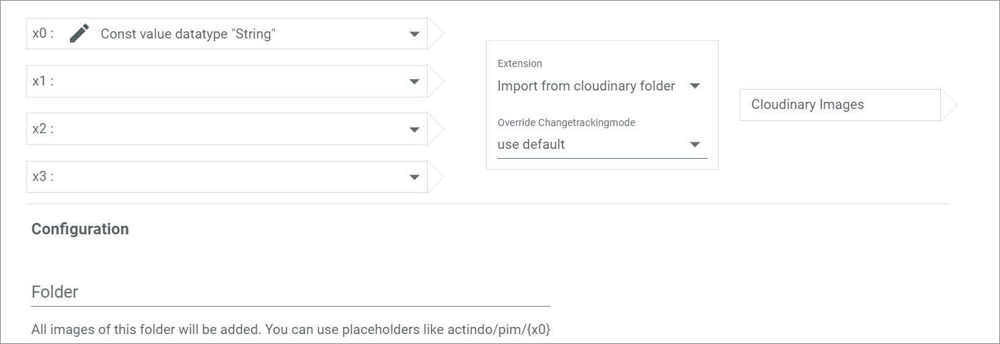

This extension is used to import all image or video files within a specified folder in Cloudinary to the Cloudinary attribute. Depending on the destination attribute, all image or video files are imported. Select one to four values in the *x0* to *x3* source attributes. The folder from which the image or videos will be imported must be defined in the configuration.

### Possible data type mappings

> [Info] The data type of the destination attribute and the selected ETL extension determine the data type of the source attribute.

| Destination attribute data type  | Source attribute data type    |
|----------------------------------|-------------------------------|
| Cloudinary image                 | String                        |
| Cloudinary video                 | String                        |

### Configuration

- *Folder*   
  Enter the folder name from which the images will be imported. Use placeholders to include the values of the source attributes, for instance **actindo/{x0}**

## Import special price

This extension is used to map a promotion price to the PIM price field attribute. The PIM price field is Actindo specific and contains not only the simple price, but also the base price, scale prices, promotion prices, the tax class including the tax rate and supported currencies. The promotion price to be mapped includes several source attributes. By the source attributes, define:  
  - whether the discount is a percent discount or an absolute discount
  - the amount of the discount
  - the currency
  - the start quantity from which the promotion price is applied
  - the start date of the promotion price
  - the end date of the promotion price

Beside the dates, all attributes are required for the mapping.

[comment]: <> (Is that right?)

### Possible data type mappings

> [Info] The data type of the destination attribute and the selected ETL extension determine the data type of the source attribute.

| Destination attribute data type  | Source attribute data type     |
|----------------------------------|--------------------------------|
| Price field                      | *Percent discount*: Boolean   *Discount percent/absolute special price*: Float, Integer, String   *Currency*: String, Currency   *Start quantity*: Float, Integer, String   *Promotion start*: String   *Promotion End*: String |

### Configuration

This ETL extension has no further configuration settings.

## Language to X

This extension is used to map a language attribute to a destination attribute. This mapping is mainly used to map the Actindo language attribute to another system.

### Possible data type mappings

> [Info] The data type of the destination attribute and the selected ETL extension determine the data type of the source attribute.

| Destination attribute data type  | Source attribute data type     |
|----------------------------------|--------------------------------|
| String                           | Language                       |
| Text field                       | Language                       |

### Configuration

- *language value*   
  Click the drop-down list and select the appropriate display type for the language attribute. The following options are available:
  - **3 digit code**   
    The three-letter language code according to ISO 639-2 is used. For languages with a bibliographic (B) and a terminological (T) code, both codes are indicated, for instance *ger (B), deu (T)*.
  - **2 digit code**   
    The two-letter language code according to ISO 639-1 is used, for instance *de*.
  - **Name (english)**   
    The english language name is used, for instance *german*.
  - **Name (french)**   
    The french language name is used, for instance *allemand*.
  - **Name (german)**   
    The german language name is used, for instance *deutsch*.

## Mapping table

This extension is used to map a set of source attributes to fixed destination attributes. The destination values are assigned in the configuration. This extension is often used in the order import, for instance with different shipping provider names in a web shop and Actindo.

### Possible data type mappings

> [Info] The data type of the destination attribute and the selected ETL extension determine the data type of the source attribute.

| Destination attribute data type  | Source attribute data type                    |
|----------------------------------|-----------------------------------------------|
| String                           | String, Integer, Float, Tree node, Text field |
| Integer                          | String, Integer, Float, Tree node, Text field |
| Float                            | String, Integer, Float, Tree node, Text field |
| Tree node                        | String, Integer, Float, Tree node, Text field |
| Text field                       | String, Integer, Float, Tree node, Text field |

[comment]: <> (Boolean auch möglich?)

### Configuration

| Source value   | Destination value     |
|----------------|-----------------------|
| All available values for the selected source attribute are automatically displayed in this column. | Click the row in this column to enter or select a destination value for the corresponding source value. When a tree node attribute is selected as a destination attribute, all predefined values for this attribute are available in a drop-down list. |

-  (Add)    
  Click this button to manually add a source value to the mapping table.

## MySQL query

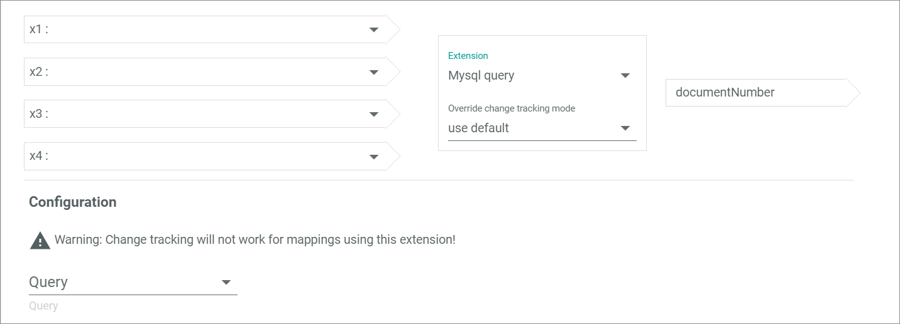

This extension is used to map a MySQL query to a destination attribute. The MySQL query can include placeholders that are defined in up to four source attributes. The MySQL query to be applied is selected in the configuration. This mapping is mainly used for more logical assignments which cannot be mapped with other extensions. This extension is only available when the *Database and reporting* module is installed.  

### Possible data type mappings

> [Info] The data type of the destination attribute and the selected ETL extension determine the data type of the source attribute.

| Destination attribute data type  | Source attribute data type      |
|----------------------------------|---------------------------------|
| String                           | String, Integer, Float, Boolean |
| Integer                          | String, Integer, Float, Boolean |
| Float                            | String, Integer, Float, Boolean |
| Boolean                          | String, Integer, Float, Boolean |

### Configuration

- *Query*   
  Click the drop-down list and select the MySQL query to be applied to the mapping. All available queries are displayed in the list. The MySQL query can be created in the *DB and Reporting* module: *DB and Reporting > Managed queries > Tab QUERIES*.

- [TEST]   
  Click this button to run the selected query and test if a valid value is extracted.

- *Column*   
  Enter the name from the column in the MYSQL database from which the value will be selected.

  [comment]: <> (Stimmt das alles? Bild aktualisieren! Modul installieren? No change tracking?)

## Next promotion base price to float

[comment]: <> (SpecialBasePriceToFloatExtension)

This extension is used to map the promotion price of a PIM price field attribute to a destination attribute. The PIM price field is Actindo specific and contains not only the simple price, but also the base price, scale prices, promotion prices, the tax class including the tax rate and supported currencies. Each of this data is extracted from the price attribute by the corresponding extension. In this case, the promotion price is mapped to the destination attribute. Further settings are defined in the configuration.

### Possible data type mappings

> [Info] The data type of the destination attribute and the selected ETL extension determine the data type of the source attribute.

| Destination attribute data type  | Source attribute data type      |
|----------------------------------|---------------------------------|
| Float                            | Price field                     |

### Configuration

- *Country*     
  Click the drop-down list and select the appropriate country to apply the correct tax rate to the price. All available countries are displayed in the list.

- *Currency*   
  Click the drop-down list and select the appropriate currency. Only those currencies that are defined as a supported currency in the PIM price field attribute configuration are mapped. All available currencies are displayed in the list.

-  *Destination gross*   
  Enable the toggle to map the gross price of the PIM price field attribute. Disable the toggle to map the net price.

[comment]: <> (Is that right? why do I need the country?)

## Next special base price to date time

[comment]: <> (SpecialBasePriceToDateTimeExtension)

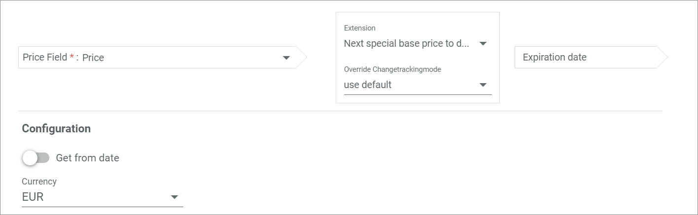

This extension is used to map the promotion date of a PIM price field attribute to a destination attribute. The PIM price field is Actindo specific and contains not only the simple price, but also the base price, scale prices, promotion prices, the tax class including the tax rate and supported currencies. Each of this data is extracted from the price attribute by the corresponding extension. In this case, the date of the next promotion is mapped to the destination attribute. Further settings are defined in the configuration.

### Possible data type mappings

> [Info] The data type of the destination attribute and the selected ETL extension determine the data type of the source attribute.

| Destination attribute data type  | Source attribute data type      |
|----------------------------------|---------------------------------|
| Date time                        | Price field                     |

### Configuration

-  *Get from date*   
  Enable the toggle to map the start date of the promotion. Otherwise, the end date of the promotion is mapped to the destination attribute. By default, the toggle is disabled.

[comment]: <> (Standardmäßig wird das Enddatum gemappt! Deutsches UI falsch -> richtig: Von-Datum)

- *Currency*   
  Click the drop-down list and select the appropriate currency. Only those currencies that are defined as a supported currency in the PIM price field attribute configuration are mapped. All available currencies are displayed in the list.

  [comment]: <> (Is that right? what currencies are mapped?)

## Null coalescence extension

This extension is used to map an attribute with one or more fallback attributes if the first attribute is not available. At least one source attribute must be selected in the *x0* attribute and one fallback attribute in the *x1* attribute. If the value of the source attribute in the *x0* attribute is empty, the value of the source attribute in the *x1* attribute is applied, if this value is empty, the value in the *x2* attribute is applied and so on. Up to four source attributes can be selected in the drop-down lists. Note that a blank space is also considered as an input.

### Possible data type mappings

> [Info] The data type of the destination attribute and the selected ETL extension determine the data type of the source attribute.

| Destination attribute data type  | Source attribute data type                    |
|----------------------------------|-----------------------------------------------|
| String                           | String, Text field, Integer, Float, Tree node |
| Text field                       | String, Text field, Integer, Float, Tree node |
| Integer                          | Integer                                       |
| Float                            | Integer, Float                                |

### Configuration

- *Relevant language*   
  Click the drop-down list and select the language of the attribute value used for the mapping. All active languages are displayed in the list. This setting only applies when a tree node attribute is mapped to a single language attribute.

## Number to string

This extension is used to map a number to text. Both absolute and decimal number values are allowed in the source attribute. The value is mapped unchanged, only the data type of the attribute changes.

### Possible data type mappings

> [Info] The data type of the destination attribute and the selected ETL extension determine the data type of the source attribute.

| Destination attribute data type  | Source attribute data type      |
|----------------------------------|---------------------------------|
| String                           | Integer, Float                  |
| Text field                       | Integer, Float                  |

### Configuration

This ETL extension has no further configuration settings.

## Number to unit value

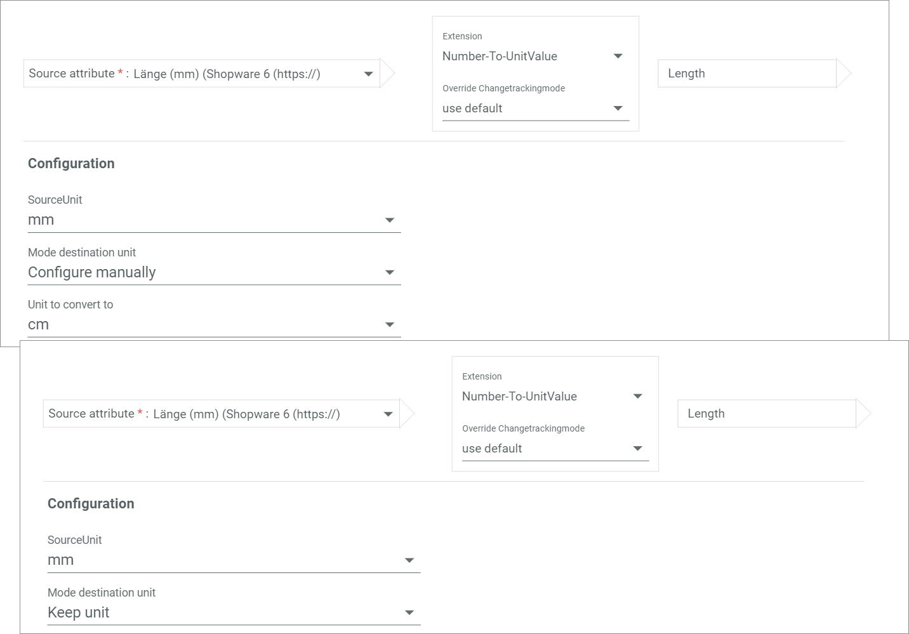

This extension is used to map a number to a unit attribute. Both absolute and decimal number values are allowed in the source attribute. A unit attribute always includes a quantity and a unit value. This mapping is used to map a source attribute, which is maintained in a certain unit and therefore does not include the unit in the source attribute, to a unit attribute. Define the unit settings in the configuration.

### Possible data type mappings

> [Info] The data type of the destination attribute and the selected ETL extension determine the data type of the source attribute.

| Destination attribute data type  | Source attribute data type      |
|----------------------------------|---------------------------------|
| Unit                             | Integer, Float                  |

### Configuration

- *Source unit*   
  Click the drop-down list and select the appropriate unit of the source attribute to convert the quantity value into the correct unit. All units corresponding to the dimension of the destination attribute are displayed in the list.

- *Mode destination unit*   
  Click the drop-down list and select the appropriate unit mapping mode. The following options are available:
  - **Configure manually**   
    The unit to be mapped to the destination attribute must be selected in the *Unit to convert to* drop-down list. The quantity value is converted into the correct destination unit.
  - **Keep unit**   
    The unit selected in the *Source unit* drop-down list is mapped to the destination attribute.
  - **Default unit of destination attribute**   
    The configured default destination unit is kept in the destination attribute. The quantity value is converted into the correct destination unit.

- *Unit to convert to*   
  Click the drop-down list and select the appropriate unit of the destination attribute to convert the quantity value into the correct unit. All units corresponding to the dimension of the destination attribute are displayed in the list. This drop-down list is only displayed if the **Configure manually** option is selected in the *Mode destination unit* drop-down list.

## PIM base price to amount (VPE value)

This extension is used to map a PIM base price attribute to a decimal number. The base price is Actindo specific and contains the dimension, the unit and the relevant amount for the base price. Each of this data is extracted from the base price attribute by the corresponding extension. In this case, the amount is mapped to the destination attribute.

### Possible data type mappings

> [Info] The data type of the destination attribute and the selected ETL extension determine the data type of the source attribute.

| Destination attribute data type  | Source attribute data type     |
|----------------------------------|--------------------------------|
| Float                            | Base price                     |

### Configuration

This ETL extension has no further configuration settings.

## PIM base price to boolean (VPE active)

This extension is used to map a PIM base price attribute to a boolean attribute, for instance to define whether or not a base price is available. If the PIM base price attribute is empty, the false value is mapped to the boolean attribute. Otherwise, the true value is mapped to the boolean attribute.

[comment]: <> (Is that right? Anwendungsfall?)

### Possible data type mappings

> [Info] The data type of the destination attribute and the selected ETL extension determine the data type of the source attribute.

| Destination attribute data type  | Source attribute data type     |
|----------------------------------|--------------------------------|
| Boolean                          | Base price                     |

### Configuration

This ETL extension has no further configuration settings.

## PIM base price to unit

This extension is used to map a PIM base price attribute to a tree node attribute. The PIM base price is Actindo specific and contains the dimension, the unit and the relevant amount for the base price. Each of this data is extracted from the PIM base price attribute by the corresponding extension. In this case, the unit is mapped to the destination attribute.

[comment]: <> (Is that right?)

### Possible data type mappings

> [Info] The data type of the destination attribute and the selected ETL extension determine the data type of the source attribute.

| Destination attribute data type  | Source attribute data type     |
|----------------------------------|--------------------------------|
| Tree node                        | Base price                     |

### Configuration

This ETL extension has no further configuration settings.

## PIM base price to VPE reference unit

This extension is used to map a PIM base price attribute to a number. Both absolute and decimal number values are allowed in the destination attribute. The PIM base price is Actindo specific and contains the dimension, the unit and the relevant amount for the base price. Each of this data is extracted from the PIM base price attribute by the corresponding extension. In this case, the relevant amount is taken and the corresponding reference amount is mapped to the destination attribute. By default, the reference amount equals **0,1** for all amounts smaller than **0,25** and to the specified amount for all amounts greater than **0,25**.

[comment]: <> (ist das korrekt mit dem reference amount?)

### Possible data type mappings

> [Info] The data type of the destination attribute and the selected ETL extension determine the data type of the source attribute.

| Destination attribute data type  | Source attribute data type     |
|----------------------------------|--------------------------------|
| Integer                          | Base price                     |
| Float                            | Base price                     |

### Configuration

This ETL extension has no further configuration settings.

## PIM price to simple price

This extension is used to map a PIM price field attribute to a simple price field attribute. The PIM price field is Actindo specific and contains not only the simple price, but also the base price, scale prices, promotion prices, the tax class including the tax rate and supported currencies. In this case, all values that are also included to the simple price field attribute are mapped. Further settings are defined in the configuration.

 [comment]: <> (Is that correct? Which values? Base price, scale prices and indication about net or gross price?)

### Possible data type mappings

> [Info] The data type of the destination attribute and the selected ETL extension determine the data type of the source attribute.

| Destination attribute data type  | Source attribute data type     |
|----------------------------------|--------------------------------|
| Simple Pricing                   | Price field                    |

### Configuration

- *Country*     
  Click the drop-down list and select the appropriate country to apply the correct tax rate to the price. All available countries are displayed in the list.

- *Mapping mode*   
  Click the drop-down list and select the appropriate mapping mode for the PIM price field attributes. The following options are available:   
    - **Consider all prices**   
      All prices in the PIM price field attribute are mapped to the destination attribute.
    - **Consider only promotions**   
      Only the promotion prices in the PIM price field attribute are mapped to the destination attribute.
    - **Ignore promotions**   
      All prices beside the promotion prices in the PIM price field attribute are mapped to the destination attribute.

[comment]: <> (Is that correct? Why country? Is a tax class or rate mapped? Where are the promotions prices mapped to: scale prices???)

## Preg replace extension

This extension is used to replace the value of a source attribute by a certain value and map it to a destination attribute. The replacement settings are defined in the configuration.

### Possible data type mappings

> [Info] The data type of the destination attribute and the selected ETL extension determine the data type of the source attribute.

| Destination attribute data type  | Source attribute data type         |
|----------------------------------|------------------------------------|
| String                           | String, Text field, Integer, Float |
| Text field                       | String, Text field, Integer, Float |

### Configuration

- *Pattern*   
  Enter a regular expression for the source attribute value that should be replaced. For detailed information about regular expressions, see https://regex101.com/.

- *Replacement*    
  Enter the value that will replace the value selected in the *Pattern* field.

## Price builder

[comment]: <> (StringsToPriceExtension)

This extension is used to map several attributes containing price data to a PIM price field attribute. The PIM price field is Actindo specific and contains not only the simple price, but also the base price, scale prices, promotion prices, the tax class including the tax rate and supported currencies. The price to be mapped is composed of different source attributes. By the source attributes, define:  
  - the tax class
  - the base price
  - the currency
  - whether the price is gross or net
  - the MSRP

Beside the MSRP, all attributes are required for the mapping.

[comment]: <> (Is that right?)

### Possible data type mappings

> [Info] The data type of the destination attribute and the selected ETL extension determine the data type of the source attribute.

| Destination attribute data type  | Source attribute data type         |
|----------------------------------|------------------------------------|
| Price field                      | *Tax class ID*: String, Integer, Tax class   *Base price*: String, Integer, Float   *Currency*: String   *Is gross*: String, Boolean   *MSRP*: String, Boolean |

### Configuration

This ETL extension has no further configuration settings.

## Price to price with discount

This extension is used to map a PIM price field attribute including a defined discount to another PIM price field attribute. In the discount attribute, a number for the percentage discount is defined. The source price field attribute less the selected discount is mapped to the destination price attribute.

### Possible data type mappings

> [Info] The data type of the destination attribute and the selected ETL extension determine the data type of the source attribute.

| Destination attribute data type  | Source attribute data type                                        |
|----------------------------------|-------------------------------------------------------------------|
| Price field                      | *Price*: Price field   *Discount in percent*: Integer, Float  |

### Configuration

This ETL extension has no further configuration settings.

## Price to tax

This extension is used to map a PIM price field attribute to a decimal number. The PIM price field is Actindo specific and contains not only the simple price, but also the base price, scale prices, promotion prices, the tax class including the tax rate and supported currencies. Each of this data is extracted from the price attribute by the corresponding extension. In this case, the tax rate is calculated by the tax class set in the attribute, which is based on the destination country selected in the configuration and mapped to the destination attribute. The country and the display type of the tax rate are defined in the configuration.

### Possible data type mappings

> [Info] The data type of the destination attribute and the selected ETL extension determine the data type of the source attribute.

| Destination attribute data type  | Source attribute data type     |
|----------------------------------|--------------------------------|
| Float                            | Price field                    |

### Configuration

- *Country*   
  Click the drop-down list and select the appropriate country to apply the corresponding tax rate. All available countries are displayed in the list.

-  *In percent*   
  Enable the toggle to indicate the tax rate as a percentage. Otherwise, the tax rate is indicated as a decimal number.

[comment]: <> (Is that right?)

## Price to tax class

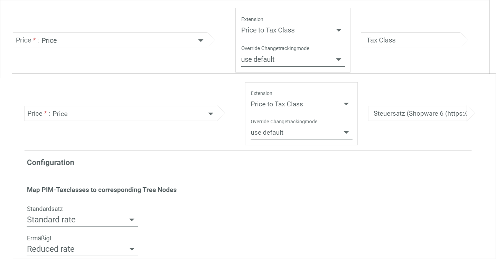

This extension is used to map a PIM price field attribute to a destination attribute. The PIM price field is Actindo specific and contains not only the simple price, but also the base price, scale prices, promotion prices, the tax class including the tax rate and supported currencies. Each of this data is extracted from the price attribute by the corresponding extension. In this case, the tax class is mapped to the destination attribute. The configuration settings are only displayed if a destination attribute with the tree node data type is selected.

### Possible data type mappings

> [Info] The data type of the destination attribute and the selected ETL extension determine the data type of the source attribute.

| Destination attribute data type  | Source attribute data type     |
|----------------------------------|--------------------------------|
| Tax class                        | Price field                    |
| Tree node                        | Price field                    |

### Configuration

The configuration depends on the selected tax class attribute. A single drop-down list is displayed for each tax class defined in the source attribute.

**Map PIM tax classes to corresponding tree nodes**

- *"Tax class name"*   
  Click the drop-down list and select the applicable tax class to be mapped to the tax class in the destination attribute. All available tax rates from the destination attribute are displayed in the list.

[comment]: <> (Stimmt das?)

## Pricing to float

This extension is used to map a PIM price field attribute to a destination attribute. The PIM price field is Actindo specific and contains not only the simple price, but also the base price, scale prices, promotion prices, the tax class including the tax rate and supported currencies. Each of this data is extracted from the price attribute by the corresponding extension. In this case, the simple price is mapped to the destination attribute. A discount to the price can be entered in the *Discount in percent* attribute. Further price settings are defined in the configuration.

### Possible data type mappings

> [Info] The data type of the destination attribute and the selected ETL extension determine the data type of the source attribute.

| Destination attribute data type  | Source attribute data type                                             |
|----------------------------------|------------------------------------------------------------------------|
| Float                            | *Price field*: Price field   *Discount in percent*: Integer, Float |
| String                           | *Price field*: Price field   *Discount in percent*: Integer, Float |

### Configuration

- *Country*     
  Click the drop-down list and select the appropriate country to apply the correct tax rate to the price. All available countries are displayed in the list.

- *Currency*   
  Click the drop-down list and select the appropriate currency. All available currencies are displayed in the list. Only those currencies that are defined as a supported currency in the PIM price field attribute configuration are mapped.

  [comment]: <> (Is that right?)

-  *Destination gross*   
  Enable the toggle to map the gross price of the source attribute. Disable the toggle to map the net price.

## Pricing to float with fallback price

[comment]: <> (PriceSpecialPriceToFloatExtension)

This extension is used to map a PIM price field attribute with a fallback attribute, if the first attribute is not available, to a decimal number. This extension is similar to the *Pricing to float* extension with an additional fallback price. The *Special price* attribute is always considered first when mapping. The *Fallback price* attribute is only used as a fallback price that will be mapped when no other price is available. The fallback price attribute is mandatory. This mapping is used when at least two PIM price field attributes with different prices are maintained. Further price settings are defined in the configuration.

### Possible data type mappings

> [Info] The data type of the destination attribute and the selected ETL extension determine the data type of the source attribute.

| Destination attribute data type  | Source attribute data type                      |
|----------------------------------|-------------------------------------------------|
| Float                            | *Fallback price*, *Special price*: Price field  |

### Configuration

- *Country*     
  Click the drop-down list and select the appropriate country to apply the correct tax rate to the price. All available countries are displayed in the list.

- *Currency*   
  Click the drop-down list and select the appropriate currency. All available currencies are displayed in the list. Only those currencies that are defined as a supported currency in the PIM price field attribute configuration are mapped.

  [comment]: <> (Is that right?)

-  *Destination gross*   
  Enable the toggle to map the gross price of the source attribute. Disable the toggle to map the net price.

[comment]: <> (gibt es die extensions RMA-Extension und RMAExtension PosId Extensions noch?
## RMA extension ???

### Possible data type mappings

> [Info] The data type of the destination attribute and the selected ETL extension determine the data type of the source attribute.

| Destination attribute data type  | Source attribute data type     |
|----------------------------------|--------------------------------|
| String                           | *EAN*, *Amount*: String         |

### Configuration

## RMA extension pos ID extensions ???

### Possible data type mappings

> [Info] The data type of the destination attribute and the selected ETL extension determine the data type of the source attribute.

| Destination attribute data type  | Source attribute data type        |
|----------------------------------|-----------------------------------|
| String                           |*Project number*, *EAN*: String    |

### Configuration )

## Simple pricing to float

This extension is used to map a simple price attribute to a decimal number. The simple price attribute is Actindo specific and therefore needs a special extension for mapping. As the simple price attribute is not often used, the extension is also rarely needed.  

### Possible data type mappings

> [Info] The data type of the destination attribute and the selected ETL extension determine the data type of the source attribute.

| Destination attribute data type  | Source attribute data type     |
|----------------------------------|--------------------------------|
| Float                            | Simple pricing                 |

### Configuration

- *Empty value*   
  Click the drop-down list and select the value that will be mapped to the destination attribute if the source attribute value is empty. The following options are available:
  - **null**  
    The destination attribute value is empty.
  - **0**   
    The destination attribute value is 0.

  [comment]: <> (Is that right?)

## Special price with default fallback

[comment]: <> (PriceSpecialPriceCopyExtension)

This extension is used to map a PIM price field attribute with a fallback attribute, if the first attribute is not available, to another PIM price attribute. The *Special Price* attribute is used for the promotion price. This attribute is always considered first when mapping. The *Fallback Price* attribute is used as a fallback price that will be mapped when no promotion price is available. The fallback price attribute is mandatory. This mapping is used when promotion prices and regular prices are maintained in different price field attributes. Further price settings are defined in the configuration.

### Possible data type mappings

> [Info] The data type of the destination attribute and the selected ETL extension determine the data type of the source attribute.

| Destination attribute data type  | Source attribute data type                      |
|----------------------------------|-------------------------------------------------|
| Price field                      | *Fallback price*, *Special price*: Price field  |

### Configuration

- *Country*     
  Click the drop-down list and select the appropriate country to apply the correct tax rate to the price. All available countries are displayed in the list.

- *Mapping mode*   
  Click the drop-down list and select the appropriate mapping mode for the source price attributes. The following options are available:   
    - **Consider all prices**   
      All prices in the PIM price field attribute are mapped to the destination attribute.
    - **Consider only promotions**   
      Only the promotion prices in the PIM price field attribute are mapped to the destination attribute.
    - **Ignore promotions**   
      All prices beside the promotion prices in the PIM price field attribute are mapped to the destination attribute.

## Stock to integer

This extension is used to map a stock attribute to an absolute number. The stock attribute is Actindo specific and therefore needs a special extension for mapping. This extension is mainly used to map the stock from Actindo to another system.  

### Possible data type mappings

> [Info] The data type of the destination attribute and the selected ETL extension determine the data type of the source attribute.

| Destination attribute data type  | Source attribute data type     |
|----------------------------------|--------------------------------|
| Integer                          | Stock                          |

### Configuration
This ETL extension has no further configuration settings.

## String/tree to string/tree

[comment]: <> (ETLTreeExtension)

This extension is used to either map a source attribute to a tree node attribute or a tree node attribute to a text. This extension is often used for CSV imports where only data input as string data type is allowed but the data should result in a tree node data type.  

### Possible data type mappings

> [Info] The data type of the destination attribute and the selected ETL extension determine the data type of the source attribute.

| Destination attribute data type  | Source attribute data type     |
|----------------------------------|--------------------------------|
| String                           | Tree node                      |
| Float                            | Tree node                      |
| Integer                          | Tree node                      |
| Text field                       | Tree node                      |
| Tree node                        | String, Text field             |

### Configuration

- *Separator*   
  Enter a separator sign by which a lower level in the string attribute is indicated. For instance, to indicate several gradations for a color (Red|Coral).

- *Destination field*   
  Click the drop-down list and select the field of the tree node attribute whose value will be used for the mapping. This drop-down list is only displayed if the destination attribute is a tree node attribute. The following options are available:
  - **Key**   
    The key value of the tree node attribute is used for the mapping.
  - **Title**   
    The title value of the tree node attribute is used for the mapping.

- *Relevant locale (applies for single language attributes)*   
  Click the drop-down list and select the language of the attribute value used for the mapping. All active languages are displayed in the list. This setting only applies to single language attributes.

  [comment]: <> (Anwendungsbeispiel für relevant locale? Verstehe den Einsatz nicht so richtig...)

## String and value to unit

This extension is used to map two attributes including a unit and a unit value to a unit attribute. A unit attribute always includes a unit and a quantity. The unit to be mapped is defined in the *Unit* attribute, the quantity in the *Value* attribute.

### Possible data type mappings

> [Info] The data type of the destination attribute and the selected ETL extension determine the data type of the source attribute.

| Destination attribute data type  | Source attribute data type                            |
|----------------------------------|-------------------------------------------------------|
| Unit                             | *Unit*: String   *Value*: String, Float, Integer  |

### Configuration

This ETL extension has no further configuration settings.

## String date converter

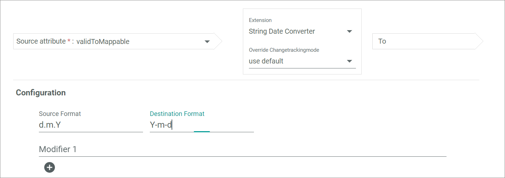

This extension is used to map a date within a string attribute to a text attribute. Both a string and a text field data type are allowed in the source attribute. The source as well as the destination date format are defined in the configuration. Further, additional modifiers can be defined to change the date by a defined time value.

### Possible data type mappings

> [Info] The data type of the destination attribute and the selected ETL extension determine the data type of the source attribute.

| Destination attribute data type  | Source attribute data type     |
|----------------------------------|--------------------------------|
| String                           | String, Text field             |

### Configuration

- *Source format*   
  Enter the source format of the date, for instance **Y-m-d**. The date must be entered in the php format, see https://www.php.net/manual/de/datetime.format.php.

- *Destination format*   
  Enter the destination format of the date, for instance **Y-m-d**. The date must be entered in the php format, see https://www.php.net/manual/de/datetime.format.php.

- *Modifier 1*   
  Enter a value for the modifier to change the source date by a certain time value. For instance, enter **+ 7 days** to predate the date in the source attribute always by 7 days in the destination attribute. You can predate a date by using a plus sign, or backdate a date by using a minus sign. You can only enter one modification per modifier. To add further modifications, add another modifier.

-  (Add)   
  Click this button to add another modifier. Enter a further value for the modifier to change the source date by a certain time value. The modifier is additionally applied to the source date. For instance, if you enter **+ 1 month** in the first modifier and **+ 1 day** in the second modifier, the destination date is predated by 1 month and 1 day. You can add an unlimited number of modifiers

## String to image

This extension is used to map multiple string attributes to an image attribute. At least one string attribute containing the image URL must be selected for the mapping and up to eight source attributes can be mapped. To each image you can define one or several tags. Define the tags separator in the configuration.

[comment]: <> (Stimmt das? Oder: To map several image URLs within one source attribute, define a separator in the configuration. ?!)

### Possible data type mappings

> [Info] The data type of the destination attribute and the selected ETL extension determine the data type of the source attribute.

| Destination attribute data type  | Source attribute data type               |
|----------------------------------|------------------------------------------|
| Image                            | *Image*, *Image tags for image*: String  |

### Configuration

- *Separator*   
  Enter a separator that is used between multiple image tags.

[comment]: <> (Separator correct? oder between URLs?)

## String concat to string

This extension is used to map multiple string attributes to a single string attribute. This extension is often used in the receipt management, for instance to combine the receipt type and the receipt number, which are stored in different source attributes, in a single destination attribute. At least two source attributes must be selected and up to ten attributes can be selected. The source attribute values are written one after the other in the destination attribute without separation. Define a connector or separator in the configuration.

### Possible data type mappings

> [Info] The data type of the destination attribute and the selected ETL extension determine the data type of the source attribute.

| Destination attribute data type  | Source attribute data type  |
|----------------------------------|-----------------------------|
| String                           | String                      |

### Configuration

- *Glue*   
  Enter a connector or separator which is added between the different source attribute values.

## String to absolute number

This extension is used to map a string attribute to a number. The value is mapped unchanged, only the data type of the attribute changes. This mapping is used for absolute numbers. To map decimal numbers, use the *String-To-Number* extension.

[comment]: <> (What happens if a string attribute contains a floating number? Is it rounded? And why is the float data type allowed as Destination?)

### Possible data type mappings

> [Info] The data type of the destination attribute and the selected ETL extension determine the data type of the source attribute.

| Destination attribute data type  | Source attribute data type  |
|----------------------------------|-----------------------------|
| Integer                          | String                      |
| Float                            | String                      |

### Configuration

- *Separator*   
  Click the drop-down list and select the appropriate separator for decimal numbers. The following options are available:  
  - **,**   
    By default, the comma is used as a decimal separator in German.
  - **.**   
    By default, the point is used as a decimal separator in English.

  [comment]: <> (separator for absolute numbers? where is an absolute number separated?)

- *Empty string*   
  Click the drop-down list and select the value that will be mapped to the destination attribute if the source attribute value is empty. The following options are available:
  - **null**   
    The destination attribute value is empty.
  - **0**   
    The destination attribute value is 0.

## String to boolean

This extension is used to map a string attribute to a boolean attribute. If the string attribute value equals **0**, the false value is mapped to the boolean attribute. If the string attribute value equals **1**, the true value is mapped to the boolean attribute.

### Possible data type mappings

> [Info] The data type of the destination attribute and the selected ETL extension determine the data type of the source attribute.

| Destination attribute data type  | Source attribute data type  |
|----------------------------------|-----------------------------|
| Boolean                          | String                      |

### Configuration

This ETL extension has no further configuration settings.

## String to country

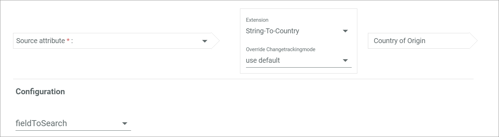

This extension is used to map a text to a country attribute. This mapping is mainly used for the import to Actindo as the country attribute is Actindo specific. Define how the country is indicated in the configuration.

### Possible data type mappings

> [Info] The data type of the destination attribute and the selected ETL extension determine the data type of the source attribute.

| Destination attribute data type  | Source attribute data type  |
|----------------------------------|-----------------------------|
| Country                          | String, Text field          |

### Configuration

- *Field to search*   
  Click the drop-down list and select the appropriate information about how the country is entered in the source attribute, so that the system can map the country correctly to the destination attribute. The following options are available:
  - **Numeric country code**      
    Three-digit country code according to ISO 3166-1 numeric, for instance *840*.
  - **3 letter country code**   
    Three-letter country code according to ISO 3166-1 alpha-3, for instance *USA*.
  - **2 letter country code**   
    Two-letter country code according to ISO 3166-1 alpha-2, for instance *US*.
  - **Vehicle country code**   
    International vehicle registration code, for instance *USA*.
  - **Name**   
    Country name (in the national language), for instance *United States*.
  - **FusionMaps country code**   
    Specific FusionMaps ID for the country. FusionCharts have to be integrated to use this country code.

  [comment]: <> (Was ist FusionMaps? Stimmt das so?)

## String to number

This extension is used to map a string attribute to a number. The value is mapped unchanged, only the data type of the attribute changes. In contrast to the *String to absolute number* extension, both decimal and absolute numbers can be mapped to the destination attribute.

### Possible data type mappings

> [Info] The data type of the destination attribute and the selected ETL extension determine the data type of the source attribute.

| Destination attribute data type  | Source attribute data type  |
|----------------------------------|-----------------------------|
| Integer                          | String                      |
| Float                            | String                      |

### Configuration

- *Separator*   
  Click the drop-down list and select the appropriate separator for decimal numbers. The following options are available:  
  - **,**   
    By default, the comma is used as a decimal separator in German.
  - **.**   
    By default, the point is used as a decimal separator in English.

- *Empty string*   
  Click the drop-down list and select the value that will be mapped to the destination attribute if the source attribute value is empty. The following options are available:
  - **null**   
    The destination attribute value is empty.
  - **0**   
    The destination attribute value is 0.

## Tax class and basic price to PIM price

This extension is used to map a tax class and a price attribute to a PIM price field attribute. This mapping transfers the simple price as well as the tax class to the PIM price field attribute. As the PIM price field attribute also needs a currency and an indication whether the net or the gross price is specified, the default currency in the PIM system and the gross price value are mapped. To specify all values to be mapped to the PIM price field attribute, use the [PriceBuilder](#pricebuilder) extension.

[comment]: <> (Ist das richtig? Immer brutto und standardwährung? oder funktioniert dieses mapping gar nicht mehr?)

### Possible data type mappings

> [Info] The data type of the destination attribute and the selected ETL extension determine the data type of the source attribute.

| Destination attribute data type  | Source attribute data type                          |
|----------------------------------|-----------------------------------------------------|
| Price field                      | *Price*: Simple Price   *Tax class*: Tax class  |

### Configuration

This ETL extension has no further configuration settings.

## Tax class to tax class

This extension is used to map a tax class attribute to a tax class attribute. The tax class attribute is Actindo specific and therefore needs a special extension for mapping. This mapping is only used when the tax class is maintained in a separate attribute and not included to the price attribute.

### Possible data type mappings

> [Info] The data type of the destination attribute and the selected ETL extension determine the data type of the source attribute.

| Destination attribute data type  | Source attribute data type  |
|----------------------------------|-----------------------------|
| Tax class                        | Tax class                   |

### Configuration
This ETL extension has no further configuration settings.

## Tax zone to VAT ID

This extension is used to map a tax zone attribute to a string attribute. The tax zone attribute is Actindo specific and therefore needs a special extension for mapping. This mapping is only used when the tax zone is maintained in a separate attribute and not included to the price attribute.

[comment]: <> (Stimmt das? Anwendungsbeispiel? Mehr infos! Bild aktualisieren! Datentypen?)

### Possible data type mappings

> [Info] The data type of the destination attribute and the selected ETL extension determine the data type of the source attribute.

| Destination attribute data type  | Source attribute data type  |
|----------------------------------|-----------------------------|
| String                           | Tax zone                    |

### Configuration

This ETL extension has no further configuration settings.

## Text to unit value

This extension is used to map a text to a unit attribute. A unit attribute always includes a unit and a quantity. Only the quantity value is mapped by the source attribute. The default unit to the destination dimension is automatically used as unit for the destination attribute.

### Possible data type mappings

> [Info] The data type of the destination attribute and the selected ETL extension determine the data type of the source attribute.

| Destination attribute data type  | Source attribute data type   |
|----------------------------------|------------------------------|
| Unit                             | String, Text field           |

### Configuration

This ETL extension has no further configuration settings.

## Tree and number to base price

This extension is used to map a tree node attribute and a number to a PIM base price attribute. The base price is Actindo specific and contains the dimension, the unit and the relevant amount for the base price. The amount for the base price is mapped by the *Value* attribute, the unit by the *Unit* attribute. The dimension and the unit are defined in the configuration. The configuration settings are only displayed after a unit attribute has been selected.

### Possible data type mappings

> [Info] The data type of the destination attribute and the selected ETL extension determine the data type of the source attribute.

| Destination attribute data type  | Source attribute data type                       |
|----------------------------------|--------------------------------------------------|
| Base price                       | *Value*: Float, Integer   *Unit*: Tree node  |

### Configuration

The configuration depends on the selected unit attribute. A single drop-down list is displayed for each source value in the tree node attribute.

**"Source value name"**

- *Dimension*   
  Click the drop-down list and select the dimension to display the units to be mapped for the corresponding source value.  All active dimensions are displayed in the list. A different dimension can be selected for each source value.

- *Unit*   
  Click the drop-down list and select the unit to be mapped to the corresponding source value. All units corresponding to the selected dimension are displayed in the list. A different dimension can be selected for each source value. This drop-down list is locked until a dimension is selected in the *Dimension* drop-down list.

## Tree node and basic price to PIM price

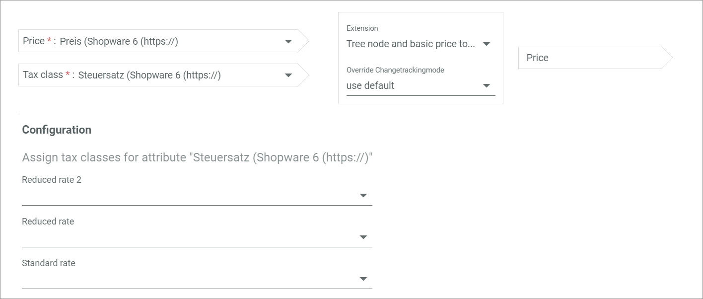

This extension is used to map a tree node attribute and a price attribute to a PIM price field attribute. This mapping is often used to import offers or product from another system to Actindo. The simple price as well as the tax class are mapped to the PIM price field attribute. The different tax classes are defined in the configuration. The configuration settings are only displayed after a tax class attribute has been selected. As the PIM price field attribute also needs a currency and an indication whether the net or the gross price is specified, the default currency in the PIM system and the gross price value are mapped. To specify all values to be mapped to the PIM price field attribute, use the [PriceBuilder](#pricebuilder) extension.

[comment]: <> (Is that right?)

### Possible data type mappings

> [Info] The data type of the destination attribute and the selected ETL extension determine the data type of the source attribute.

| Destination attribute data type  | Source attribute data type                          |
|----------------------------------|-----------------------------------------------------|
| Price field                      | *Price*: Simple price   *Tax class*:  Tree node |

### Configuration

The configuration depends on the selected tax class attribute. A single drop-down list is displayed for each tax class defined in the source system.

**Assign tax classes for attribute "Tax class attribute name"**

- *"Tax class name"*     
  Click the drop-down list and select the applicable tax class to be mapped to the tax class in the destination attribute. All available tax rates from the destination attribute are displayed in the list.

## Tree key to string

This extension is used to map a tree node attribute to text. Both string and text field attributes are allowed in the destination attribute. The key value of the source tree node attribute is mapped to the destination attribute.

### Possible data type mappings

> [Info] The data type of the destination attribute and the selected ETL extension determine the data type of the source attribute.

| Destination attribute data type  | Source attribute data type   |
|----------------------------------|------------------------------|
| String                           | Tree node                    |
| Text field                       | Tree node                    |

### Configuration

This ETL extension has no further configuration settings.

## Tree/string to tax class

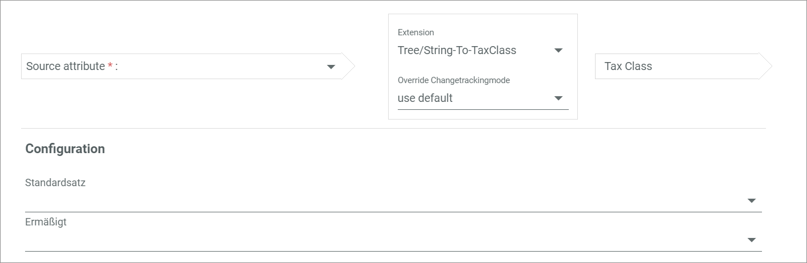

This extension is used to map a tree node to a tax class attribute. The name value of the source tree node attribute is mapped to the destination attribute. The tax class attribute is Actindo specific and therefore needs a special extension for mapping. This mapping is only used when the tax class is maintained in a separate attribute and not included to the price attribute. The different tax classes are defined in the configuration.

### Possible data type mappings

> [Info] The data type of the destination attribute and the selected ETL extension determine the data type of the source attribute.

| Destination attribute data type  | Source attribute data type  |
|----------------------------------|-----------------------------|
| Tax class                        | Tree node                   |

[comment]: <> (Stimmt das? Warum heißt die extension Tree/string wenn nur eine tree node gemappt werden kann?)

### Configuration

The configuration depends on the selected tree node attribute. A single drop-down list is displayed for each tax class defined in the source system.

- *"Tax class name"*   
  Click the drop-down list and select the applicable tax class to be mapped to the tax class in the destination attribute. All available tax rates from the destination attribute are displayed in the list.

[comment]: <> (Stimmt das? Anwendungsbeispiel?)

## Tree to boolean

This extension is used to map a tree node attribute to a boolean attribute. If the value in the tree node attribute equals **0**, the false value is mapped to the boolean attribute. If the value in the tree node attribute equals **1**, the true value is mapped to the boolean attribute.

[comment]: <> (Stimmt das?)

### Possible data type mappings

> [Info] The data type of the destination attribute and the selected ETL extension determine the data type of the source attribute.

| Destination attribute data type  | Source attribute data type  |
|----------------------------------|-----------------------------|
| Boolean                          | Tree node                   |

### Configuration

This ETL extension has no further configuration settings.

## Tree to float

This extension is used to map a tree node attribute to a decimal number. The name value of the source tree node attribute is mapped to the destination attribute.

[comment]: <> (Stimmt das?)

### Possible data type mappings

> [Info] The data type of the destination attribute and the selected ETL extension determine the data type of the source attribute.

| Destination attribute data type  | Source attribute data type          |
|----------------------------------|-------------------------------------|
| Float                            | Tree node                           |

### Configuration

This ETL extension has no further configuration settings.

## Tree to tree

This extension is used to map a tree node attribute to another tree node attribute. Further settings to the tree node are defined in the configuration.

### Possible data type mappings

> [Info] The data type of the destination attribute and the selected ETL extension determine the data type of the source attribute.

| Destination attribute data type  | Source attribute data type          |
|----------------------------------|-------------------------------------|
| Tree node                        | Tree node                           |

### Configuration

-  *Create node if not existing*   
  Enable the toggle to automatically create a tree node in the destination attribute if no tree node exists. Otherwise, you have to manually create a tree node.

  [comment]: <> (is that right? or does the mapping fail then?)

- *Match destination node by*   
  Click the drop-down list and select the field of the tree node attribute whose value will be used for the mapping. The following options are available:
  - **Key**   
    The key value of the tree node attribute is used for the mapping.
  - **Title**   
    The title value of the tree node attribute is used for the mapping.

- *Relevant language*   
  Click the drop-down list and select the language of the attribute value used for the mapping. All active languages are displayed in the list. The drop-down list is only displayed if the **Title** option is selected in the *Match destination node by* drop-down list.

## Tree value mapping

This extension is used to map a value connected to a string or tree node attribute to another tree node attribute. The connected value of the source attribute must be accessed to map it to the tree node attribute. For instance, this extension is often used to map the Actindo payment method from an order. All payment methods and their IDs are defined in the *Order management* module. These values must be accessed to map both the payment methods and their IDs to the destination tree node attribute.

### Possible data type mappings

> [Info] The data type of the destination attribute and the selected ETL extension determine the data type of the source attribute.

| Destination attribute data type  | Source attribute data type   |
|----------------------------------|------------------------------|
| Tree node                        | Tree node, String            |

### Configuration

This ETL extension has no further configuration settings.

## Unit value to number

This extension is used to map a unit attribute to a number. Both decimal and absolute numbers are allowed in the destination attribute. A unit attribute always includes a unit and a quantity. Only the quantity value is mapped to the destination attribute. To map the quantity value in the correct unit, the quantity is converted into the unit of the destination attribute. Define the unit in the configuration.

[comment]: <> (Is that right?)

### Possible data type mappings

> [Info] The data type of the destination attribute and the selected ETL extension determine the data type of the source attribute.

| Destination attribute data type  | Source attribute data type          |
|----------------------------------|-------------------------------------|
| Integer                          | Unit                                |
| Float                            | Unit                                |

### Configuration

- *Unit to convert to*   
  Click the drop-down list and select the appropriate unit of the destination attribute to convert the quantity value into the correct unit. All units corresponding to the dimension of the source attribute are displayed in the list.

## Unit value to text

This extension is used to map a unit attribute to a string attribute. A unit attribute always includes a unit and a quantity. The settings how to display both values in the string attribute are defined in the configuration.

### Possible data type mappings

> [Info] The data type of the destination attribute and the selected ETL extension determine the data type of the source attribute.

| Destination attribute data type  | Source attribute data type          |
|----------------------------------|-------------------------------------|
| String                           | Unit                                |

### Configuration

- *Mode*     
  Click the drop-down list and select the unit mapping mode. The following options are available:
  - **Keep unit**   
    The source unit is mapped to the destination attribute.
  - **Configured unit**   
    The unit to be mapped to the destination attribute must be selected in the *Configured unit* drop-down list.
  - **Destination unit**   
    The destination unit is kept in the destination attribute.

  [comment]: <> (Destination Unit -> error; Configured Unit -> not working and no drop-down list displayed; ergibt auch irgendwie beides keinen sinn, oder?)

- *Suffix Mode*   
  Click the drop-down list and select the suffix display mode for the unit. The following options are available:
  - **Suffix symbol**   
    The unit is displayed by its symbol or abbreviation, for instance *cm*.
  - **Suffix name**   
    The unit is displayed by its name, for instance *centimeter*.
  - **Suffix empty**   
    The unit is hidden.

- *Separator*   
  Enter the separator sign placed between quantity and unit. If the field is left empty, the unit and quantity are written directly one after the other.

- *Decimal separator*   
  Enter the decimal separator for the quantity value. If the number of decimal places is greater than 0, you should enter a separator sign to avoid that the value is displayed incorrectly. By default, the point is used as a decimal separator in English, the comma in German.

- *Decimal places*   
  Enter the number of decimal places for the quantity value. This field is mandatory. Depending on the decimal places, the quantity is rounded.

  [comment]: <> (Verwirrend: warum wird bei der unitvalue-to-number erweiterung nur der mengenwert, bei der unitvalue-to-string erweiterung aber menge inklusive einheit übertragen?)

## Unit value to unit value

This extension is used to map a unit attribute to another unit attribute. A unit attribute always includes a unit and a quantity. Define in the configuration which of the units should be mapped in the destination attribute. In contrast to the *Basic mapping* extension, the *Unit value to unit value* extension allows to convert the value when using different units in the source and the destination attribute.

### Possible data type mappings

> [Info] The data type of the destination attribute and the selected ETL extension determine the data type of the source attribute.

| Destination attribute data type  | Source attribute data type          |
|----------------------------------|-------------------------------------|
| Unit                             | Unit                                |

### Configuration

- *Choose the unit mapping mode*     
  Click the drop-down list and select the appropriate unit mapping mode. The following options are available:
  - **Keep unit**   
    The source unit is mapped to the destination attribute.
  - **Configured unit**   
    The unit to be mapped to the destination attribute must be selected in the *Configured unit* drop-down list.
  - **Destination unit**   
    The destination unit is kept in the destination attribute.

- *Configured unit*    
  Click the drop-down list and select the unit that will be mapped in the destination unit. All units corresponding to the dimension of the destination attribute are displayed in the list. The drop-down list is only displayed if the  **Configured unit** option is selected in the *Choose the unit mapping mode* drop-down list.

## Variant to string

This extension is used to map a variant attribute to text, for instance to provide product information. The defining attribute value of the variant is mapped to the destination attribute. Define in the configuration if certain attributes should be excluded and if the attribute names should be included for the mapping.

### Possible data type mappings

> [Info] The data type of the destination attribute and the selected ETL extension determine the data type of the source attribute.

| Destination attribute data type  | Source attribute data type          |
|----------------------------------|-------------------------------------|
| String                           | Variant                             |
| Text field                       | Variant                             |

### Configuration

-  *Include attribute name*     
  Enable the toggle to map both the attribute names and their values. Disable the toggle to map the attribute values only.

- *Excluded attribute keys*  
  Enter the attribute keys of those attributes that should not be mapped to the destination attribute.

- *Language for values from a tree node*   
  Click the drop-down list and select the language of the source attribute value used for the mapping. All active languages are displayed in the list. This setting only applies to values from a tree node.

[comment]: <> (when is the language setting displayed?)

## Variant value to master SKU

[comment]: <> (VariantValueToStringExtension)

This extension is used to map a product variant attribute to a string attribute. The defining attribute value of the variant is mapped to the destination attribute. The product variant attribute is Actindo specific and therefore needs a special extension for mapping.

[comment]: <> (stimmt das? Bild aktualisieren!)

### Possible data type mappings

> [Info] The data type of the destination attribute and the selected ETL extension determine the data type of the source attribute.

| Destination attribute data type  | Source attribute data type          |
|----------------------------------|-------------------------------------|
| String                           | Product variant                     |

### Configuration

This ETL extension has no further configuration settings.

## Variant to variant

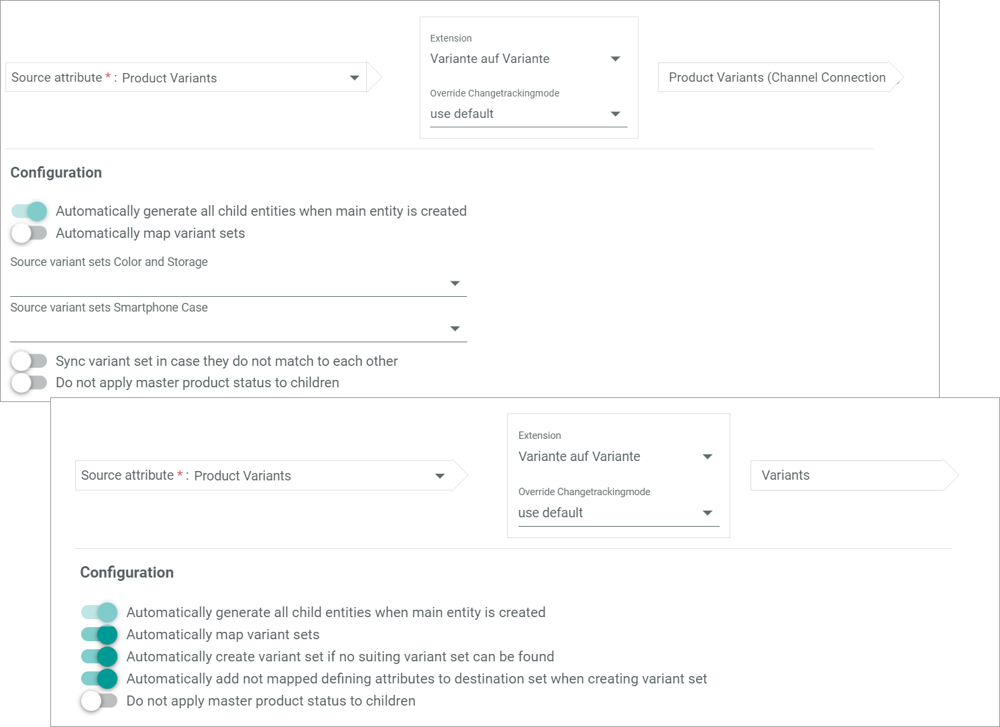

This extension is used to map a variant attribute to a variant attribute. The variant mapping is used to define the handling of product variants in relation to their master product. The settings about the variant handling are defined in the configuration.

### Possible data type mappings

> [Info] The data type of the destination attribute and the selected ETL extension determine the data type of the source attribute.

| Destination attribute data type  | Source attribute data type          |
|----------------------------------|-------------------------------------|
| Variant                          | Variant                             |

[comment]: <> (stimmt das? Den Code checke ich nicht...)

### Configuration

-  *Automatically generate all child entities when main entity is created*   
  All variants to a master product are automatically created in the destination when the master product is created. This toggle is read-only.

  [comment]: <> (Welchen Sinn ergibt ein Toggle, der nicht umgeschaltet werden kann?)

-  *Automatically map variant sets*   
  Enable the toggle to automatically map the assigned variant sets of the source variant attribute and the destination variant attribute. It is recommended to enable the toggle. Otherwise, the variant sets must be mapped manually. By default, the toggle is enabled.

- *Source variant sets "Variant set name"*   
  Click the drop-down list to select the applicable variant set. All available variant sets, that are defined in the *Omni-Channel* module for the selected destination attribute set, are displayed in the list. A single drop-down list is displayed for each variant set, which is defined for the selected source attribute set.

-  *Automatically create variant set if no suiting variant set can be found*   
  Enable the toggle to automatically create a variant set if the assigned variant sets of the source variant attribute and the destination variant attribute do not match. It is recommended to enable the toggle. Otherwise, the variant set must be created manually. By default, the toggle is enabled. This toggle is only displayed if the *Automatically map variant sets* toggle is enabled.

-  *Automatically add not mapped defining attributes to destination set when creating variant set*   
  Enable the toggle to automatically add unmapped defining attributes to the created destination variant set. It is recommended to enable the toggle. Otherwise, the defining attributes must be added manually to the attribute set. By default, the toggle is enabled. This toggle is only displayed if the *Automatically map variant sets* toggle is enabled.

-  *Sync variant set in case they do not match to each other*   
  Enable the toggle to automatically create a variant set if the assigned variant sets of the source variant attribute and the destination variant attribute do not match. By default, the toggle is disabled. This toggle is only displayed if the *Automatically map variant sets* toggle is disabled.

-  *Do not apply master product status to children*      
  Enable the toggle to manage the status of all variants independently of their master product. Otherwise, the status of the main product is automatically applied to all variants in the destination attribute. By default, the toggle is disabled.
