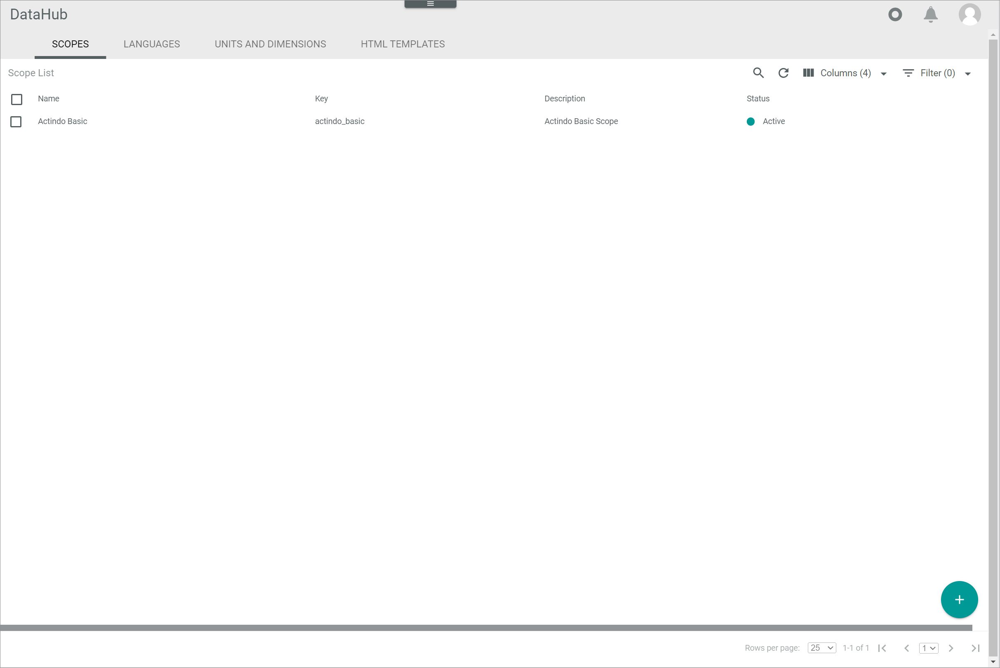

[!!Manage the scopes](../Integration/04_ManageScopes.md)

# Scopes

*DataHub > Settings > Tab SCOPES*

**Scope list**

-  (Search)   
    Click this button to display the search bar and search for a scope.

-  (Refresh)   
    Click this button to update the list of scopes.

-  Columns (x)   
    Click this button to display the columns bar and customize the displayed columns and the order of columns in the list. The *x* indicates the number of columns that are currently displayed in the list.

-  Filter (x)   
    Click this button to display the filter bar and customize the active filters. The *x* indicates the number of filters that are currently active.

- [x]     
    Select the checkbox to display the editing toolbar. If you click the checkbox in the header, all scopes in the list are selected.

- [EDIT]   
    Click this button to edit the selected scope. This button is only displayed if a single checkbox of a scope is selected. Alternatively, you can click directly a row in the list to edit a scope.

- [DELETE]   
    Click this button to delete the selected scope. This button is only displayed if the checkbox of at least one scope is selected.       

The list displays all scopes. Depending on the settings, the displayed columns may vary. All fields are read-only.

- *Name*   
    Scope name.

- *Key*   
    Scope key.

- *Description*   
    Description of the scope.

- *Status*   
    Scope status. The following statuses are available:
    -  **Active**
    -  **Inactive**   

- *ID*   
    Scope identification number. The ID number is automatically assigned by the system.

- *Modified on*   
    Date and time of the last modification.

- *Modified by*   
    Name and username of the user who modified the scope.

- *Created on*   
    Date and time of the creation.

- *Created by*   
    Name and username of the user who created the scope.

- *Name (Language)*   
    Scope name in the selected language. A single *Name (Language)* column is displayed for the system languages *English (United States)* and *Deutsch (Deutschland)*.

- *Description (Language)*   
    Scope description in the displayed language. A single *Description (Language)* column is displayed for the system languages *English (United States)* and *Deutsch (Deutschland)*.

-  (Add)   
    Click this button to create a scope. The *Create scope* view is displayed.   

## Create scope

*DataHub > Settings > Tab SCOPES > Button Add*

**Create scope**

The *Create scope* view is used to add a new scope in all needed languages.  

-  (Back)   
    Click this button to close the *Create scope* view and return to the scope list. All changes are rejected.

- *"Language name"*   
    Click the drop-down list and select the system language in which the *Name (Language)* and *Description (Language)* fields are displayed. By default, the following options are available:
    - **English (United States)**
    - **Deutsch (Deutschland)**

- [SAVE]   
    Click this button to save the scope. The *Create scope* view is closed.

- *Name (Language)*   
    Enter a scope name in the selected language.

- *Description (Language)*   
    Enter a description to the scope in the selected language.

- *Key*   
    Enter a scope key. The key is required for API access and must be system-wide unique. A scope key must fulfill the following criteria:
    - Valid characters are **a-z** (upper and lower case), **0-9** and the underscore ( **_** )
    - The key must not start with a number
    - A double underscore ( **___** ) and a trailing underscore are not allowed.

-  *Active*   
    Enable this toggle to set the scope status to active. Disable the toggle to set the scope status to inactive. By default, this toggle is disabled.

## Edit scope

*DataHub > Settings > Tab SCOPES > Select scope*

**Edit scope**

The *Edit scope* view is used to change a scope in all needed languages. 

-  (Back)   
    Click this button to close the *Edit scope* view and return to the scope list. All changes are rejected.

- *"Language name"*   
    Click the drop-down list and select the system language in which the *Name (Language)* and *Description (Language)* fields are displayed. By default, the following options are available:
    - **English (United States)**
    - **Deutsch (Deutschland)**
    
- [SAVE]   
    Click this button to save the scope. The *Edit scope* view is closed.

- *Name (Language)*   
    Click the field to edit the scope name in the selected language.

- *Description (Language)*   
    Click the field to edit the description to the scope in the selected language.

- *Key*   
    Click the field to edit the scope key. It is not recommended to change the scope key after creation.   
    The key is required for API access and must be system-wide unique. A scope key must fulfill the following criteria:
    - Valid characters are **a-z** (upper and lower case), **0-9** and the underscore ( **_** ).
    - The key must not start with a number.
    - A double underscore ( **___** ) and a trailing underscore are not allowed.

-  *Active*   
    Enable this toggle to set the scope status to active. Disable the toggle to set the scope to inactive. By default, this toggle is disabled.

