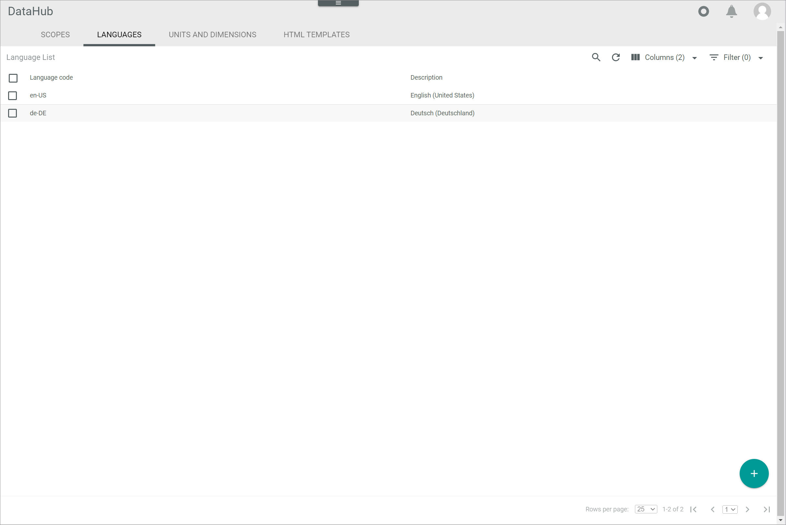
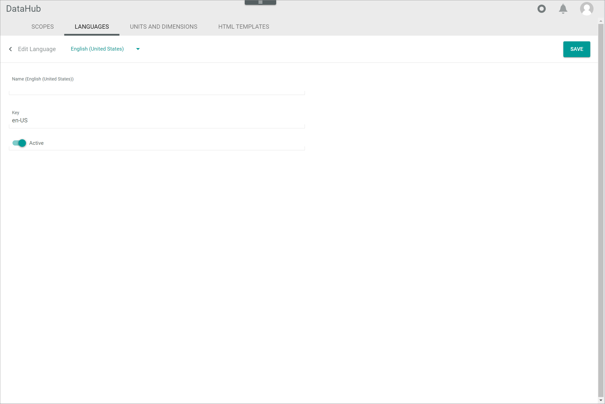

[!!Manage the languages](../Integration/05_ManageLanguages.md)

# Languages

*DataHub > Settings > Tab LANGUAGES*

**Language list**

The list displays all languages. Depending on the settings, the displayed columns may vary. All fields are read-only.

The following functions are available for the editing toolbar:

- [x]     
    Select the checkbox to display the editing toolbar. If you click the checkbox in the header, all languages in the list are selected.

- [EDIT]   
    Click this button to edit the selected language. The *Edit language* view is displayed, see [Edit language](#edit-language). This button is only displayed if a single checkbox of a language is selected. Alternatively, you can click directly a row in the list to edit a language.

- [DELETE]   
    Click this button to delete the selected language. This button is only displayed if the checkbox of at least one language is selected.       

The following functions and fields are available in this view:

- *Key*   
    Language key.

- *Language*   
    Language name.

- *ID*   
    Language identification number. The ID number is automatically assigned by the system.

- *Modified on*   
    Date and time of the last modification.

- *Modified by*   
    Name and username of the user who modified the language.

- *Created on*   
    Date and time of the creation.

- *Created by*   
    Name and username of the user who created the language.

-  (Add)   
    Click this button to create a language. The *Create language* view is displayed, see [Create language](#create-language).   

## Create language

*DataHub > Settings > Tab LANGUAGES > Button Add*

**Create language**

The following functions and fields are available in this view:

- *"Language name"*   
    Click the drop-down list and select the system language in which the *Name (Language)* and *Description (Language)* fields are displayed. By default, the following options are available:
    - **English (United States)**
    - **Deutsch (Deutschland)**

- [SAVE]   
    Click this button to save the language. The *Create language* view is closed.

- *Name (Language)*   
    Enter a language name in the selected language.

- *Key*   
    Enter a language key. The key is required for API access and must be system wide unique. The language key must fulfill the criteria of the language codes according to [RFC 4646](https://www.heise.de/netze/rfc/rfcs/rfc4646.shtml). For instance, keys with the following structure are valid:
    - **en**
    - **en_US**
    - **en-US**

    > [Info] It is recommended to use the two-letter ISO 639-1 code for the language separated by a hyphen with the two-letter ISO 3166-1 code for the country, for instance en-US for English (United States), en-UK for English (United Kingdom) or de-DE for German (Germany).

[comment]: <> (Achtung, in der 1. Version heißt es Key im UI, aber hier Language code. Auch Key in 2. Version in Create/Edit language. UI vereinheitlichen!)

-  *Active*   
    Enable this toggle to set the language status to active. Disable the toggle to set the language status to inactive. By default, this toggle is disabled.

## Edit language

*DataHub > Settings > Tab LANGUAGES > Select language*

**Edit language**

The following functions and fields are available in this view:

- *"Language name"*   
    Click the drop-down list and select the system language in which the *Name (Language)* and *Description (Language)* fields are displayed. By default, the following options are available:
    - **English (United States)**
    - **Deutsch (Deutschland)**

- [SAVE]   
    Click this button to save the language. The *Edit language* view is closed.

- *Name (Language)*   
    Click the field to edit the language name in the selected language.

- *Key*   
    Click the field to edit the language key. It is not recommended to change the language key after creation.   
    The key is required for API access and must be system wide unique. The language key must fulfill the criteria of the language codes according to [RFC 4646](https://www.heise.de/netze/rfc/rfcs/rfc4646.shtml). For instance, keys with the following structure are valid:
    - **en**
    - **en_US**
    - **en-US**

    > [Info] It is recommended to use the two-letter ISO 639-1 code for the language separated by a hyphen with the two-letter ISO 3166-1 code for the country, for instance en-US for English (United States), en-UK for English (United Kingdom) or de-DE for German (Germany).

-  *Active*   
    Enable this toggle to set the language status to active. Disable the toggle to set the language to inactive. By default, this toggle is disabled.

