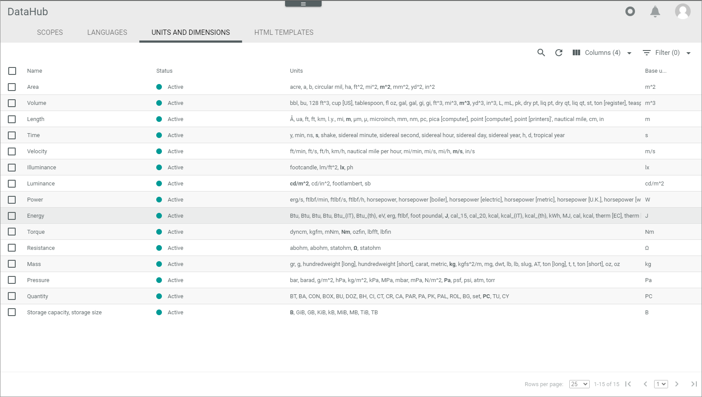
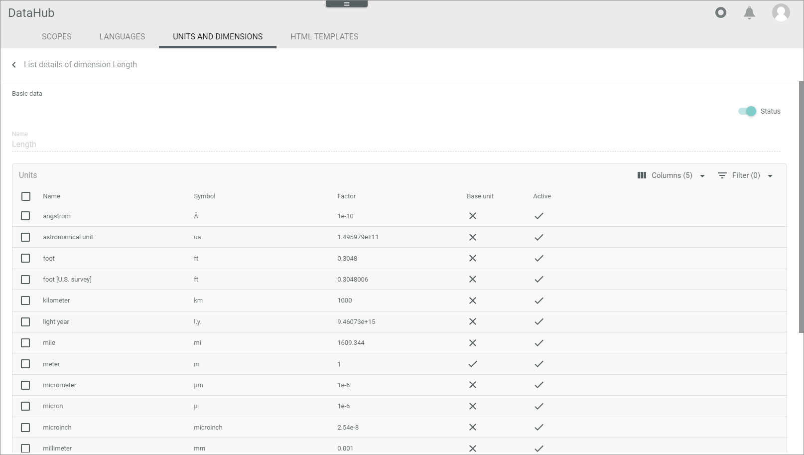

[comment]: <> (Überarbeiten, wenn Funktionen möglich!)

# Units and dimensions

*DataHub > Settings > Tab UNITS AND DIMENSIONS*

**Dimension list**

-  (Search)   
  Click this button to display the search bar and search for a unit or dimension.

  [comment]: <> (Wonach kann ich suchen? Klappt bei mir nicht...)

-  (Refresh)   
  Click this button to update the list of dimensions.

-  Columns (x)   
  Click this button to display the columns bar and customize the displayed columns and the order of columns in the list. The *x* indicates the number of columns that are currently displayed in the list.

-  Filter (x)   
  Click this button to display the filter bar and customize the active filters. The *x* indicates the number of filters that are currently active.

- [x]     
  Select the checkbox to display the editing toolbar. If you click the checkbox in the header, all dimensions in the list are selected. Click directly a row in the list to display the details of the dimension.

  [comment]: <> (Leere Toolbar - was kann ich hier machen?)

The list displays all dimensions. All fields are read-only. Depending on the settings, the displayed columns may vary.

- *Name*   
  Dimension name.

- *Active*   
  Dimension status. The following statuses are available:
  -  **Active**
  -  **Inactive**     

- *Units*   
  Units associated with the dimension. The base unit is highlighted in bold.

- *ID*   
  Dimension identification number. The ID number is automatically assigned by the system.

- *Modified on*   
  Date and time of the last modification.

- *Modified by*   
  Name and username of the user who modified the dimension.

- *Created on*   
  Date and time of the creation.

- *Created by*   
  Name and username of the user who created the dimension.

## Detail list of dimension

*DataHub > Settings > Tab UNITS AND DIMENSIONS > Select dimension*

**Detail list of dimension**

**BASIC DATA**

-  *Active*   
  Enable this toggle to set the dimension status to active. Disable the toggle to set the status to inactive. By default, this toggle is enabled. This toggle is read-only.

  [comment]: <> (Ein toggle, der read-only ist, ist sinnfrei, oder?)

- *Name*   
  Dimension name. This field is read-only.

**Units**

-  Columns (x)   
  Click this button to display the columns bar and customize the displayed columns and the order of columns in the list. The *x* indicates the number of columns that are currently displayed in the list.

-  Filter (x)   
  Click this button to display the filter bar and customize the active filters. The *x* indicates the number of filters that are currently active.

- [x]     
  Select the checkbox to display the editing toolbar. If you click the checkbox in the header, all units in the list are selected.

  [comment]: <> (Leere Toolbar - was kann ich hier machen?)

The list displays all units that are associated to the selected dimension. All fields are read-only. Depending on the settings, the displayed columns may vary.

- *Name*   
  Unit name.

- *Symbol*   
  Unit symbol or abbreviation.

- *Factor*   
  Conversion factor of the unit to the base unit. The base unit always has the factor **1**.

- *Base unit*   
  Indication whether the unit is the base unit or not:
  -  (Checkmark): The unit is the base unit.  
  -  (Cross): The unit is not the base unit.

- *ID*   
  Unit identification number. The ID number is automatically assigned by the system.

- *Modified on*   
  Date and time of the last modification.

- *Modified by*   
  Name and username of the user who modified the unit.

- *Created on*   
  Date and time of the creation.

- *Created by*   
  Name and username of the user who created the unit.

  
