[!!ETL extensions list](../UserInterface/04_ETLExtensions.md)
[!!Manage an attribute](../Integration/01_ManageAttributes.md)

# Data type list

To create an attribute, you have to define a data type.
In the *DataHub* module, all data types from all plugins that interact with the *DataHub* module are available.
Depending on the plugins installed in the current system, the list of data types varies.

In the following, the available data types, their use and their configuration and their owning plugin are described in detail:

- [Textfield](#textfield)
- [Checkbox](#checkbox)
- [Floating point number](#floating-point-number)
- [Integer](#integer)
- [String](#string)
- [Currency](#currency)
- [Language](#language)
- [Country](#country)
- [TreeNode](#treenode)
- [Completeness](#completeness-internal-not-editable)
- [Number with unit](#number-with-unit)
- [DateTime](#datetime)
- [Sales unit value](#sales-unit-value)
- [Simple price field](#simple-price-field)
- [Stock value](#stock-value)
- [EntityCollectionValue](#entitycollectionvalue-internal-not-editable)
- [IntegerCollectionValue](#integercollectionvalue-internal-not-editable)
- [StringCollectionValue](#stringcollectionvalue-internal-not-editable)
- [JSON](#json-internal-not-editable)
- [Taxclass](#taxclass)
- [Taxzone](#taxzone)
- [Images](#images)
- [Files](#files)
- [PIM-Channels connection](#pim-scopes-connection-internal-not-editable)
- [UCS product bundle](#ucs-product-bundle-internal-not-editable)
- [PIM product variants](#pim-product-variants)
- [URLs](#urls-internal-not-editable)
- [Cloudinary image](#cloudinary-image)
- [Cloudinary video](#cloudinary-video)
- [XML](#xml-internal-not-editable)
- [Offer bundle](#offer-bundle)
- [Object](#object-internal-not-editable)
- [Encrypted value](#encrypted-value-internal-not-editable)
- [Related products](#related-products)
- [PIM price field](#pim-price-field)
- [Product variants](#product-variants-internal-not-editable)
- [Base price](#base-price)
- [Product bundle](#product-bundle)
- [Packaging unit](#packaging-unit)
- [Offer variants](#offer-variants-internal-not-editable)
- [Feed offer variants](#feed-offer-variants-internal-not-editable)
- [Multiple errors](#multiple-errors-internal-not-editable)

## Textfield

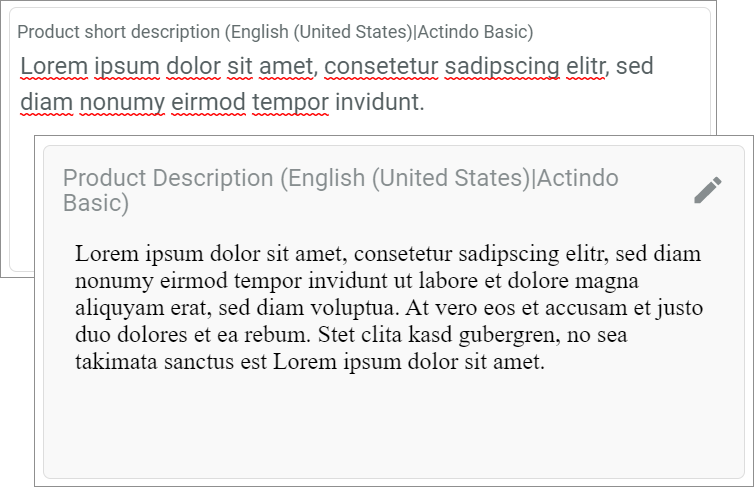

The *Textfield* data type is used for long texts, for example for descriptions. You can configure the text length and select to use a basic editor or an WYSIWYG editor (HTML editor).
In the *PIM Basic Set*, the following attributes have the *Textfield* data type:
- Product short description
- Product description
- Long text

The *DataHub* plugin owns this data type.

### Configuration

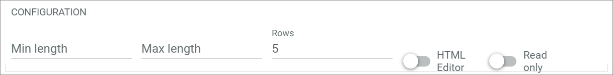

- *Min length*   
    Enter a minimal length of the textfield.

- *Max length*   
    Enter a maximal length of the textfield.

- *Rows*   
    Enter the number of rows in the textfield. By default the number of rows is set to **5**.

-  *HTML Editor*   
    Enable this toggle to enable the HTML editor for the textfield. A WYSIWIG-editor is displayed to edit the textfield. Disable the toggle to disable the HTML editor for the textfield. By default, this toggle is disabled.

-  *Read only*   
    Enable this toggle to set the textfield to read-only. Disable the toggle to set the textfield to editable. By default, this toggle is disabled.

## Checkbox

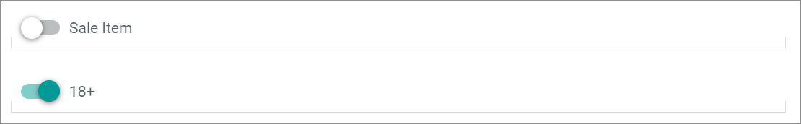

The *Checkbox* data type is used to indicate a statement that is either true or false, for example if a product is a digital or a real product. The checkbox is displayed by a toggle. In the *PIM Basic Set*, the following attributes have the *Checkbox* data type:
- Sale item
- 18+
- Digital item

> [Info] Note that the *Checkbox* date type also has the third value **not set**. When creating or importing a product, the value **not set** is set for the corresponding attribute. After saving, the value switches automatically to **false** if it has not been manually changed to **true**. This may cause problems when connecting to other systems, for example shops or marketplaces, with different default settings for checkboxes.   

The *DataHub* plugin owns this data type.

### Configuration

This data type has no further configuration settings.

## Floating point number

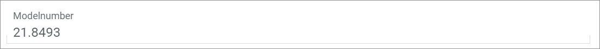

The *Floating point number* data type is used to indicate decimal numbers without a unit. You can configure the number of decimal places and the number range.

The *DataHub* plugin owns this data type.

### Configuration

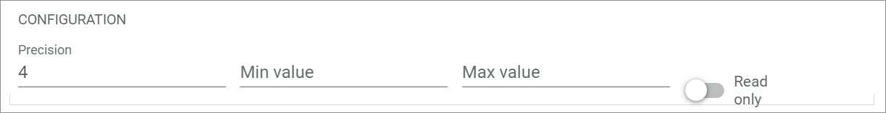

- *Precision*   
    Enter the number of decimal places for the floating point number. By default the number of decimals is set to **4**.  

    > [Info] Note that when you enter more than the defined number of decimal places for the attribute value, the number is commercially rounded to the defined number of decimal places after saving.

- *Min value*   
    Enter a minimum value for the floating point number.  

- *Max value*   
    Enter a maximum value for the floating point number.  

-  *Read only*   
    Enable this toggle to set the floating point number to read-only. Disable the toggle to set the floating point number to editable. By default, this toggle is disabled.

## Integer

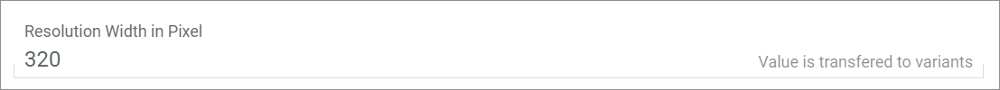

The *Integer* data type is used to indicate whole numbers without a unit. You can configure the number range.

The *DataHub* plugin owns this data type.

### Configuration

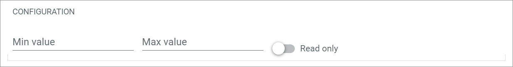

- *Min value*   
    Enter a minimum value for the integer.  

- *Max value*   
    Enter a maximum value for the integer.  

-  *Read only*   
    Enable this toggle to set the integer to read-only. Disable the toggle to set the integer to editable. By default, this toggle is disabled.

## String

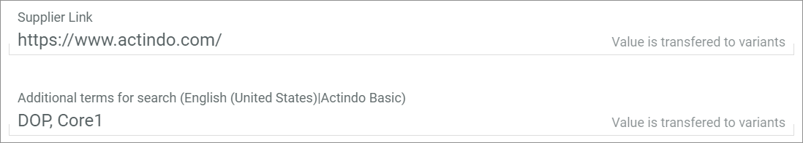

The *String* data type is used for short texts or alphanumeric information, for example keywords. You can configure the string length and define regular expressions for the string. In the *PIM Basic Set*, the following attributes have the *String* data type:
- Product name
- EAN-code
- Customs tariff number
- Supplier link
- Additional terms for search
- Tags/Keywords
- Meta title
- Meta description
- Meta keywords

The *DataHub* plugin owns this data type.

### Configuration

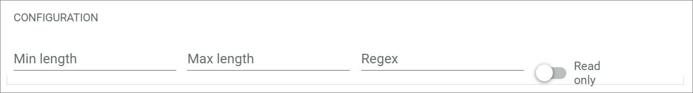

- *Min length*   
    Enter a minimal length of the string.

- *Max length*   
    Enter a maximal length of the string.

- *Regex*   
    Enter a regular expression for the string. For detailed information about regular expressions, see https://regex101.com/.

-  *Read only*   
    Enable this toggle to set the string to read-only. Disable the toggle to set the string to editable. By default, this toggle is disabled.

## Currency

The *Currency* data type is used to indicate a currency. A drop-down list with all currencies in the system is displayed in the product view.

The *DataHub* plugin owns this data type.

### Configuration

This data type has no further configuration settings.

## Language

The *Language* data type is used to indicate a language. A drop-down list with all languages in the system is displayed in the product view.

### Configuration

This data type has no further configuration settings.

The *DataHub* plugin owns this data type.

## Country

The *Country* data type is used to indicate a country. A drop-down list with all countries in the system is displayed in the product view. In the *PIM Basic Set*, the *Country of origin* attribute has the *Country* data type.

The *DataHub* plugin owns this data type.

### Configuration

This data type has no further configuration settings.

## TreeNode

The *TreeNode* is used for indications with multiple, predefined selection options. You have to define the different selection options in the configuration. Additionally, you can configure whether the selection of values will be a multiple or single selection.

> [Info] Note that tree nodes are monolingual. The values are maintained in one single language, but the values are translatable. For example, when adding an element to a tree node attribute defining different colors, it doesn't make sense to add one element *red* and one element *rot* as both elements describe the same color. Instead, only add the the color element in one language.

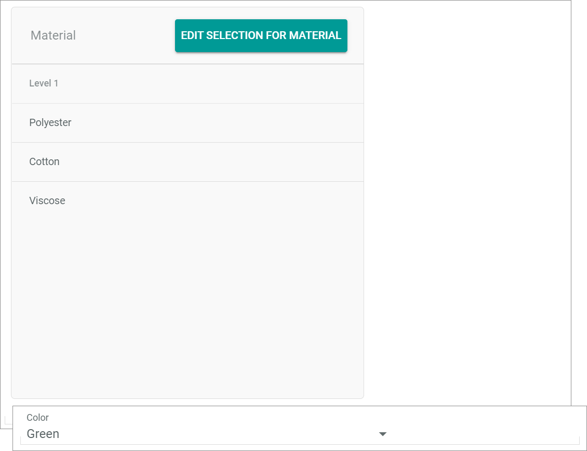

### Configuration

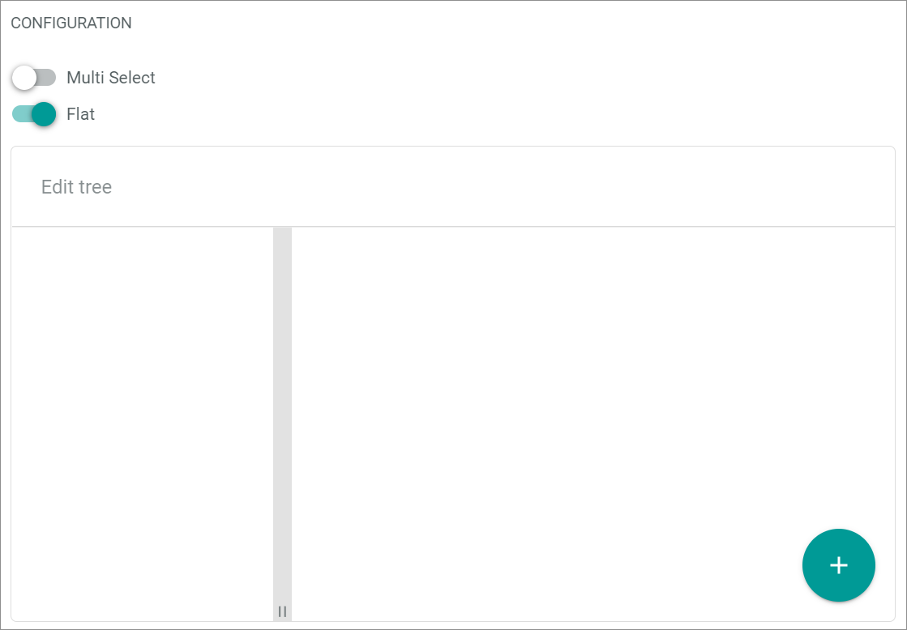

-  *Multi Select*   
    Enable this toggle to allow a multiple selection of values. Disable the toggle to allow only a single selection of values. By default, this toggle is disabled.

> [Info] In the product view, the *TreeNode* data type is displayed either by a drop-down list or by a box with all created options. The drop-down list is only displayed for one dimensional single-select trees.

**Edit tree**

-  (Add)   
    Click first this button and then the plus sign displayed in the left column of the *Edit tree* table to add an attribute value. The *Add Element* window is displayed.

The *DataHub* plugin owns this data type.

### Add element

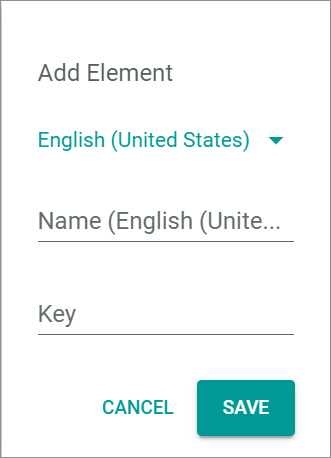

- *Name*   
    Enter the tree node name.

- *Key*   
    Enter the tree node key.

- [CANCEL]   
    Click this button to cancel adding a value.

- [SAVE]   
    Click this button to save the value and add it to the table.

## Completeness (internal, not editable)

This data type is for internal use only. It is strongly advised not to use this data type without the required knowledge.   
The data type is used to show the completeness of a product, according to the required fields in the attribute set.
In the *PIM Basic Set*, the *Completeness* attribute has the *Completeness* data type.

The *DataHub* plugin owns this data type.

## Number with unit

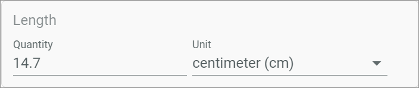

The *Number with Unit* is used for numerical specifications of a certain unit of measurement, for example weight specifications. You can configure the applicable dimension and unit of measurement. Depending on the selected dimension, the options for the unit are adapted. In the *PIM Basic Set*, the following attributes have the *Number with Unit* data type:
- Length
- Width
- Depth
- Weight

The *DataHub* plugin owns this data type.

### Configuration

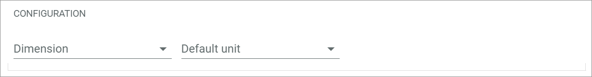

- *Dimension*   
    Click the drop-down list to select the dimension to be used. All active dimensions are displayed in the drop-down list.

- *Default unit*   
    Click the drop-down list to select the dimension to be used. All units that are assigned to the selected dimension are displayed in the drop-down list.

## DateTime

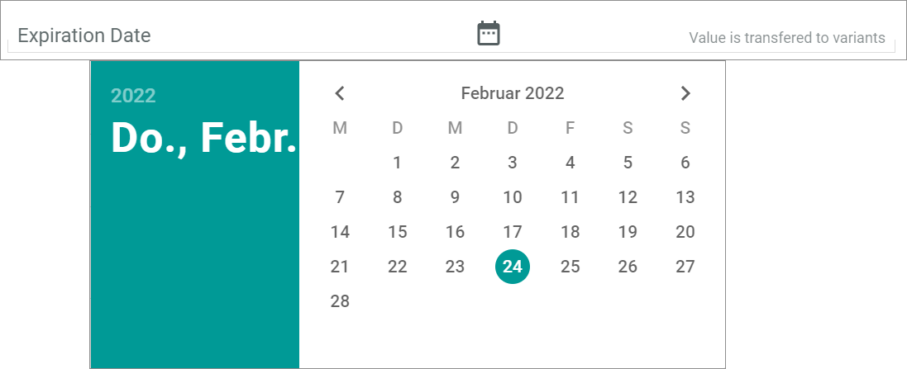

The *DateTime* data type is used to indicate a date and/or a time. You can configure whether to display or not the date and the time, and you can select a date and time format. A calendar widget to select the date is displayed in the product view. In the *PIM Basic Set*, the *Expiration date* attribute has the *DateTime* data type.

The *DataHub* plugin owns this data type.

### Configuration

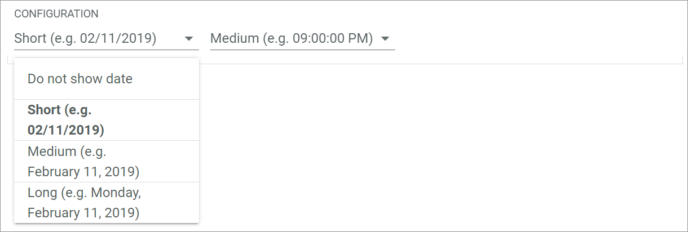

- *Date*   
    Click the drop-down list to select a date format. The formats below are available. By default, the date format **Short** is selected.
    - **Do not show date**   
        hidden date
    - **Short**   
        short format, for example 02/11/2021
    - **Medium**   
        medium format, writing out the month, for example February 11, 2021
    - **Long**   
        long format, adding the weekday and writing out the month, for example Monday, February 11, 2021

- *Time*    
    Click the drop-down list to select a time format. The formats below are available. By default, the time format **Medium** is selected.
    - **Do not show time**   
        hidden time
    - **Short**   
        short format, for example 09:00 PM
    - **Medium**   
        medium format, including seconds, for example 09:00:00 PM

## Sales unit value

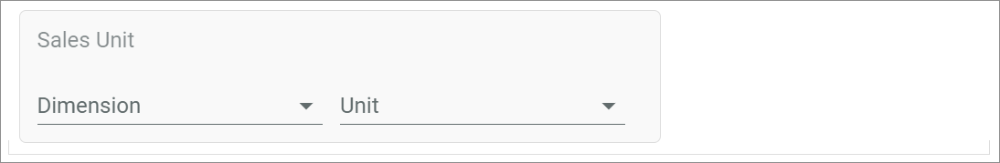

The *Sales Unit Value* data type is used to define a dimension and a unit. Two drop-down lists to select the applicable dimension and unit are displayed in the product view. Depending on the selected dimension, the options for the unit are adapted. In the *PIM Basic Set*, the *Sale unit* attribute has the *Sales Unit Value* data type.

The *DataHub* plugin owns this data type.

### Configuration

This data type has no further configuration settings.

## Simple price field

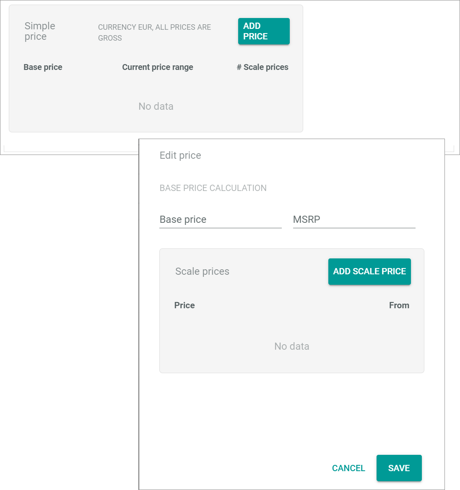

The *Simple price field* data type is used to indicate a price. You can configure the use of gross or net price, the display of an MSRP field and promotion prices, and the currency to be used. Additionally, you can create scale prices in the product view. Unlike the *PIM price field* data type, the *Simple price field* data type requires less information to indicate the price.

The *DataHub* plugin owns this data type.

### Configuration

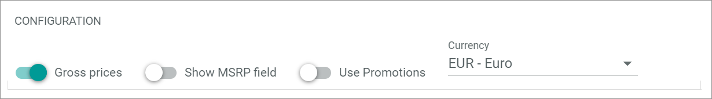

-  *Gross prices*   
    Enable this toggle to display gross prices. Disable the toggle to display net prices. By default, this toggle is enabled.

    > [Info] Note that, especially for the ETL-mapping, it is very important if prices are net or gross.

-  *Show MSRP field*   
    Enable this toggle to display the MSRP field. Disable the toggle to hide the MSRP field. By default, this toggle is disabled.

-  *Use Promotions*    
    Enable this toggle to allow to enter a promotion period for prices. Disable the toggle to not allow promotion prices. By default, this toggle is disabled.

- *Currency*   
    Click the drop-down list to select the currency to be used. All available currencies are displayed in the drop-down list. By default, the default currency is preselected.

## Stock value

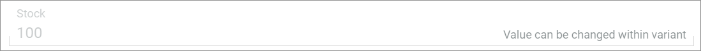

The *Stock Value* data type is used to indicate the number of stocks. You can configure the number of decimal places. A new target channel for this stock is created in the *Warehouse* module for the inventory assignment. In the *PIM Basic Set*, the *Stock* attribute has the *Stock value* data type.

The *DataHub* plugin owns this data type.

### Configuration

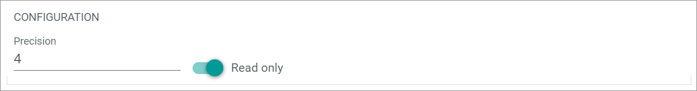

- *Precision*   
    Enter the number of decimals for the stock value. By default the number of decimals is set to **4**.  

-  *Read only*   
    Enable this toggle to set the stock value to read-only. Disable the toggle to set the stock value to editable. By default, this toggle is enabled.

    > [Info] If the warehouse logistic for an product is active and the *Warehousing* module is correctly connected, the stocks are transferred from the invoicing and automatically written into this attribute value. It is only recommended to deactivate the toggle *Read only* if the warehouse logistic is inactive and a stock value is needed.

## EntityCollectionValue (internal, not editable)

This data type is for internal use only. It is strongly advised not to use this data type without the required knowledge.

The *DataHub* plugin owns this data type.

## IntegerCollectionValue (internal, not editable)

This data type is for internal use only. It is strongly advised not to use this data type without the required knowledge.

The *DataHub* plugin owns this data type.

## StringCollectionValue (internal, not editable)

This data type is for internal use only. It is strongly advised not to use this data type without the required knowledge.

The *DataHub* plugin owns this data type.

## JSON (internal, not editable)

This data type is for internal use only. It is strongly advised not to use this data type without the required knowledge.

The *DataHub* plugin owns this data type.

## Taxclass

The *Taxclass* data type is used to indicate the tax class. A drop-down list with all available tax classes is displayed in the product view.

    > [Info] For detailed information about creating a tax class, see [Create a tax class](../../Taxes/Integration/02_ManageTaxClasses.md#create-a-tax-class).

The *Taxes* plugin owns this data type.

### Configuration

This data type has no further configuration settings.

## Taxzone

The *Taxzone* data type is used to indicate the tax zone. A drop-down list with all available tax zones is displayed in the product view.

    > [Info] For detailed information about creating a tax zone, see [Create a tax zone](../../Taxes/Integration/03_ManageTaxZones.md#create-a-tax-zone).

The *Taxes* plugin owns this data type.

### Configuration

This data type has no further configuration settings.

## Images

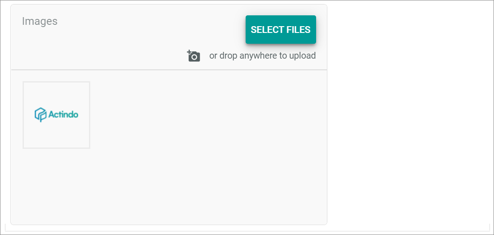

The *Images* data type is used to attach images. You can configure the filename prefix of the uploaded image, the allowed number of images and the file extensions. A preview of the uploaded images is displayed in the product view. In the *PIM Basic Set*, the *Images* attribute has the *Images* data type.     

The *ECM Integration in DataHub* plugin owns this data type.

### Configuration

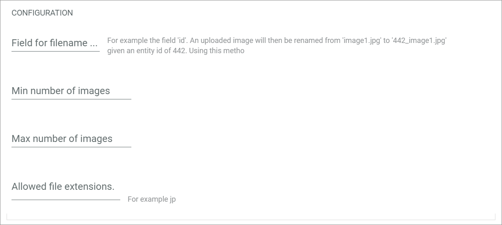

- *Field for filename prefix*   
    Enter a fixed field name whose value will be used as filename prefix for the uploaded image, for example **id** or **sku**.

- *Min number of images*     
    Enter the minimum number of images.

- *Max number of images*     
    Enter the maximum number of images.

- *Allowed file extensions.*     
    Enter the allowed file extensions for the image format. If you want to allow several extensions, separate them with a comma. If no file extension is entered, all file extensions are allowed.

## Files

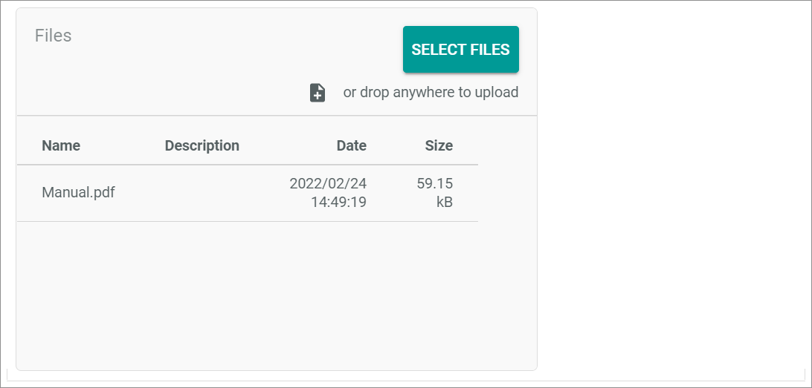

The *Files* data type is used to attach files. You can configure the filename prefix of the uploaded file, the allowed number of files and the file extensions. The uploaded files are displayed in a list in the product view. In the *PIM Basic Set*, the *Files* attribute has the *Files* data type.    

The *ECM Integration in DataHub* plugin owns this data type.

### Configuration

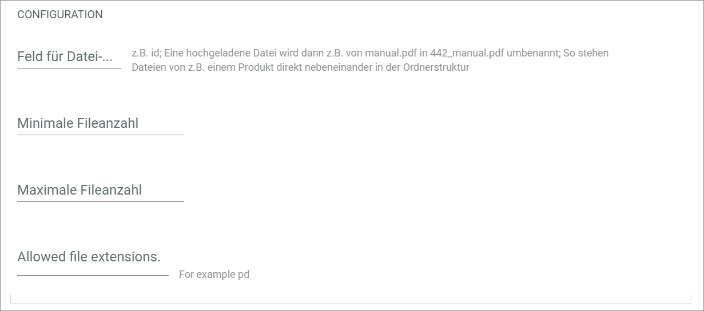

- *Field for filename prefix*   
    Enter a fixed field name whose value will be used as filename prefix for the uploaded file , for example **id** or **sku**.

- *Min number of files*     
    Enter the minimum number of files.

- *Max number of files*     
    Enter the maximum number of files.

- *Allowed file extensions.*     
    Enter the allowed file extensions for the file format. If you want to allow several extensions, separate them with a comma. If no file extension is entered, all file extensions are allowed.

## PIM-Channels connection (internal, not editable)

This data type is for internal use only. It is strongly advised not to use this data type without the required knowledge.   
In the *PIM Basic Set*, the *PIM Omni-Channel Connection* attribute has the *PIM-Channels Connection* data type.

The *PIM Channels Connection* plugin owns this data type.

## UCS product bundle (internal, not editable)

This data type is for internal use only. It is strongly advised not to use this data type without the required knowledge.

The *UCS Product Sync* plugin owns this data type.

## PIM product variants

This data type is for internal use only. It is strongly advised not to use this data type without the required knowledge. In the *PIM Basic Set*, the *Product variants* attribute has the *PIM product variants* data type.

The *PIM* plugin owns this data type.

## URLs (internal, not editable)

This data type is for internal use only. It is strongly advised not to use this data type without the required knowledge.

The *Omni-Channel* plugin owns this data type.

## Cloudinary image

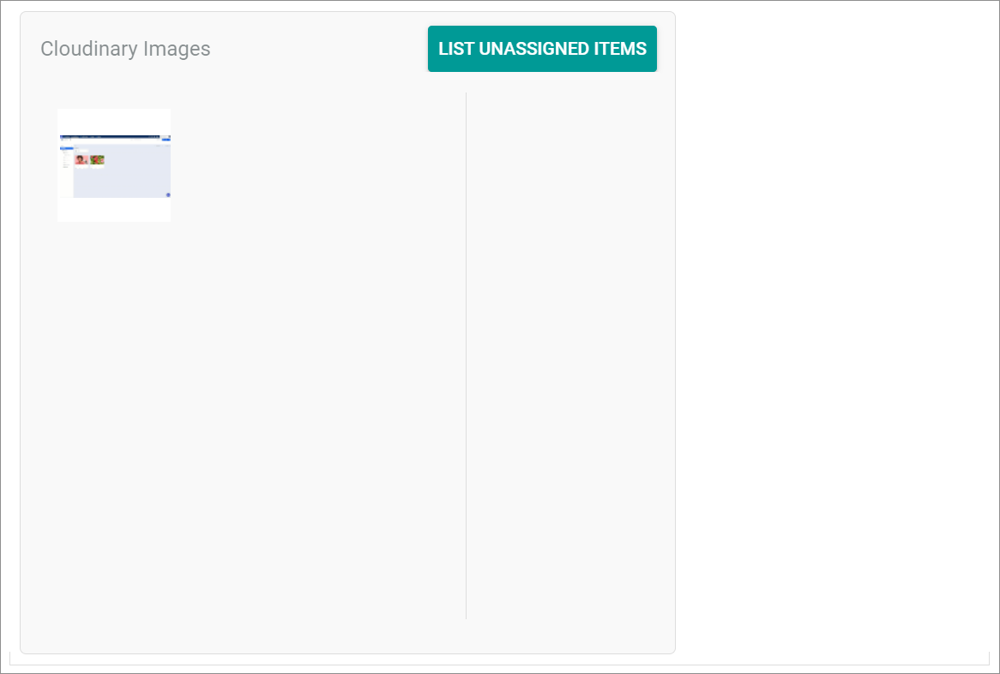

The *Cloudinary Image* data type is used to attach image files from Cloudinary. You can configure further data exchange settings for the image files. You can import image files from Cloudinary or upload image files to Cloudinary in the product view. This data type is only available when the *Cloudinary* module is installed.

The *Cloudinary* plugin owns this data type.

### Configuration

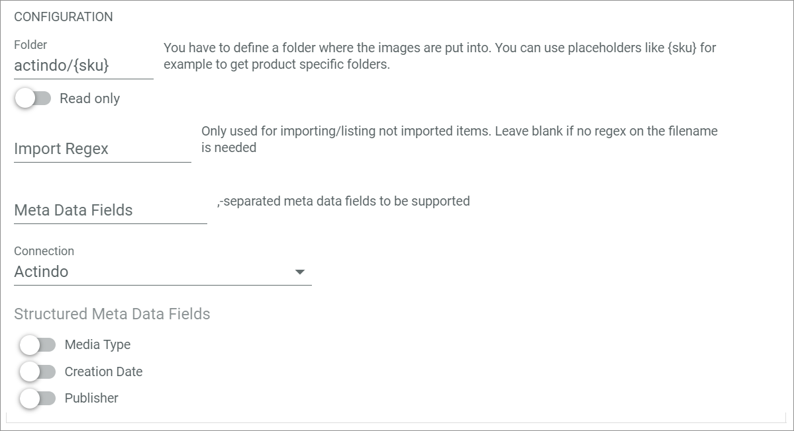

- *Folder*   
    Enter a folder name where the images are put into. If the folder is not yet created in Cloudinary, it is automatically created when uploading the first image. Use placeholders to define product specific folders, for example **{sku}**.

-  *Read only*   
    Enable this toggle to set the *Cloudinary Image* value to read-only. Disable the toggle to set the *Cloudinary Image* value to editable. By default, this toggle is disabled.

- *Import Regex*     
    Enter a regular expression to restrict the listed items for the import of images from Cloudinary. The restriction is applied to the filename. If the field is left blank, no restriction is applied. For detailed information about regular expressions, see https://regex101.com/.

- *Meta Data Fields*     
    Enter names for additional contextual meta data fields. Use commas to separate the field names. A separate meta data field is created for each field name. By default, the *Title (caption)* and the *Description (alt)* contextual meta data fields are automatically created for each image and do not need to be added manually.

- *Connection*     
    Click the drop-down list and select the appropriate connection. All connections created in the *Cloudinary* module are displayed in the list.

**Structured Meta Data Fields**

In this section all structured meta data fields from the selected Cloudinary connection are displayed. Enable the meta data fields in the *PIM* module by activating the corresponding toggle. All inactive fields are not displayed in the *PIM* module and consequently cannot be edited in the *Cloudinary Image* attribute.

## Cloudinary video

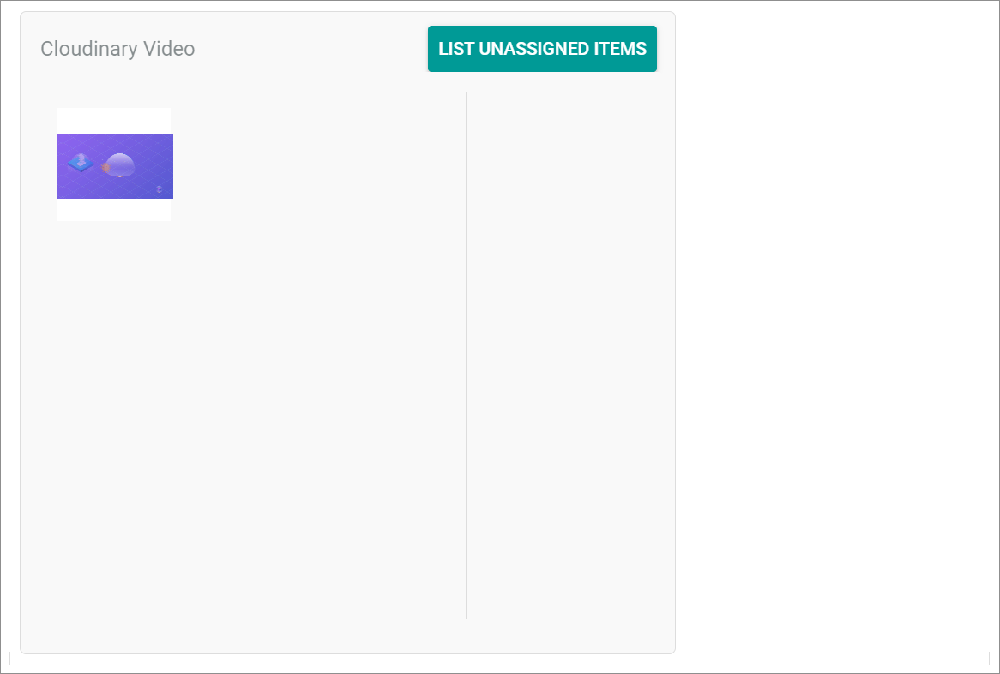

The *Cloudinary Video* data type is used to attach video files from Cloudinary. You can configure further data exchange settings for the video files. You can import video files from Cloudinary or upload video files to Cloudinary in the product view. This data type is only available when the *Cloudinary* module is installed.

The *Cloudinary* plugin owns this data type.

### Configuration

- *Folder*   
    Enter a folder name where the videos are put into. If the folder is not yet created in Cloudinary, it is automatically created when uploading the first video file. Use placeholders to define product specific folders, for example **{sku}**.

-  *Read only*   
    Enable this toggle to set the *Cloudinary Video* value to read-only. Disable the toggle to set the *Cloudinary Video* value to editable. By default, this toggle is disabled.

- *Import Regex*     
    Enter a regular expression to restrict the listed items for the import of videos from Cloudinary. The restriction is applied to the filename. If the field is left blank, no restriction is applied. For detailed information about regular expressions, see https://regex101.com/.

- *Meta Data Fields*     
    Enter names for additional contextual meta data fields. Use commas to separate the field names. A separate meta data field is created for each field name. By default, the *Title (caption)* and the *Description (alt)* contextual meta data fields are automatically created for each video and do not need to be added manually.

- *Connection*     
    Click the drop-down list and select the appropriate connection. All connections created in the *Cloudinary* module are displayed in the list.

**Structured Meta Data Fields**

In this section all structured meta data fields from the selected Cloudinary connection are displayed. Enable the meta data fields in the *PIM* module by activating the corresponding toggle. All inactive fields are not displayed in the *PIM* module and consequently cannot be edited in the *Cloudinary Video* attribute.

The *DataHub* plugin owns this data type.

## XML (internal, not editable)

This data type is for internal use only. It is strongly advised not to use this data type without the required knowledge.

The *DataHub* plugin owns this data type.

## Offer bundle

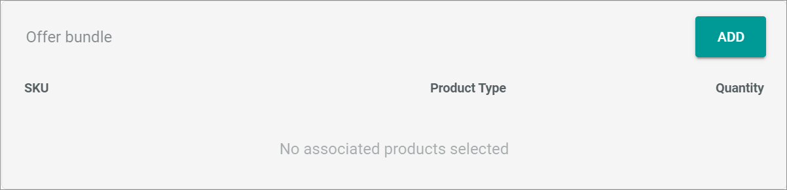

The *Offer bundle* data type is used to create bundles of multiple other products. The data type is only used for Omni-Channel offers, but not for PIM products.

The *Omni-Channel* plugin owns this data type.

### Configuration

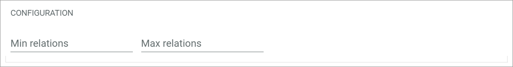

- *Min relations*     
    Enter the minimum number of offers that must be related for an offer bundle.

- *Max relations*    
    Enter the maximum number of offers that can be related for an offer bundle.

## Object (internal, not editable)

This data type is for internal use only. It is strongly advised not to use this data type without the required knowledge.

The *Fulfillment* plugin owns this data type.

## Encrypted value (internal, not editable)

This data type is for internal use only. It is strongly advised not to use this data type without the required knowledge.

The *Global Driver Management* plugin owns this data type.

## Related products

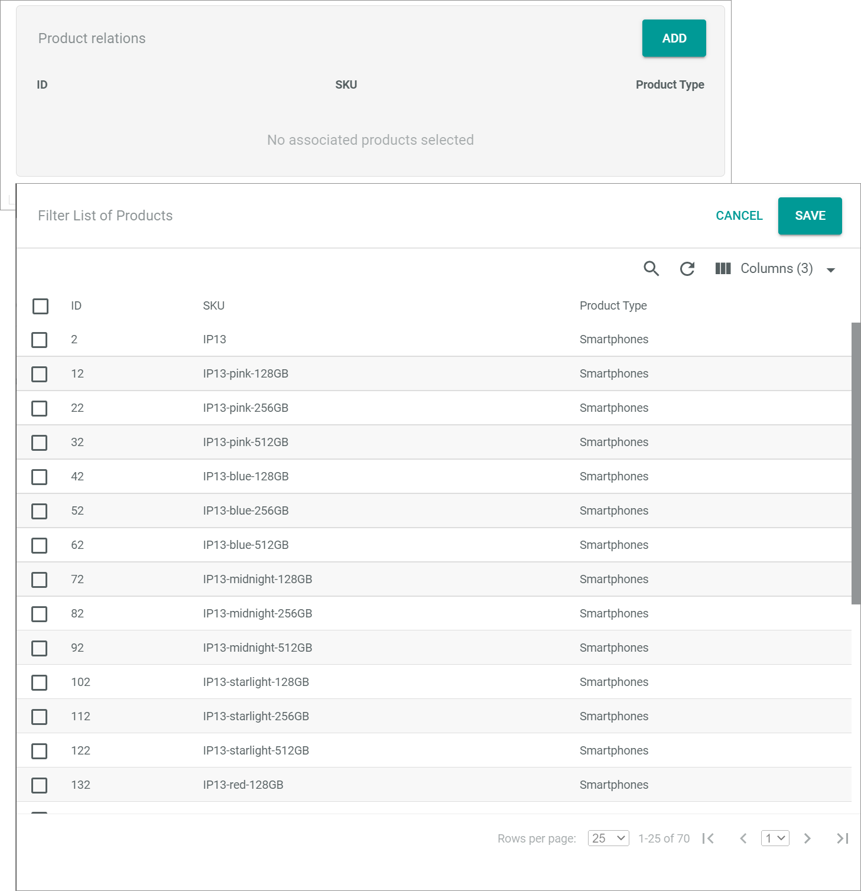

The *Related products* data type is used to connect other products to the selected product, for example for product recommendations. You can configure the allowed number of related products. You can select each created product as a related product in the product view. In the *PIM Basic Set*, the *Product relations* attribute has the *Related products* data type.

The *PIM* plugin owns this data type.

### Configuration

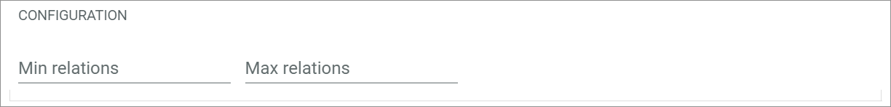

- *Min relations*     
    Enter the minimum number of products that must be related to the selected product.

- *Max relations*    
    Enter the maximum number of products that can be related to the selected product.

## PIM price field

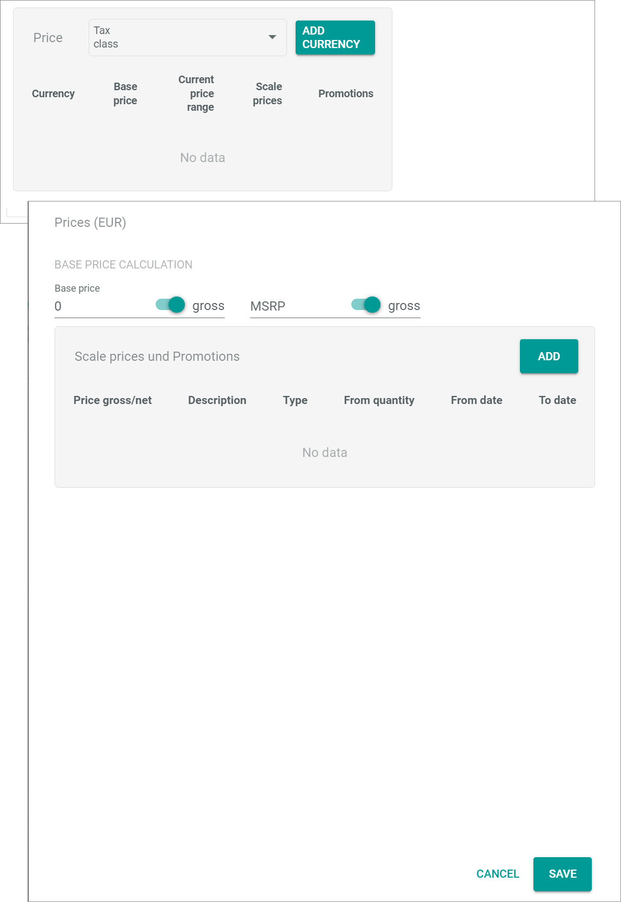

The *PIM Price Field* data type is used to indicate a price. You can configure the number of decimals for the price and the supported currencies. In the product view, you must select a tax class for price calculation. Additionally, you can define a MSRP, scale prices and promotion periods. Unlike the *Simple price field* data type, the *PIM Price Field* data type offers more setting options and therefore also a more detailed and extended price specification. In the *PIM Basic Set*, the *Price* attribute has the *PIM Price Field* data type.

The *PIM* plugin owns this data type.

### Configuration

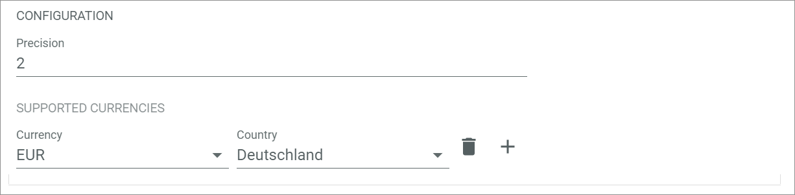

- *Precision*   
    Enter the number of decimals for the price. By default the number of decimals is set to **2**.  

**SUPPORTED CURRENCIES**

- *Currency*    
    Click the drop-down list to select a currency. All available currencies are displayed in the drop-down list.

-  (Delete)   
    Click this button to delete the currency left to this button.

-  (Add)   
    Click this button to add another currency to the list of supported currencies. A new row with the drop-down list *Currency* is displayed below.

## Product variants (internal, not editable)

This data type is for internal use only. It is strongly advised not to use this data type without the required knowledge.   

The *UCS Product Sync* plugin owns this data type.

## Base price

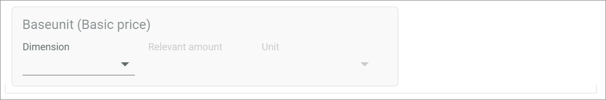

The *Base price* data type is used to indicate a base price. The base price is necessary to calculate the price per unit, which is mandatory in the EU. Two drop-down lists to select the applicable dimension and unit and a field to enter the corresponding amount of the product are displayed in the product view. In the *PIM Basic Set*, the *Base unit (Base price)* attribute has the *Base price* data type:

The *PIM* plugin owns this data type.

### Configuration

This data type has no further configuration settings.

## Product bundle

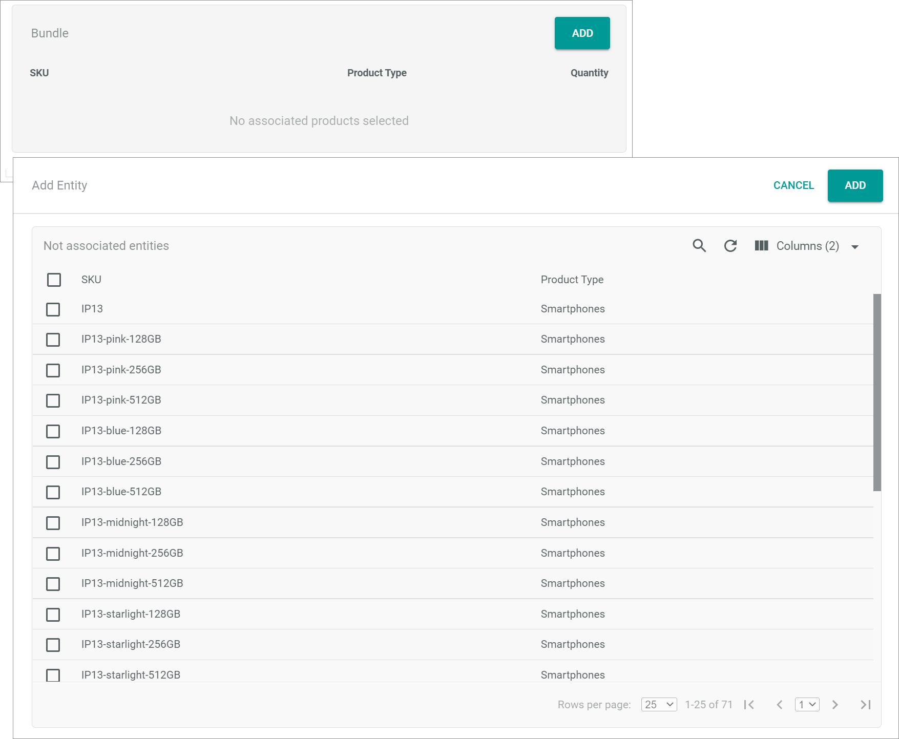

The *Product bundle* data type is used to define products that can be sold in a bundle with the selected product. In a product bundle, several different products are sold together, for example at a promotional price, without forming a packaging unit. That means, that each product has still its own EAN-code and can also be purchased by itself. You can configure the number of allowed products in a product bundle. In the *PIM Basic Set*, the *Bundle* attribute has the *Product bundle* data type:

The *PIM* plugin owns this data type.

### Configuration

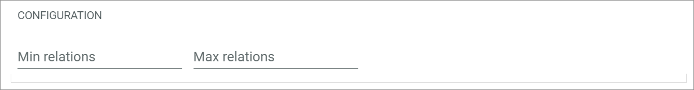

- *Min relations*     
    Enter the minimum number of products that must be related for a product bundle.

- *Max relations*    
    Enter the maximum number of products that can be related for a product bundle.

## Packaging unit

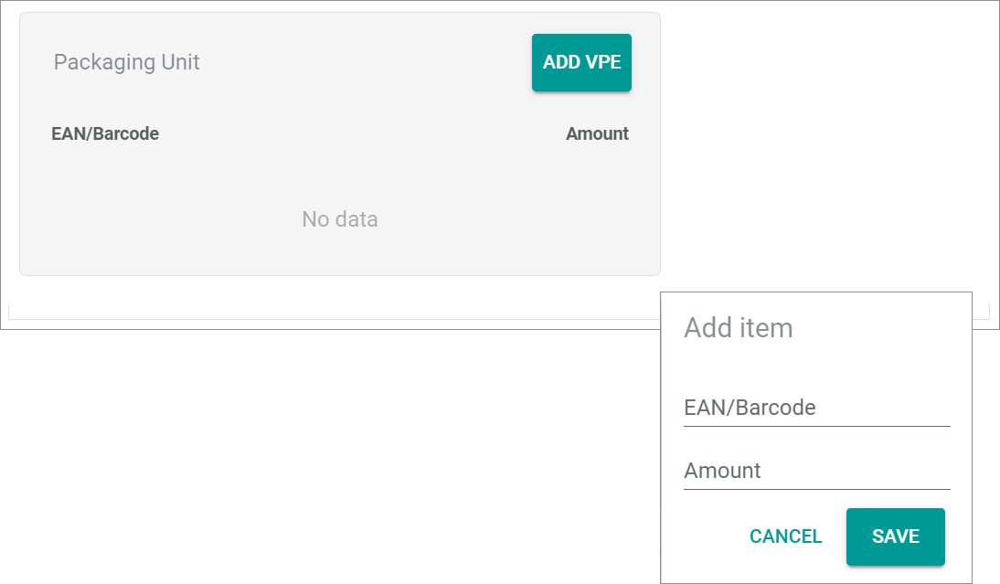

The *Packaging Unit* data type is used to define packaging units. In a packaging unit, several identical products are sold together in one fixed package. This package has its own EAN code and is handled as its own product. Therefore the packaging unit must be maintained in the single product. You can create multiple packaging units for a product in the product view.

The *PIM* plugin owns this data type.

### Configuration

This data type has no further configuration settings.

## Offer variants (internal, not editable)

This data type is for internal use only. It is strongly advised not to use this data type without the required knowledge.   

The *Omni-Channel* plugin owns this data type.

## Feed offer variants (internal, not editable)

This data type is for internal use only. It is strongly advised not to use this data type without the required knowledge.   

The *Omni-Channel* plugin owns this data type.

## Multiple errors (internal, not editable)

This data type is for internal use only. It is strongly advised not to use this data type without the required knowledge.   

The *Global Driver Management* plugin owns this data type.
