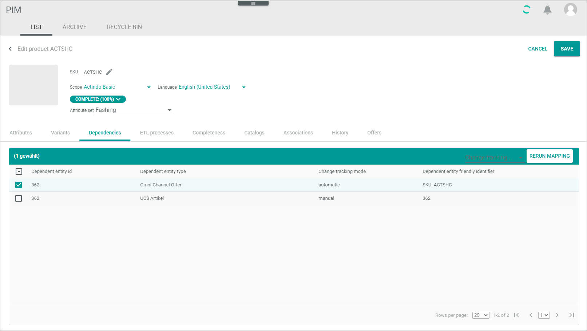

# Dependencies

*Any module that processes DataHub entities > Select entity > Click the Dependencies tab*

**Dependencies**

The list displays all dependencies of the selected entity. Dependencies exist when individual attributes of an entity or the entire entity are linked to another entity, such as through inheritance or automatic mapping.    
For example, an offer in the *Omni-Channel* module that was created by an automatic mapping from a product of the *PIM* module. In this case, all attributes or the entire entity are displayed in this list.   
Depending on the settings, the displayed columns may vary.

> DELETE
-  (Refresh)   
    Click this button to update the list of product dependencies.

-  Columns (x)   
    Click this button to display the columns bar and customize the displayed columns and the order of columns in the list. The *x* indicates the number of columns that are currently displayed in the list.

> END OF DELETE

- *Dependent entity ID*   
    Identification number of the dependent entity.

- *Dependent entity type*   
    Type of the dependent entity. The available types depend on the installed plugins.

- *Change tracking mode*   
    Change tracking mode (ETL mode) of the dependent entity. The following options are available:
    - **Manual**
    - **Semiautomatic**
    - **Semiautomatic, changes must be confirmed by another user**   
    - **Automatic**

- *Dependent entity friendly identifier*   
    Another more descriptive identifier of the dependent entity such as the SKU number or an invoice number.

## Dependencies &ndash; Rerun Mapping

*Any module that processes DataHub entities > Select entity > Click the Dependencies tab > Select an entry*

- [x]     
    Select the checkbox to display the editing toolbar. If you click the checkbox in the header, all dependent entities in the list are selected.

- *Dependent entity ID*   
    Identification number of the dependent entity.

- *Dependent entity type*   
    Type of the dependent entity. The available types depend on the installed plugins.

- *Change tracking mode*   
    Select the *Change tracking mode (ETL mode)* drop-down list of the dependent entity. This drop-down list is only displayed if the checkbox of at least one dependency is selected. The following options are available:
    - **Manual**
    - **Semiautomatic**
    - **Semiautomatic, changes must be confirmed by another user**   
    - **Automatic**

- *Dependent entity friendly identifier*   
    Another more descriptive identifier of the dependent entity such as the SKU number or an invoice number.

- [RERUN MAPPING]   
    Click this button to rerun the mapping of the selected entity. This button is only displayed if the checkbox of at least one dependency is selected.

