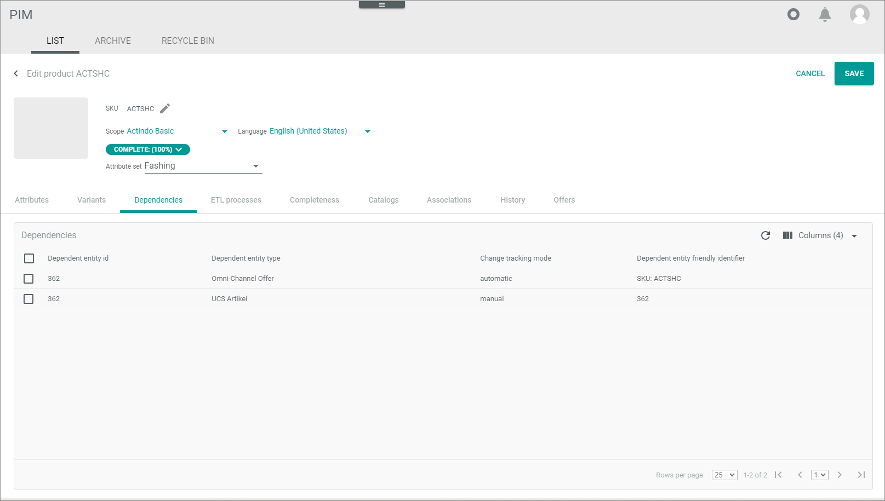
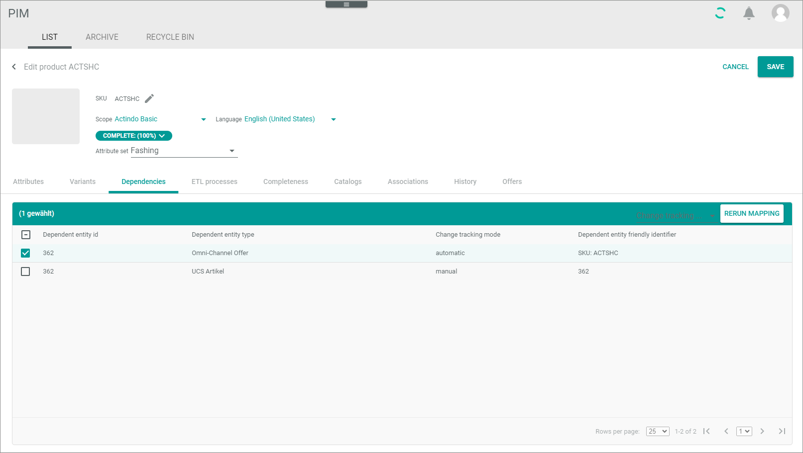

# Dependencies tab

*Any module that processes DataHub entities > Select entity > Click the Dependencies tab*

This tab is not part of the *DataHub* module, but it is used in many other *Core1 Platform* modules that process entities coming from the *DataHub* module.  

[comment]: <> (Unsicher, ob das ganz stimmt. Die Entitäten kommen nicht unbedingt aus DataHub, z.B. dispatch note, PIM-Produkt... Julian fragen.)

**Dependencies**

The list displays all dependencies of the selected entity. Dependencies exist when individual attributes of an entity or the entire entity are linked to another entity, such as through inheritance or automatic mapping.    
For example, an offer in the *Omni-Channel* module that was created by an automatic mapping from a product of the *PIM* module. In this case, all attributes or the entire entity are displayed in this list.   

[comment]: <> (In diesem Fall, denke ich, dass Dependencies angezeigt werden anhand der Entitäten, die via Attribute gemappt sind, die aufeinander eine Auswirkung haben. PIM Produkt -> Offer. Evtl. andere Beispiele geben)

Depending on the settings, the displayed columns may vary.

- *Dependent entity ID*   
    Identification number of the dependent entity.

- *Dependent entity type*   
    Type of the dependent entity. The available types depend on the installed plugins.

- *Change tracking mode*   
    Change tracking mode (ETL mode) of the dependent entity. The following options are available:
    - **Manual**
    - **Semiautomatic**
    - **Semiautomatic, changes must be confirmed by another user**   
    - **Automatic**

- *Dependent entity friendly identifier*   
    Another more descriptive identifier of the dependent entity such as the SKU number or an invoice number.

## Dependencies &ndash; Rerun Mapping

*Any module that processes DataHub entities > Select entity > Click the Dependencies tab > Select an entry*

[comment]: <> (Ich finde, diese Header und Screenshot brauchen wir hier nicht. Einfach weiter mit "functions in editing toolbar". Es ist keine neue Ansicht.)

The following functions are available for the editing toolbar:

- [x]     
    Select the checkbox to display the editing toolbar. If you click the checkbox in the header, all dependent entities in the list are selected.

- [RERUN MAPPING]   
    Click this button to rerun the mapping of the selected entity. This button is only displayed if the checkbox of at least one dependency is selected.

The following functions and fields are available in this view:

- *Dependent entity ID*   
    Identification number of the dependent entity.

- *Dependent entity type*   
    Type of the dependent entity. The available types depend on the installed plugins.

- *Change tracking mode*   
    Select the *Change tracking mode (ETL mode)* drop-down list of the dependent entity. This drop-down list is only displayed if the checkbox of at least one dependency is selected. The following options are available:
    - **Manual**
    - **Semiautomatic**
    - **Semiautomatic, changes must be confirmed by another user**   
    - **Automatic**

- *Dependent entity friendly identifier*   
    Another more descriptive identifier of the dependent entity such as the SKU number or an invoice number.

    

