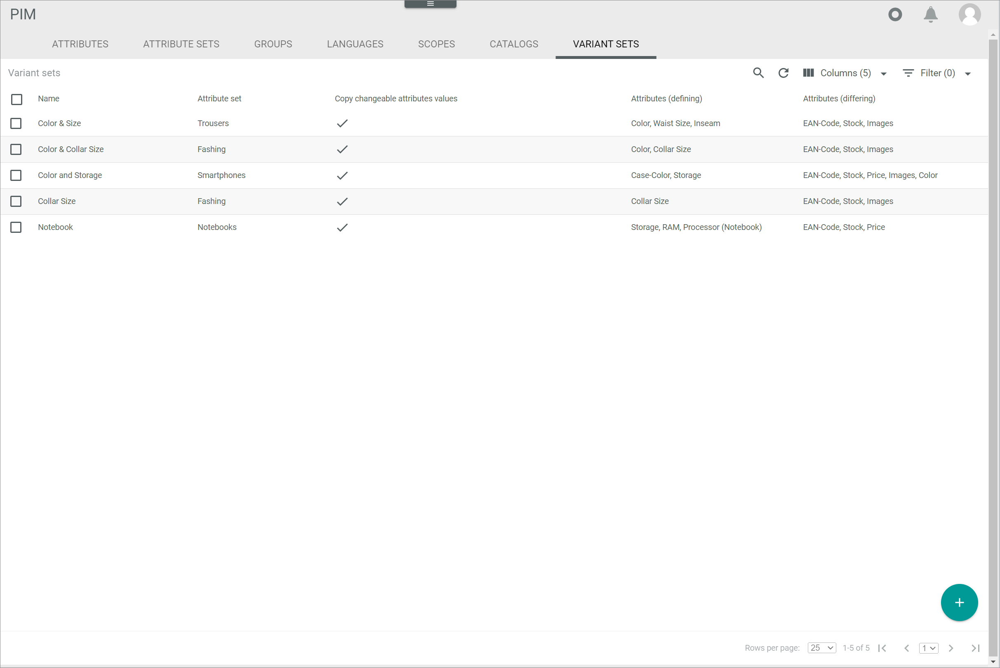
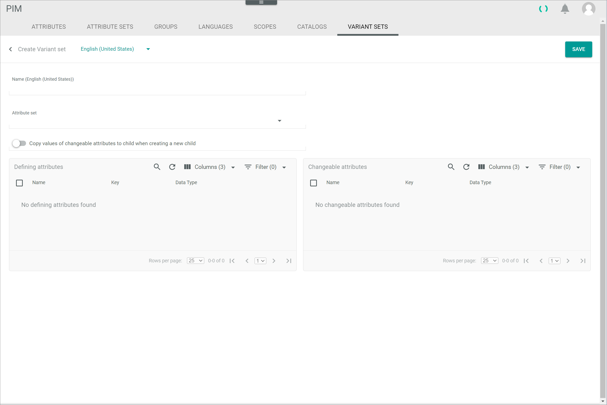
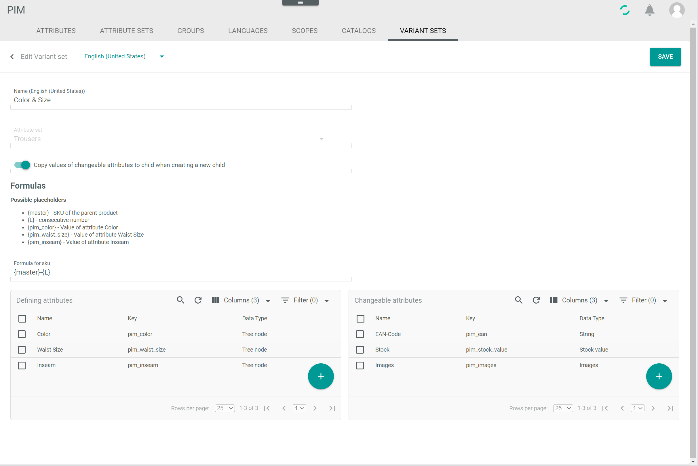
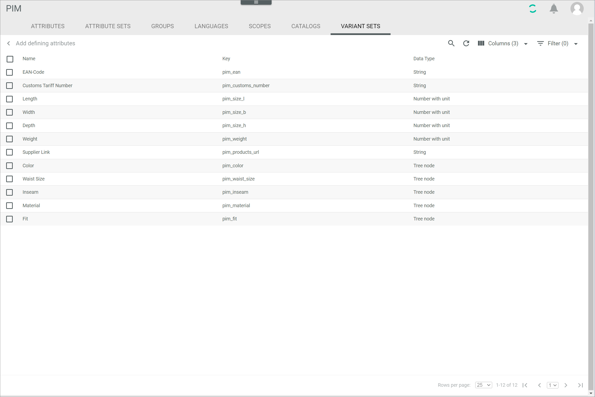
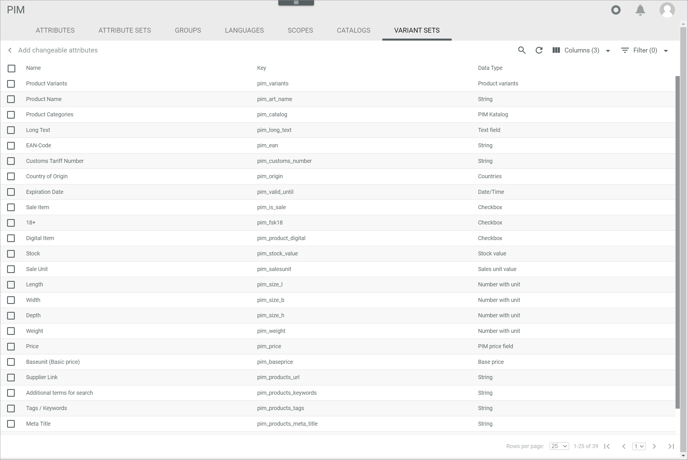

[!!Manage the variant set](../Integration/07_ManageVariantSets.md)
[!!Data type list](..//UserInterface/05_DataTypeList.md)

# Variant sets

*PIM > Settings > Tab VARIANT SETS*  
*Omni-Channel > Settings > Tab VARIANT SETS*

This tab is not part of the *DataHub* module, but it is used in the *PIM* and *Omni-Channel* modules to manage the attributes that define the different variants of a product or an offer. The functionality itself, however, is based on the data models defined in the *DataHub* module.

**Variant set list**

The list displays all variant sets. Depending on the settings, the displayed columns may vary. All fields are read-only. 

The following functions are available for the editing toolbar: 

- [x]     
    Select the checkbox to display the editing toolbar. If you click the checkbox in the header, all variant sets in the list are selected.

- [EDIT]      
    Click this button to edit the selected variant set. This button is only displayed if a single checkbox in the list of variant sets is selected. Alternatively, you can click directly a row in the list to edit a variant set. The *Edit variant set* view is displayed.   
    For detailed information, see [Edit a variant set](../Integration/07_ManageVariantSets.md#edit-a-variant-set).

- [DELETE]     
    Click this button to delete the selected variant sets. A variant set can only be deleted if no dependencies are existing. Otherwise, an error message is displayed. This button is only displayed if the checkbox of at least one variant set is selected.

The following functions and fields are available in this view:

- *Name*   
    Variant set name.

- *Attribute set*   
    Attribute set name assigned to the variant set.

- *Attributes (defining)*   
    Defining attributes of the variant set.

- *Attributes (changeable)*   
    Changeable attributes of the variant set.

- *ID*   
    Variant set identification number. The ID number is automatically assigned by the system.

- *Modified on*   
    Date and time of the last modification.

- *Modified by*   
    Name and username of the user who modified the variant set.

- *Created on*   
    Date and time of the creation.

- *Created by*   
    Name and username of the user who created the variant set.

- *Name (Language)*   
    Variant set name in the selected language. A single column is displayed for the system languages *English (United States)* and *Deutsch (Deutschland)*.

-  (Add)   
    Click this button to create a variant set. The *Create variant set* window is displayed.   

## Create variant set

*PIM > Settings > Tab VARIANT SETS > Button Add*  
*Omni-Channel > Settings > Tab VARIANT SETS > Button Add*

**Create variant set**

The following functions and fields are available in this view:

- *"Language name"*   
    Click the drop-down list and select the language in which the *Name (Language)* fields are displayed. The languages *English (United States)* and *Deutsch (Deutschland)* are available in the drop-down list.

- [SAVE]   
    Click this button to save the variant set. The *Create variant set* view is closed.

- *Name (Language)*   
    Variant set name in the selected language.

- *Attribute set*   
    Click the drop-down list to select the assigned attribute set. All attribute sets are displayed in the drop-down list.

**FORMULAS**

This section is only displayed if an attribute set is selected.

- *Formula for SKU*   
    Click the field to edit the formula for the SKU of the variant articles. By default, the formula **{master}-{L}** is predefined. The following placeholders are available:
    - **{master}**   
        SKU number of the master entity
    - **{L}**   
        consecutive number   
    
    > [Info] In addition to these default placeholders, you can include the value of the defining attributes of the variant set into the SKU formula. The corresponding placeholders are displayed in the *Possible placeholders* section when you have added a defining attribute.

- *Copy values of changeable attributes to variant when creating a new variant*  
    Enable this toggle to copy the attribute set values when creating a new variant in this variant set. By default, this toggle is disabled.

**Defining attributes**

The list in this box displays all defining attributes to the variant set. All fields are read-only.

The following functions are available for the editing toolbar:

- [x]     
    Select the checkbox to display the editing toolbar. If you click the checkbox in the header, all attributes in the list are selected.

- [DELETE]   
    Click this button to delete the selected attribute from the box. This button is only displayed if the checkbox of at least one attribute is selected.

The following functions and fields are available in this box:

- *Name*   
    Attribute name.

- *Key*   
    Attribute key. The key is required for API access and must be system-wide unique.

- *Data type*   
    Attribute data type.   
    For detailed information about all data types, see [Data type list](./05_DataTypeList.md).

- *ID*   
    Attribute identification number. The ID number is automatically assigned by the system.

-  (Add)   
    Click this button to add a defining attribute to the variant set. The *Add defining attributes* view is displayed, see [Add defining attributes](#add-defining-attributes).

**Changeable attributes**

The list in this box displays all changeable attributes to the variant set. All fields are read-only.

The following functions are available for the editing toolbar:

- [x]     
    Select the checkbox to display the editing toolbar. If you click the checkbox in the header, all attributes in the list are selected.

- [DELETE]   
    Click this button to delete the selected attribute from the box. This button is only displayed if the checkbox of at least one attribute is selected.

The following functions and fields are available in this box:

- *Name*   
    Attribute name.

- *Key*   
    Attribute key. The key is required for API access and must be system-wide unique.

- *Data type*   
    Attribute data type.   
    For detailed information about all data types, see [Data type list](./05_DataTypeList.md).

- *ID*   
    Attribute identification number. The ID number is automatically assigned by the system.

-  (Add)   
    Click this button to add a changeable attribute to the variant set. The *Add changeable attributes* view is displayed, see [Add changeable attributes](#add-changeable-attributes).

## Edit variant set

*PIM > Settings > Tab VARIANT SETS > Select variant set*  
*Omni-Channel > Settings > Tab VARIANT SETS > Select variant set*

**Edit variant set**

The following functions and fields are available in this view:

- *"Language name"*   
    Click the drop-down list and select the language in which the *Name (Language)* fields are displayed. The languages *English (United States)* and *Deutsch (Deutschland)* are available in the drop-down list.

- [SAVE]   
    Click this button to save the variant set. The *Edit variant set* view is closed.

- *Name (Language)*   
    Variant set name in the selected language.

- *Attribute set*   
    Assigned attribute set. This field is read-only.

**FORMULAS**

- *Formula for SKU*  
    Click the field to edit the formula for the SKU of the variant articles. By default, the formula **{master}-{L}** is predefined. The following placeholders are available:
    - **{master}**   
        SKU number of the master entity
    - **{L}**   
        consecutive number   
    
    > [Info] In addition to these default placeholders, you can include the value of the defining attributes of the variant set into the SKU formula. The corresponding placeholders are displayed in the *Possible placeholders* section when you have added a defining attribute.

- *Copy values of changeable attributes to variant when creating a new variant*  
    Enable this toggle to copy the attribute set values when creating a new variant in this variant set. Disable the toggle to leave the existing attribute changeable values unchanged.

**Defining attributes**

The list in this box displays all defining attributes to the variant set. All fields are read-only.

The following functions are available for the editing toolbar:

- [x]     
    Select the checkbox to display the editing toolbar. If you click the checkbox in the header, all attributes in the list are selected.

- [DELETE]   
    Click this button to delete the selected attribute from the box. This button is only displayed if the checkbox of at least one attribute is selected.

The following functions and fields are available in this box:

- *Name*   
    Attribute name.

- *Key*   
    Attribute key. The key is required for API access and must be system-wide unique.

- *Data type*   
    Attribute data type.   
    For detailed information about all data types, see [Data type list](./05_DataTypeList.md).

- *ID*   
    Attribute identification number. The ID number is automatically assigned by the system.

-  (Add)   
    Click this button to add a defining attribute to the variant set. The *Add defining attributes* view is displayed, see [Add defining attributes](#add-defining-attributes).

**Changeable attributes**

The list in this box displays all changeable attributes to the variant set. All fields are read-only.

The following functions are available for the editing toolbar:

- [x]     
    Select the checkbox to display the editing toolbar. If you click the checkbox in the header, all attributes in the list are selected.

- [DELETE]   
    Click this button to delete the selected attribute from the box. This button is only displayed if the checkbox of at least one attribute is selected.

The following functions and fields are available in this box:

- *Name*   
    Attribute name.

- *Key*   
    Attribute key. The key is required for API access and must be system-wide unique.

- *Data type*   
    Attribute data type.   
    For detailed information about all data types, see [Data type list](./05_DataTypeList.md).

- *ID*   
    Attribute identification number. The ID number is automatically assigned by the system.

-  (Add)   
    Click this button to add a changeable attribute to the variant set. The *Add changeable attributes* view is displayed, see [Add changeable attributes](#add-changeable-attributes).

### Add defining attributes

*PIM > Settings > Tab VARIANT SETS > Button Add > Select attribute set > Button Add (Defining attributes)*    
*PIM > Settings > Tab VARIANT SETS > Select variant set > Button Add (Defining attributes)*  
*Omni-Channel > Settings > Tab VARIANT SETS > Button Add > Select attribute set > Button Add (Defining attributes)*  
*Omni-Channel > Settings > Tab VARIANT SETS > Select variant set > Button Add (Defining attributes)*

The list displays all available defining attributes. Depending on the settings, the displayed columns may vary. All fields are read-only. 

The following functions are available for the editing toolbar:

- [x]     
    Select the checkbox to display the editing toolbar. Alternatively, you can click directly a row in the list to select the attribute. If you click the checkbox in the header, all attributes in the list are selected.

- [ADD]   
    Click this button to add the selected attribute(s) to the variant set. This button is only displayed if the checkbox of at least one attribute is selected.

- [ADD AND GO BACK]   
    Click this button to add the selected attribute(s) to the variant set. This button is only displayed if the checkbox of at least one attribute is selected. The *Add defining attributes* view is closed. The defining attributes are displayed in the *Defining attributes* box.

The following functions and fields are available in this view:

- *Name*   
    Attribute name.

- *Key*   
    Attribute key. The key is required for API access and must be system-wide unique.

- *Data type*   
    Attribute data type.    
    For detailed information about all data types, see [Data type list](./05_DataTypeList.md).

- *ID*   
    Attribute identification number. The ID number is automatically assigned by the system.

### Add changeable attributes

*PIM > Settings > Tab VARIANT SETS > Button Add > Select attribute set > Button Add (Changeable attributes)*   
*PIM > Settings > Tab VARIANT SETS > Select variant set > Button Add (Changeable attributes)*  
*Omni-Channel > Settings > Tab VARIANT SETS > Button Add > Select attribute set > Button Add (Changeable attributes)*  
*Omni-Channel > Settings > Tab VARIANT SETS > Select variant set > Button Add (Changeable attributes)*  

The list displays all available changeable attributes. Depending on the settings, the displayed columns may vary. All fields are read-only. 

The following functions are available for the editing toolbar:

- [x]     
    Select the checkbox to display the editing toolbar. Alternatively, you can click directly a row in the list to select the attribute. If you click the checkbox in the header, all attributes in the list are selected.

- [ADD]   
    Click this button to add the selected attribute(s) to the variant set. This button is only displayed if the checkbox of at least one attribute is selected.

- [ADD AND GO BACK]   
    Click this button to add the selected attribute(s) to the variant set. This button is only displayed if the checkbox of at least one attribute is selected. The *Add changeable attributes* view is closed. The changeable attributes are displayed in the *Changeable attributes* box.

The following functions and fields are available in this view: 

- *Name*   
    Attribute name.

- *Key*   
    Attribute key. The key is required for API access and must be system-wide unique.

- *Data type*   
    Attribute data type.   
    For detailed information about all data types, see [Data type list](./05_DataTypeList.md).

- *ID*   
    Attribute identification number. The ID number is automatically assigned by the system.
