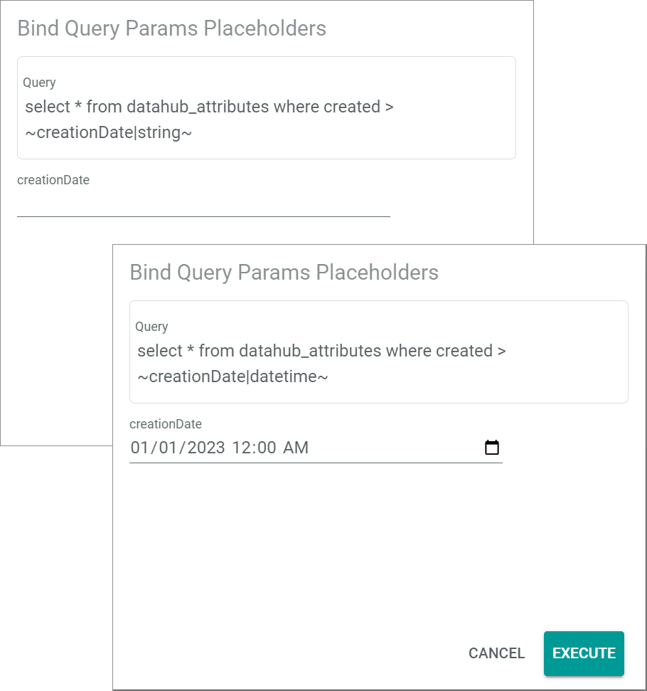
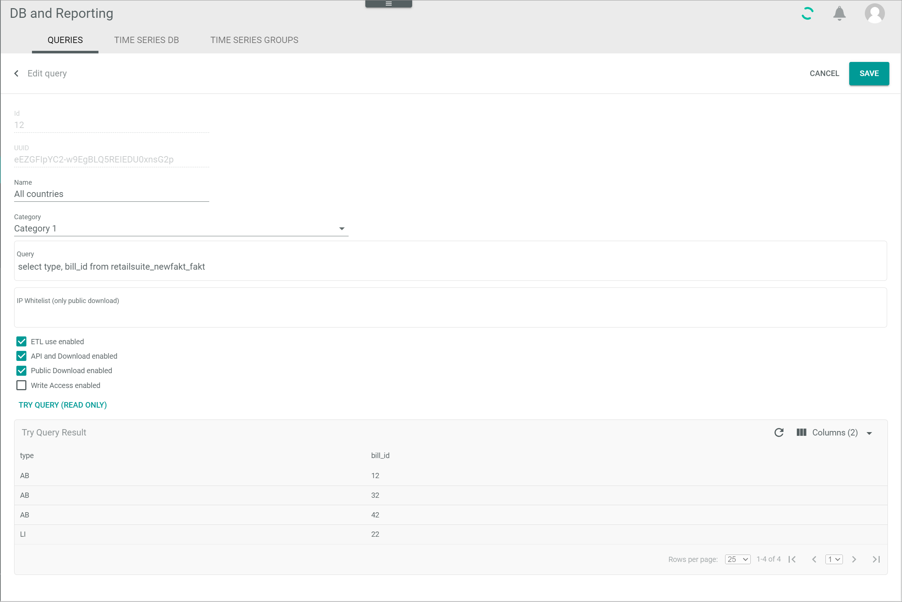

[!!User interface Queries](../UserInterface/01a_Queries.md)
[!!Manage the query categories](./02_ManageQueryCategories.md)
[!!Manage the user rights](./05_ManageUserRights.md)

# Manage the queries

Queries can be predefined to determine the queries that users may execute and the data that may be accessed. Instead of entering and executing a query directly in MySQL console, the user can simply select the query to be executed from the list of queries. 

Data can be accessed via API and download, that is, users must be logged in the Core1, or via public download in a web browser. In the case of public download, a download link and a UUID (Universally Unique Identifier) are required. Queries can be read-only, that is, the mere access and retrieval of available data, or write access can be enabled, which additionally allows to modify the data contained in the database. 

Managed queries can be created, edited, and deleted, as well as organized in categories, see [Manage the query categories](./02_ManageQueryCategories.md). Query access can also be restricted pro query and query category depending on the user role, see [Manage the user rights](./05_ManageUserRights.md).

## Create a query

Define a query, determine how the data may be accessed and by whom, allow write operations, and, if necessary, add conditions with placeholders.

#### Prerequisites 

No prerequisites to fulfill.

#### Procedure

*Database and reporting > Managed queries > Tab QUERIES*

1. Click the  (Add) button in the bottom right corner.  
    The *Create MySQL query* is displayed.

    

2. Enter a name in the *Name* field.

3. If desired, click the *Category* drop-down list and select the applicable category. All available query categories are displayed in the list. 
    > [Info] The query category can be assigned while creating the query or later on, after the query has been created. To create a query category, see [Create a query category](./02_ManageQueryCategories.md#create-a-query-category).  

4. Enter a valid MySQL statement.  
    
5. If desired, add a time condition to your statement in order to filter the query results by time criteria. To do so, follow the procedure below:
      
    - Enter a condition (WHERE clause) in the query statement followed by a placeholder, for example **where created > \~creationDate|datetime\~**. 
        > [Info] The condition provided is just an example. Other conditions and placeholders may apply according to the data model and the user's information needs.

    - Click the [TRY QUERY (READ ONLY)] button.   
        The *Bind query parameters placeholders* window is displayed.
        > [Info] There are two possible placeholders to define time conditions: **|datetime** and **|string**. The **|datetime** placeholder generates a calendar button in the *Bind query parameters placeholders* window, whereas the **|string** placeholder creates a free text field.

        

    - Define the desired time criteria in the *creationDate* field, either by entering the date with the keyboard or by clicking the calendar button to select the desired date and time. 

    - Click the [EXECUTE] button.   
        The query results are displayed in table format at the bottom of the workspace. The time condition has been added to the query.

[comment]: <> (ETL use enabled vorest ignorieren, laut JS)

5. If desired, enter one or several IP addresses or an IP range (subnet mask) in the *IP whitelist (only public download)* field to allow access only to those IP addresses entered in case of public download.  
    > [Info] When entering more than one IP address, each IP address must be entered on a separate line. 

6. Select the *API and download enabled* checkbox to allow logged in users with the appropriate rights to execute the query and download the retrieved data.
    > [Info] Additionally, user access rights must be granted for every single query, see [Manage the user rights](./05_ManageUserRights.md).

[comment]: <> (Evtl. Link updaten, wenn relevanter Unterkapitel definiert wird)

7. Select the *Public download enabled* checkbox to allow any user, also non-logged in users, with the applicable link to execute the query and download the retrieved data via web browser. 
    > [Info] In addition to the corresponding download link, a UUID (Universally Unique Identifier) is required to execute the query in a web browser.

8. Select the *Write access enabled* checkbox to allow write operations when executing the query. Otherwise, a query with write operations, such as INSERT or DELETE, will not be executed and an error message will be displayed.

9. If desired, click the [TRY QUERY (READ ONLY)] button to test the query.  
  The query results are displayed in table format at the bottom of the workspace.

10. Click the [SAVE] button.  
   The query has been saved. The *Create MySQL query* is closed. The newly created query is displayed in the list of queries.

## Edit a query

After you have a created a query, it can be edited to change any previously set values. The fields *ID* and *UUID*, however, are automatically assigned by the system and cannot be modified.

#### Prerequisites 

A query has been created, see [Create a query](#create-a-query).

#### Procedure

*Database and reporting > Managed queries > Tab QUERIES*

1. Click the query to be edited in the list of queries. Alternatively, select the checkbox of the query to be edited and click the  (Edit) button in the editing toolbar.  
    The *Edit MySQL query* view is displayed.

    

2. Edit the query set values as necessary in the corresponding fields and checkboxes.
    
3. If desired, click the [TRY QUERY (READ ONLY)] button to test the query.  
  The query results are displayed in table format at the bottom of the workspace.

4. Click the [SAVE] button.  
  The changes have been saved. The *Edit MySQL query* is closed. 

## Delete a query

Delete a query that is no longer needed. It is possible to several queries at once.  

#### Prerequisites 

At last a query has been created, see [Create a query](#create-a-query).

#### Procedure

*Database and reporting > Managed queries > Tab QUERIES*

1. Select the checkbox of the query to be deleted.   
    The editing toolbar is displayed.

2. Click the  (Delete) button in the editing toolbar.  
    The *Deleted queries xxxx* window is displayed. The number indicates the identifier of the deleted query as displayed in the *ID* column. The deleted query is removed from the list of queries. 

    

