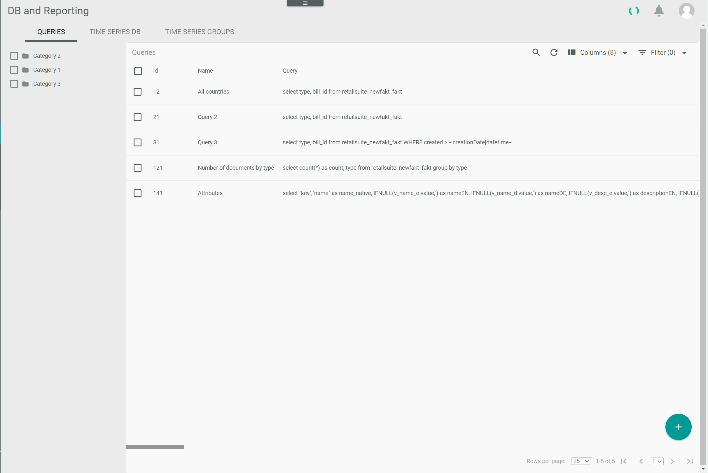

[!!Manage the query categories](./02_ManageQueryCategories.md)
[!!Manage the user rights](./05_ManageUserRights.md)
[!!Execute the managed queries](../Operation/01_ExecuteManagedQueries.md)
[!!User interface Queries](../UserInterface/01a_Queries.md)

# Manage the queries

Managed queries are predefined SQL queries to extract data from the database and/or manipulate data in the database. Access to queries can be restricted to specific user groups. Instead of entering and executing a query directly in the MySQL console, the users can simply select the query to be executed from the list of queries. 

Data can be accessed via API and download, that is, users must be logged in to the *Actindo Core1 Platform*, or via public download. In the case of public download, a download link and a UUID (Universally Unique Identifier) are required. Queries can be read-only, that is, the mere access and retrieval of available data, or write access can be enabled, which additionally allows to modify the data contained in the database. The data is provided either in CSV or XML format.

Managed queries can be created, edited, and deleted, as well as organized in categories, see [Manage the query categories](./02_ManageQueryCategories.md). The query access can also be restricted or granted per query based on the user group, see [Grant access rights to a user group](./05_ManageUserRights.md#grant-access-rights-to-a-user-group).

## Create a query

Define a query and determine how the data may be accessed and by whom. Besides, you can allow write operations, and, if necessary, insert placeholders to represent any desired variables. The queries must be written in SQL syntax, and therefore SQL knowledge is required. The database is operated by Percona Servers for MySQL.  

#### Prerequisites 

No prerequisites to fulfill.

#### Procedure

*Database and reporting > Managed queries > Tab QUERIES*

1. Click the  (Add) button in the bottom right corner.  
    The *Create MySQL query* view is displayed.

    

2. Enter a name in the *Name* field.

3. If desired, click the *Category* drop-down list and select the applicable category. All available query categories are displayed in the list. 

    > [Info] The query category can be assigned while creating the query or later on, after the query has been created. To create a query category, see [Create a query category](./02_ManageQueryCategories.md#create-a-query-category).  

4. Enter a valid MySQL query.  
    
5. If desired, insert a placeholder to your query to represent any variables to be specified when executing a query. Placeholders are most often used in the SET, VALUES, and WHERE clauses, as in the example provided below, where a time condition is defined: 
      
    + Enter a condition (WHERE clause) in the query followed by a placeholder, for example **WHERE created > \~creationDate|datetime\~**.
    
        > [Info] Placeholders can be named freely. It is recommended to use a descriptive name, as this description is displayed later as a field name.
        
    + Click the [TRY QUERY (READ ONLY)] button to test the query.   
        The *Bind query parameters placeholders* window is displayed.
        
        > [Info] There are different placeholders to define time conditions: **|datetime**, **|number** and **|string**. The **|datetime** placeholder generates a  (Calendar) button in the *Bind query parameters placeholders* window, whereas the **|string** and **|number** placeholders create a free text and number field respectively. The required date format corresponds to the one defined in the user's web browser. 

        

    + Define the desired time criteria in the *creationDate* field, either by entering the date with the keyboard or by clicking the calendar button to select the desired date and time. 

    + Click the [EXECUTE] button.   
        The query results are displayed in the *Try query result* box at the bottom of the workspace. 

[comment]: <> (Julian: ETL use enabled muss noch ausgeblendet werden)

6. If desired, enter one or several IP addresses or an IP range (subnet mask; only supported for IPV4) in the *IP whitelist (only public download)* field to allow access only to those IP addresses entered in case of public download.  

    > [Info] When entering more than one IP address, each IP address must be entered on a separate line. Note that if no IP address is whitelisted, any person with the link, from any IP address, can access the query results via the public download if enabled. If at least one IP address is whitelisted, all other IP addresses are blacklisted. 

7. If desired, select the *API and download enabled* checkbox to allow logged in users with the appropriate rights to execute the query and download the retrieved data.

    > [Info] Additionally, user access rights must be granted for every single predefined query, see [Grant access rights to a user group](./05_ManageUserRights.md#grant-access-rights-to-a-user-group).

8. If desired, select the *Public download enabled* checkbox to allow any user, also non-logged in users, with the applicable link to execute the query and download the retrieved data via web browser. 

    > [Info] A specific download link, containing a UUID (Universally Unique Identifier), is required to execute the query in a web browser.

9. If desired, select the *Write access enabled* checkbox to allow write operations when executing the query. Otherwise, a query with write operations, such as INSERT or DELETE, will not be executed and an error message will be displayed.

    > [Info] Only a user who has been granted rights to execute queries with write access is allowed to create or modify queries with write access.

10. If desired, click the [TRY QUERY (READ ONLY)] button to test the query.  
    The query results are displayed in the *Try query result* box at the bottom of the workspace.

11. Click the [SAVE] button.  
   The query has been saved. The *Create MySQL query* is closed. The new query is displayed in the list of queries.

## Edit a query

After you have created a query, it can be edited to change any previously set values. The *ID* and *UUID* fields are automatically assigned by the system and cannot be modified.

#### Prerequisites 

At least one query has been created, see [Create a query](#create-a-query).

#### Procedure

*Database and reporting > Managed queries > Tab QUERIES*

1. Click the query to be edited in the list of queries. Alternatively, select the checkbox of the query to be edited and click the  (Edit) button in the editing toolbar.  
    The *Edit MySQL query* view is displayed.

    

2. Edit the query as necessary in the corresponding fields and checkboxes.
    
3. If desired, click the [TRY QUERY (READ ONLY)] button to test the query.  
  The query results are displayed in the *Try query result* box at the bottom of the workspace. 

4. Click the [SAVE] button.  
  The changes have been saved. The *Edit MySQL query* is closed. 

## Delete a query

Delete a query that is no longer needed. It is possible to delete several queries at once.  

[comment]: <> (Julian: Kann es beim Löschen von queries zu Problemen kommen?)

#### Prerequisites 

At least one query has been created, see [Create a query](#create-a-query).

#### Procedure

*Database and reporting > Managed queries > Tab QUERIES*

1. Select the checkbox of the query to be deleted.   
    The editing toolbar is displayed.

2. Click the  (Delete) button in the editing toolbar.  
    The *Deleted queries xxxx* pop-up window is displayed. The *xxxx* indicates the identifier of the deleted query as displayed in the *ID* column. The deleted query is removed from the list of queries. 

    

