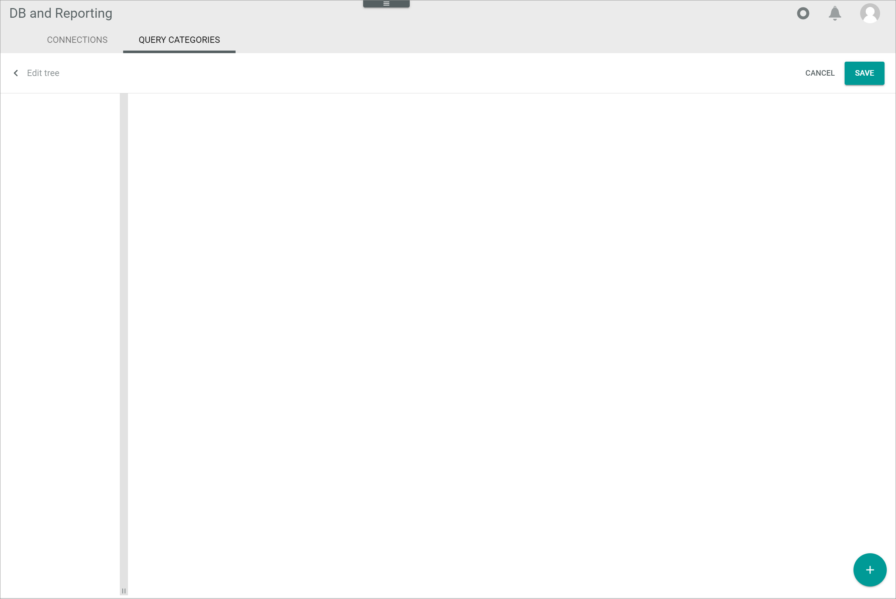
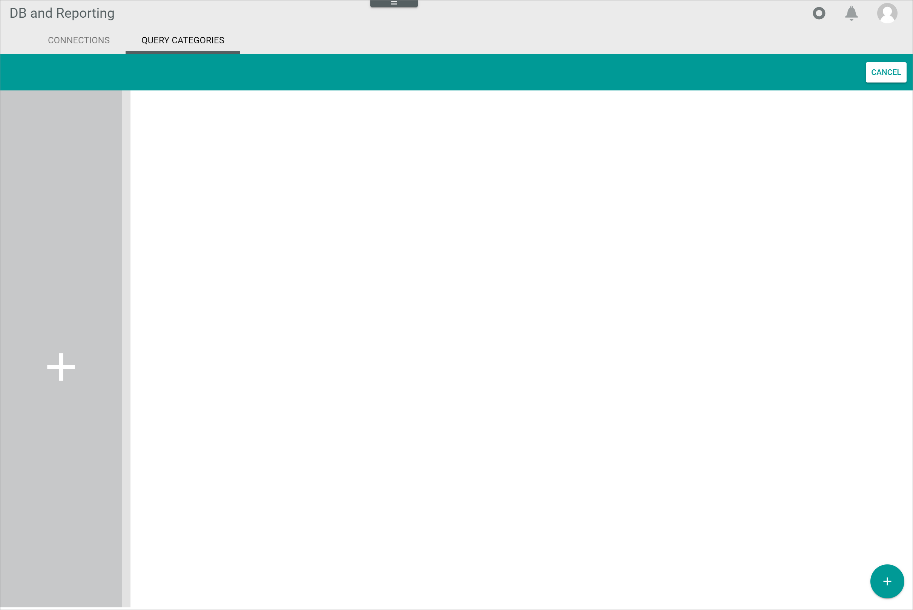
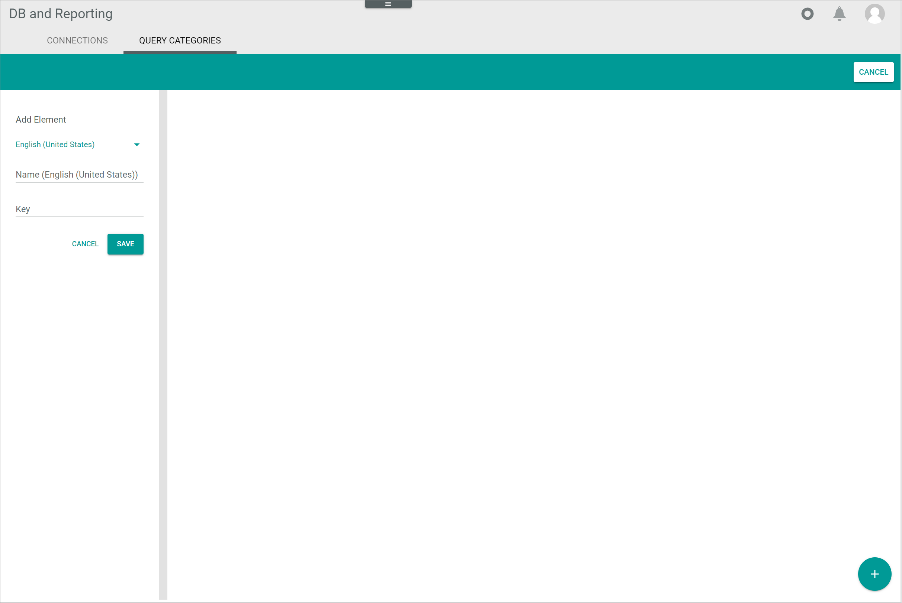
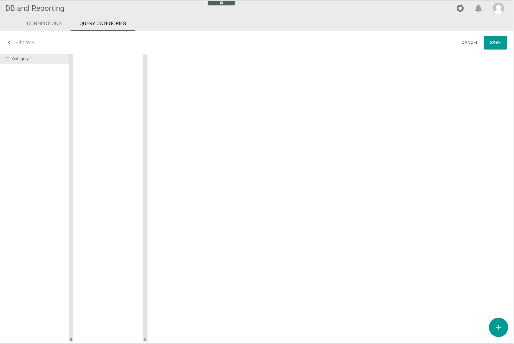
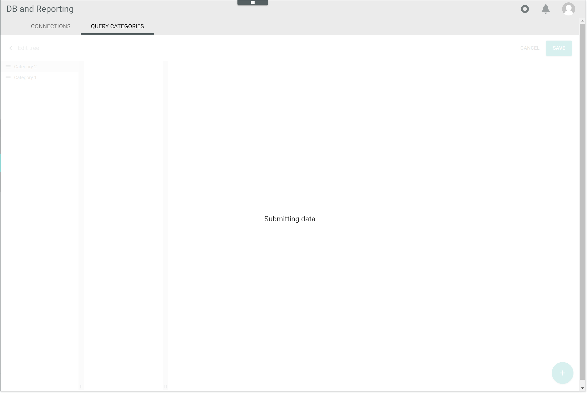
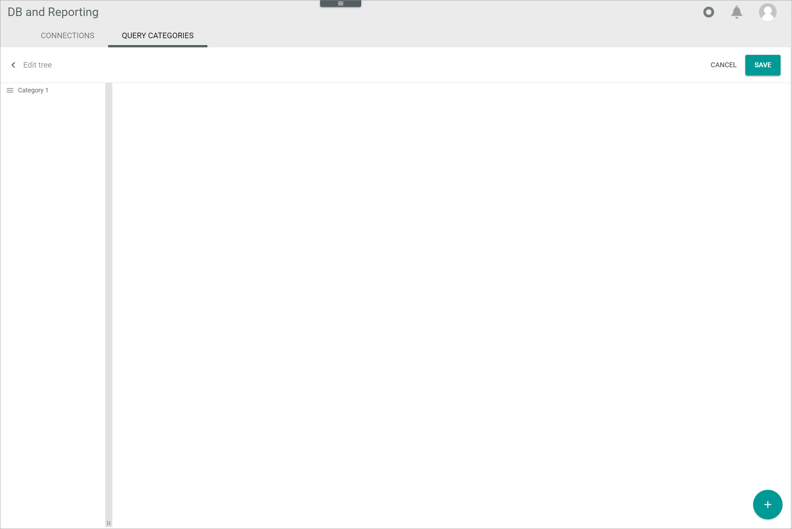
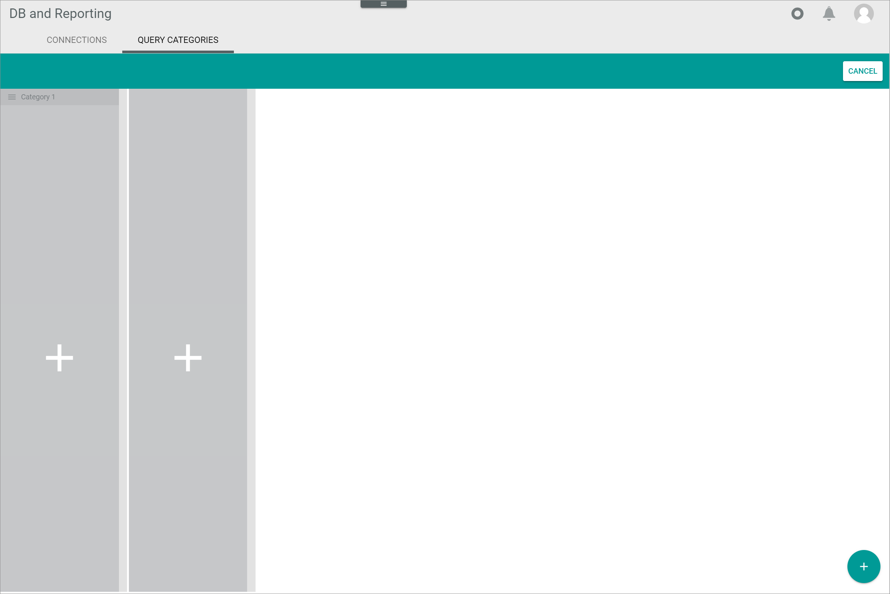
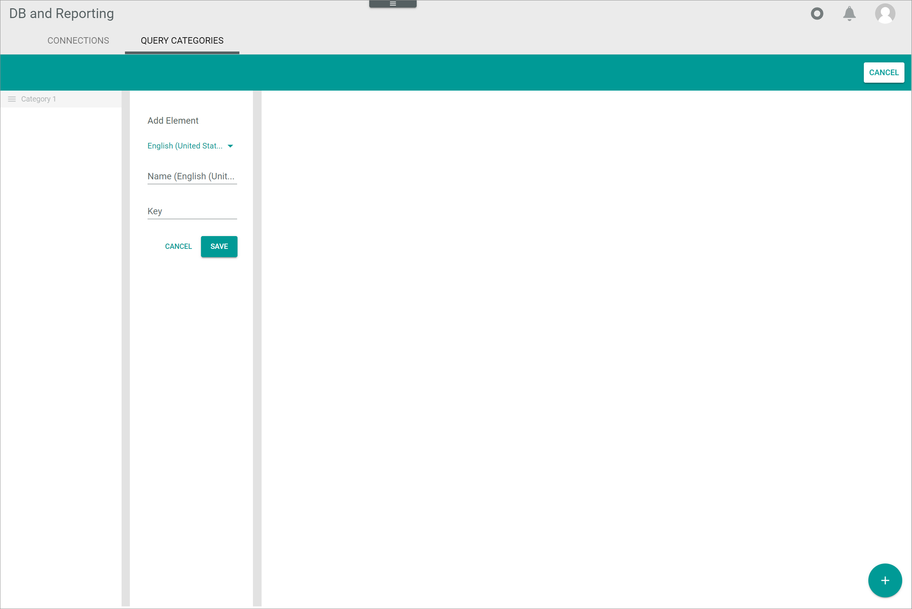
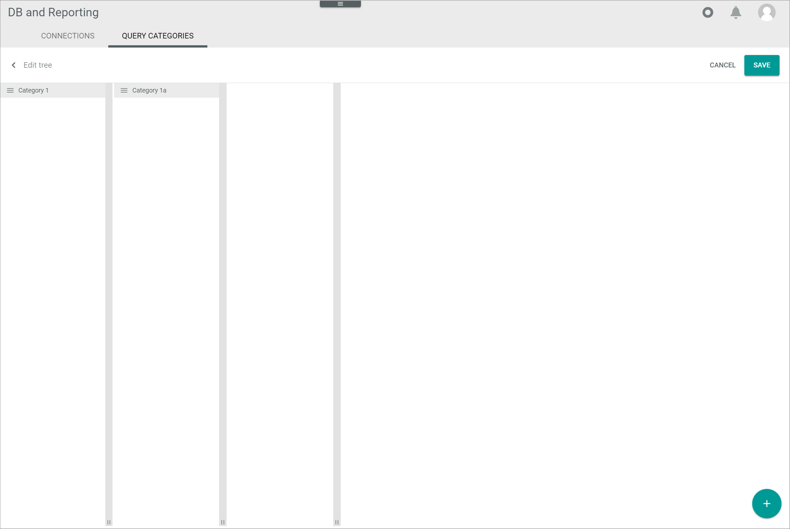

[!!User interface Query categories](../UserInterface/03b_QueryCategories.md)
[!!Manage the queries](./01_ManageQueries.md)
[!!Manage the user rights](./05_ManageUserRights.md)

# Manage the query categories

Query categories are used for the logical organization of the managed queries. The managed queries are organized in a tree structure of folders and sub-folders.

Query categories can be created, edited, deleted, and divided into sub-categories. All individual managed queries can, in turn, be assigned to a category and/or a sub-category, see [Create a query](./01_ManageQueries.md#create-a-query). The read and save rights of categories can also be restricted or granted based on the user group, see [Grant access rights to a user group](./05_ManageUserRights.md#grant-access-rights-to-a-user-group).

## Create a query category

Create a query category for new managed queries you want to assign to a certain category.

#### Prerequisites 

No prerequisites to fulfill.

#### Procedure

*Database and reporting > Settings > Tab QUERY CATEGORIES*

1. Click the  (Add) button in the bottom right corner.   
    A plus sign is displayed in the query category column.

    

2. Click the plus sign in the query category column.    
    The *Add element* window is displayed in the query category column.

    

3. Enter a name for the query category in the *Name* field.

4. Enter a key for the query category in the *Key* field.  

[comment]: <> (Key wird hier irgendwann abgebaut)

5. Click the [SAVE] button.   
    The query category has been created. The *Add element* window is closed. The new query category is displayed in the query category column.

    

    > [Info] To add an additional query category, repeat the steps **1** to **5**. To add a query sub-category, see [Create a query sub-category](#create-a-query-sub-category).

6. Click the [SAVE] button in the upper right corner.   
    The *Submitting data...* view is displayed while saving. 

    

    The new query category has been saved to the query categories tree, which is displayed in the *Queries* view.
    > [Info] It may be necessary to press the **F5** key to initialize the *Core1 Platform* for the changes to be displayed in the *Queries* view. 
    
## Edit a query category

After you have created a query category, you can edit it. You can create sub-categories, edit the query category data, and change the order of query categories.

### Create a query sub-category

Add further query sub-categories to a query category. An unlimited number of sub-category levels can be added. 

The procedure to add a query sub-category to a category and to another sub-category is identical. Just select a sub-category instead of a category and follow the steps described below.

#### Prerequisites
At least one query category has been created, see [Create a query category](#create-a-query-category).

#### Procedure

*Database and reporting > Settings > Tab QUERY CATEGORIES*

1. Click the category to which you want to create a sub-category.  
    A query sub-category column is displayed in the column to the right of the query category column. If sub-categories already exist for the selected category, they are displayed in this column.

    

2. Click the  (Add) button in the bottom right corner.   
    Plus signs are displayed in the query category and the query sub-category columns. 

    

3. Click the plus sign in the query sub-category column.  
    The *Add element* window is displayed in the query sub-category column.

    

4. Enter a name for the query sub-category in the *Name* field.

5. Enter a key for the query sub-category in the *Key* field. 

[comment]: <> (Key wird hier irgendwann abgebaut)

6. Click the [SAVE] button.   
    The query sub-category has been created. The *Add element* window is closed. The new query sub-category is displayed in the query sub-category column.

    

    > [Info] If you want to change the order of the query sub-categories in the list, see [Change the order of query categories](#change-the-order-of-query-categories).

7. Click the [SAVE] button in the upper right corner.   
    The *Submitting data...* view is displayed while saving. 

    

    The new query sub-category has been saved to the query categories tree, which is displayed in the *Queries* view.

    > [Info] It may be necessary to press the **F5** key to initialize the *Core1 Platform* for the changes to be displayed in the *Queries* view. 

### Edit the query category data

Edit the query category name and key as necessary.

The procedure to edit the data of query categories and sub-categories is identical. Just select a sub-category instead of a category and follow the steps described below.

#### Prerequisites 

At least one query category has been created, see [Create a query category](#create-a-query-category).

#### Procedure

*Database and reporting > Settings > Tab QUERY CATEGORIES*

1. Click the  (Edit) button to the right of the query category name.   
    The query category data is displayed in a window in the query category column. 

    

2. Modify the query category data as necessary.

3. Click the [SAVE] button in the bottom right corner of the query category data window.  
    The changes have been saved to the query category column. 

    > [Info] If you want to change the order of the query sub-categories in the list, see [Change the order of query categories](#change-the-order-of-query-categories).

4. Click the [SAVE] button in the upper right corner.  
     The *Submitting data...* view is displayed while saving. 

    

    The changes have been saved to the query categories tree, which is displayed in the *Queries* view.

    > [Info] It may be necessary to press the **F5** key to initialize the *Core1 Platform* for the changes to be displayed in the *Queries* view. 

### Change the order of query categories

[comment]: <> (Momentan funktioniert es nicht, Stand 18.04.23. JS weiß Bescheid.)

You can change the order of the query categories if necessary. 

The procedure to change the order of query categories and sub-categories is identical. Just select a sub-category instead of a category and follow the steps described below.

#### Prerequisites 

At least two query categories have been created, see [Create a query category](#create-a-query-category). 

#### Procedure

*Database and reporting > Settings > Tab QUERY CATEGORIES*

1. Click and hold the  (Sort) button to the left of the query category you want to move to another position in the list.

2. Move the selected query category to the desired position in the list by using drag and drop.

3. Click the [SAVE] button in the upper right corner.  
    The *Submitting data...* view is displayed while saving. 

    

    The new query category order has been saved. The changes have been saved to the query categories tree, which is displayed in the *Queries* view.

    > [Info] It may be necessary to press the **F5** key to initialize the *Core1 Platform* for the changes to be displayed in the *Queries* view. 

[comment]: <> (Wenn Bug behoben, testen and prüfen, ob es stimmt)

## Delete a query category

You can delete a query category if it is no longer in use. Note that you delete the query category with all sub-categories but not the queries assigned to it. 

The procedure to delete query categories and sub-categories is identical. Just select a sub-category instead of a category and follow the steps described below.

#### Prerequisites 

At least one query category has been created, see [Create a query category](#create-a-query-category).

#### Procedure

*Database and reporting > Managed queries > Tab QUERY CATEGORIES*

1. Click the  (Edit) button to the right of the query category name.   
    The query category data is displayed in a window in the query category column. 

    

2. Click the  (Delete) button in the bottom left corner of the query category data window.   
    The deleted query category has been removed from the query category column.

3. Click the [SAVE] button in the upper right corner.   
    The *Submitting data...* view is displayed while saving. 

    

    The changes have been saved to the query categories tree, which is displayed in the *Queries* view.

    > [Info] It may be necessary to press the **F5** key to initialize the *Core1 Platform* for the changes to be displayed in the *Queries* view. 