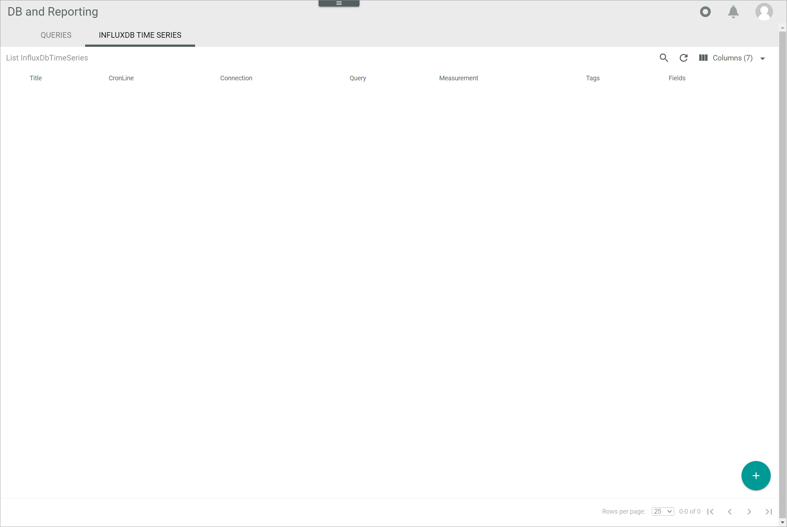
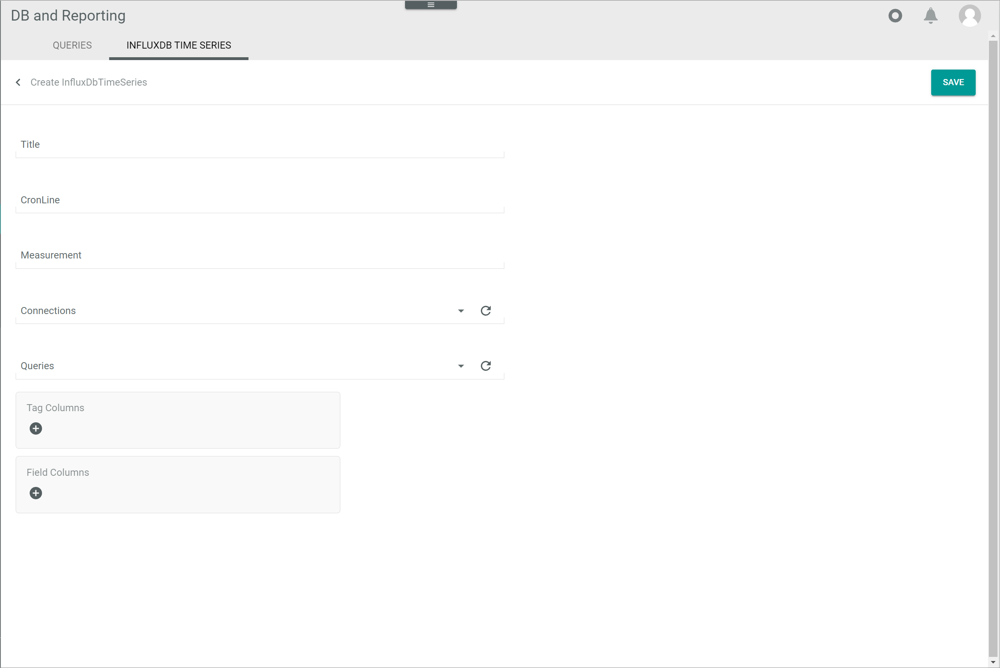
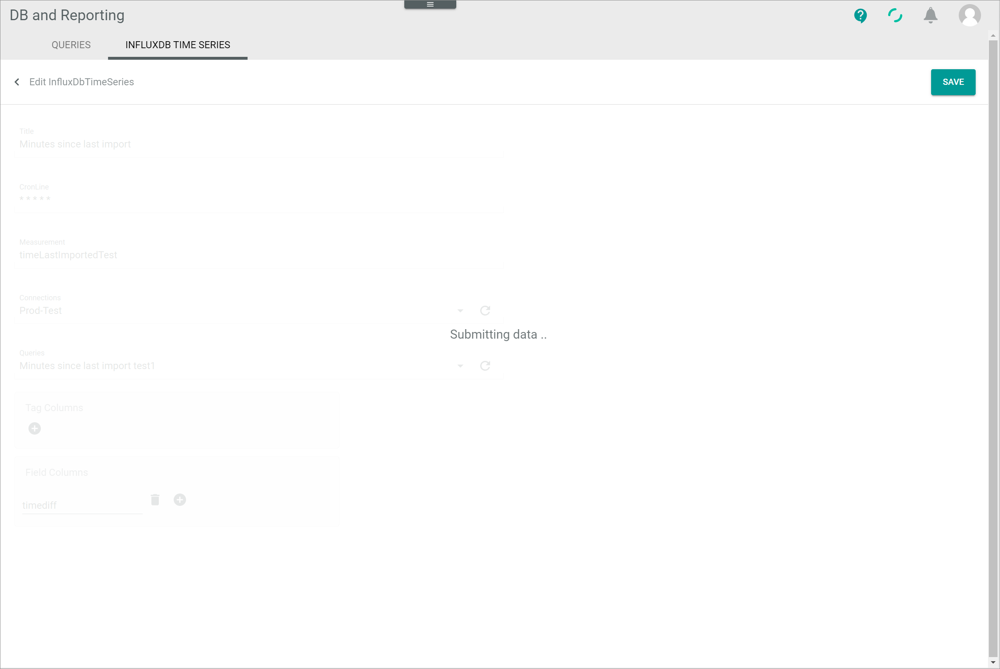
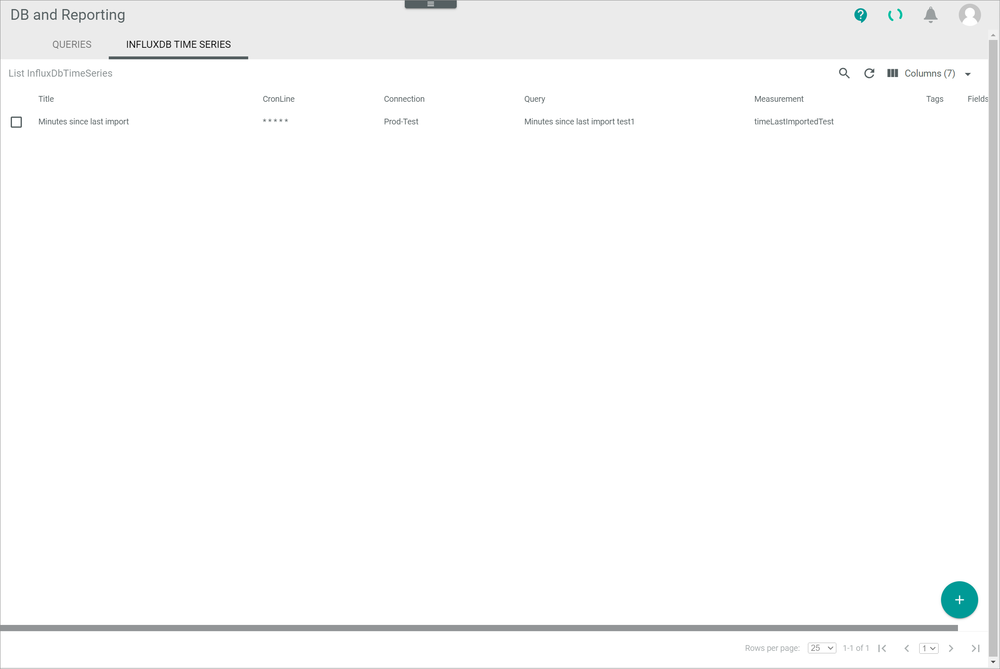
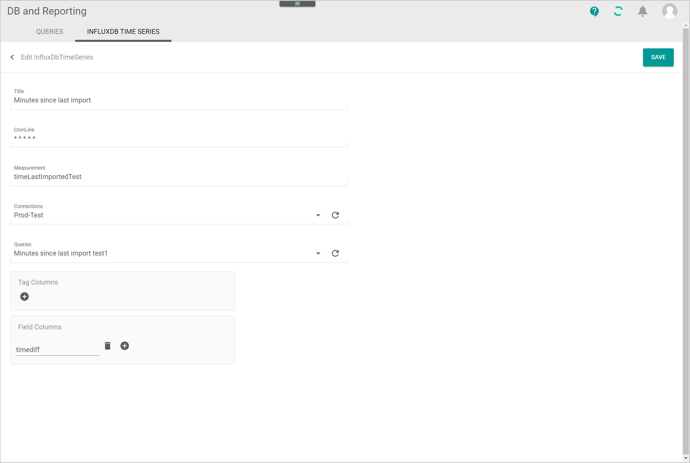

[!!Manage the queries](./01_ManageQueries.md)
[!!Manage the connection](./04_ManageConnections.md)
[!!User interface InfluxDB time series](../UserInterface/01b_InfluxDBTimeSeries.md)

# Manage the InfluxDB time series

After a predefined query has been created to retrieve any required data from your databases, this data can be written to an InfluxDB at regular time intervals using an InfluxDB time series, which allows you to collect and process a series of data points over time. For detailed information about the InfluxDB, see [InfluxDB](https://docs.influxdata.com/influxdb/v2.6/).

Once the data has been written to an InfluxDB, it can be easily visualized and monitored using Grafana, see [Get started with Grafana and InfluxDB](https://grafana.com/docs/grafana/latest/getting-started/get-started-grafana-influxdb/).

You can create, edit or delete an InfluxDB time series for any predefined query.

## Create an InfluxDB time series

Create an InfluxDB time series for a specific predefined query.

#### Prerequisites

- A connection to the InfluxDB has been established, see [Create a connection](./04_ManageConnections.md#create-a-connection). 
- At least one query has been created, see [Create a query](./01_ManageQueries.md#create-a-query). 

#### Procedure

*Database and reporting > Managed queries > Tab INFLUXDB TIME SERIES*

1. Click the  (Add) button in the bottom right corner.   
    The *Create InfluxDB time series* view is displayed.

    

2. Enter a descriptive name for the InfluxDB time series in the *Title* field.

3. Enter a valid cron expression in the *Cronline* field to specify the time interval in which data are to be written to the InfluxDB. If you need help creating  a cron expression, you can check a cron expression editor, such as [Crontab guru](https://crontab.guru/).

    > [Info] Note that each execution puts a certain amount of load on the database. Therefore, it is recommended to execute the query only as often as necessary. As a rule of thumb consider: The more complex the query, the less often the execution.

4. Enter a description for the table where the data is to be written in the *Measurement* field. 

    > [Info]  If the measurement does not exist yet, it will be created automatically with the specified fields and tags. If the measurement already exists, the fields and tags of the existing table will be added to the specified measurement. 

5. Click the drop-down list and select the appropriate connection.  
    All available connections established in the *CONNECTIONS* tab of the *Settings* menu entry are displayed in the list.

6. Click the drop-down list and select the appropriate query.   
    All available queries predefined in the *QUERIES* tab are displayed in the list.

7. If desired, click the  (Add) button in the *Tag columns* box.  
    A new input line is displayed.

8. Enter the desired tag in the new input line.   

    > [Info] Repeat steps **7** and **8** to add further tags if necessary. 

9. Click the  (Add) button in the *Field columns* box.  
    A new input line is displayed.

    > [Info] The fields contain the actual data, that is, the values being measured. The tags, on the other hand, can be used for metadata, that is, to categorize the data. This means that at least one field needs to be specified, whereas tags are optional.

10. Enter the desired field in the new input line.    

    > [Info] Repeat steps **9** and **10** to add further fields if necessary.

11. Click the [SAVE] button in the upper right corner.  
    The *Submitting data...* view is displayed shortly while saving. 

    

    [comment]: <> (Screenshot aus NoE test account. OK?)

    The InfluxDB times series has been saved. The *Create InfluxDB time series* view is closed. The new InfluxDB times series is displayed in the list of InfluxDB time series. 

## Edit an InfluxDB time series

Once an InfluxDB time series has been created, it can be edited to change any previously set values.

#### Prerequisites

At least one InfluxDB time series has been created, see [Create an InfluxDB time series](#create-an-influxdb-time-series).

#### Procedure

*Database and reporting > Managed queries > Tab INFLUXDB TIME SERIES*

[comment]: <> (Screenshot aus NoE test account. OK?)

1. Click the InfluxDB time series to be edited in the list of InfluxDB time series. Alternatively, select the checkbox of the InfluxDB time series to be edited and click the [EDIT] button in the editing toolbar.  
    The *Edit InfluxDB time series* is displayed.

    

2. Edit the InfluxDB time series set values as necessary in the corresponding fields.

3. Click the [SAVE] button.   
    The *Submitting data...* view is displayed shortly while saving. 

    

    [comment]: <> (Screenshots aus NoE test account)

    The changes have been saved. The *Edit InfluxDB time series* view is closed. The edited InfluxDB times series is displayed in the list of InfluxDB time series. 

## Delete an InfluxDB time series 

An InfluxDB time series can be deleted if it no longer in use.

#### Prerequisites

At least one InfluxDB time series has been created, see [Create an InfluxDB time series](#create-an-influxdb-time-series).

#### Procedure

*Database and reporting > Managed queries > Tab INFLUXDB TIME SERIES*

1. Select the checkbox of the InfluxDB time series to be deleted.   
    The editing toolbar is displayed.

2. Click the [DELETE] button in the editing toolbar.  
    The *Deleted InfluxDB time series XXXX* pop-up window is displayed. The number indicates the identifier of the deleted InfluxDB time series as displayed in the *ID* column. The deleted InfluxDB time series is removed from the list of InfluxDB time series.

    

[comment]: <> (Julian: Wie besprochen, bitte Screenshot einbauen, ziehen und zukommen lassen.)

