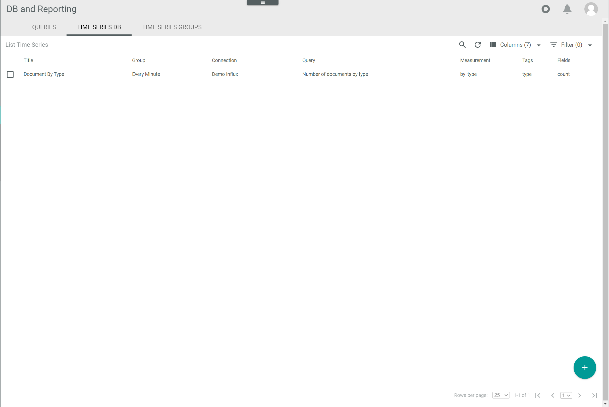
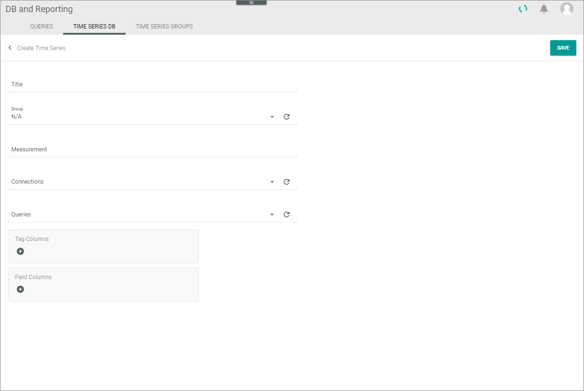
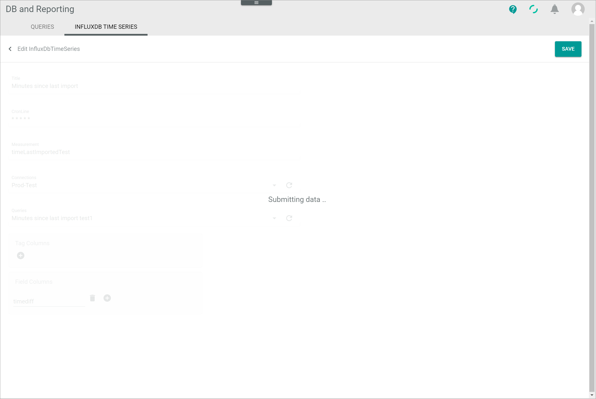
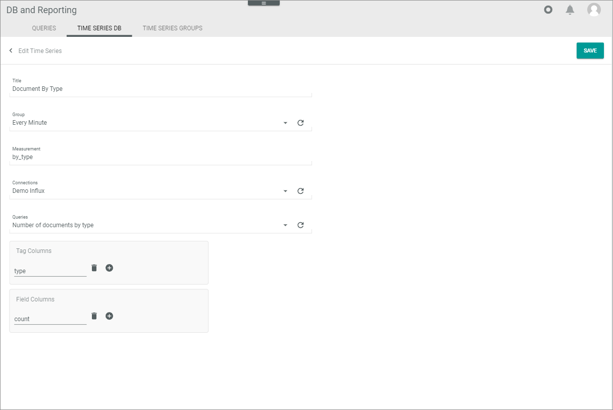
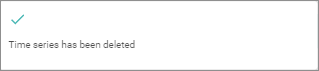

[!!Manage the queries](./01_ManageQueries.md)
[!!Manage the connection](./04_ManageConnections.md)
[!!User interface Time series databases](../UserInterface/01b_TimeSeriesDatabases.md)

# Manage the time series databases

After a predefined query has been created to retrieve any required data from your databases, this data can be written to a time series database at regular time intervals using the InfluxDB&trade;[^1] technology, which allows you to collect and process a series of data points over time. For detailed information about InfluxDB&trade;, see the [InfluxDB&trade; website](https://influxdata.com/).

> [Info] We currently support the versions 1 and 2 of InfluxDB&trade; but we are not affiliated with, endorsed or sponsored by InfluxData or its affiliates in any way.

Once the data has been written to the time series database, it can be easily visualized and monitored using the Grafana&trade;[^2] technology. For detailed information, see the [Grafana&trade; website](https://grafana.com).

[comment]: <> (Julian: Prüf mal bitte, ob so ok. Footnote auch unten hinzugefügt, wie von InfluxData and Grafana trademark policy vorgegeben.)

You can create, edit or delete a time series database for any predefined query.

## Create a time series database

Create a time series database for a specific predefined query.

#### Prerequisites

- A connection to InfluxDB&trade; has been established, see [Create a connection](./04_ManageConnections.md#create-a-connection). 
- At least one query has been created, see [Create a query](./01_ManageQueries.md#create-a-query). 
- A time series group has been created, see [Create a time series group](./06_ManageTimeSeriesGroups.md#create-a-time-series-group).

#### Procedure

*Database and reporting > Managed queries > Tab TIME SERIES DATABASES*

1. Click the  (Add) button in the bottom right corner.   
    The *Create time series database* view is displayed.

    

2. Enter a descriptive name for the time series database in the *Title* field.

3. Click the *Group* drop-down list and select the applicable time series group. Note that every time series databases must be assigned to a time series group to be executed. All available time series groups are displayed in the list. If the additional option **N/A** is selected, the time series database will not be executed. 

    > [Info] The time series group can be assigned while creating the time series database or later on, after the time series database has been created. To create a time series group, see [Create a time series group](./02_ManageTimeSeriesGroups.md#create-a-time-series-group).  
    
 
[comment]: <> (Das scheint für mich ilogisch: Warum würde man N/A wählen? Macht die Option da Sinn? Zur temporären Deaktivierung des jeweiligen time series DB?)

4. Enter a description for the table where the data is to be written in the *Measurement* field. 

    > [Info]  If the measurement does not exist yet, it will be created automatically with the specified fields and tags. If the measurement already exists, the fields and tags of the existing table will be added to the specified measurement. 

5. Click the drop-down list and select the appropriate connection.  
    All available connections established in the *CONNECTIONS* tab of the *Settings* menu entry are displayed in the list.

6. Click the drop-down list and select the appropriate query.   
    All available queries predefined in the *QUERIES* tab are displayed in the list.

7. If desired, click the  (Add) button in the *Tag columns* box.  
    A new input line is displayed.

8. Enter the desired tag in the new input line.   

    > [Info] Repeat steps **7** and **8** to add further tags if necessary. 

9. Click the  (Add) button in the *Field columns* box.  
    A new input line is displayed.

    > [Info] The fields contain the actual data, that is, the values being measured, for example the orders being placed. The tags, on the other hand, can be used for metadata, that is, to categorize the data, for example the different countries where the orders are being placed. This means that at least one field needs to be specified, whereas tags are optional.

    [comment]: <> (Julian: Bitte prüfen, ob Beispiel ok.)

10. Enter the desired field in the new input line.    

    > [Info] Repeat steps **9** and **10** to add further fields if necessary.

11. Click the [SAVE] button in the upper right corner.  
    The *Submitting data...* view is displayed shortly while saving. 

    

    [comment]: <> (Screenshot aus NoE test account. OK?)

    The times series database has been saved. The *Create time series database* view is closed. The new times series database is displayed in the list of time series database. 

## Edit a time series database

Once a time series database has been created, it can be edited to change any previously set values.

#### Prerequisites

At least one time series database has been created, see [Create a time series database](#create-a-time-series-database).

#### Procedure

*Database and reporting > Managed queries > Tab TIME SERIES DATABASE*

[comment]: <> (Screenshot aus NoE test account. OK?)

1. Click the time series database to be edited in the list of time series databases. Alternatively, select the checkbox of the time series database to be edited and click the [EDIT] button in the editing toolbar.  
    The *Edit time series database* view is displayed.

    

2. Edit the time series database set values as necessary in the corresponding fields.

3. Click the [SAVE] button.   
    The *Submitting data...* view is displayed shortly while saving. 

    

    [comment]: <> (Screenshots aus NoE test account)

    The changes have been saved. The *Edit time series database* view is closed. The edited time series database is displayed in the list of time series databases. 

## Delete a time series database 

A time series database can be deleted if it no longer in use.

#### Prerequisites

At least one time series database has been created, see [Create a time series database](#create-a-time-series-database).

#### Procedure

*Database and reporting > Managed queries > Tab TIME SERIES DATABASES*

1. Select the checkbox of the time series database to be deleted.   
    The editing toolbar is displayed.

2. Click the [DELETE] button in the editing toolbar.  
    The *Time series has been deleted* pop-up window is displayed. The deleted time series database is removed from the list of time series databases.

    

[comment]: <> (Julian: Wollen wir diese Screenshot ähnlich wie bei Queries nennen? The *Deleted time series database xxxx* pop-up window is displayed. The *xxxx* indicates the identifier of the deleted time series database as displayed in the *ID* column.)

[^1]: **Disclaimer:** InfluxDB&trade; is a trademark owned by InfluxData, which is not affiliated with, and does not endorse, this site.  

[^2]: **Disclaimer:** The Grafana Labs Marks are trademarks of Grafana Labs, and are used with Grafana Labs’ permission. We are not affiliated with, endorsed or sponsored by Grafana Labs or its affiliates.