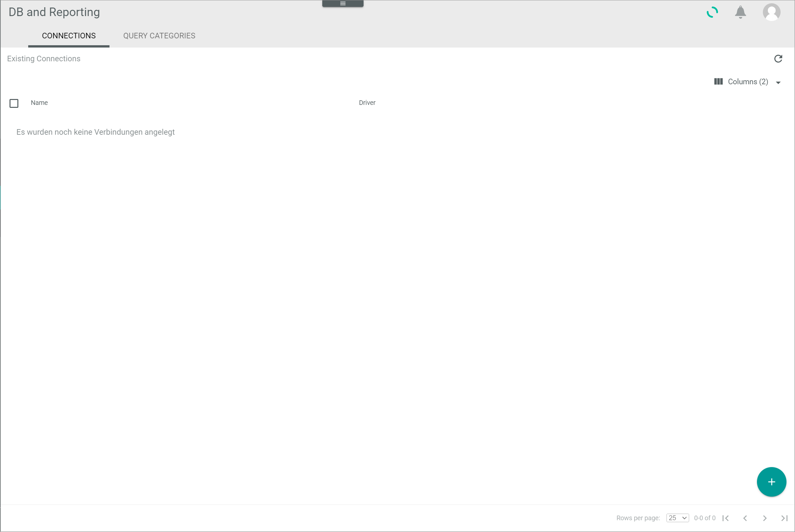
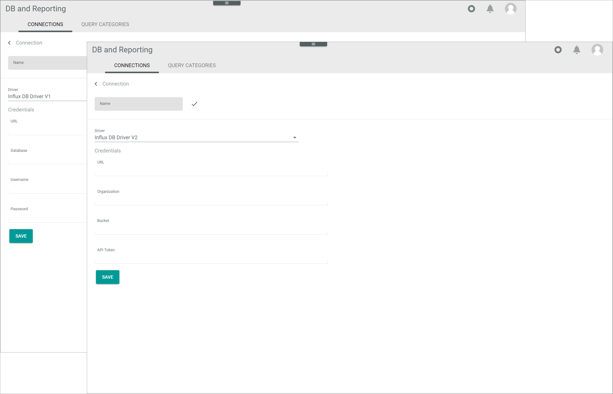
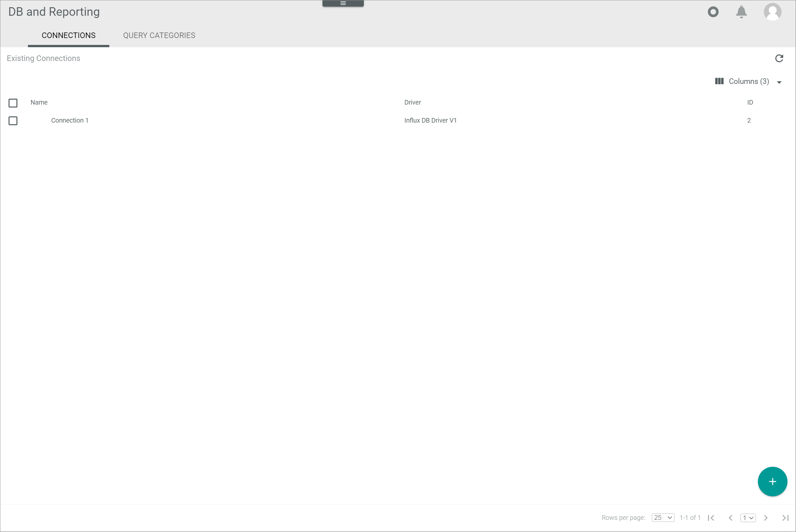
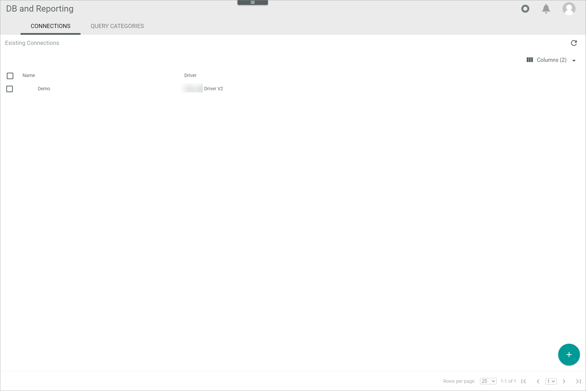
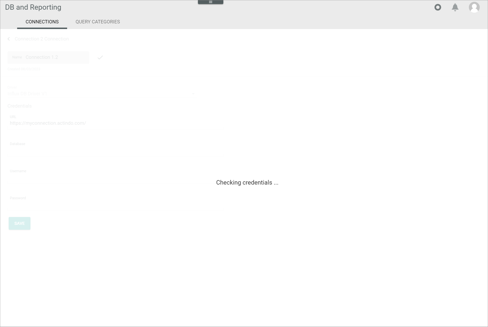

[!!User interface Connections](../UserInterface/03a_Connections.md)

# Manage the connections

Establish a connection to InfluxDB in order to write data from your databases to InfluxDB at regular time intervals using an InfluxDB time series.

The InfluxDB driver is preinstalled with the *Database and reporting* module and is available in two different versions. Depending on the driver version, the credentials differ. All necessary credentials to establish the connection are available by InfluxDB. For detailed information, see [InfluxDB](https://docs.influxdata.com/influxdb/v2.6/).

The connections can be created, edited and deleted.

## Create a connection

Create a connection to InfluxDB to be able to write data from your databases to InfluxDB. 

### Add a connection

Add a new connection to InfluxDB using one of the available InfluxDB drivers.

#### Prerequisites

InfluxDB has been purchased.

#### Procedure

*Database and reporting > Settings > Tab CONNECTIONS*

1. Click the  (Add) button in the bottom right corner.    
    The *Create connection* view is displayed.

    

2. Enter a name for the connection in the *Name* field.

3. Click the *Driver* drop-down list and select the desired driver. The following options are available:

    - **InfluxDB driver V1**  
    - **InfluxDB driver V2**  

    Depending on the selected driver, the fields in the *Credentials* section differ. All necessary credentials are provided by InfluxDB.
   
    

4. For the next steps to create a connection, follow the appropriate procedure:

    - [Create a connection with InfluxDB driver V1](#create-a-connection-with-influxdb-driver-v1)
    - [Create a connection with InfluxDB driver V2](#create-a-connection-with-influxdb-driver-v2) 

### Create a connection with InfluxDB driver V1

Enter the credentials als provided by InfluxDB in the corresponding fields of the *Credentials* section to create a connection with the InfluxDB driver V1.

#### Prerequisites

- A connection has been added, see [Add a connection](#add-a-connection).
- The InfluxDB driver V1 has been selected. 

#### Procedure

*Database and reporting > Settings > Tab CONNECTIONS > Add connection > Select InfluxDB driver V1*

1. Enter the URL path in the *URL* field.

2. Enter the database identifier in the *Database* field.

3. Enter the username in the *Username* field.

4. Enter the password in the *Password* field. 

5. Click the [SAVE] button.  
    The connection has been saved. The *Create connection* view is closed. The new connection is displayed in the list of connections.

    

### Create a connection with InfluxDB driver V2

Enter the credentials als provided by InfluxDB in the corresponding fields of the *Credentials* section to create a connection with the InfluxDB driver V2.

#### Prerequisites

- A connection has been added, see [Add a connection](#add-a-connection).
- The InfluxDB driver V2 has been selected. 

#### Procedure

*Database and reporting > Settings > Tab CONNECTIONS > Add connection > Select InfluxDB driver V2*

1. Enter the URL path in the *URL* field.

2. Enter the organization name in the *Organization* field.

3. Enter the database identifier in the *Bucket* field.

4. Enter the API token in the *API token* field.

5. Click the [SAVE] button.  
    The connection has been saved. The new connection is displayed in the list of connections.

    

## Edit a connection

Edit a connection to adjust any changed credentials or the connection name. The driver selection is read-only and cannot be edited.

#### Prerequisites

At least one connection has been established, see [Create a connection](#create-a-connection).

#### Procedure

*Database and reporting > Settings > Tab CONNECTIONS*

1. Click the connection to be edited in the list of connections. Alternatively, select the checkbox of the connection to be edited and click the  (Edit) button in the editing toolbar.  
    The *Edit connection* view is displayed.
    
    

2.  Edit the desired data of the connection in the corresponding fields in the *Credentials* section. 

    > [Info] The fields in the *Credentials* section differ depending on the driver version.

3. Click the [SAVE] button.  
    The *Checking credentials* notice is displayed.

    

    The *Edit connection* is automatically closed when the changes have been saved. The edited connection is displayed in the list of connections.

## Delete a connection

Delete a connection if it is no longer in use.

#### Prerequisites

At least one connection has been established, see [Create a connection](#create-a-connection).

#### Procedure

*Database and reporting > Settings > Tab CONNECTIONS*

1. Select the checkbox of the connection to be deleted.   
    The editing toolbar is displayed.

2. Click the  (Delete) button in the editing toolbar.  
    The *Connection XXXX* pop-up window is displayed. The number indicates the identifier of the deleted connection as displayed in the *ID* column. The deleted connection is removed from the list of connections.

    

[comment]: <> (Delete wird noch eingebaut. Wenn soweit, ggf. Procedure ergänzen/anpassen. Julian, bitte Screenshot einbauen, ziehen und zukommen lassen.)