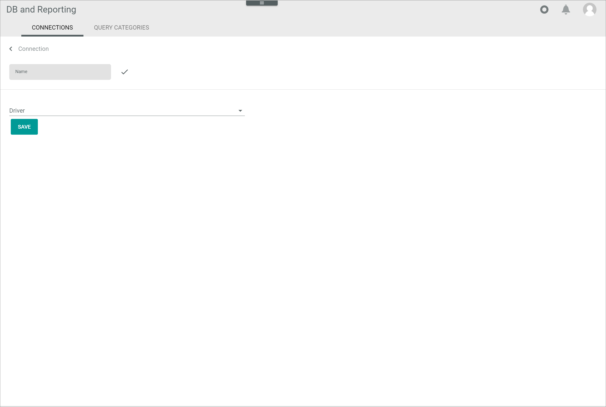

[!!User interface Connections](../UserInterface/03a_Connections.md)

# Manage the connections

Establish a connection to InfluxDB to be able to write data from your MySQL database to an InfluxDB database, and subsequently create InfluxDB time series.

[comment]: <> (Ist es das gleiche, write data from MySQL DB to InfluDB und create an InfluxDB time series?)

The InfluxDB driver is available in two different versions. Depending on the driver version, the credentials differ. All necessary credentials to establish the connection are provided by InfluxDB. For detailed information, see [InfluxDB](https://docs.influxdata.com/influxdb/v2.6/).

[comment]: <> (Zusätzlich auf https://docs.influxdata.com/influxdb/v2.6/api-guide/ verweisen?)

Connections can be created and edited.

[comment]: <> (Löschen nicht möglich? Enable/disable/sync nicht nötig?)

## Create a connection

Create a connection to InfluxDB to be able to write data from your MySQL database to an InfluxDB database. 

### Add a connection

Add a new connection to InfluxDB using one of the available InfluxDB drivers.

#### Prerequisites

- InfluxDB has been purchased.
- The InfluxDB drivers have been installed in the Core1.

> [Info] The drivers can only be installed in the Core1 with the collaboration of the Actindo IT department.

[comment]: <> (Stimmt das so für Kunden? Wie kommt man zu den Treibern? Können Sie selber installieren oder müssen sie das IT- oder Implementation-Team dazu kontaktieren?)

#### Procedure

*Database and reporting > Settings > Tab CONNECTIONS*

1. Click the  (Add) button in the bottom right corner.    
    The *Create connection* view is displayed.

    

2. Enter a name for the connection in the *Name* field.

3. Click the *Driver* drop-down list and select the desired driver. The following options are available:

    - InfluxDB driver V1  
    - InfluxDB driver V2  

    > [Info] Drivers must be downloaded and installed separately in each sandbox or account where you want to use them.    

    Depending on the selected driver, the fields in the *Credentials* section differ. All necessary credentials are provided by InfluxDB.
   
    

4. For the next steps to create a connection, follow the appropriate procedure:

    - [Create a connection with InfluxDB driver V1](#create-a-connection-with-influxdb-driver-v1)
    - [Create a connection with InfluxDB driver V2](#create-a-connection-with-influxdb-driver-v2) 

### Create a connection with InfluxDB driver V1

#### Prerequisites

- A connection has been added, see [Add a connection](#add-a-connection).
- The InfluxDB driver V1 has been selected. 

#### Procedure

*Database and reporting > Settings > Tab CONNECTIONS > Add connection > Select InfluxDB driver V1*

1. Enter the InfluxDB URL in the *URL* field.

2. Enter the InfluxDB database identifier in the *Database* field.

3. Enter the InfluxDB username in the *Username* field.

4. Enter the InfluxDB password in the *Password* field. 

5. Click the [SAVE] button.  
    The connection has been saved. The new connection is displayed in the list of connections.

    

### Create a connection with InfluxDB driver V2

#### Prerequisites

- A connection has been added, see [Add a connection](#add-a-connection).
- The InfluxDB driver V2 has been selected. 

#### Procedure

*Database and reporting > Settings > Tab CONNECTIONS > Add connection > Select InfluxDB driver V2*

1. Enter the InfluxDB URL in the *URL* field.

2. Enter the InfluxDB organization name in the *Organization* field.

3. Enter the InfluxDB database identifier in the *Bucket* field.

4. Enter the InfluxDB API token in the *API token* field.

5. Click the [SAVE] button.  
    The connection has been saved. The new connection is displayed in the list of connections.

    

[comment]: <> (Beide connections mit V1 erstellt, aber ohne credentials. JS fragen, "echte" connections zu erstellen /  bessere Screenshots ziehen)

## Edit a connection

Edit a connection to adjust any changed credentials or the connection name. The driver selection is read-only and cannot be edited.

#### Prerequisites

At least one connection has been established, see [Create a connection](#create-a-connection).

#### Procedure

*Database and reporting > Settings > Tab CONNECTIONS*

1. Click the connection to be edited in the list of connections. Alternatively, select the checkbox of the connection to be edited and click the  (Edit) button in the editing toolbar.  
    The *Edit connection* view is displayed.
    
    

2.  Edit the desired data of the connection in the corresponding fields in the *Credentials* fields.   
    > [Info] Bear in mind that the *Credentials* fields differ depending on the driver version.

3. Click the [SAVE] button.  
    The *Checking credentials* notice is displayed.

    

    The *Edit connection* is automatically closed when the changes have been saved. The edited connection is displayed in the list of connections.

[comment]: <> (Delete a connection)

[comment]: <> (Sinnvoll? Geplannt? Andere Möglichkeiten, z.B. Enable/disable/sync?)

