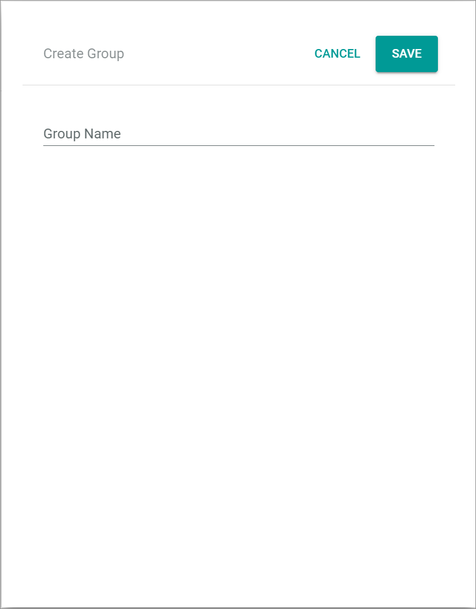
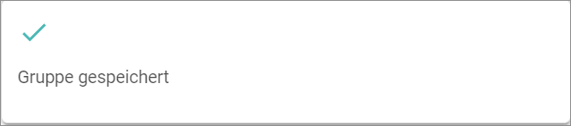
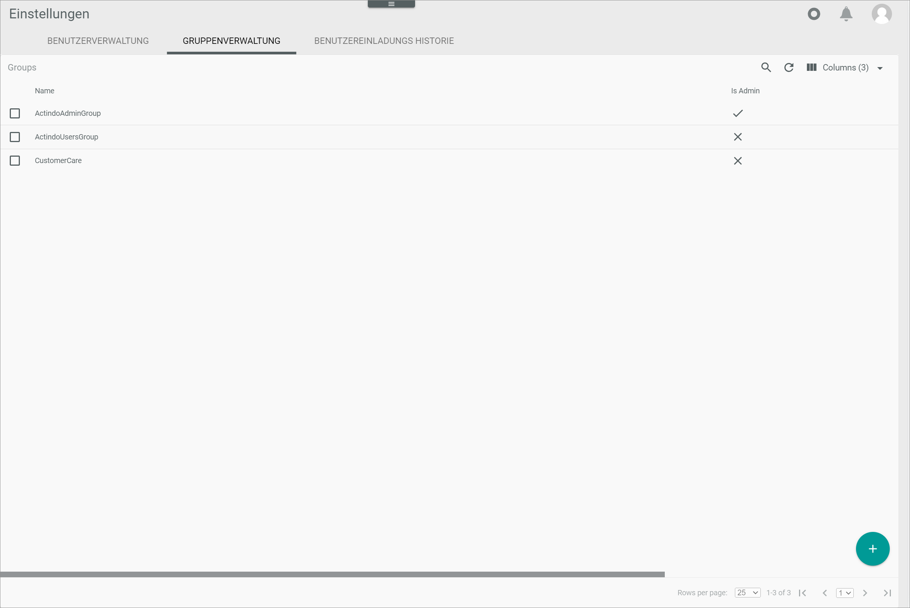
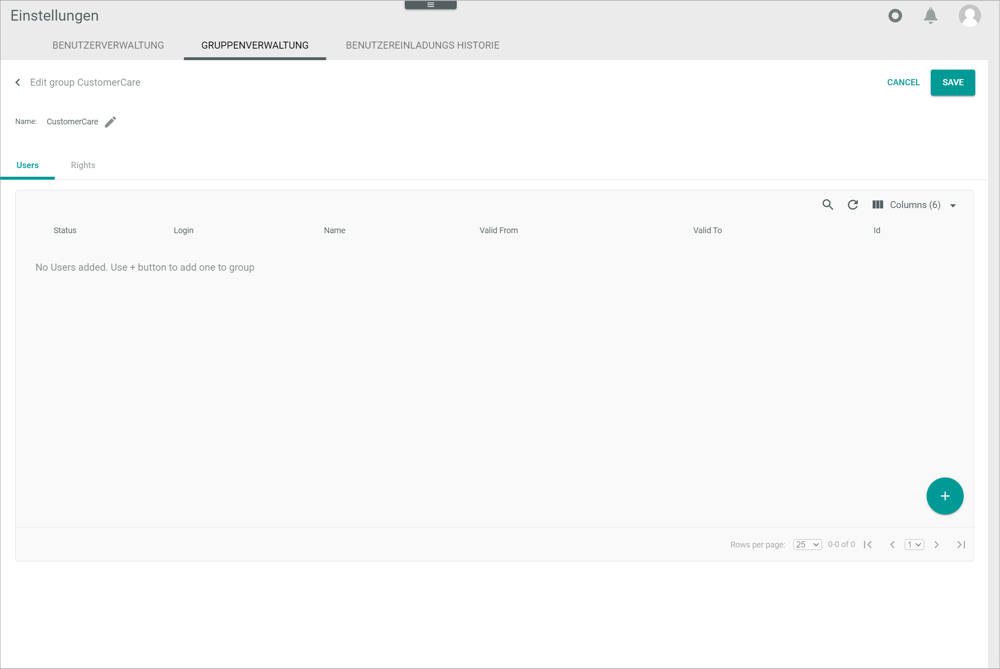
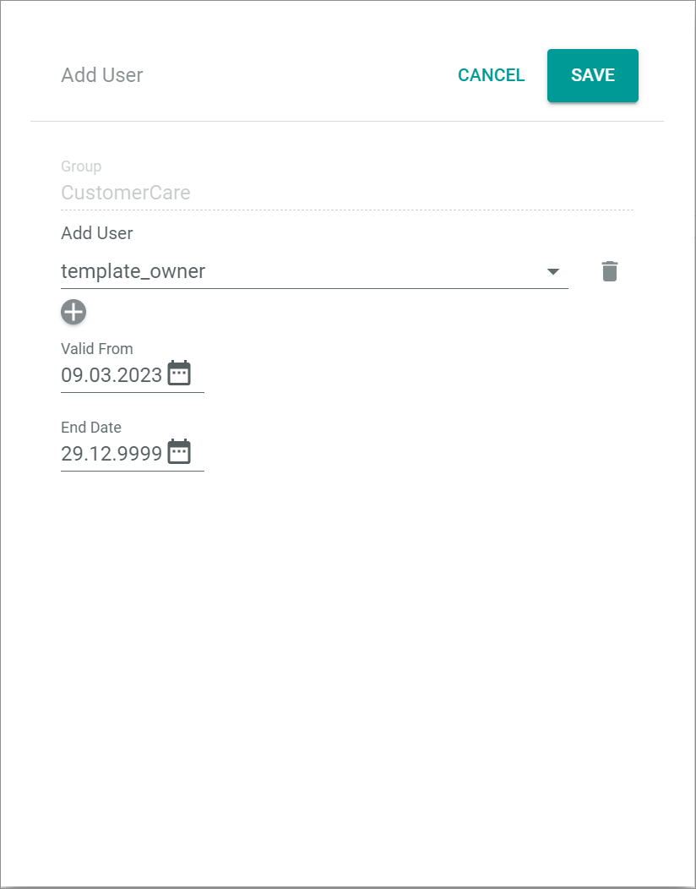

[!!Manage the queries](./01_ManageQueries.md)
[!!Manage the query categories](./02_ManageQueryCategories.md)

# Manage the user rights

Manage the user rights to allow a user or a group of users to access specific data. User rights can be individually granted or denied pro query and pro query category based on user roles. The user may be granted permission to read, create, update, delete and execute queries, to read and save query categories, and to execute specific queries.

[comment]: <> (Stimmt das so? Check andere Folders mit Julian: InfluxDB, Interactive MySQL console.)

The user rights are managed centrally for all modules and plugins installed in the Core1 in the Module *Settings*. You can create, edit and delete user groups, add specific users to a group and remove users from the a group, and assign rights to all users included in a user group.

## Create a user group

Create a user group based on a user role to be able to subsequently assign them a specific set of user rights.

#### Prerequisites

No prerequisites to fulfill.

#### Procedure

*Settings > User and Groups > Group management*

1. Click the  (Add) button in the bottom right corner.    
    The *Create group* view is displayed.

    

2. Enter a name for the group in the *Group name* field.

3. Click the [SAVE] button.   
    The *Group saved* pop-up window is displayed.
    
    

    The newly created group is displayed in the list of groups.

    
 

## Edit a user group

Edit a group to add users to a user group, remove users from a user group and assign rights to the users included in a user group. 

### Add a user to a user group

Add any number of users to a user group to assign them rights subsequently.

#### Prerequisites

A user group has been created, see [Create a user group](#create-a-user-group).

#### Procedure

*Settings > User and Groups > Group management*

1. Select the checkbox of the user group to which you want to add users.   
    The editing toolbar is displayed.

2. Click the  (Edit) button in the editing toolbar.    
    The *Edit group* view is displayed. By default, the *Users* tab is preselected.

    > [Info] If no users have been added yet, the *No users added. Add + button to add one to group* notice is displayed. Otherwise, the details of the user(s) included in the group are displayed.

    

3. Click the  (Add) button in the bottom right corner.    
    The *Add user* view is displayed.

    

4. Click the *Add user* drop-down list and select the desired user. 

5. If desired, click the  button below the *Add user* drop-down list to add an additional user.   
    An additional drop-down list is displayed. Repeat steps **4** and **5** to add as many users as necessary.

6. 

### Remove a user from a user group

#### Prerequisites

No prerequisites to fulfill.

#### Procedure

*Settings > User and Groups > Group management*

### Assign rights to a user group

- Execute query via API 
- Queries 
- Query categories 
- InfluxDB 
- Interactive MySQL console 

## Delete a user group

#### Prerequisites

No prerequisites to fulfill.

#### Procedure

*Settings > User and Groups > Group management*

