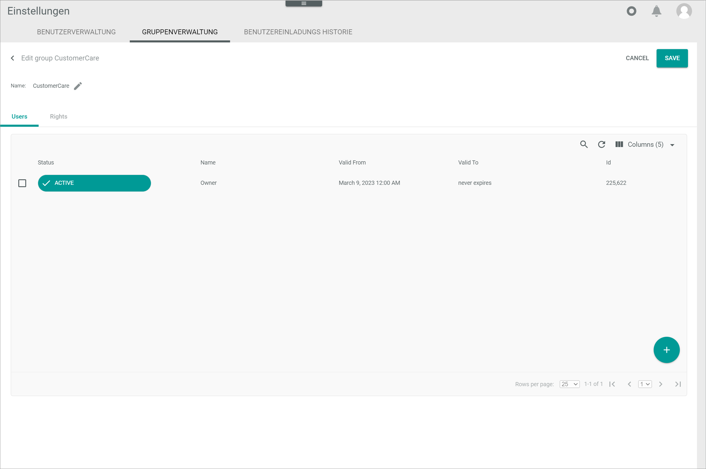

[!!Manage the queries](./01_ManageQueries.md)
[!!Manage the query categories](./02_ManageQueryCategories.md)

# Assign access rights to a user group

[comment]: <> (Evtl. Filename ändern?)

Assign user access rights to control access to specific data. Access rights can be individually granted or denied pro query and pro query category to a user group based on their user role. 

The following access rights can be individually assigned:

- **Execute query via API**  
    The user can execute a managed query via API if this option has been enabled in the query.
- **Queries**   
    Depending on the access permission type granted, the user can read, create, update, delete, and execute queries. Besides, queries must be individually selected to be executed.   
- **Query categories**  
    Depending on the access permission type granted, the user can read and save query categories.
- **InfluxDB**  
    Depending on the access permission type granted, the user can create, edit, list, delete, and execute InfluxDB time series.
- **Interactive MySQL console**  
    The user can execute any query in MySQL interactive console. Bear in mind that this gives the user access, and even write access, to all available data. 

[comment]: <> (Stimmt das so? Check mit Julian: InfluxDB, Interactive MySQL console.)

The user rights for all modules and plugins installed in the Core1 are managed centrally in the *Settings* module. For detailed information on managing the user rights, see the *Settings* module documentation.

[comment]: <> (Link hinzufügen, wenn verfügbar)

#### Prerequisites

- A user group has been created.
- The users to be granted access have been added to the applicable user group.

#### Procedure

*Settings > Users and groups > Tab GROUP MANAGEMENT*

1. Select the checkbox of the user group to be granted access.   
    The editing toolbar is displayed.

2. Click the  (Edit) button in the editing toolbar.    
    The *Edit group* view is displayed. By default, the *Users* tab is preselected.

    

3. Click the *Rights* tab.  
    All modules and plugins installed are displayed.

    > [Info] It may take some time for the system to upload all installed modules and plugins.

    

4. Navigate the folder tree structure on the left side until you locate the *Modules.Actindo.Database and Reporting* folder.
    
5. If necessary, click the rightwards arrow to the left of the *Modules.Actindo.Database and Reporting* folder to display all contained sub-folders.  
    All contained sub-folders are displayed.

    

6. Locate the functions you wish to grant access to.

7. Click the rightwards arrow to the left of the corresponding folder (function) to display all contained sub-folders (access permission types).  
    All contained sub-folders (access permission types) are displayed.

    

8. Select the checkbox of the applicable folder(s).  
    The user group, and all users included in it, have been granted access rights to the selected functions.

