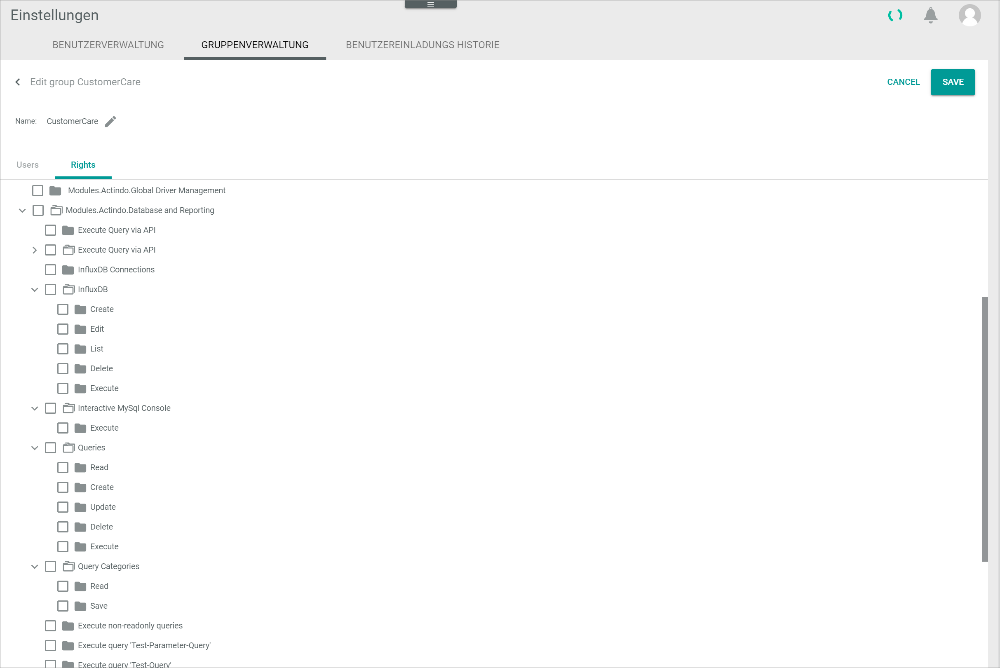

[!!Manage the queries](./01_ManageQueries.md)
[!!Manage the query categories](./02_ManageQueryCategories.md)

# Manage the user rights

The user rights for all modules and plugins installed in your Core1 account are managed centrally in the *Settings* module. 

[comment]: <> (Link hinzufügen, wenn verfügbar)

## Grant access rights to a user group

Assign user access rights to control access to specific data. The following access rights must be individually granted to any user group with a role other than administrator:

- **Execute query via API**  
    The users can execute a managed query via API if this option has been enabled in the query. Additionally, access rights must be granted for each individual predefined query.    
- **Queries**   
    Depending on the access permission type granted, the users can read, create, update, delete, and execute queries. 
- **Query categories**  
    Depending on the access permission type granted, the users can read and save query categories.
- **InfluxDB&trade;[^1]**  
    Depending on the access permission type granted, the users can create, edit, list, delete, and execute time series databases.
- **Interactive MySQL console**  
    The users can execute any query in the MySQL interactive console. Bear in mind that this gives the users access and even write access to all available data. 

    > [Info] Depending on the access rights granted, the user interface of the *Database and reporting* varies. That is, a user with no access right to the MySQL console cannot see the corresponding menu entry in the system.

#### Prerequisites

- A user group has been created.
- The users to be granted access have been added to the applicable user group.

[comment]: <> (Links hinzufügen, wenn verfügbar)

#### Procedure

*Settings > Users and groups > Tab GROUP MANAGEMENT*

1. Select the checkbox of the user group to be granted access.   
    The editing toolbar is displayed.

2. Click the  (Edit) button in the editing toolbar.    
    The *Edit group "Group name"* view is displayed. By default, the *Users* tab is preselected.

    

3. Click the *Rights* tab.  
    All modules and plugins installed are displayed.

    > [Info] It may take some time for the system to display all installed modules and plugins.

    

4. Navigate the folder tree structure on the left side until you locate the *Modules.Actindo.Database and Reporting* folder.
    
5. If necessary, click the rightwards arrow to the left of the *Modules.Actindo.Database and Reporting* folder to display all contained sub-folders.  
    All contained sub-folders are displayed.

    

6. Locate the module functions you want to grant access to.

7. Click the rightwards arrow to the left of the corresponding folder (module function) to display all contained sub-folders (access permission types).  
    All contained sub-folders (access permission types) are displayed.

    

8. Select the checkbox of the applicable folder(s) and/or sub-folders.  
   The user group, and all users included in it, have been granted access rights to the selected module functions.

[comment]: <> (Julian: Sind diese direkt wirksam oder erst nach erneuter Anmeldung des Users im System?)

[^1]: **Disclaimer:** InfluxDB&trade; is a trademark owned by InfluxData, which is not affiliated with, and does not endorse, this site.  