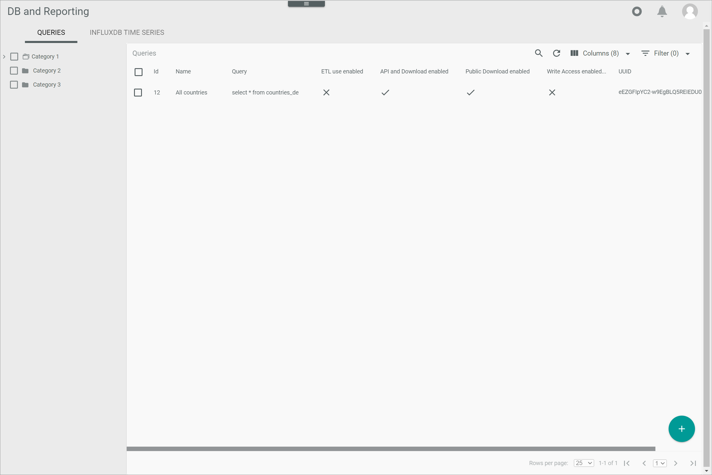
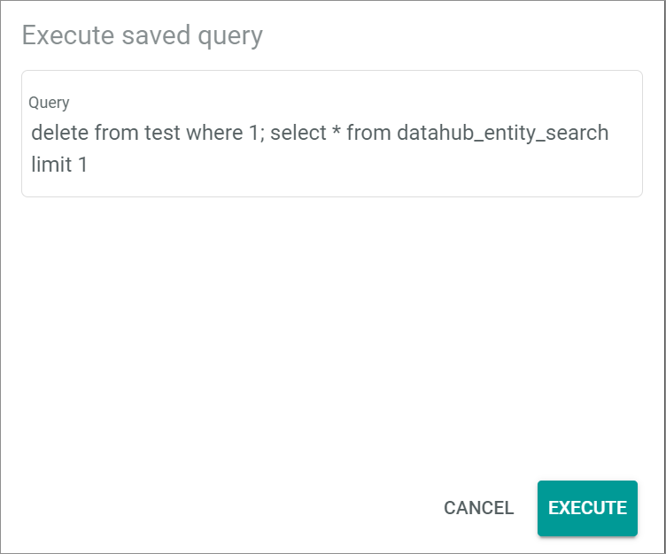
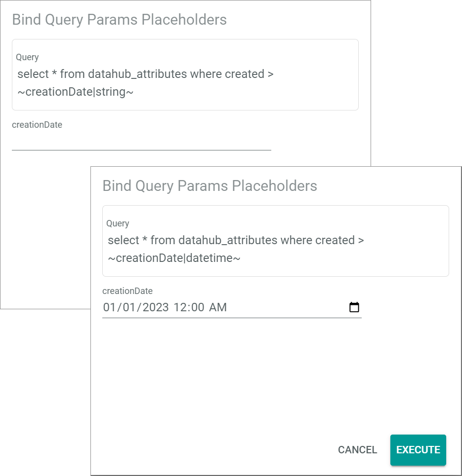
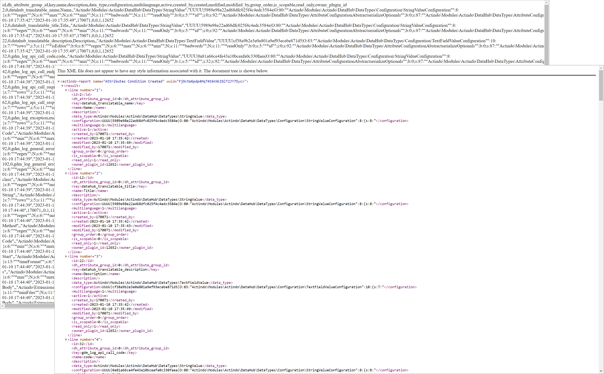

[!!Manage the queries](../Integration/01_ManageQueries.md)
[!!Manage the query categories](../Integration/02_ManageQueryCategories.md)
[!!Manage the user rights](../Integration/05_ManageUserRights.md)
[!!User interface Managed queries](../UserInterface/01a_Queries.md)

# Execute the managed queries

Once the queries have been predefined, they can be executed. When executing a query, the query results can be provided in CSV or XML format, either as a download file or as a preview.

Depending on the options that have been enabled in the query, a query can be executed via API or via download link. Moreover, the managed queries may only be executed by users who have been granted the applicable access rights. For detailed information, see [Manage the user rights](../Integration/05_ManageUserRights.md). 

## Execute a query via API 

Execute a predefined query to access the available data in your Core1 account. To execute a query via API, the user must be logged in. The query results may be previewed in your browser in CSV or XML format or may be downloaded in a CSV or an XML file. 

### Preview the query results

Execute the query and preview the results in your browser in CSV or XML format.

#### Prerequisites

- A predefined query has been created, see [Create a query](../Integration/01_ManageQueries.md#create-a-query).
- The API and download option has been enabled. 
- The user has been granted the applicable access rights, see [Grant access rights to a user group](../Integration/05_ManageUserRights.md#grant-access-rights-to-a-user-group).

#### Procedure

*Database and reporting > Managed queries > Tab QUERIES*

1. Select the checkbox of the query you want to preview.  
    The editing toolbar is displayed.

2. Click the file format drop-down list in the editing toolbar and select the desired option. The following options are available:  
      - **CSV**   
        The query results are displayed in CSV format.   
      - **XML**   
        The query results are displayed in XML format.  

3. Click the  (Preview) button in the editing toolbar.  
    The *Execute saved query* is displayed.  

    

4. If the selected query contains a placeholder, the *Bind query parameters placeholders* window is displayed. Otherwise, go to step **6**.

    

5. Enter the desired value in the placeholder field. 

6. Click the [EXECUTE] button.   
    The query is executed. The query results are displayed in a new browser window in the selected format.

    

### Download the query results

Execute the query and download the results in a CSV or an XML format file.

#### Prerequisites

- A predefined query has been created, see [Create a query](../Integration/01_ManageQueries.md#create-a-query).
- The API and download option has been enabled. 
- The user has been granted the applicable access rights, see [Grant access rights to a user group](../Integration/05_ManageUserRights.md#grant-access-rights-to-a-user-group).

#### Procedure

*Database and reporting > Managed queries > Tab QUERIES*

1. Select the checkbox of the query you want to execute.  
    The editing toolbar is displayed.

2. Click the file format drop-down list in the editing toolbar and select the desired option. The following options are available:
    - **CSV**  
        The query results are downloaded in a CSV file. CSV files can be visualized with most spreadsheet programs and text editors.   
    - **XML**  
        The query results are downloaded in an XML file. XML files can be visualized using most web browsers and text editors.

3. Click the  (Download) button in the editing toolbar.  
    The *Execute saved query* is displayed.  

    

4. If the selected query contains a placeholder, the *Bind query parameters placeholders* window is displayed. Otherwise, go to step **6**. 
    
    

5. Enter the desired value in the placeholder field. 

6. Click the [EXECUTE] button.   
    The query is executed. The query results are downloaded in the selected file format. By default, the file is saved in the downloads folder of your device. 

## Execute a query via download link 

Execute a query in a web browser using the download link provided in the *Actindo Core1 Platform*. To execute the query via public download, the query download link and the UUID (Universally Unique Identifier) are required.

#### Prerequisites

- A predefined query has been created, see [Create a query](../Integration/01_ManageQueries.md#create-a-query).
- The query contains no placeholders.
- The public download option has been enabled. 
- The IP address of the person executing the query has been not been blacklisted.

#### Procedure

*Database and reporting > Managed queries > Tab QUERIES*

1. Select the checkbox of the query you want to execute.  
    The editing toolbar is displayed.

2. Click the file format drop-down list in the editing toolbar and select the desired option. The following options are available:
    - **CSV**  
        The query results are downloaded in a CSV file. CSV files can be visualized with most spreadsheet programs and text editors.   
    - **XML**  
        The query results are downloaded in an XML file. XML files can be visualized using most web browsers and text editors.

3. Click the [COPY DOWNLOAD LINK] button in the editing toolbar.  
    The query download link is copied to your clipboard.

    > [Info] The download link contains the query URL and the required UUID (Universally Unique Identifier), which is automatically assigned by the system when creating a query.

4. Open a new browser window and paste the copied link from your clipboard. 

5. Press the [ENTER] key to execute the query in your web browser.  
    The query is executed. The query results are downloaded in the selected file format. By default, the file is saved in the downloads folder of your device.  

    > [Info] If the selected query contains a placeholder, an error messages is displayed, as no parameters can be bound. 

[comment]: <> (Download via public download sollte möglich als CSV und XML Datei. Momentan funktioniert nur als CSV - URL hat nur CSV drin. Reported, Stand 20.04.2023)