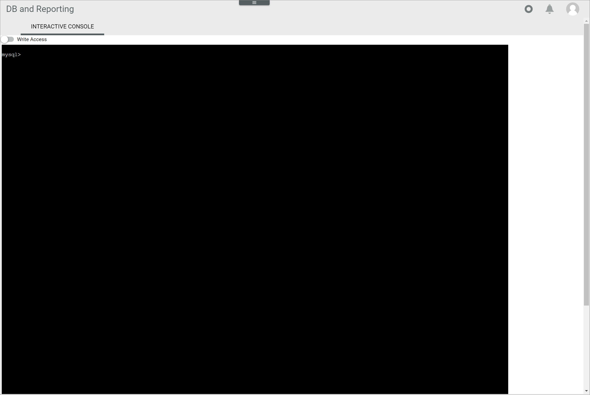
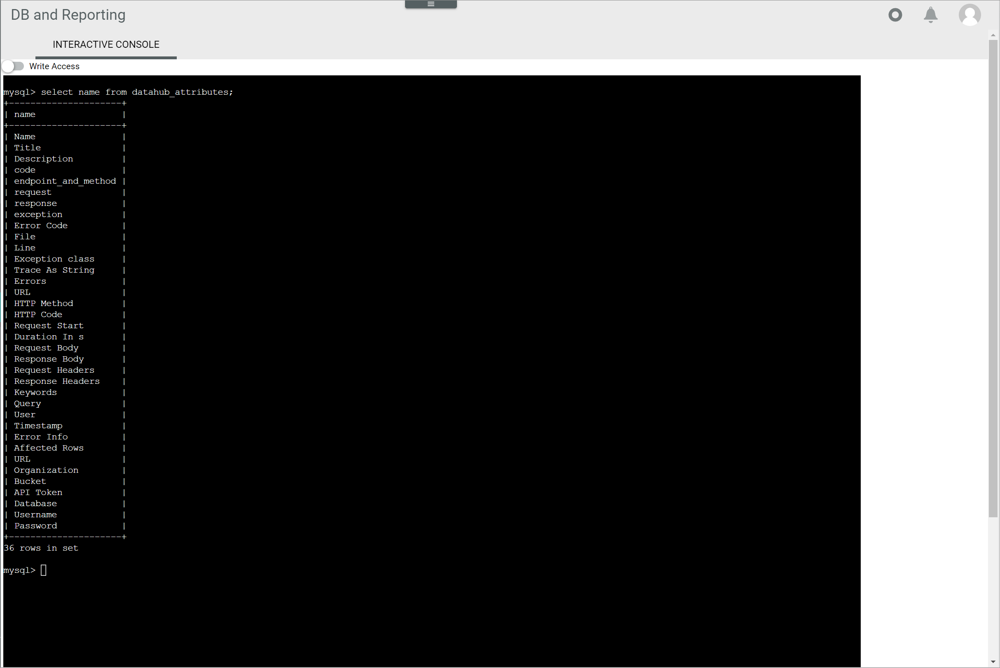
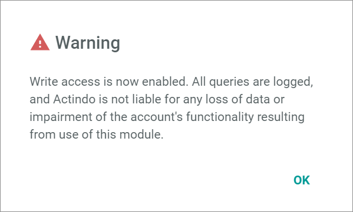
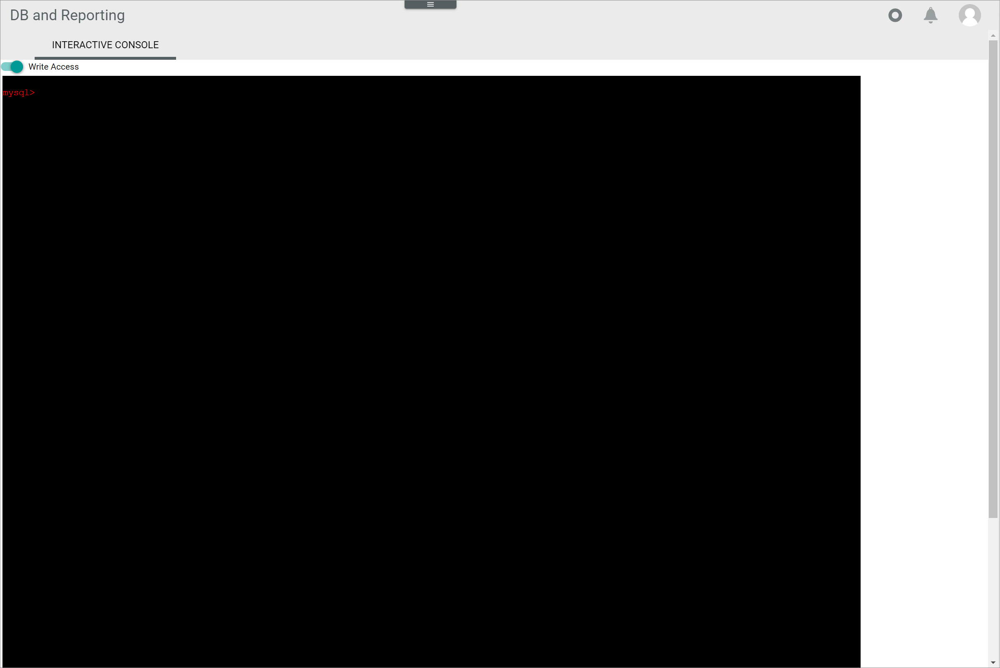

[!!Manage user rights](../Integration/05_ManageUserRights.md)
[!!User interface Interactive console](../UserInterface/04a_InteractiveConsole.md)

# Execute queries in the MySQL console

The MySQL console allows the users to query any data contained in your *Actindo Core1 Platform*. The queries must be written in SQL syntax. Therefore, SQL knowledge is required.  

All data available in the system can be accessed, retrieved, and modified using MySQL interactive console. For this reason, MySQL interactive console must be handled with extreme caution, and access rights should only be granted to persons with the appropriate role and skills. For detailed information about managing user rights, see [Manage user rights](../Integration/05_ManageUserRights.md).

[comment]: <> (Julian: Wollen wir hier den Inhalt irgendwie als Expertenwissen markieren/kennzeichnen, wie besprochen?)

## Access and retrieve data

Access and retrieve any data contained in your system's databases using the interactive console. The data displayed in the console is read-only.

#### Prerequisites

The users have been granted the applicable access rights, see [Grant access rights to a user group](../Integration/05_ManageUserRights.md#grant-access-rights-to-a-user-group).

#### Procedure

*Database and reporting > MySQL console > Tab INTERACTIVE CONSOLE*

1. Enter a valid SQL query, for example **SELECT name FROM datahub_attributes;**, to retrieve all attribute names contained in the *datahub_attributes* table. 
    > [Info] SQL knowledge is required to perform the queries. For detailed information on SQL, see for instance [SQL Tutorial](https://www.w3schools.com/sql/default.asp).
    
2. Press the **ENTER** key.  
    The query results are displayed in the interactive console.    

    

## Edit data

Data contained in your system's database can also be modified using the interactive console, for instance, a record can be inserted, updated or even deleted.

> [Caution] **Potential loss of data**   
  Editing has the potential to cause loss of data due to overwrite or deletion. The overwrite or deletion cannot be undone and the overwritten or deleted data cannot be restored.    
  Check all your entries before proceeding. 

#### Prerequisites

The user has been granted the applicable access rights, see [Grant access rights to a user group](../Integration/05_ManageUserRights.md#grant-access-rights-to-a-user-group).

#### Procedure

*Database and reporting > MySQL console > Tab INTERACTIVE CONSOLE*

1. Enable the *Write access* toggle in the upper left corner.  
    A warning message with the following notice is displayed:   
    *Write access is now enabled. All queries are logged, and Actindo is not liable for any loss of data or impairment of the account's functionality resulting from use of this module*. 

    

2. Click the [OK] button to proceed.   
    The text in the interactive console turns red. Write access is enabled. 

    

3. Enter a valid SQL query, for example **INSERT INTO table_name (column1, column2) VALUES (value1, value2)** to edit the selected data accordingly. 

    > [Caution] **Potential loss of data**   
    Editing has the potential to cause loss of data due to overwrite or deletion. The overwrite or deletion cannot be undone and the overwritten or deleted data cannot be restored.    
    Check all your entries before proceeding. 

4. Press the **ENTER** key.  
    The data has been modified. The query results are displayed in the interactive console.   

    

[comment]: <> (Julian, bitte, sinnvoller Query für Schritt 3 vorschlagen und evtl. Screenshot with write access ziehen lassen?)

