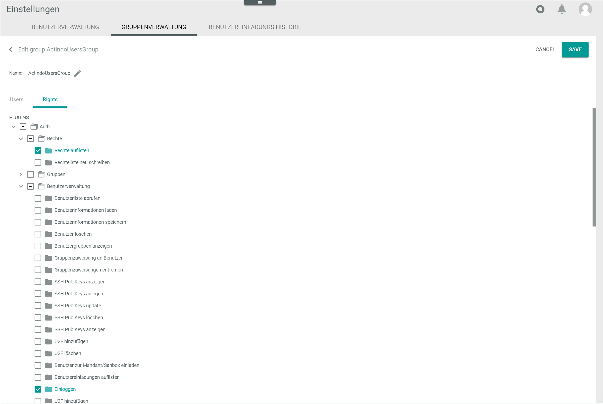
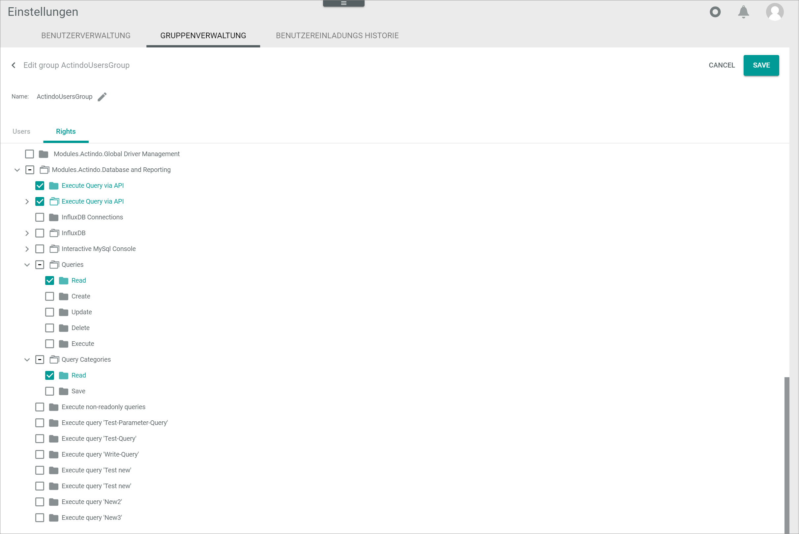

[!!User interface Interactive console](../UserInterface/04a_InteractiveConsole.md)
[!!Manage user rights](../Integration/05_ManageUserRights.md)

# Execute queries in MySQL console

MySQL console allows the user to query any data contained in your *Actindo Core1 Platform*. The queries must be performed using SQL commands, and therefore SQL knowledge is required. 

All data available in the system can be accessed, retrieved and modified using MySQL interactive console. For this reason, MySQL interactive console must be handle with extreme caution, and access should only be granted to personnel with the appropriate rights. For detailed information about managing user rights, see [Manage user rights](../Integration/05_ManageUserRights.md).

## Access and retrieve data

Access and retrieve any data contained in your system's databases using the interactive console. The data displayed in the console is read-only.

#### Prerequisites

No prerequisites to fulfill.

#### Procedure

*Database and reporting > MySQL console > Tab INTERACTIVE CONSOLE*

1. Enter a valid SQL statement, for example **SELECT CustomerName, Address, City FROM Customers;** to retrieve the data *CustomerName*, *Address* and *City* from the *Customers* table. 
    > [Info] SQL knowledge is necessary to perform the queries. For further information on SQL, see [SQL Tutorial](https://www.w3schools.com/sql/default.asp).

[comment]: <> (Evtl. anderen/besseren Link? Oder lieber keinen? Echte statements oder lieber exemplarische?)

2. Press the **ENTER** key.  
    The query results are displayed in the interactive console.    

    

[comment]: <> (Screenshot needed - Julian, bitte query als Beispiel erstellen und Screenshots ziehen)

## Edit data

Data contained in your system's database can also be modified using the interactive console, for instance, a record can be inserted, updated or even deleted.

> [Caution] **Potential loss of data**   
  Editing has the potential to cause loss of data due to overwrite. The overwrite cannot be undone and the overwritten data cannot be restored.    
  Check all your entries before proceeding. 

#### Prerequisites

No prerequisites to fulfill.

#### Procedure

1. Enable the *Write access* toggle in the upper left corner.  
    A warning message with the following notice is displayed:   
    *Write access is now enabled. All queries are logged, and Actindo is not liable for any loss of data or impairment of the account's functionality resulting from use of this module*. 

    

2. Click the [OK] button to proceed.   
    The text in the interactive console turns red. Write access is enabled. 

3. Enter a valid SQL statement, for example **INSERT INTO table_name (column1, column2, column3) VALUES ('value1', 'value2')** to edit the selected data accordingly. 

    > [Caution] **Potential loss of data**   
  Editing has the potential to cause loss of data due to overwrite. The overwrite cannot be undone and the overwritten data cannot be restored.    
  Check all your entries before proceeding. 

4. Press the **ENTER** key.  
    The data has been modified.   

    

[comment]: <> (Wird was angezeigt? Screenshots ziehen lassen)

## Assign access rights to users 

Grant access to the interactive console to users with the necessary knowledge and the appropriate rights according to the applicable data protection guidelines. 

#### Prerequisites

- The user to be granted access has been added to the applicable user group, see [Add a user to a user group](../Integration/05_ManageUserRights.md#add-a-user-to-a-user-group).

[comment]: <> (Oder Verweis auf Assign rights to a user group?)

#### Procedure

*Settings > Users and groups > Tab GROUP MANAGEMENT*

1. Select the checkbox of the user group where the desired user is included.   
    The editing toolbar is displayed.

2. Click the  (Edit) button in the editing toolbar.    
    The *Edit group* view is displayed. By default, the *Users* tab is preselected.

    

2. Click the *Rights* tab.  
    All modules and plugins installed are displayed.

    > [Info] It may take a few seconds for the system to upload all installed modules and plugins.

    

3. Navigate the folder tree structure on the left side until you locate the *Modules.Actindo.Database and Reporting* folder.

    

4. If necessary, click the rightwards arrow to the left of the *Modules.Actindo.Database and Reporting* folder to display all contained sub-folders.  
    All contained sub-folders are displayed.

5. Select the checkbox of the *Interactive MySQL console* folder.  
    The *Interactive MySQL console* folder and the *Execute* subfolder are selected. The user group, and all users included in it, have been granted access right to the interactive console.  

[comment]: <> (Vermute, es gibt keine weiteren Unterordner, also nicht nötig auszuklappen und einzeln auswählen, oder?)