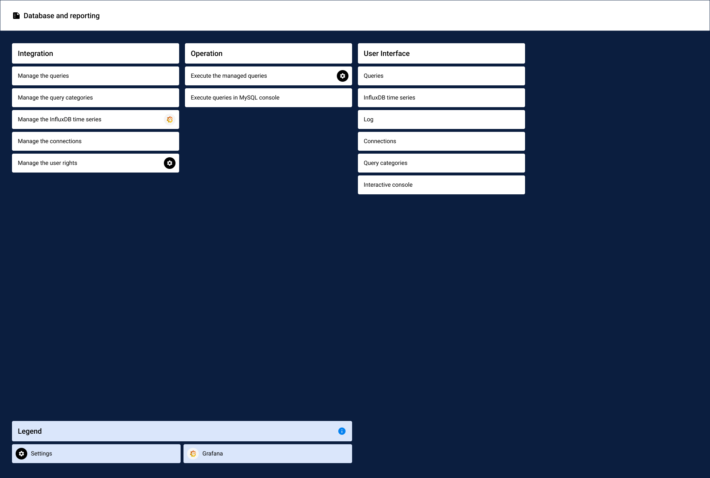

# Processes overview

The following scheme shows the processes and chapters of the *Database and reporting* module documentation and their link to other modules:

[comment]: <> (Check, ob Verwendung von Grafana Icon i.O.)