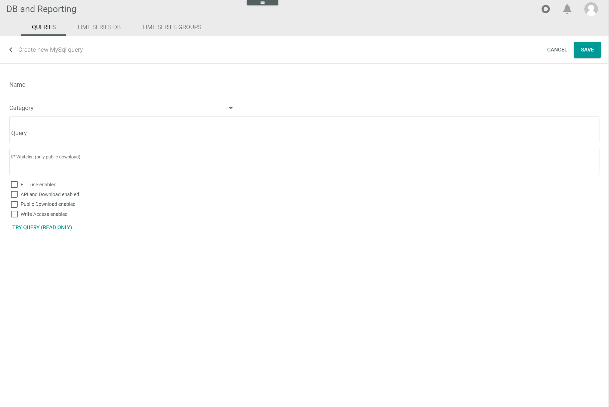

#  Queries

*Database and reporting > Managed queries > Tab QUERIES*

**Query categories tree**

 -  (Folders)  
    Query category that contains query sub-categories. Click the arrow *>* left to the query category to unfold it and display the query sub-categories. 

-  (Folder)  
    Query category. Click the query category to display all queries that are assigned to the selected query category in the *Queries* list.

**Queries**

-  (Search)   
    Click this button to display the search bar and search for a query. 

-  (Refresh)   
    Click this button to update the list of queries. 

-  Columns (x)   
    Click this button to display the columns bar and customize the displayed columns and the order of columns in the list. The *x* indicates the number of columns that are currently displayed in the list.

-  Filter (x)   
    Click this button to display the filter bar and customize the active filters. The *x* indicates the number of filters that are currently active.

- [x]     
    Select the checkbox to display the editing toolbar. If you click the checkbox in the header, all queries in the list are selected.

- [CSV/XML]   
    Click this drop-down list to selected the desired format to visualize or download the query results. This button is only displayed if a single checkbox in the list of queries is selected. 

-  (Download)   
    Click this button to download the query results. This button is only displayed if a single checkbox in the list of queries is selected.   
    The *Execute saved query* window is displayed, see [Execute saved query](#execute-saved-query).

-  (View)   
      Click this button to visualize the query results onscreen. This button is only displayed if a single checkbox in the list of queries is selected.  
      The *Execute saved query* window is displayed, see [Execute saved query](#execute-saved-query).

- [COPY DOWNLOAD LINK]  
    Click this button to copy the download link to your clipboard. This button is only displayed if a single checkbox in the list of queries is selected and if public download has been enabled for the selected query.  

-  (Edit)   
    Click this button to edit a query. This button is only displayed if a single checkbox in the list of queries is selected. Alternatively, you can click directly a query in the list to edit it.
    The *Edit MySQL query* window is displayed, see [Edit MySQL query](#edit-mysql-query).

-  (Delete)   
    Click this button to delete a query. It is possible to delete several queries at once. This button is displayed if at least one checkbox in the list of queries is selected.       

The list displays all predefined queries. Depending on the settings, the displayed columns may vary. All fields are read-only. If no query has been created yet, the notice *No queries created. Use + button to create one* is displayed.

- *ID*  
    Query identification number. The ID number is automatically assigned by the system. 

- *Name*   
    Attribute name.

- *Query*   
    Predefined query expressed in SQL.

- *ETL use enabled*   
    Indication whether the ETS use is enabled or not:
    -  (Checkmark): The ETL use is enabled.  
    -  (Cross): The ETL use is not enabled.
    
    > [Info] This function is not available in the current version.

[comment]: <> (Check!)

- *API and download enabled*   
    Indication whether the public download is enabled or not:
    -  (Checkmark): The API access and download is enabled.  
    -  (Cross): The API access and download is not enabled.

- *Public download enabled*   
    Indication whether the public download is enabled or not:
    -  (Checkmark): The public download is enabled.  
    -  (Cross): The public download is not enabled.

- *Write access enabled*   
    Indication whether the write operations are enabled or not:
    -  (Checkmark): Write operations are enabled.  
    -  (Cross): Write operations are not enabled.

- *UUID*   
    Universally Unique Identifier. This code is required to execute a query via web browser. 

-  (Copy)  
    Click this button to copy the UUID (Universally Unique Identifier) to your clipboard.

-  (Add)   
    Click this button to create a query. The *Create MySQL query* view is displayed.   

 ## Create MySQL query

*Database and reporting > Managed queries > Tab QUERIES > Button Add*

- *Name*

- *Category*

- *Query*

- *IP whitelist (only public download)*

- [x] ETL use enabled

- [x] API and download enabled

- [x] Public download enabled

- [x] Write access enabled

- [TRY QUERY] (READ ONLY)

- *Try query result*

- [CANCEL]

- [SAVE]

## Edit MySQL query

*Database and reporting > Managed queries > Tab QUERIES > Select query*
*Database and reporting > Managed queries > Tab QUERIES > Select query checkbox > Button Edit*

- *ID*

- *UUID*

- *Name*

- *Category*

- *Query*

- *IP whitelist (only public download)*

- [x] ETL use enabled

- [x] API and download enabled

- [x] Public download enabled

- [x] Write access enabled

- [TRY QUERY] (READ ONLY)

- *Try query result*

- [CANCEL]

- [SAVE]

## Execute saved query

*Database and reporting > Managed queries > Tab QUERIES > Select query checkbox > Button View*
*Database and reporting > Managed queries > Tab QUERIES > Select query checkbox > Button Download*

## Bind query parameters placeholders

*Database and reporting > Managed queries > Tab QUERIES > Select query checkbox > Button View*
*Database and reporting > Managed queries > Tab QUERIES > Select query checkbox > Button Download*

> [Info] This window is only displayed when the query selected contains placeholders to be bound before executing it. 
