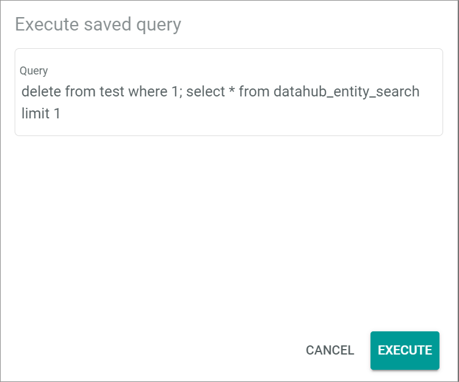

[!!User interface Query categories](../UserInterface/03b_QueryCategories.md)
[!!Manage the categories](./01_ManageCategories.md)
[!!Manage the query categories](./02_ManageQueryCategories.md)

#  Queries

*Database and reporting > Managed queries > Tab QUERIES*

**Query categories tree**

 -  (Folders)  
    Query category that contains query sub-categories. Click the arrow left to the query category to unfold it and display the query sub-categories. Select the query category to display all queries that are assigned to it in the *Queries* list.

-  (Folder)  
    Query sub-category. Click the query sub-category to display all queries that are assigned to it in the *Queries* list.

**Queries**

-  (Search)   
    Click this button to display the search bar and search for a query. 

-  (Refresh)   
    Click this button to update the list of queries. 

-  Columns (x)   
    Click this button to display the columns bar and customize the displayed columns and the order of columns in the list. The *x* indicates the number of columns that are currently displayed in the list.

-  Filter (x)   
    Click this button to display the filter bar and customize the active filters. The *x* indicates the number of filters that are currently active.

- [x]     
    Select the checkbox to display the editing toolbar. If you click the checkbox in the header, all queries in the list are selected.

- Format   
    Click this drop-down list to select the desired format to visualize or download the query results. This button is only displayed if a single checkbox in the list of queries is selected. The following options are available:  
    - **CSV**  
        Select this option to visualize or download the query results in CSV format.
    - **XML**   
        Select this option to visualize or download the query results in XML format.

-  (Download)   
    Click this button to download the query results. This button is only displayed if a single checkbox in the list of queries is selected.   
    The *Execute saved query* window is displayed, see [Execute saved query](#execute-saved-query).

-  (View)   
      Click this button to visualize the query results on screen. This button is only displayed if a single checkbox in the list of queries is selected.  
      The *Execute saved query* window is displayed, see [Execute saved query](#execute-saved-query).

- [COPY DOWNLOAD LINK]  
    Click this button to copy the download link to your clipboard. This button is only displayed if a single checkbox in the list of queries is selected and if public download has been enabled for the selected query.  

-  (Edit)   
    Click this button to edit a query. This button is only displayed if a single checkbox in the list of queries is selected. Alternatively, you can click directly a query in the list to edit it.  
    The *Edit MySQL query* view is displayed, see [Edit MySQL query](#edit-mysql-query).

-  (Delete)   
    Click this button to delete a query. It is possible to delete several queries at once. This button is displayed if at least one checkbox in the list of queries is selected.       

The list displays all predefined queries. Depending on the settings, the displayed columns may vary. All fields are read-only. If no query has been created yet, the notice *No queries created. Use + button to create one* is displayed.

- *ID*  
    Query identification number. The ID number is automatically assigned by the system. 

- *Name*   
    Description of the query.

- *Query*   
    Predefined SQL query.

[comment]: <> (ETL use enabled Option wird noch ausgeblendet)

- *API and download enabled*   
    Indication whether API access and download is enabled or not:
    -  (Checkmark): API access and download is enabled.  
    -  (Cross): API access and download is not enabled.

- *Public download enabled*   
    Indication whether public download is enabled or not:
    -  (Checkmark): Public download is enabled.  
    -  (Cross): Public download is not enabled.

- *Write access enabled*   
    Indication whether write access is enabled or not:
    -  (Checkmark): Write access is enabled.  
    -  (Cross): Write access is not enabled.

- *UUID*   
    Universally Unique Identifier. This code is automatically assigned by the system when the query is created. It is required to execute a query in a web browser. 

-  (Copy)  
    Click this button to copy the UUID (Universally Unique Identifier) to your clipboard.

-  (Add)   
    Click this button to create a query. The *Create MySQL query* view is displayed, see [Create MySQL query](#create-mysql-query).   

 ## Create MySQL query

*Database and reporting > Managed queries > Tab QUERIES > Button Add*

- *Name*  
    Enter a description for the query.

- *Category*  
    Click the drop-down list to assign the query to a category. All available categories are displayed in the list. 

- *Query*  
    Enter the SQL query.

- *IP whitelist (only public download)*  
    Enter the IP address(es) you want to limit access to in case of public download. It is possible to enter one or several IP addresses or an IP range (subnet mask). When entering more than one IP address, each IP address must be entered on a separate line.  

[comment]: <> (ETL use enabled Option wird noch ausgeblendet)
    
- [x] API and download enabled   
    Click the checkbox to enable API access and download.

- [x] Public download enabled   
    Click the checkbox to enable public download.
   
- [x] Write access enabled   
    Click the checkbox to enable write access.
   
- [TRY QUERY (READ ONLY)]   
    Click this button to try the defined query. The *Try query result* box is displayed.

- [CANCEL]  
    Click this button to cancel creating the query. The *Create MySQL query* view is closed.

- [SAVE]  
    Click this button to save the query. The *Create MySQL query* view is closed. The new query is displayed in the list of queries.

## Edit MySQL query

*Database and reporting > Managed queries > Tab QUERIES > Select query*  
*Database and reporting > Managed queries > Tab QUERIES > Select query checkbox > Button Edit*

- *ID*  
    Query identification number. The identification number is automatically assigned by the system when the query is created and cannot be edited.

- *UUID*   
    Universally Unique Identifier. The UUID is automatically assigned by the system when the query is created and cannot be edited.

- *Name*  
    Edit the query description.

- *Category*  
    Click the drop-down list to assign the query to a category. All available categories are displayed in the list. 

- *Query*  
    Edit the SQL query.

- *IP whitelist (only public download)*  
    Enter the IP address(es) you want to limit access to in case of public download. It is possible to enter one or several IP addresses or an IP range (subnet mask). When entering more than one IP address, each IP address must be entered on a separate line.  

[comment]: <> (ETL use enabled Option wird noch ausgeblendet)
    
- [x] API and download enabled  
    Click the checkbox to enable/disable API access and download.

- [x] Public download enabled  
    Click the checkbox to enable/disable public download.
   
- [x] Write access enabled  
    Click the checkbox to enable/disable write access.
   
- [TRY QUERY (READ ONLY)]   
    Click this button to try the edited query. The *Try query result* box is displayed.

- [CANCEL]  
    Click this button to cancel editing the query. The *Edit MySQL query* view is closed. All changes have been rejected.

- [SAVE]  
    Click this button to save any changes made. The *Edit MySQL query* view is closed. All changes have been applied.

## Execute saved query

*Database and reporting > Managed queries > Tab QUERIES > Select query checkbox > Button View*  
*Database and reporting > Managed queries > Tab QUERIES > Select query checkbox > Button Download*  

- *Query*  
    The predefined SQL query is displayed.

- [CANCEL]   
    Click this button to cancel executing the query. The *Execute saved query* is closed.

- [EXECUTE]  
    Click this button to execute the query. The *Execute saved query* is closed. The query results are displayed in a new window or downloaded in a CSV or XML file to the downloads folder of your device depending on the option previously selected. 

## Bind query parameters placeholders

*Database and reporting > Managed queries > Tab QUERIES > Select query checkbox > Button View*  
*Database and reporting > Managed queries > Tab QUERIES > Select query checkbox > Button Download*  
*Database and reporting > Managed queries > Button Add > Insert placeholder in query > TRY QUERY (READ ONLY)*   

> [Info] This window is only displayed when the predefined query contains placeholders to be bound before executing it. 
	
- *Query*  
    The predefined SQL query is displayed.

- Placeholder field  
  Enter the desired value in the placeholder field. The placeholder field name changes according to the description defined for the placeholder when creating the query.

- [CANCEL]   
    Click this button to cancel executing the query. The *Bind query parameters placeholders* is closed.

- [EXECUTE]  
    Click this button to execute the query. The *Bind query parameters placeholders* is closed. The query results are displayed in a new window or downloaded in a CSV or XML file to the downloads folder of your device depending on the option previously selected.
