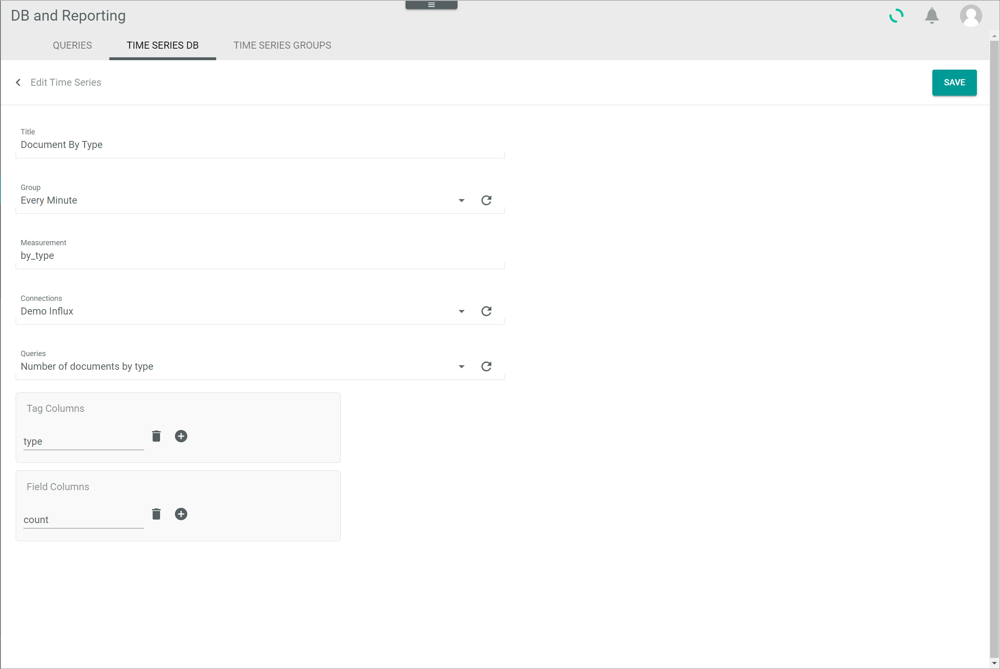

[!!Manage time series databases](../Integration/03_ManageTimeSeriesDatabases.md)
[!!Manage the user rights](../Integration/05_ManageUserRights.md)

#  Time series databases

*Database and reporting > Managed queries > Tab TIME SERIES DATABASES*

**List of time series databases**

-  (Search)   
    Click this button to display the search bar and search for a time series database. 

-  (Refresh)   
    Click this button to update the list of time series databases. 

-  Columns (x)   
    Click this button to display the columns bar and customize the displayed columns and the order of columns in the list. The *x* indicates the number of columns that are currently displayed in the list.

- [x]     
    Select the checkbox to display the editing toolbar. If you click the checkbox in the header, all time series databases in the list are selected.

- [EXECUTE]  
    Click this button to execute the selected time series database immediately, that is, without waiting for the next scheduled run. You can also use this button to execute the time series database manually if it has not been assigned to a group. This button is only displayed if a single checkbox in the list of time series databases is selected.

- [EDIT]  
    Click this button to edit a selected time series database. This button is only displayed if a single checkbox in the list of time series databases is selected. The *Edit time series database* view is displayed, see [Edit time series database](#edit-time-series-database).

- [DELETE]  
    Click this button to delete a selected time series database. It is possible to delete several time series databases at once. This button is displayed if at least one checkbox in the list of time series databases is selected.

[comment]: <> (Julian: Funktioniert es so wie bei Queries?)

The list displays all time series databases. Depending on the settings, the displayed columns may vary. All fields are read-only. 

- *Title*  
    Description of the time series database.

- *Group*  
    Time series group selected to which the time series database has been assigned. This column is empty if the **N/A** option has been selected, that is, if the time series database has not been assigned to any group. 

- *Connection*  
    Connection selected to write data to the time series database. 

- *Query*  
    Predefined query to be executed in the time series database.

- *Measurement*  
    Name of the table where the data is to be written.

- *Tags*  
    Tags specified to categorize the data written to the time series database. Tags are optional and therefore this column may be empty.

- *Fields*  
    Values specified to be written to the time series database. Fields are mandatory. 

- *CronLine*  
    CronLine defined in time series group to which the time series database has been assigned. This column is empty if the **N/A** option has been selected, that is, if the time series database has not been assigned to any group. 

- *Last executed at*  
    Date and time that the selected time series database has been last executed.

[comment]: <> (Julian: Ich habe auf EXECUTE geklickt, die Spalte zeigt aber nichts. Ich weiß nicht, ob daran liegt, dass meine Dummy-Verbindung nicht richtig funktioniert oder ob es generell ein Bug ist)

- *ID*  
    Time series database identification number. The ID number is automatically assigned by the system.

-  (Add)   
    Click this button to create a time series database. The *Create time series database* view is displayed, see [Create time series database](#create-time-series-database).  

## Create time series database

*Database and reporting > Managed queries > Tab TIME SERIES DATABASES > Button Add*

- *Title*  
    Enter a description for the time series database.

- *Group*  
    Time series group selected to which the time series database has been assigned. This column is empty if the **N/A** option has been selected, that is, if the time series database has not been assigned to any group. 

- *Measurement*  
    Enter the name of the table where the data is to be written. 
    
    > [Info] If the measurement does not exist yet, it will be created automatically with the specified fields and tags. If the measurement already exists, the fields and tags of the existing table will be added to the specified measurement.

- *Connections*  
    Click the drop-down list and select the desired connection. The available connections are displayed in the list.  

-  (Refresh)  
    Click this button to refresh the *Connections* drop-down list and display any newly created connection.

- *Queries*  
    Click the drop-down list and select the desired predefined query.

-  (Refresh)  
    Click this button to refresh the *Queries* drop-down list and display any newly created query.

- *Tag columns*  
    Enter the relevant tag(s) in this box to categorize the data to be written to the time series database according to your desired criteria. Tags represent metadata and are therefore optional.

-  (Add)  
    Click this button to add a new input line to the *Tag columns* box.

-  (Delete)  
    Click this button to remove a tag from the *Tag columns* box. This button is displayed to the right of a newly added input line.
    
- *Field columns*  
    Enter the relevant field(s) in this box to define the data to be written to the time series database. Fields represent the actual values and are therefore mandatory.

-  (Add)  
    Click this button to add a new input line to the *Field columns* box.

-  (Delete)  
    Click this button to remove a field from the *Field columns* box. This button is displayed to the right of a newly added input line.
- [SAVE]  
    Click this button to save the time series database. The *Create time series database* view is closed. The new time series database is displayed in the list of time series databases.

## Edit time series database

*Database and reporting > Managed queries > Tab TIME SERIES DATABASES > Select time series database*  
*Database and reporting > Managed queries > Tab TIME SERIES DATABASES > Select time series database checkbox > Button Edit*  

- *Title*  
    Click this field to edit the description of the time series database.

- *CronLine*  
    Click this field to edit the cron expression and specify the time interval in which the time series database must be executed.

- *Measurement*  
    Click this field to edit the name of the table where the data is to be written. 

- *Connections*  
    Click the drop-down list and select the appropriate connection. The available connections are displayed in the list.  

-  (Refresh)  
    Click this button to refresh the *Connections* drop-down list and display any newly created connection.
    
- *Queries*  
    Click the drop-down list and select the desired predefined query.

-  (Refresh)  
    Click this button to refresh the *Queries* drop-down list and display any newly created query.
  
- *Tag columns*  
    Edit the tag(s) in this box to categorize the data to be written to the time series database according to your desired criteria. Tags represent metadata and are therefore optional.

-  (Add)  
    Click this button to add a new input line to the *Tag columns* box.

-  (Delete)  
    Click this button to remove a tag from the *Tag columns* box. This button is displayed to the right of a newly added input line.
    
- *Field columns*  
    Edit the field(s) in this box to define the data to be written to the time series database. Fields represent the actual values and are therefore mandatory.

-  (Add)  
    Click this button to add a new input line to the *Field columns* box.

-  (Delete)  
    Click this button to remove a field from the *Field columns* box. This button is displayed to the right of a newly added input line.

- [SAVE]  
    Click this button to save any changes made. The *Edit time series database* view is closed. All changes have been applied.