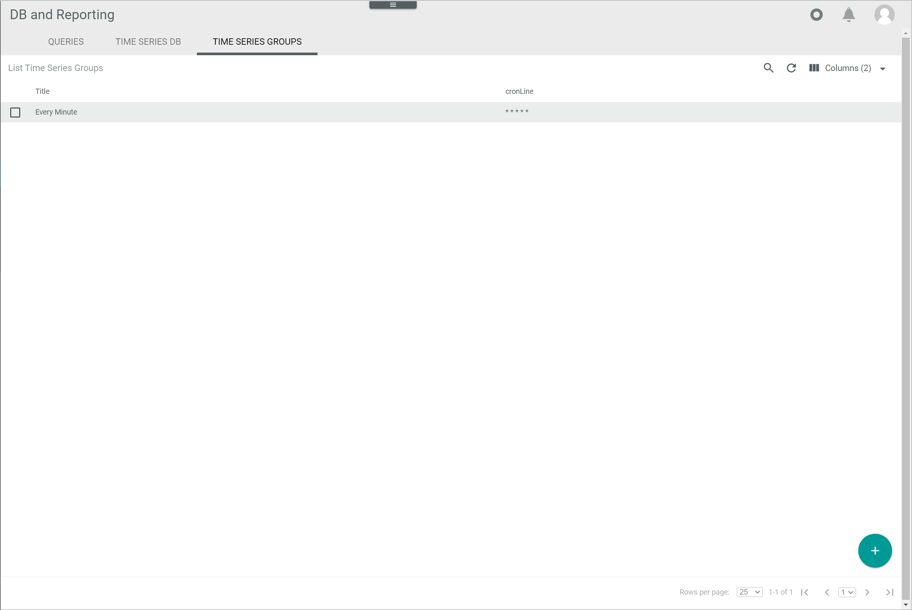

[!!Manage the time series groups](../Integration/06_ManageTimeSeriesGroups.md)

#  Time series groups

*Database and reporting > Managed queries > Tab TIME SERIES GROUPS*

**List of time series groups**

-  (Search)   
    Click this button to display the search bar and search for a time series group. 

-  (Refresh)   
    Click this button to update the list of time series groups. 

-  Columns (x)   
    Click this button to display the columns bar and customize the displayed columns and the order of columns in the list. The *x* indicates the number of columns that are currently displayed in the list.

- [x]     
    Select the checkbox to display the editing toolbar. If you click the checkbox in the header, all time series groups in the list are selected.

- [EXECUTE]  
    Click this button to execute the selected time series group immediately, that is, without waiting for the next scheduled run. This button is only displayed if a single checkbox in the list of time series groups is selected.

- [EDIT]  
    Click this button to edit a selected time series group. This button is only displayed if a single checkbox in the list of time series groups is selected. The *Edit time series group* view is displayed, see [Edit time series group](#edit-time-series-group).

- [DELETE]  
    Click this button to delete a selected time series group. It is possible to delete several time series groups at once. This button is displayed if at least one checkbox in the list of time series groups is selected.

[comment]: <> (Julian: Funktioniert es so wie bei Queries?)

The list displays all time series groups. Depending on the settings, the displayed columns may vary. All fields are read-only. 

- *Title*  
    Description of the time series group.

- *CronLine*  
    Cron expression used to specify the time interval in which the time series group must be executed.

- *ID*  
    Time series group identification number. The ID number is automatically assigned by the system.

-  (Add)   
    Click this button to create a time series group. The *Create time series group* view is displayed, see [Create time series group](#create-time-series-group).  

## Create time series group

*Database and reporting > Managed queries > Tab TIME SERIES GROUPS > Button Add*

**Create time series group**

- *Title*  
    Enter a description for the time series group.

- *CronLine*  
    Enter a valid cron expression to specify the time interval in which the time series group must be executed.

- [SAVE]  
    Click this button to save the time series group. The *Create time series group* view is closed. The new time series group is displayed in the list of time series groups.

## Edit time series group

*Database and reporting > Managed queries > Tab TIME SERIES GROUPS > Select time series group*  
*Database and reporting > Managed queries > Tab TIME SERIES GROUPS > Select time series group checkbox > Button Edit*  

**Edit time series groups**

- *Title*  
    Click this field to edit the description of the time series group.

- *CronLine*  
    Click this field to edit the cron expression and specify the time interval in which the time series group must be executed.

- [SAVE]  
    Click this button to save any changes made. The *Edit time series group* view is closed. All changes have been applied.