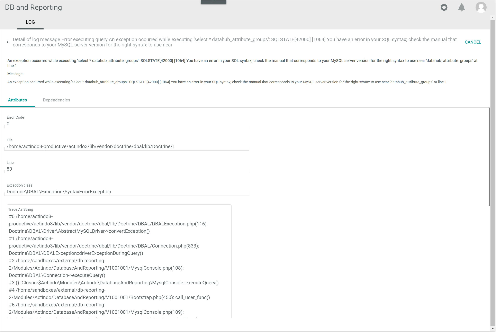

# Log

*Database and reporting > Logging > Tab LOG*

[comment]: <> (Sinnvollere Screenshots ziehen / ziehen lassen?)

**List of intents**

-  (Search)   
    Click this button to display the search bar and search for an intent.

-  (Refresh)   
    Click this button to update the list of intents.

-  Columns (x)   
    Click this button to display the columns bar and customize the displayed columns and the order of columns in the list. The *x* indicates the number of columns that are currently displayed in the list.

-  Filter (x)   
    Click this button to display the filter bar and customize the active filters. The *x* indicates the number of filters that are currently active.

- [x]     
    Select the checkbox to display the editing toolbar. You can only select one checkbox at a time.

- [ SHOW MESSAGE]  
    Click this button to display the selected intent. This button is only displayed if the checkbox of an intent is selected. Alternatively, you can click directly a row in the list to display the corresponding intent. The *List of messages* view is displayed, see [List of messages](#list-of-messages).

[comment]: <> (Checkbox -selection mode- Show message button rausnehmen? Standard UI auch geändert?)

The list displays all intents. Depending on the settings, the displayed columns may vary. All fields are read-only.

- *Name*  
    Name of the intent.

- *Number of messages*  
    Number of messages contained in the intent.

- *Created on*  
    Date and time of the creation.

- *Created by*  
    Name and username of the user who created the intent. 

- *Max log level of message*  
    Maximum log level of the message(s) contained in the intent. The following levels are available:
    - **Debug**
    - **Info**
    - **Notice**
    - **Warning**
    - **Error**
    - **Critical**
    - **Alert**
    - **Emergency**

- *ID*  
    Log identification number. The ID number is automatically assigned by the system.

- *Short preview*  
    First 30 characters of the log message.

- *Preview*  
    Complete log message.

## List of messages

*Database and reporting > Logging > Tab LOG > Select intent*

**List of messages**

-  (Back)   
    Click this button to close the *List of messages* view and return to the list of intents. 

-  (Search)   
    Click this button to display the search bar and search for a message.

-  (Refresh)   
    Click this button to update the list of messages.

-  Columns (x)   
    Click this button to display the columns bar and customize the displayed columns and the order of columns in the list. The *x* indicates the number of columns that are currently displayed in the list.

- [x]     
    Select the checkbox to display the editing toolbar. You can only select one checkbox at a time.

-  (Download)  
    Click this button to download the displayed log message.

-  (View)    
    Click this button to display the details of the log message. Alternatively, you can click directly a row in the list to display the details of the log message. The *Detail of log message "Log message title"* view is displayed, see [Detail of log message "Log message title"](#detail-of-log-message-log-message-title). 

[comment]: <> (Checkbox -selection mode-, Download und View button rausnehmen? Standard UI auch geändert?)

The list displays all log messages of the selected intent. Depending on the settings, the displayed columns may vary. All fields are read-only.

- *Title*  
    Title of the log message.

- *Log level*  
    Log level type. The following options are available:
    - **Debug**
    - **Info**
    - **Notice**
    - **Warning**
    - **Error**
    - **Critical**
    - **Alert**
    - **Emergency**

- *Created on*  
    Date and time of the creation.

- *Created by*  
    Name and username of the user who created the intent. 

- *Message*  
    Log message to the intent.

- *ID*  
    Log identification number. The ID number is automatically assigned by the system.

### Detail of log message "Log message title"

*Database and reporting > Logging > Tab LOG > Select intent > Select log message*

-  (Back)   
    Click this button to close the *Detail of log message "Log message title"* view and return to the list of messages. 

- [CANCEL]  
    Click this button to close the *Detail of log message "Log message title"* view.

- *Message*  
    Description of the log message.

### Detail of log message "Log message title" &ndash; Attributes

*Database and reporting > Logging > Tab LOG > Select intent > Select log message > Tab Attributes*

The *Attributes* tab displays further details of the selected log message. Depending on the attribute set of the log message, the displayed fields vary. All fields are read-only.

In general, the most common attribute sets are the standard error log message attribute set and the API communication attribute set. The fields of these sets are described in the following. Furthermore, it is possible to create a custom log message attribute set with different fields.

**Standard error log message attribute set**

- *Error code*  
    Error code number.

- *File*  
    Path of the file where the error has occurred.

- *Line*  
    Line in the file where the error has occurred.

- *Exception class*   
    Class name of the error. The error class describes the type of error that has occurred.

- *Trace as string*   
    Stack trace until the error has occurred. The stack trace lists the code until the error has occurred and is used to track the error.

- *Exception*   
    Detailed description of the error.

**API communication attribute set**

- *Code*   
    Http response status code. For detailed information about the http status codes, see [http status codes](https://www.rfc-editor.org/rfc/rfc9110#section-15).

- *Endpoint and method*   
    Http method of the API request and url endpoint to which the request was sent.

- *Request*   
    Http header and body of the request.

- *Response*   
    Http header and body of the response.

- *Exception*   
    Description of the error. An exception is only displayed if an error has occurred and a http status code of the **4xx** class, for instance a **404** code, has been returned.

### Detail of log message "Log message title" &ndash; Dependencies

*Database and reporting > Logging > Tab LOG > Select intent > Select log message > Tab Dependencies*

**Dependencies**

-  (Refresh)   
    Click this button to update the list of the entity dependencies.

-  Columns (x)   
    Click this button to display the columns bar and customize the displayed columns and the order of columns in the list. The *x* indicates the number of columns that are currently displayed in the list.

- [x]     
    Select the checkbox to display the editing toolbar. If you click the checkbox in the header, all dependent entities in the list are selected. If no dependency exists for the message, the *No other entities depend on this entity* notice is displayed.

The list displays all dependencies of the selected entity. Depending on the settings, the displayed columns may vary. All fields are read-only. 

- *Dependent entity ID*   
    Identification number of the dependent entity.

- *Dependent entity type*   
    Type of the dependent entity. The available types depend on the installed plugins.

- *Change tracking mode*   
    Change tracking mode (ETL mode) of the dependent entity. The following options are available:
    - **Manual**
    - **Semiautomatic**
    - **Semiautomatic, changes must be confirmed by another user**   
    - **Automatic**

- *Dependent entity friendly identifier*   
    Further, more descriptive identifier of the dependent entity, for instance the SKU number or a bill number.

- [RERUN MAPPING]   
    Click this button to rerun the mapping of the selected entity. This button is only displayed if the checkbox of at least one dependency is selected.

