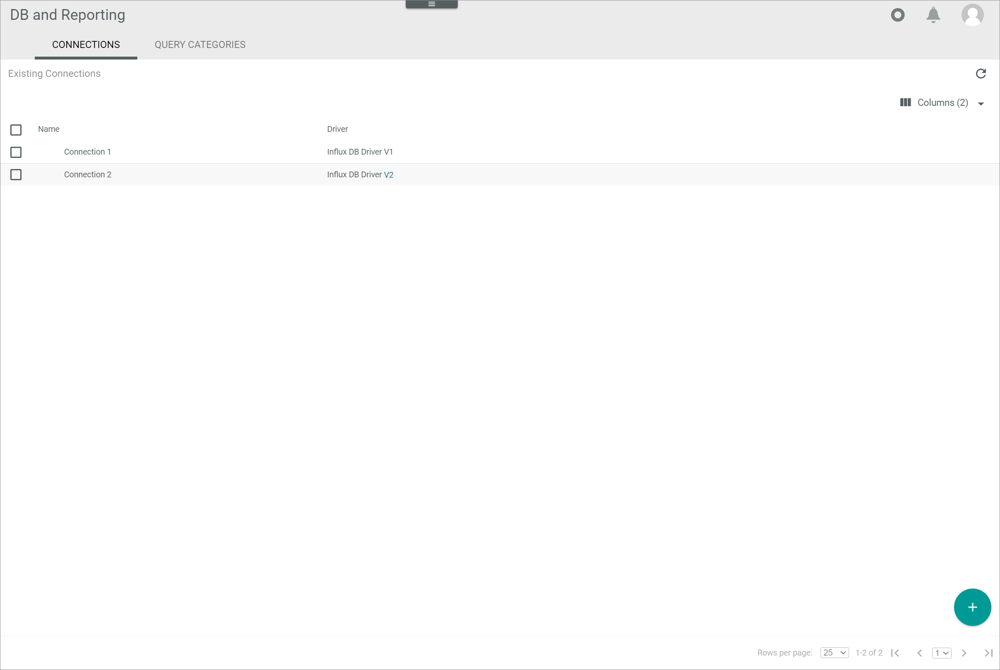
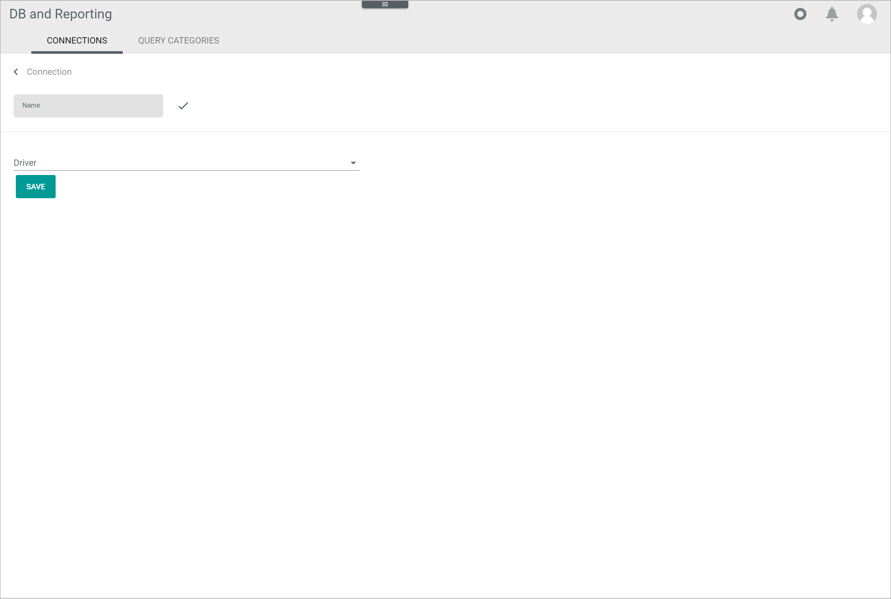
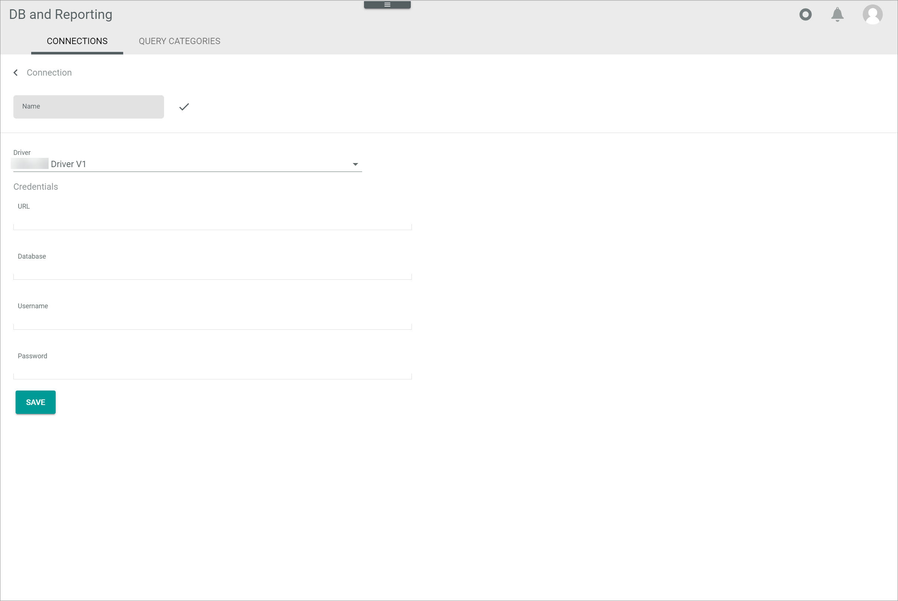
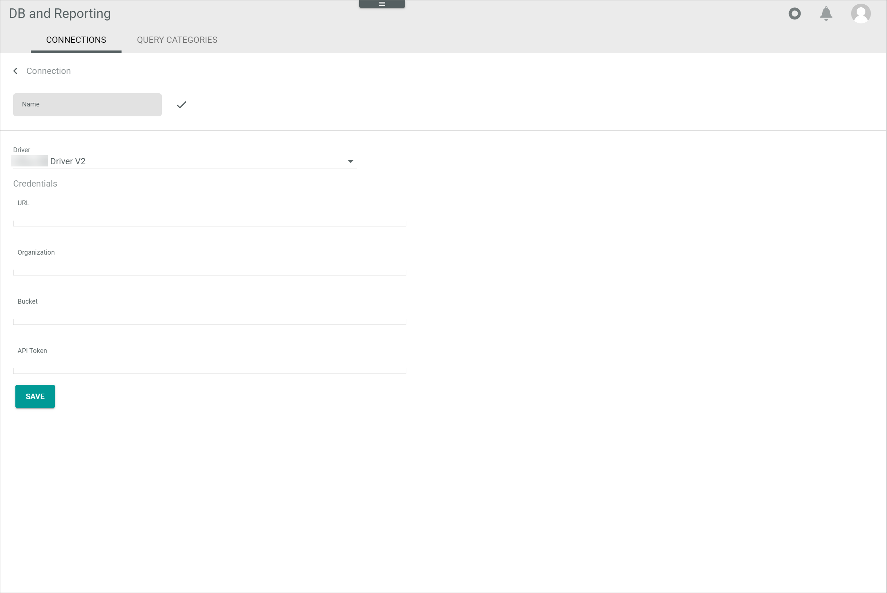
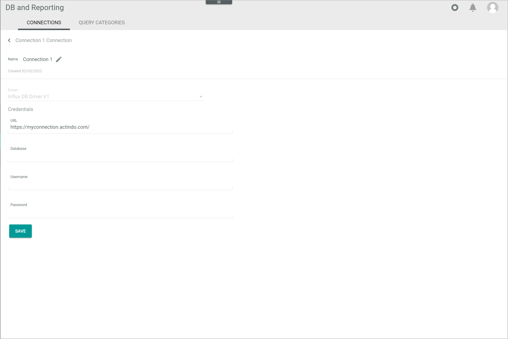
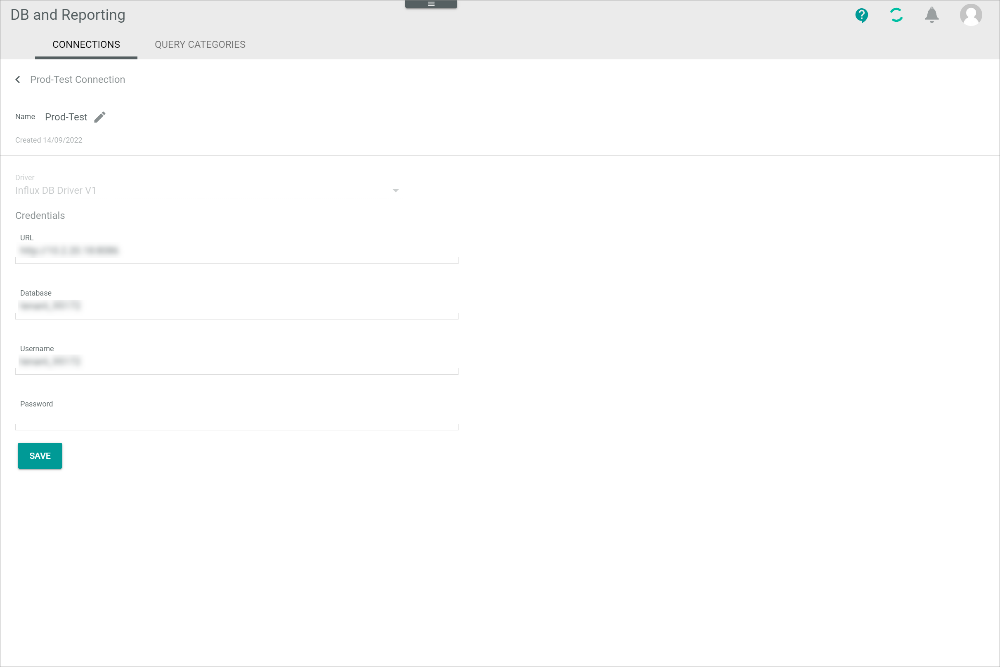
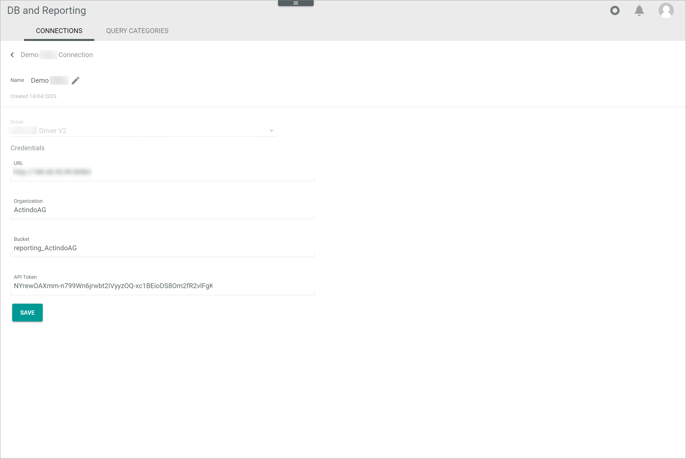

[!!Manage the connections](../Integration/04_ManageConnections.md)
[!!Manage the user rights](../Integration/05_ManageUserRights.md)

# Connections

*Database and reporting > Settings > Tab CONNECTIONS*

**Connections**

-  (Refresh)   
    Click this button to update the list of connections.

-  Columns (x)   
    Click this button to display the columns bar and customize the displayed columns and the order of columns in the list. The *x* indicates the number of columns that are currently displayed in the list.

- [x]     
    Select the checkbox to display the editing toolbar. If you click the checkbox in the header, all connections in the list are selected.

-  (Edit)  
    Click this button to edit the selected connection. This button is only displayed if a single checkbox in the list of connections is selected. Alternatively, you can click directly a row in the list to edit a connection. The *Edit connection* view is displayed, see [Edit connection](#edit-connection).

The list displays all available connections. Depending on the settings, the displayed columns may vary. All fields are read-only.

- *Name*  
    Connection name.

- *Driver*  
    Driver name. The following options are available:
    - **InfluxDB&trade;[^1] driver V1**
    - **InfluxDB&trade; driver V2**

- *ID*  
    Connection identification number. The ID number is automatically assigned by the system.

-  (Add)  
    Click this button to add a connection. The *Create connection* view is displayed, see [Create connection](#create-connection).

## Create connection

*Database and reporting > Settings > Tab CONNECTIONS > Button Add*

-  (Back)   
    Click this button to close the *Create connection* view and return to the list of connections. All changes are rejected.

- *Name*   
    Enter a connection name.

-  (Apply)  
    Click this button to apply the entered connection name. This button is only displayed if the connection name has not yet been confirmed. 

-  (Edit)  
    Click this button to edit the connection name. This button is only displayed if the connection name has been confirmed. 

- *Driver*  
    Click the drop-down list and select the desired driver version. The following options are available:
    - **InfluxDB&trade; driver V1**
    - **InfluxDB&trade; driver V2**
      
    > [Info] The drivers V1 and V2 are preinstalled in the *Database and reporting* module.

    Once a driver is selected, the *Credentials* section is displayed below the *Driver* drop-down list.

**Credentials**

The fields displayed in the *Credentials* section vary depending on the selected driver version. For a detailed description of this section and the corresponding functions, see the applicable interface: 
  - [Create connection &ndash; Credentials driver V1](#create-connection-–-credentials-driver-v1)   
  - [Create connection &ndash; Credentials driver V2](#create-connection-–-credentials-driver-v2) 
    

## Create connection &ndash; Credentials driver V1

*Database and reporting > Settings > Tab CONNECTIONS > Button Add > Select driver V1*

- *URL*  
    Enter your URL path.

[comment]: <> (Julian: Ist das die URL der aktuellen Instanz oder der InfluxDB database?)

- *Database*  
    Enter your database identifier.

- *Username*  
    Enter your username.

- *Password*  
    Enter your password.

- [SAVE]  
    Click this button to save the connection.

    

## Create connection &ndash; Credentials driver V2

*Database and reporting > Settings > Tab CONNECTIONS > Button Add > Select driver V2*

- *URL*  
    Enter your URL path.

[comment]: <> (Julian: Ist das die URL der aktuellen Instanz oder der InfluxDB database?)

- *Organization*  
    Enter your organization name.

- *Bucket*  
    Enter your database identifier.

- *API token*  
    Enter your API token.

- [SAVE]  
    Click this button to save the connection.

## Edit connection

*Database and reporting > Settings > Tab CONNECTIONS > Select a connection*

-  (Back)   
    Click this button to close the *Edit connection* view and return to the list of connections. All changes are rejected.

- *Name*   
    Connection name.  

-  (Edit)  
    Click this button to edit the connection name.

-  (Apply)  
    Click this button to apply the changes to the connection name. This button is only displayed if you are editing the connection name.

- *Created DD/MM/YYYY*  
    Creation date of the connection. This field is read-only.  

- *Driver*  
    Selected driver name. This drop-down list is read-only.

    The fields displayed in the *Credentials* section vary depending on the selected driver version. For a detailed description of this section and the corresponding functions, see the applicable interface: 
    - [Edit connection &ndash; Credentials driver V1](#edit-connection-–-credentials-driver-v1)   
    - [Edit connection &ndash; Credentials driver V2](#edit-connection-–-credentials-driver-v2) 
    

## Edit connection &ndash; Credentials driver V1

*Database and reporting > Settings > Tab CONNECTIONS > Select a connection with driver V1*

**Credentials** 

- *URL*  
    Click this field to edit your URL path.

- *Database*  
    Click this field to edit your database identifier.

- *Username*  
    Click this field to edit your username.

- *Password*  
    Click this field to edit your password.

- [SAVE]  
    Click this button to save any changes made.

## Edit connection &ndash; Credentials driver V2

*Database and reporting > Settings > Tab CONNECTIONS > Select a connection with driver V2*

**Credentials** 

- *URL*  
    Click this field to edit your URL path.

- *Organization*  
    Click this field to edit your organization name.

- *Bucket*  
    Click this field to edit your database identifier.

- *API token*  
    Click this field to edit your API token.

- [SAVE]  
    Click this button to save any changes made.

    

[^1]: **Disclaimer:** InfluxDB&trade; is a trademark owned by InfluxData, which is not affiliated with, and does not endorse, this site.  