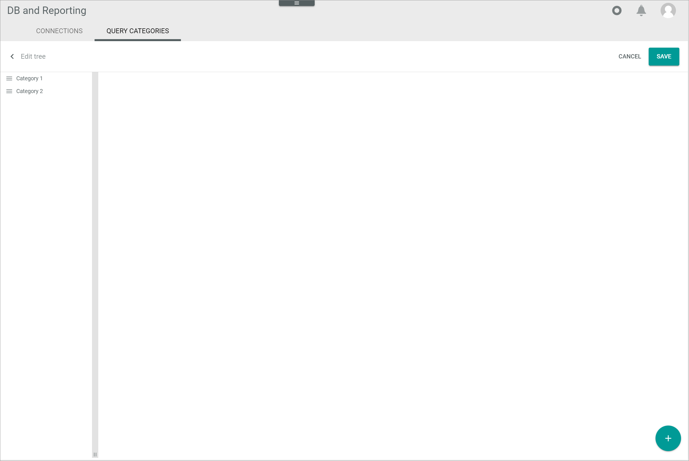

[!!Manage the query categories](../Integration/02_ManageQueryCategories.md)
[!!Manage the user rights](../Integration/05_ManageUserRights.md)

# Query categories

*Database and reporting > Settings > Tab QUERY CATEGORIES*

**Edit tree**

-  (Back)   
    Click this button to go back to the top level of the tree structure. 

- [CANCEL]   
    Click this button to cancel editing the tree structure. Any open element is closed. All changes are rejected. 

- [SAVE]   
    Click this button to save all changes. The *Submitting data* view is displayed while saving. The changes are displayed in the tree structure.

-  (Add)   
    Click this button to add a query category or sub-category. A plus sign is displayed in each displayed column. Click the plus sign in the desired column to add a new query category or sub-category to the selected column. The *Add element* window is displayed, see [Add element](#add-element).    

    > [Info] If you add a query category, a second column is displayed. When you click the button  (Add) again, you can also create a query sub-category in the second column. Each time you add a new query sub-category, the next column is displayed. You can add an unlimited number of query sub-categories in an unlimited number of levels. 

The following buttons and fields are only displayed when you have added a query category.

-  (Sort)   
    Click and hold this button to move the selected query category to another position in the list using drag and drop.

[comment]: <> (Sorting geht nicht)

-  (Edit)   
    Click this button to edit the selected query category. The *Edit query category data* window is displayed, see [Edit query category data](#edit-query-category-data). This button is only displayed if you hover over the query category.

- First level query category   
    Top level query category. Click the query category to display the second level column and all assigned query sub-categories. Hover over the query category to display the  (Edit) button.

- Second level query category   
    Query sub-category to the selected first level query category. Click the query category to display the third level column and all assigned query sub-categories. Hover over the query category to display the  (Edit) button.

- x level query category   
    Query sub-category to the selected query category. Click the query category to display the next lower level column and all assigned query sub-categories. Hover over the category to display the  (Edit) button.

## Add element

*Database and reporting > Settings > Tab QUERY CATEGORIES > Button Add*

> [Info] The *Add element* window for query categories and sub-categories is identical.

- Language   
    Click the drop-down list and select the system language in which the *Name (Language)* and *Description (Language)* fields are displayed. By default, the following options are available:
    - **English (United States)**
    - **Deutsch (Deutschland)**

- *Name (Language)*   
    Enter a query category name in the selected language.

- *Key*   
    Enter a query category key. The number of characters is limited to 190.

[comment]: <> (Julian: Sollte Key hier schon raus?)

- [CANCEL]   
    Click this button to cancel adding a query category. The *Add element* window is closed.

- [SAVE]   
    Click this button to add the new query category. The *Add element* window is closed.

    > [Info] You have to click the [SAVE] button in the *Edit tree* view to save the added query categories.

## Edit query category data

*Database and reporting > Settings > Tab QUERY CATEGORIES > Hover over query category > Button Edit*

> [Info] The *Edit query category data* window for query categories and sub-categories is identical.

- Language   
    Click the drop-down list and select the system language in which the *Name (Language)* and *Description (Language)* fields are displayed. By default, the following options are available:
    - **English (United States)**
    - **Deutsch (Deutschland)**

- *Name (Language)*   
    Click the field to edit the query category name in the selected language.

- *Key*   
    Click the field to edit the query category key. The number of characters is limited to 190.

[comment]: <> (Julian: Sollte Key hier schon raus?)

-  (Delete)   
    Click this button to remove the selected query category.

    > [Info] You must click the [SAVE] button in the *Edit tree* view to permanently delete the query category.

    > [Caution] Be aware that as soon as you delete a query category, you also delete all assigned query sub-categories.

- [CANCEL]   
    Click this button to cancel editing the query category. The *Edit query category data* window is closed.

- [SAVE]   
    Click this button to save any changes to the query category. The *Edit query category data* window is closed.

    > [Info] You have to click the [SAVE] button in the *Edit tree* view to save the changes. Otherwise, all changes are rejected.
