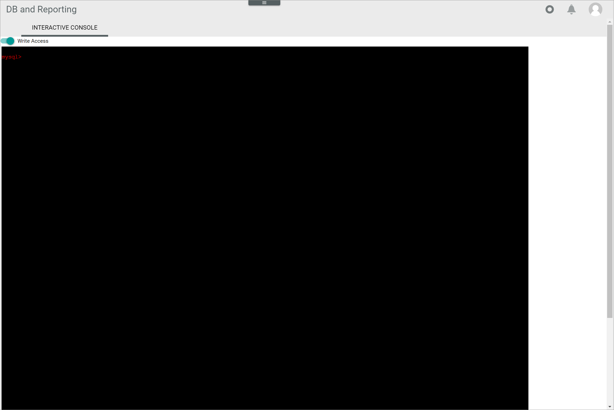

[!!Manage the user rights](../Integration/05_ManageUserRights.md)
[!!Execute queries in MySQL console](../Operation/02_ExecuteQueriesMySQLConsole.md)

# Interactive console

*Database and reporting > My SQL console > Tab INTERACTIVE CONSOLE*

-  Write Access   
    Enable this toggle to activate the write access. A warning message is displayed, see [Warning](#warning). When this toggle is disabled, the SQL queries are read-only. By default, the toggle is disabled.

- mysql>  
    Enter your SQL query following the interactive command prompt and press the **ENTER** key to execute it. The results are presented in an ASCII table format in the interactive console.  

## Warning

*Database and reporting > My SQL console > Tab INTERACTIVE CONSOLE > Enable toggle Write access*

- [OK]   
    Click this button to confirm the write access activation. The *Warning* window is closed. The text in the interactive console turns red. Now it is possible to execute SQL queries with write operations in the interactive console.

## Interactive console with write access

*Database and reporting > My SQL console > Tab INTERACTIVE CONSOLE > Enable toggle Write access > Confirm warning message*

-  Write Access   
    Disable this toggle to deactivate the write access. When this toggle is disabled, the SQL queries are read-only. When this toggle is enabled, SQL queries with write operations can be executed.

- mysql>  
    Enter your SQL query following the interactive command prompt and press the **ENTER** key to execute it. The results are presented in an ASCII table format in the interactive console.  

