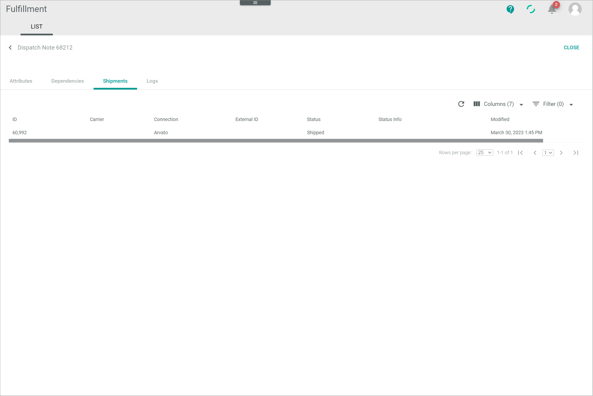
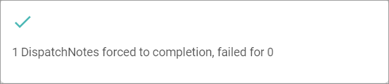

# Screenshot in an expandable area

Dispatch notes are shipment requests generated by the system when a delivery note has been issued in the *Order management* module. The dispatch note is than sent to the order fulfiller, who will in turn arrange the shipment.

The communication between the *Actindo Core1 Platform* and the fulfiller's internal system takes place via a connection driver. The *Actindo Core1 Platform* sends the fulfiller the information they need based on the information provided in the delivery note. The delivery note and the dispatch note have been previously mapped via the ETL function in the *DataHub* module. The fulfiller, on the other hand, sends back a confirmation message to update the shipment status accordingly during all stages of the fulfillment process.   

The *Fulfillment* module works together with the *Workflows* module. Once the *Fulfillment* module has been configured, a workflow must be created for the corresponding business process, which runs automatically in the *Workflows* module. The *Fulfillment* module is designed to monitor the fulfillment process but not to steer it. For this purpose, the *Workflows* module should be used, see [Workflows](../ActindoWorkFlow/Overview/01_General.md).

## Check a dispatch note

A dispatch note provides numerous order-related details, which may vary depending on the connection settings. The following order-related details, among others, can be checked in the list of dispatch notes.

#### Prerequisites

- At least one connection has been created, see [Create a connection](../Integration/01_ManageConnections.md#create-a-connection).
- At least one dispatch note has been created.

#### Procedure

*Fulfillment > Dispatch notes > Tab LIST*

Click to see the screenshot

1. Check the dispatch note status in the *Status* column. The status displays the current stage in the fulfillment process. The following options are available:  
    - **New dispatch note**  
        The dispatch note has been newly created.
    - **Transferred to partner**  
        The dispatch note has been transferred to the fulfiller but no receival has been confirmed. If the fulfiller has not  received the dispatch note, it may be necessary to re-export the dispatch note, see [Export a dispatch note](#export-a-dispatch-note).
    - **Partner confirmed receival**  
        The fulfiller has confirmed the receival of the dispatch note. The shipment status is subsequently updated by the fulfiller, see [Check the shipment status](./02_CheckShipment.md#check-the-shipment-status). 
    - **Dispatch note completed**  
        The dispatch note has been processed.
    - **Error**  
        The dispatch note has has not been processed as an error occurred, for instance, because the export has failed. 
    - **Void**  
        The dispatch note is void. This is the case, for instance, if the order has been canceled.

        > [Info] In the *Logging* menu entry, the list of messages generated in the communication process between the *Actindo Core1 Platform* and the fulfiller's system with further information on the dispatch note status is displayed, see [Logging](../UserInterface/02a_Connections.md).

2. Check the dispatch note number in the *Document number* column. The document number equals the delivery note number and can be useful to find further order-related details in the *Order management* module.

3. Check the order number in the *Description* column. The order number is a user-defined field. It can be useful to find further order-related details in the *Order management* module.

4. Check the packaging type identification number in the *Packaging type* column.    

    > [Info] The packaging types are defined in the *PACKAGING TYPES* tab of *Settings* menu entry and provide detailed information on the packaging used for the shipment, the shipping type, and the ship-to country, among others. For detailed information, see [Packaging types](../UserInterface/03b_PackagingTypes.md).  

5. Check the shipment status in the *Shipment status* column. For further information, see [Check the shipment status](./02_CheckShipment.md#check-the-shipment-status).

6. If desired, click the  (Columns) button to add further details to the list of dispatch notes. 

    > [Info] Additional information can be displayed depending on the attributes mapped via the fulfiller's driver when establishing the connection. 

## Complete a dispatch note

The fulfillers may not notify if an order has been delivered. In this case, the dispatch note status is not automatically updated to **completed**. To provide a better overview and handling of the dispatch note list, the dispatch note status can be updated manually if necessary. It is also possible to update the status of several dispatch notes at once.

#### Prerequisites

- The shipment has been delivered.
- The dispatch note status is **Partner confirmed receival** and the shipment status is  (In progress) in the list of dispatch notes. 
- The status of all shipments in the dispatch note in the *Shipments* sub-tab of the *Dispatch note "Dispatch note ID"* view is **Shipped**.

#### Procedure

*Fulfillment > Dispatch notes > Tab LIST*

Click to see the screenshot

1. Click the dispatch note whose status has not been updated.  
    The *Dispatch note "Dispatch note ID"* view is displayed.

2. Click the *Shipments* sub-tab.  
    All shipments included in the dispatch note are displayed.

    

3. Verify that the status of all shipments is **Shipped**.

4. Click the  (Back) button in the upper left corner.   
   The *Dispatch note "Dispatch note ID"* view is closed and the list of dispatch notes is displayed again. 

5. Click the checkbox of the dispatch note(s) to be completed.   
    The editing toolbar is displayed.

6. Click the [FORCE COMPLETION] button in the editing toolbar.  
    The *"x DispatchNotes forced to completion, failed for x"* notice is displayed.

    > [Info] The *x* indicates the number of dispatch notes that have been completed or that have failed. A manual completion will only fail if the status of any shipment in the dispatch note is not **Shipped**.

    

    The dispatch note status in the *Status* column changes to **Dispatch note completed** and the shipment status in the *Shipment status* column changes to  (Double check). The status of all shipments in the dispatch note is updated to **Delivered**.    

## Export a dispatch note

You can re-export a dispatch note to the fulfiller if the receival has failed in the partner's system. Nevertheless, this procedure should be carefully used, as some destination systems may not be able to manage a re-export of data. Besides, dependent processes in the *Actindo Core1 Platform* must be considered. 

#### Prerequisites

- A dispatch note has been created and sent.
- The dispatch note status is **Transferred to partner**.
- The shipment status is  (No shipment).

#### Procedure

*Fulfillment > Dispatch notes > Tab LIST*

Click to see the screenshot

1. Click the checkbox of the dispatch note to be re-exported.   
    The editing toolbar is displayed.

2. Click the [EXPORT] button.   
    The *Confirm selection* confirmation window is displayed.

    

3. Click the [EXPORT] button in the *Confirm selection* confirmation window.  
    The *Really?* confirmation window is displayed.

    

4. Click the [EXPORT] button in the *Really?* confirmation window.  
    The dispatch note has been re-exported to the fulfiller.

  