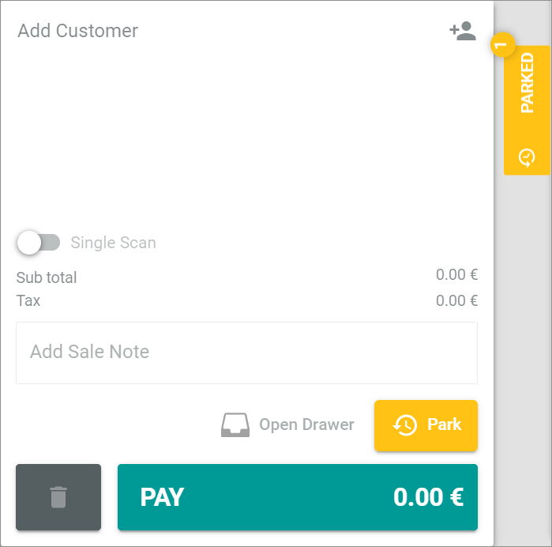
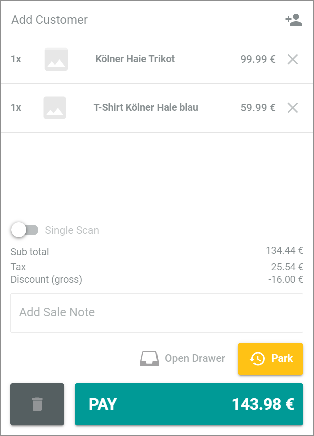
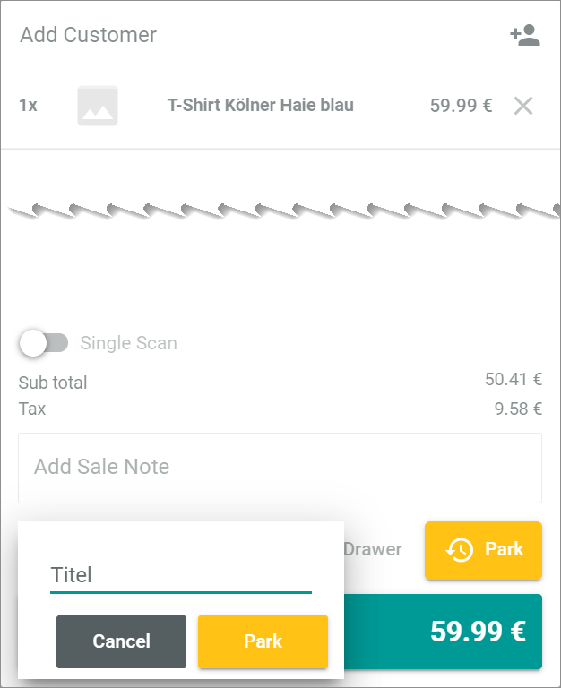
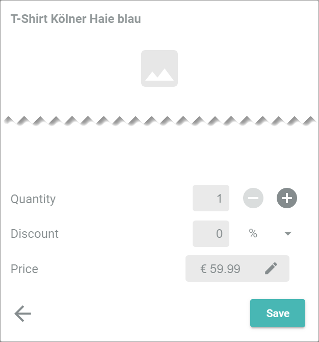
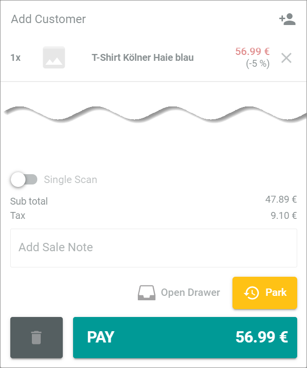
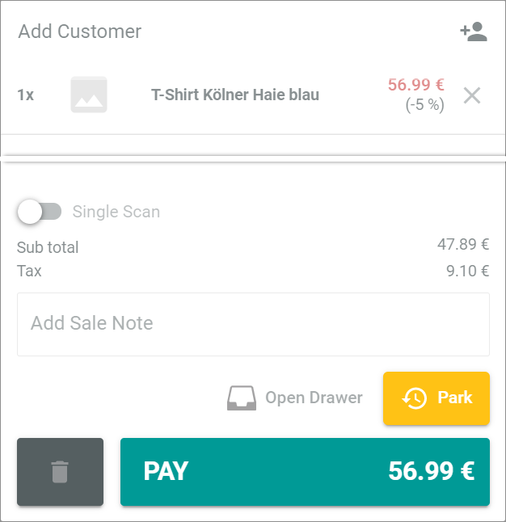
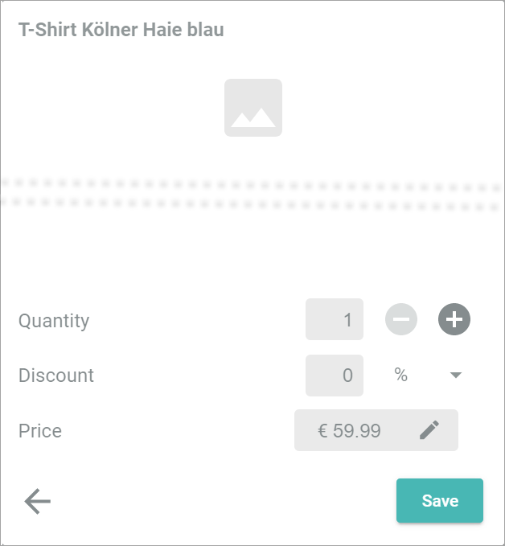
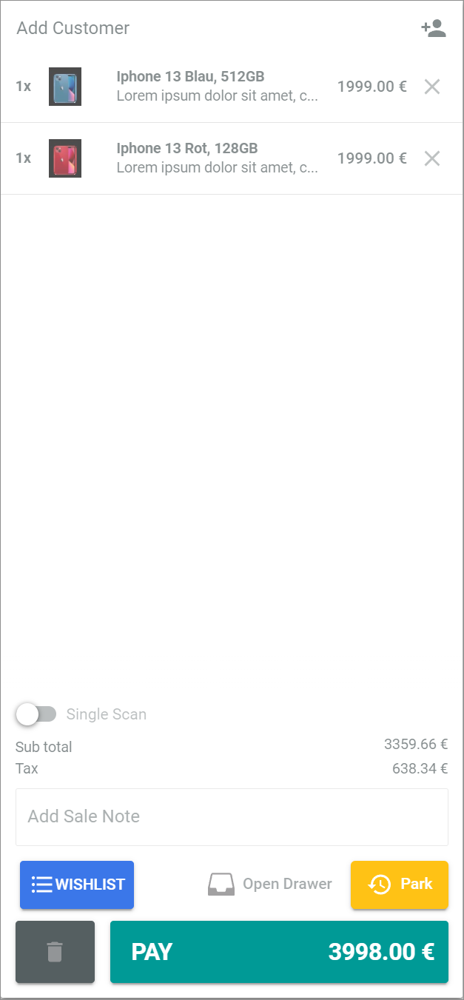
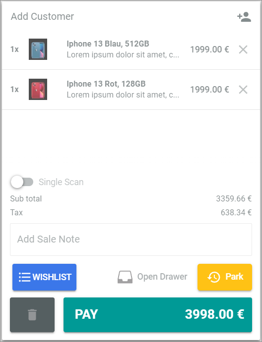

# Ausschneiden von leeren Screen-Bestandteilen

Beispiele, wie man leere Screen-Bestandteile ausschneiden kann, wenn sich unten noch Buttons befinden, die mit auf das Bild müssen. 

## Original

## Ausgeschnitten

**Horizontal**

**Horizontal fade**

**Horizontal saw**

**Horizontal sharktooth**

**Horizontal tear**

**Horizontal wave**

**Horizontal with separation line**
> white line with shadow

**Horizontal with double separation line**
> white broken line with shadow

**Screenshot from big screen**

**Screenshot from laptop screen**

**Snag it docu**

Note: For Cut Out quick styles with straight edges, Snagit seamlessly stitches the sections together. For other edge styles, Snagit leaves a gap. The size of the gap is not editable.

