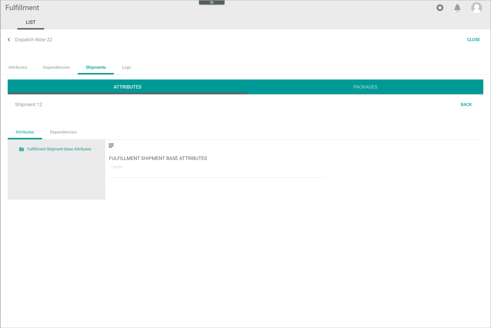

# All parts that have been deleted

**LIST**  

The *Dispatch notes* menu entry offers an overview of all dispatch notes processed by the system. It also allows the possibility to check the dispatch note status and the corresponding shipment status, among others.

*Fulfillment > Dispatch notes > Tab LIST*

**Dispatch notes**

The *Dispatch notes* LIST tab contains a list view. For detailed information on creating and maintaining a view, see LINK in the *Actindo Core1 Platform* documentation.

The following further functions are available in the list header of the dispatch notes:       

- *Connections*   
    Click the drop-down list to select a connection. The following options are available:
    - **All connections**  
        Select this option to display the dispatch notes for all configured connections. 
    - **Connection name**  
        Select this option to display the dispatch notes for the selected connection. When a specific connection has been selected, the **All connections** option is no longer displayed. Click the selected connection again to deselect it.    

The following functions are available in the editing toolbar:
- [x]     
    Select the checkbox to display the editing toolbar. If you click the checkbox in the header, all dispatch notes in the list are selected.

- [VIEW]  
    Click this button to view a dispatch note. This button is only displayed if a single checkbox in the list of dispatch notes is selected. Alternatively, you can click directly a row in the list to view the corresponding dispatch note. 
    The *Dispatch note "Dispatch note ID"* view is displayed, see [Dispatch note](#dispatch-note). The *Attributes* tab is preselected.

- [EXPORT]  
    Click this button to export a dispatch note to the fulfiller. This button is displayed if the checkbox of at least one dispatch note is selected.

    > [Info] The dispatch note is exported automatically by the system. If the export fails, the dispatch note can be manually re-exported. For detailed information, see [Export a dispatch note](../Operation/01_ManageDispatchNotes.md#export-a-dispatch-note).

- [FORCE COMPLETION]  
    Click this button to complete a dispatch note. This button is displayed if the checkbox of at least one dispatch note is selected.   
    For detailed information, see [Complete a dispatch note](../Operation/01_ManageDispatchNotes.md#complete-a-dispatch-note). 

**Status information fields**   
The list displays all dispatch notes. Depending on the settings, the displayed columns may vary. All fields are read-only. The following status information fields are available:

- *Status*  
    Dispatch note status. The following statuses are available:  
    - **New dispatch note**  
        The dispatch note has been newly created.
    - **Transferred to partner**  
        The dispatch note has been transferred to the fulfiller.
    - **Partner confirmed receival**  
        The fulfiller has confirmed receival of the dispatch note.
    - **Dispatch note completed**  
        The dispatch note has been completed.
    -  **Error**  
        The dispatch note has given an error while exporting.
    - **Void**  
        The dispatch note is void, for instance, because of an order cancellation.

- *Shipment status*  
    Status of shipment associated with the dispatch note. The following options are available:
    -  (Cross)   
        No shipment has been performed yet.  
    -  (Circular arrows)   
        The shipment is in progress.   
    -  (Double check)    
        The shipment has been delivered.
    -  (Error)    
        The fulfiller has reported a shipment error.
    - Empty  
        No information on the shipment status has been received from fulfiller.   

- *Status ID*  
  Dispatch note status identifier. The following options are available:
    - **new**  
        The dispatch note has been newly created.
    - **transferred**  
        The dispatch note has been transferred to the fulfiller.
    - **confirmed**  
        The fulfiller has confirmed receival of the dispatch note.
    - **completed**  
        The dispatch note has been completed.
    - **error**  
        The dispatch note has given an error while exporting.
    - **void**  
        The dispatch note is void, for instance, because of an order cancellation.

- *Shipping type*  
    Type of shipment. The following options are available:  
    - **STND**  
        Standard shipping type.
    - **EXPR**  
        Express shipping type.

    > [Info] The shipping type can be set up in the *PACKAGING TYPES* tab in the *Settings* menu entry, see [Packaging types](./03b_PackagingTypes.md).

## Dispatch note &ndash; Attributes

*Fulfillment > Dispatch notes > Tab LIST > Select a dispatch note > Tab Attributes*

  
For detailed information, see LINK in the *DataHub* documentation. 

## Dispatch note &ndash; Dependencies

*Fulfillment > Dispatch notes > Tab LIST > Select a dispatch note > Tab Dependencies*

For detailed information, see LINK in the *DataHub* documentation.

## Dispatch note &ndash; Shipments

*Fulfillment > Dispatch notes > Tab LIST > Select a dispatch note > Tab Shipments*

The list displays all shipments. Depending on the settings, the displayed columns may vary. All fields are read-only.

- *ID*  
    Shipment identification number. The ID number is automatically assigned by the system.

- *Carrier*  
    Carrier identifier.

- *Connection*  
    Connection to fulfiller.

- *External ID*  
    Shipment identification number in the fulfiller's system. 

- *Status*  
    Shipment status. The following options are available:
    - **New shipment**
    - **Shipped**
    - **Delivered**
    - **Void**
    - **Error**
    - **Packed**

- *Status info*  
    Additional status information provided by the fulfiller. 

- *Created*  
    Date and time of the creation.

- *Modified*    
    Date and time of the last modification.

- *"Attribute name"*    
    You can add a column for each attribute that is assigned to the shipment. The column displays the attribute name, the row displays the corresponding attribute value of the shipment.

### Shipment attributes

*Fulfillment > Dispatch notes > Tab LIST > Select a dispatch note > Tab Shipments > Select a shipment > Sub-tab ATTRIBUTES*

Erklärung, was in den Shipment- Attribute steht.

### Shipment attributes &ndash; Attributes

*Fulfillment > Dispatch notes > Tab LIST > Select a dispatch note > Tab Shipments > Select a shipment > Sub-tab ATTRIBUTES > Tab Attributes*

For detailed information, see LINK in the *DataHub* documentation.

### Shipment attributes &ndash; Dependencies

*Fulfillment > Dispatch notes > Tab LIST > Select a dispatch note > Tab Shipments > Select a shipment > Sub-tab ATTRIBUTES > Tab Dependencies*

For detailed information, see LINK in the *DataHub* documentation.

### Shipment packages

*Fulfillment > Dispatch notes > Tab LIST > Select a dispatch note > Tab Shipments > Select a shipment > Sub-tab PACKAGES*

The list displays all packages contained in the selected shipment. Depending on the settings, the displayed columns may vary. All fields are read-only.

- *Packaging type*  
    Packaging type name. Packaging types can be defined in the *PACKAGING TYPES* tab of the *Settings* menu entry, see [Manage the packaging types](../Integration/02_ManagePackagingTypes.md).

- *Created*  
    Date and time of the creation.

- *Modified*  
    Date and time of the last modification.

- *ID*  
    Packaging type identification number. This number is automatically assigned by the system.

-  *Tracking number*  
    Package tracking number.

- *Tracking link*  
    Package tracking link.

- *Package ID*  
    Package identification number. This identifier is provided by the fulfiller.

- *Proof of delivery*  
    Proof of delivery in the form of link leading to the relevant data, such as a photo of the delivery location or a signed delivery receipt. 

- *"Attribute name"*    
    You can add a column for each attribute that is assigned to the shipment package. The column displays the attribute name, the row displays the corresponding attribute value of the shipment package.
    

#### Items

*Fulfillment > Dispatch notes > Tab LIST > Select a dispatch note > Tab Shipments > Select a shipment > Sub-tab PACKAGES > Select a package*

The list displays all items contained in the selected package. Depending on the settings, the displayed columns may vary. All fields are read-only.

- *Item number*  
    Item number in the package.

- *SKU*  
    Stock Keeping Unit. Identification number of the item.

- *Amount*  
    Amount of item units contained in the package.

- *Serial number*  
    Item serial number.

- *ID*  
    Item identification number. The ID number is automatically assigned by the system.

- *Unit net value*  
    Item unit net value.

- *Unit gross value*  
    Item unit gross value.

- *Total net value*  
    Item total net value.

- *Currency*  
    Item currency.

- *Dangerous goods indicator*  
    Indication whether the item has been classified as a dangerous product.

- *"Attribute name"*    
    You can add a column for each attribute that is assigned to the item. The column displays the attribute name, the row displays the corresponding attribute value of the item.

## Dispatch note &ndash; Logs

*Fulfillment > Dispatch notes > Tab LIST > Select a dispatch note > Tab Logs*

This tab displays an extract from the list of intents contained in the *CONNECTIONS* tab of the *Logging* menu entry. The intents displayed in this tab refer to the selected dispatch note. For a detailed description of this window and the corresponding functions, see [Connections (Logging)](./02a_Connections.md).

