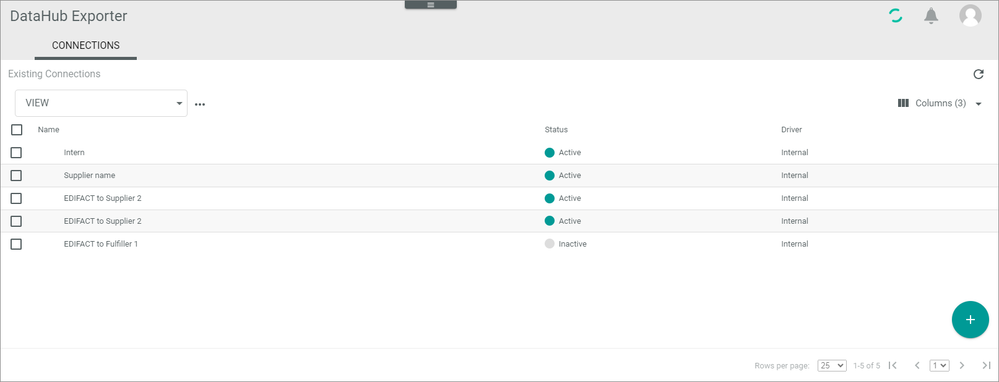
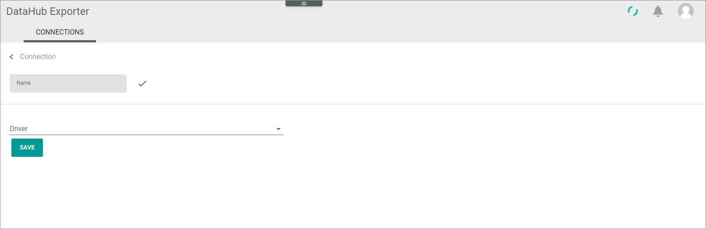
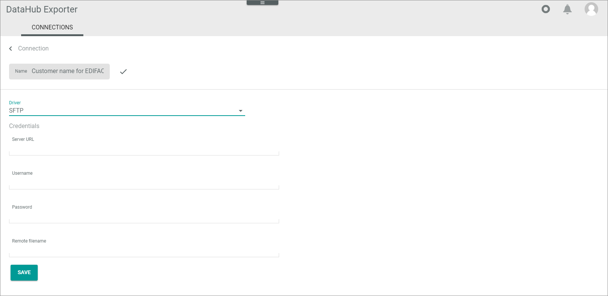
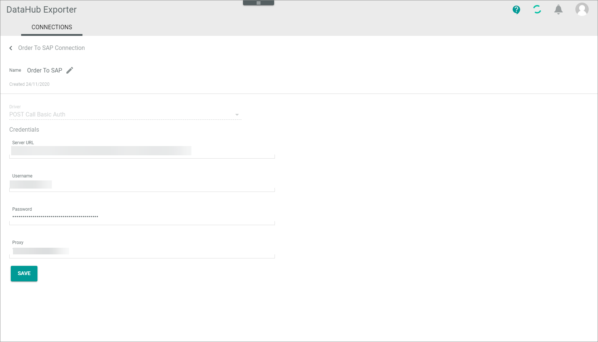

# Manage connections

Establish connections via drivers to connect your EDIFACT message receivers with the *Actindo Core1 Platform*. The drivers represent a specific internet protocol to transfer the data.   
In the following, the general settings to create, edit, enable, and disable connections for EDIFACT messages are described.

## Create connection

Create a connection to a certain EDIFACT message receiver. 

#### Prerequisites

- At least one driver has been installed.
- Check with your message receiver the protocol to be used.

#### Procedure

*DataHub Exporter > Settings > Tab CONNECTIONS*

1. Click the  (Add) button in the bottom right corner.   
    The *Create connection* view is displayed.

    

2. Enter a name for the connection in the *Name* field. It might be useful to choose a name that contains a precise description of the purpose, so that you have more flexibility for further connection names, for example, "EDIFACT to [supplier]". 

3. Click the *Driver* drop-down list and select the driver/protocol your business partner require. For EDIFACT messages, in most cases, the SFTP or the AS2 drivers are required.   
    The following drivers are available in the standard:    
        - SFTP   
        - Internal  
        - POST call   
        - Output
    > [Info] For the AS2 (Applicability Statement 2) protocol, the *AS2Transport* plugin is available in the *Core1 Platform*. Contact your MPS consultant if your business partner requires this protocol.
     
    The *Credentials* section is displayed below the *Driver* field.

    

    > [Info] Depending on the selected driver, the fields in the *Credentials* section differ.

4. Enter the required data in the *Credentials* section fields. Use the information you received from the business partner to fill the credentials.

5. Click the [SAVE] button.   
    The connection will be established. The *Checking credentials...* notice is displayed. After a few seconds, the *Sync triggered successfully* window is displayed.  
    The *Connections* view is displayed, the newly created connection is added. After successful synchronization, the entry is activated automatically. You may have to refresh the application to see the *Active* status.

 6. If necessary, click the  (Refresh) button to update the list of connections.   
    The status of the connection in the *Status* column has switched to **Active**.

## Edit connection

Edit a connection to adjust any changed credentials, the connection name, or further settings. The driver selection is read-only and cannot be edited.

#### Prerequisites

At least one connection has been created, see [Create a connection](#create-a-connection).

#### Procedure

*DataHub Exporter > Settings > Tab CONNECTIONS*

1. Click the connection you want to edit in the list of connections.   
    The *Edit connection* view is displayed.

    

2. Edit the required data of the connection in the corresponding fields.

4. Click the [SAVE] button.   
    The *Checking credentials...* notice is displayed. The *Edit connection* view is automatically closed when the changes have been saved. The *Connections* view is displayed again.

## Enable connection

A connection can only be used if it is active. Otherwise, no data is being synchronized via the connection. If a connection has been disabled, it can be enabled again. It is possible to enable several connections at a time.

#### Prerequisites

- At least one connection has been established, see [Create connection](#create-connection).
- At least one connection is inactive, see [Disable connection](#disable-connection).

#### Procedure

*DataHub Exporter > Settings > Tab CONNECTIONS*

1. Select the checkbox of the connection you want to enable in the list of connections.   
    The editing toolbar is displayed above the list of connections.

2. Click the [ENABLE] button in the editing toolbar.   
    The connection has been activated.

3. If necessary, click the  (Refresh) button to update the list of connections.   
    The status of the enabled connection in the *Status* column has switched to **Active**.

## Disable connection

Once a connection has been established, it cannot be deleted because potential dependencies. Nevertheless, you can disable a connection if you no loner use it. You can disable several active connections at a time.

#### Prerequisites

- At least one connection has been established, see [Create a connection](#create-a-connection).
- At least one connection is active, see [Enable a connection](#enable-a-connection).

#### Procedure

*DataHub Exporter > Settings > Tab CONNECTIONS*

1. Select the checkbox of the connection you want to disable in the list of connections.   
    The editing toolbar is displayed above the list of connections.

2. Click the [DISABLE] button in the editing toolbar.   
    The connection has been deactivated.

3. Click the  (Refresh) button to update the list of connections.   
    The status of the disabled connection in the *Status* column has switched to **Inactive**.

## Synchronize connection

Once a connection has been established, it can be synchronized, if necessary.

#### Prerequisites

- At least one connection has been established, see [Create connection](#create-connection).
- At least one connection is active, see [Enable connection](#enable-connection).

#### Procedure

*DataHub Exporter > Settings > Tab CONNECTIONS*

1. Select the checkbox of the connection you want to synchronize in the list of connections.   
    The editing toolbar is displayed above the list of connections.

2. Click the [SYNCHRONIZE] button in the editing toolbar.   
    A confirmation message is displayed.

