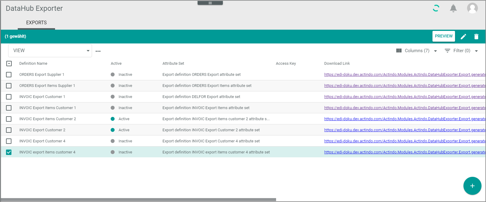
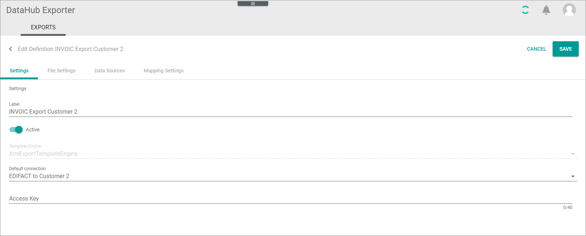

[!!Exports](../UserInterface/01a_Exports.md)

# Manage definitions 

In Actindo, the definition of the EDIFACT export messages specifies the following:
- Basic settings with template engine and connection to be used
- File settings with the message structure and related attributes   
- Data sources with attribute mappings  
- Mapping settings

Each EDIFACT export message requires two definitions in the *DataHub Exporter* module for each business partner and EDIFACT message:
- Definition for the message header   
    Figuratively speaking, the message header is the envelope, with which the message is sent. It contains general data such as receiver/sender information and dates. 
    
- Definition for the line items  
    The line item section includes a list of individual items of the message, such as required information for each product that is part of an invoice. It is necessary to have a specific definition for the line items because they require other data sources than the message header.  
    The *DataHub Exporter* processes the EDIFACT line items group for each line item of a business document.  

Note that this chapter is valid both for the definition of the header and the line items. Do not start with the line item definition before you have prepared the line item export. For detailed information, see [Prepare line item export](./02_ManageHeaderFileSett.md#prepare-line-item-export).

## Create basic definition settings
Define basic data for the export definition. You must define a definition setting for both the header and the line items of a message.

#### Prerequisites

- At least one connection has been created, see [Create connection](../Integration/01_ManageConnections.md#create-connection).
- Before creating the definition for the line items, you have prepared the line item export, see [Prepare line item export](./02_ManageHeaderFileSett.md#prepare-line-item-export).

#### Procedure

*DataHub Exporter > Exports*

1. Click the  (Add) button in the bottom right corner.   
    The *Create definition* view is displayed.

    

2. Enter a label for the definition. It might be useful to choose a name that contains the following:      
    - The information that it is an EDIFACT message. Note that the labels are visible in the *ETL attribute set mappings* window of the *DataHub* module later. Therefore, the prefix EDIFACT may be useful to distinguish these attribute set mappings from others.  
    - The information if it is the header definition or the line item definition of the message.   
    - The message type (for example, INVOIC)   
    - The direction (Export)   
    - The business partner name  
         
      For example, *EDIFACT INVOIC Export "business partner name"* or *EDIFACT INVOIC Export items "business partner name"*.

3. Click the *Template engine* drop-down list and select the **XmlExportTemplateEngine**.   
    The view has been changed. Two tabs are inserted now, the *Settings* tab and the *File settings* tab. The *Settings* tab is displayed.

    

4. Click the *Default connection* drop-down list and select the connection to the related business partner. 

5. Enter the access key of your connection in the *Access key* field.
     The access key is a key that you can give to your business partner to access your *Actindo* tenant without logging in. You can freely specify any string.  

     If you are currently creating the definition for the line items, continue with [Get line item segments](./04_ManageLineItemsFileStt.md#get-line-item-segments).

6. If you are in the header definition, click the *File settings* tab.  
    The *File Settings* tab is displayed.

    

7. Click the *Release* drop-down list and select the EDIFACT version to which you want to refer. Information on the relevant version is available in the implementation guide of your business partner.

8. Click the *Message type* drop-down list and select the message type which you want to set up, for example INVOIC.

9. Click the [SAVE] button.   
    - The *Submitting data* screen is displayed. After that, the *Exporter definitions* view is displayed again, the newly created definition is added. 
    - An attribute set has been created automatically and has been added to the attribute sets of the *DataHub* module. 
    - If you now open the definition again for editing, both the *Data Sources* tab and the *Mapping settings* tab will be displayed in addition. 

## Edit basic definition settings 

Edit basic data for the export definition. You can edit a definition setting for the header as well as for the line items of a message.

#### Prerequisites

- At least one connection has been created, see [Create connection](../Integration/01_ManageConnections.md#create-connection).
- At least one definition setting has been created, see [Create basic definition settings](#create-basic-definition-settings).

#### Procedure

*DataHub Exporter > Exports*

1. Click the definition whose settings you want to edit in the list of export definitions.   
    The *Edit definition "definition name"* view is displayed. The *Settings* tab is displayed by default.

    

2. Edit the data you want to change.

3. Click the [SAVE] button.   
    The *Submitting data* screen is displayed. After that, the *Exporter definitions* view is displayed again. 

## Prepare definition of file settings

To make your EDIFACT file settings specifications easier, it is recommended to do the following:
- Create the data source.     
    This is recommended so that you can better organize the task to do the file settings and the data mapping. It enables You  create the data source right after you have created the basic definition. You are than able to prepare the mapping directly after you have specified a variable string. For detailed information, see [Assign data source](./05_ManageDataSources.md#assign-data-source).
- Define the mapping settings.   
    This is recommended so that the necessary settings for the attribute mappings are available. For detailed information, see [Create mapping settings](./06_ManageMappingSettings.md#create-mapping-setting).
- Continue with [Manage header file settings](../Operation/02_ManageHeaderFileSett.md).

## Preview definition

After you have configured the entire definition including the file settings, you can preview the syntax of the message that will be automatically sent to the business partner later. You can use it to do the following:   
- To check your settings from time to time during configuration. 
- To send the output of the message syntax to your business partner and let him/her verify that it is correct.

#### Prerequisites
- At least one connection has been created, see [Create connection](../Integration/01_ManageConnections.md#create-connection).
- At least one definition setting has been created, see [Create basic definition settings](#create-basic-definition-settings).
- You have defined the file settings for this definition, see [Manage header file settings](./02_ManageHeaderFileSett.md#manage-header-file-settings) and [Manage line item file settings](./04_ManageLineItemsFileStt.md#manage-line-item-file-settings).
- You have defined the data sources for this definition, see [Assign data source](./05_ManageDataSources.md#assign-data-source).
- You have defined the mapping settings for this definition, see [Manage mapping settings](./06_ManageMappingSettings.md).

#### Procedure

*DataHub Exporter > Exports*

1. Click the checkbox of the definition you want to preview. Alternatively, you can click the *Download link* of a definition in the list to output the preview directly.   
    The editing toolbar is displayed. 
    

    

2. Click the [PREVIEW] button.   
    The window for specifying the output is displayed. You can ignore the *Export all* toggle. It is relevant for mass transports only.

    

3. Click the *Entity type* drop-down list and select the data sources you currently use for this definition, for example the **Retail suite business document** data source for the header export definition or the **Retail suite business document position** data source for the line item export definition. 

4. Enter **31** in the *Primary identifier* field.

5. Click the [OPEN PREVIEW] button. 
    The syntax of the message(s) is output in a new browser window. 

6. Copy the output. If required, send it to your business partner for validation. 

## Activate definition

After you have configured the entire header and line item definitions including the file settings, activate the definition to be able to send EDIFACT messages to your business partner.

#### Prerequisites

- At least one connection has been created, see [Create connection](../Integration/01_ManageConnections.md#create-connection).
- At least one definition setting has been created, see [Create basic definition settings](#create-basic-definition-settings).
- You have defined the file settings for this definition, see [Manage header file settings](./02_ManageHeaderFileSett.md#manage-header-file-settings) and [Manage line item file settings](./04_ManageLineItemsFileStt.md#manage-line-item-file-settings).
- You have defined the data sources for this definition, see [Assign data source](./05_ManageDataSources.md#assign-data-source).
- You have defined the mapping settings for this definition, see [Manage mapping settings](./06_ManageMappingSettings.md).
- You have prepared the related workflow to send the messages when they are needed in the process, see [Prepare workflow](../Operation/07_PrepareWorkflow.md).

#### Procedure

*DataHub Exporter > Exports*

1. Click the definition you want to activate.   
    The *Edit definition "definition name"* view is displayed. The *Settings* tab is displayed by default.

    

2. Click the *Active* toggle.   
    The toggle is highlighted.

    

3. Click the [SAVE] button.  
    The *Exporter definitions* view is displayed. The status in the *Active* column has switched to *Active*. The definition is activated, and you can send messages now. 

4. Continue with preparing the workflows. For detailed information, see [Prepare workflow](./07_PrepareWorkflow.md).

## Deactivate definition

Deactivate a definition if it is no longer needed. We recommend deactivating a definition that is no longer needed instead of deleting it.

#### Prerequisites

- At least one definition setting has been activated, see [Activate definition](#activate-definition).   
- You no longer want to send messages of this type to your business partner.

#### Procedure

*DataHub Exporter > Exports*

1. Click the definition you want to deactivate.   
    The *Edit definition "definition name"* view is displayed. The *Settings* tab is displayed by default.

    

2. Click the *Active* toggle.   
    The toggle is no longer highlighted.

3. Click the [SAVE] button.  
    The *Exporter definitions* view is displayed. The definition is listed as **Inactive** in the *Active* column. You can no longer send messages of this type to your business partner. 

## Delete definition

Delete a definition if both you no longer need it and you want to clear your definition list. You can delete several definitions at once.

> [CAUTION] Note that you will lose the whole definition with all EDIFACT message file settings, data sources, and mapping settings when deleting a definition. Alternatively, you can deactivate a definition to keep your settings, see [Deactivate definition](#deactivate-definition).

#### Prerequisites

- At least one definition has been created, see [Create basic definition settings](#create-basic-definition-settings).

#### Procedure

*DataHub Exporter > Exports*

1. Click the checkbox of the definition(s) you want to delete.   
    The toolbar is displayed.

    

2. Click the  button.   
    The definition is deleted without preceding security query.
  
    