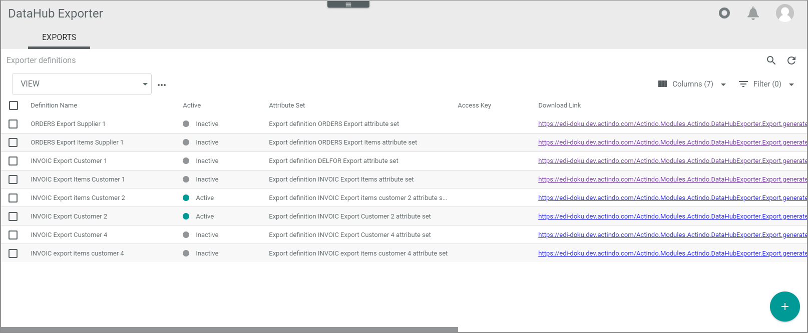

# Manage definitions 

The definition of the EDIFACT export messages specifies the following:
- Definition basic settings with template engine and the connection to be used
- Message structure with predefined data   
- Data mapping   
- Mapping settings

Each EDIFACT export message requires two definitions in the *DataHub Exporter* module:
- Definition of the message header   
    Figuratively speaking, the message header is the envelope, with which the message is sent. It contains general data such as receiver &frasl; sender information and dates.
- Definition of the line items  
    The line items contain the single positions of the message, for example the single items of an invoice. It is necessary to have a specific definition for the line items because they require another data source than the message header. 
    
First you create a definition setting. After you have defined the file settings, the data source, and the mapping settings, you can preview and activate the definition.

## Create basic definition settings 

Define basic data for the export definition. You must define a definition setting for the header as well as for the line items of a message.

#### Prerequisites

- At least one connection has been created, see [Create connection](../Integration/01_ManageConnections.md#create-connection).

#### Procedure

*DataHub Exporter > Exports*

1. Click the  (Add) button in the bottom right corner.   
    The *Create definition* view is displayed.

    

2. Enter a label for the definition. It might be useful, to choose a name that contains the following:    
        - The information, if these are the header or the line items of the message.   
        - The message type (for example, INVOIC)   
        - The direction (Export)   
        - The business partner name  
           
    For example, *INVOIC Export items "customer name"*.

3. Click the *Template engine* drop-down list and select the **XmlExportTemplateEngine**.

4. Click the *Default connection* drop-down list and select the connection to the related business partner. 

5. Define the *Access key* and click the  button. 

6. Click the [SAVE] button.   
    The *Submitting data* screen is displayed. After that, the *Exporter definitions* view is displayed again, the newly created definition is added. 

7. Repeat the procedure to create a definition setting for the line items. 

## Edit basic definition settings 

Edit basic data for the export definition. You can edit a definition setting for the header as well as for the line items of a message.

#### Prerequisites

- At least one connection has been created, see [Create connection](../Integration/01_ManageConnections.md#create-connection).
- At least one definition setting has been created, see [Create basic definition settings](#create-basic-definition-settings).

#### Procedure

*DataHub Exporter > Exports*

1. Click the definition whose settings you want to edit in the list of export definitions.   
    The *Edit definition "definition name"* view is displayed. The *SETTINGS* tab is displayed by default.

    

2. Edit the data you want to change.

3. Click the [SAVE] button.   
    The *Submitting data* screen is displayed. After that, the *Exporter definitions* view is displayed again. 

## Prepare definition of file settings

For the preparation of the file settings specifications, it is recommended to do the following:
- Create the data source.   
    This is recommended so that you can check whether variable strings to be determined automatically has been added to the list of attributes that are to be mapped. In addition, you are than able to prepare the mapping directly after you have specified a variable string. For this purpose, create the related data source(s) to be prepared. For detailed information, see [Create data source](./04_ManageDataSources.md#crate-data-source).
- Define the mapping settings.   
    This is recommended so that the necessary settings for the attribute mappings are available. For detailed information, see [Define mapping settings](./05_MappingSettings.md#define-mapping-settings).

## Preview definition

After you have configured the entire definition, you can preview the message that will be sent to the business partner. You can use this function to send it to your business partner and let him &frasl; her check, whether the message is correct.

#### Prerequisites

- At least one definition setting has been created, see [Specify header file settings](#create-basic-definition-settings).
- You have defined the file settings for this definition, see [Specify header file settings](./02_ManageHeaderFileSett.md#specify-header-file-settings) or [Specify line item file settings](./03_ManageLineItemsFileStt.md#specify-line-item-file-settings).
- You have defined the data sources for this definition, see [Create data source](./04_ManageDataSources.md#create-data-source).
- You have defined the mapping settings for this definition, see [Manage mapping settings](./05_MappingSettings.md#define-mapping-settings).

#### Procedure

*DataHub Exporter > Exports*

1. Click the checkbox of the definition you want to preview.   
    The toolbar is displayed. Alternatively, you can click the download link of a definition in the list to output the preview directly.
    The toolbar is displayed.

    

2. Click the [PREVIEW] button.   
    The window for specifying the output is displayed.

    

3. If desired, and you do not want to define the preview attributes before, click the *Export all* toggle to preview all definitions at once. Prerequisite for this is that the *Entity type* in the *Data source* definition is filled, see [Define data sources](./04_ManageDataSources.md#define-data-sources).
    The window displays the *Preview all* toggle only.

    

4. If you want to define the preview attributes before, click the *Entity type* drop-down list and select the **Retail suite business document** resp. the **Retail suite business document position** entry.

5. Enter **31** in the *Primary identifier* field.

5. Click the *OPEN PREVIEW* button. 
    The syntax of the message(s) is output in a new browser window. Copy it and send it to your business partner for validation. 

## Activate definition

Activate the definition to be able to send messages of the defined type to the business partner.

#### Prerequisites

- At least one definition setting has been created, see [Create basic definition settings](#create-basic-definition-settings).
- You have defined the file settings for this definition, see [Specify header file settings](./02_ManageHeaderFileSett.md#specify-header-file-settings) or [Specify line item file settings](./03_ManageLineItemsFileStt.md#specify-line-item-file-settings).
- You have defined the data sources for this definition, see [Define data sources](./04_ManageDataSources.md#define-data-sources).
- You have defined the mapping settings for this definition, see [Manage mapping settings](./05_MapAttributes.md#define-mapping-settings).
- You have sent the preview to the customer to validate whether the message is correct, see [Preview definition](#preview-definition).

#### Procedure

*DataHub Exporter > Exports*

1. Click the definition you want to activate
    The *Edit definition "definition name"* view is displayed. The *SETTINGS* tab is displayed by default.

    

2. Click the *Active* toggle.   
    The toggle is highlighted.

3. Click the [SAVE] button.  
    The definition is activated, and you can send messages now. 

## Deactivate definition

Deactivate a definition if you no longer need it.

#### Prerequisites

- At least one definition setting has been activated, see [Activate definition settings](#activate-definition).   

- You do no longer want to send messages of this type to your business partner.

#### Procedure

*DataHub Exporter > Exports*

1. Click the definition you want to deactivate.
    The *Edit definition "definition name"* view is displayed. The *SETTINGS* tab is displayed by default.

    

2. Click the *Active* toggle.   
    The toggle is no longer highlighted.

3. Click the [SAVE] button.  
    The definition is deactivated, and you can no longer send messages of this type to your business partner. 

## Delete definition

Delete a definition if you no longer need it. You can delete several definitions at once.

> [CAUTION] Note that you will lose the whole definition with all EDIFACT message settings, data sources, and mapping settings when deleting a definition. Alternatively, you can deactivate a definition to keep your settings, see [Deactivate definition](#deactivate-definition).

#### Prerequisites

- At least one definition has been created, see [Create definition basis settings](#).

#### Procedure

*DataHub Exporter > Exports*

1. Click the checkbox of the definition(s) you want to delete.
    The toolbar is displayed.

    

2. Click the  button.   
    The definition is deleted without preceding security query.
  
    