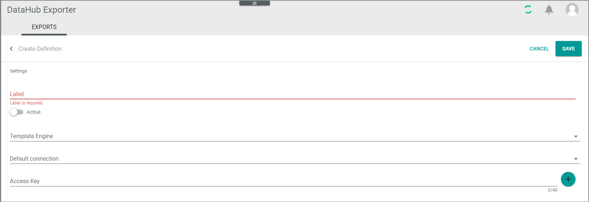

# Manage definitions 

In Actindo, the definition of the EDIFACT export messages specifies the following:
- Basic settings with template engine and connection to be used
- File settings with the message structure and related attributes   
- Data sources with attribute mappings  
- Mapping settings

Each EDIFACT export message requires two definitions in the *DataHub Exporter* module for each business partner and EDIFACT message:
- Definition of the message header   
    Figuratively speaking, the message header is the envelope, with which the message is sent. It contains general data such as receiver/sender information and dates.
- Definition of the line items  
    The line item section contains a list of single positions of the message, such as required information for each product that is part of an invoice. It is necessary to have a specific definition for the line items because they require other data sources than the message header. 

Managing of definitions follows the following sequence:   
1. You create basic definition settings, see [Create basic definition settings](#create-basic-definition-settings).   
2. You prepare the definition of file settings to make this task easier, see [Prepare definition of file settings](#prepare-definition-of-file-settings).
3. After you have added a file setting, you can preview a message, see [Preview definition](#preview-definition).
4. If desired, you can add an attribute mapping after finishing one file setting section, or you do it after finishing the whole EDIFACT message definition. 
5. If desired, you activate the definition, see.[Activate definition](#activate-definition).
6. If desired, you can deactivate or delete a definition, see [Deactivate definition](#deactivate-definition) and [Delete definition](#delete-definition).

## Create basic definition settings 

Define basic data for the export definition. You must define a definition setting for both the header and the line items of a message.

#### Prerequisites

- At least one connection has been created, see [Create connection](../Integration/01_ManageConnections.md#create-connection).

#### Procedure

*DataHub Exporter > Exports*

*

1. Click the  (Add) button in the bottom right corner.   
    The *Create definition* view is displayed.

    

2. Enter a label for the definition. It might be useful, to choose a name that contains the following:      
    - The information that it is an EDIFACT message. Note that the labels are visible in the *ETL attribute set mappings* of the *DataHub* module later. So it might be useful to distinguish these attribute set mappings from others by prefixing them with "EDIFACT".   
    - The information, if it is the header or the line items of the message.   
    - The message type (for example, INVOIC)   
    - The direction (Export)   
    - The business partner name  
         
      For example, *EDIFACT INVOIC Export "business partner name"* or *EDIFACT INVOIC Export items "business partner name"*.

3. Click the *Template engine* drop-down list and select the **XmlExportTemplateEngine**.   
    The view has been changed. Two tabs are inserted now, the *Settings* tab and the *File settings* tab. The *Settings* tab is displayed.

    

4. Click the *Default connection* drop-down list and select the connection to the related business partner. 

5. Enter the access key of your connection in the *Access key* field.
<!--- Julian, muss man das hier tun?Was ist das für ein Key?-->

5. Change to the *File settings* tab.  
    The *File Settings* tab is displayed.

    

6. Click the *Release* drop-down list and select the EDIFACT version to which you want to refer. Information on the relevant version is available in the implementation guide of your business partner.

7. Click the *Message type* drop-down list and select the message type which you want to set up, for example INVOIC.

8. Click the [SAVE] button.   
    - The *Submitting data* screen is displayed. After that, the *Exporter definitions* view is displayed again, the newly created definition is added. 
    - An attribute set has been created automatically and has been added to the attribute sets of the *DataHub* module. 
    - If you now open the definition again for editing, both the *Data Sources* tab and the *Mapping settings* tab is displayed. 

9. Repeat the procedure to create a definition setting for the line items. 

## Edit basic definition settings 

Edit basic data for the export definition. You can edit a definition setting for the header as well as for the line items of a message.

#### Prerequisites

- At least one connection has been created, see [Create connection](../Integration/01_ManageConnections.md#create-connection).
- At least one definition setting has been created, see [Create basic definition settings](#create-basic-definition-settings).

#### Procedure

*DataHub Exporter > Exports*

1. Click the definition whose settings you want to edit in the list of export definitions.   
    The *Edit definition "definition name"* view is displayed. The *SETTINGS* tab is displayed by default.

    

2. Edit the data you want to change.

3. Click the [SAVE] button.   
    The *Submitting data* screen is displayed. After that, the *Exporter definitions* view is displayed again. 

## Prepare definition of file settings

To make your EDIFACT file settings specifications easier, it is recommended to do the following:
- Create the data source.   
    This is recommended so that you can better organize the task to do the file settings and the data mapping. If you create the data source before you start with the file settings task, you can check in between whether variable strings to be automatically determined has been added to the list of attributes that are to be mapped later. In addition, you are than able to prepare the mapping directly after you have specified a variable string. For detailed information, see [Create data source](./04_ManageDataSources.md#create-data-source).
- Define the mapping settings.   
    This is recommended so that the necessary settings for the attribute mappings are available. For detailed information, see [Define mapping settings](./05_MappingSettings.md#define-mapping-settings).

## Preview definition

After you have configured the entire definition including the file settings, you can preview the message that will be sent to the business partner. You can use this function both to verify your settings in between and to send it to your business partner and let him/her check whether the message is correct.

#### Prerequisites
- At least one connection has been created, see [Create connection](../Integration/01_ManageConnections.md#create-connection).
- At least one definition setting has been created, see [Create basic definition settings](#create-basic-definition-settings).
- You have defined the file settings for this definition, see [Specify header file settings](./02_ManageHeaderFileSett.md#specify-header-file-settings) and [Specify line item file settings](./03_ManageLineItemsFileStt.md#specify-line-item-file-settings).
- You have defined the data sources for this definition, see [Create data source](./04_ManageDataSources.md#create-data-source).
- You have defined the mapping settings for this definition, see [Manage mapping settings](./05_MappingSettings.md#define-mapping-settings).

#### Procedure

*DataHub Exporter > Exports*

1. Click the checkbox of the definition you want to preview. Alternatively, you can click the *Download link* of a definition in the list to output the preview directly.   
    The toolbar is displayed. 
    

    

2. Click the [PREVIEW] button.   
    The window for specifying the output is displayed.

    

<!----Weglassen? 
3. If desired, and you do not want to define the preview attributes before, click the *Export all* toggle to preview all definitions at once. Prerequisite for this is that the *Entity type* in the *Data source* definition is filled, see [Define data sources](./04_ManageDataSources.md#define-data-sources).
    The window displays the *Preview all* toggle only.

    -->

3. Click the *Entity type* drop-down list and select the **Retail suite business document** resp. the **Retail suite business document position** entry. Alternatively, you can use any other data source or entity types that is suitable for sending the EDIFACT messages.

4. Enter **31** in the *Primary identifier* field.

5. Click the [OPEN PREVIEW] button. 
    The syntax of the message(s) is output in a new browser window. 

6. Copy the output and send it to your business partner for validation. 

## Activate definition

Activate the definition to be able to send EDIFACT messages to the business partner.

#### Prerequisites

- At least one definition setting has been created, see [Create basic definition settings](#create-basic-definition-settings).
- You have defined the file settings for this definition, see [Specify header file settings](./02_ManageHeaderFileSett.md#specify-header-file-settings) and [Specify line item file settings](./03_ManageLineItemsFileStt.md#specify-line-item-file-settings).
- You have defined the data sources for this definition, see [Define data sources](./04_ManageDataSources.md#define-data-sources).
- You have defined the mapping settings for this definition, see [Manage mapping settings](./05_MapAttributes.md#define-mapping-settings).
- You have sent the preview to the customer to validate whether the message structure is correct and sufficient, see [Preview definition](#preview-definition).

#### Procedure

*DataHub Exporter > Exports*

1. Click the definition you want to activate.   
    The *Edit definition "definition name"* view is displayed. The *SETTINGS* tab is displayed by default.

    

2. Click the *Active* toggle.   
    The toggle is highlighted.

    

3. Click the [SAVE] button.  
    The *Exporter definitions* view is displayed. The status in the *Active* column has switched to *Active*. The definition is activated, and you can send messages now. 

## Deactivate definition

Deactivate a definition if it is no longer needed. We recommend deactivating a no longer needed definition instead of deleting it.

#### Prerequisites

- At least one definition setting has been activated, see [Activate definition settings](#activate-definition).   

- You no longer want to send messages of this type to your business partner.

#### Procedure

*DataHub Exporter > Exports*

1. Click the definition you want to deactivate.   
    The *Edit definition "definition name"* view is displayed. The *SETTINGS* tab is displayed by default.

    

2. Click the *Active* toggle.   
    The toggle is no longer highlighted.

3. Click the [SAVE] button.  
    The definition is deactivated, and you can no longer send messages of this type to your business partner. 

## Delete definition

Delete a definition if you no longer need it and you want to clear your definition list. You can delete several definitions at once.

> [CAUTION] Note that you will lose the whole definition with all EDIFACT message settings, data sources, and mapping settings when deleting a definition. Alternatively, you can deactivate a definition to keep your settings, see [Deactivate definition](#deactivate-definition).

#### Prerequisites

- At least one definition has been created, see [Create definition basis settings](#).

#### Procedure

*DataHub Exporter > Exports*

1. Click the checkbox of the definition(s) you want to delete.   
    The toolbar is displayed.

    

2. Click the  button.   
    The definition is deleted without preceding security query.
  
    