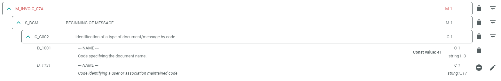
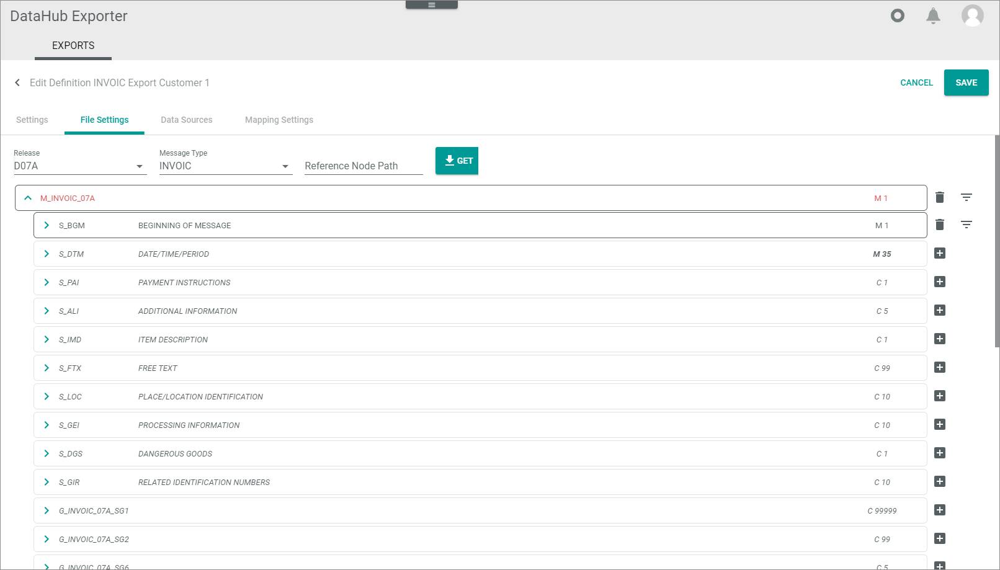
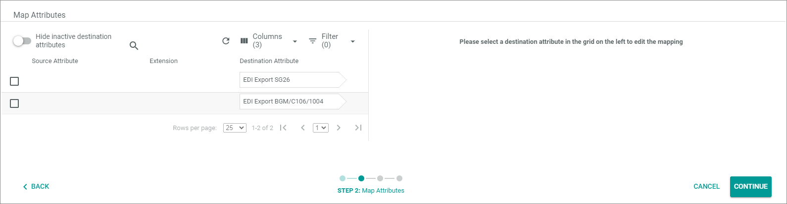
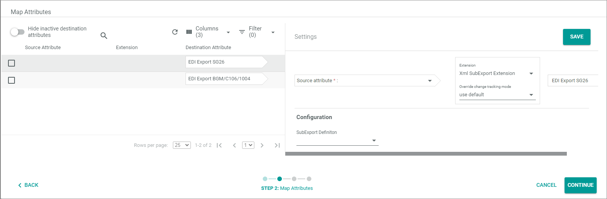

# Manage header file settings

The following procedures show by using an example how to specify the fields required by your business partner. As example the D07A INVOIC message is used.
>[INFO] The following procedures show by using examples how to specify specific header segments of the EDIFACT message. Follow the guidelines of your business partner when specifying the EDIFACT message. 

## Get header file segments

Get the header file segments of an EDIFACT message in order to be able to fill them with data.  

You can add constant values as well as strings that are to be determined via attribute mapping. For example, the document number is a variable value that must differ for each message. 

> [INFO] The UNA, UNB and UNH segments are generated automatically, for this reason, the definition starts with the S_BGM segment.

#### Prerequisites

- You have the message specification of your business partner at hand.
- You have created the basic definition settings for this type of message and business partner, see [Create basic definition settings](./01_ManageDefinitions.md#create-basic-definition-settings).

#### Procedure

*DataHub Exporter > EXPORTS tab*

1. Click the definition for which you want to specify the header file settings.   
    The *Edit definition "definition name"* view is displayed. The *Settings* tab is displayed by default.

    

2. Click the *File settings* tab.   
    The *File settings* tab is displayed.

     

3. Click the *Release* dropdown list and select the required EDIFACT release. In our example, it is **D07a**.

4. Click the *Message type* dropdown list and select the required EDIFACT message type. In our example, it is **INVOIC**. You can use the search function on top of the dropdown list.

5. Click the  [GET] button.   
    The message structure is displayed. The message name is highlighted in red because it is still empty.

    

6. Expand the message structure by clicking the  (Collapsed) button.   
    The message structure with its single segments is displayed. The  (Collapsed) button has changed to an  (Expanded) button.

    

7. Click the [SAVE] button.   
    The *Exporter definitions* view is displayed.

## Specify message name &frasl; constant text value

Start specifying the header file segments by filling out the single elements of the BGM (Beginning of message) segment. This procedure shows how to edit a constant text value, for example the transaction type *Commercial invoice* that specifies the type of the INVOIC message.

#### Prerequisites

- You have expanded the message structure, see [Get header file segments](#get-header-file-segments).

#### Procedure

*DataHub Exporter > EXPORTS tab > Select message definition > File settings tab > Expand message structure*

1. Expand the S_BGM segment by clicking the  (Collapsed) button at the *S_BGM* segment.   
    The S_BGM segment in turn consists of subordinate segments and fields.

    

2. Expand the *S_BGM C002* (Document/message name) segment by clicking the  (Collapsed) button at the *S_BGM C_C002* segment. In most cases it is mandatory to specify this segment.   
    The *S_BGM C_C002* segment has been expanded. The individual fields of this segment are displayed.

    

3. Check the specification for the fields that are required to be filled. In most cases, you must fill the *1001* field (Document name code). This is a constant value for which your business partner may have specified predefined codes for the document type.

4. Click the  button to the right of the *D_1001* row.  
    The *Set text value* window is displayed.

    

5. Enter the required document name code in the *Text value* field.

6. Click the [SAVE] button.   
    - The *Edit definition "Definition name"* view is displayed. 
    - To the right of the *D_1001* row the (Delete attribute) button is available only, with which you can remove your new entry, if desired. The field name and description are no longer displayed in italics.  
    - The *S_BGM C_C002* segment is now highlighted with a small black border. This indicates that the segment contains data.  
    - To the right of the *S_BGM C_C002* segment, the (Delete attribute) button is available with which you can remove all data contained in the segment at once.

      

## Specify document number &frasl; string attribute

Specify the header file segments by filling out the single elements of the BGM (Beginning of message) segment.   

This procedure shows how to edit a string attribute. A string attribute is used to specify a value that is variable and unique, for example, a document number that must be dynamically determined by *Actindo*. You must specify the string attributes by a data source mapping later.

#### Prerequisites

- You have expanded the message structure, see [Get header file segments](#get-header-file-segments).

#### Procedure

*DataHub Exporter > EXPORTS tab > Select message definition > File settings tab > Expand message structure*

1. Expand the S_BGM segment by clicking the  (Collapsed) button at the *S_BGM* segment.   
    The S_BGM segment in turn consists of subordinate segments and fields.

    

2. Expand the *S_BGM C_C106* (Document/message identification) segment by clicking the  (Collapsed) button at the *S_BGM C_C106* segment. In most cases it is required to specify this segment.   
    The *S_BGM C_C106* segment has been expanded. The individual fields of this segment are displayed.

    

3. Check the specification for the fields that are required to be filled. In most cases, you must fill the document number in the *D_1004* row (to identify a document). This is a numerical value that must be unique. For this reason, it is to be determined dynamically by a data source mapping. 

4. Click the  button to the right of the *D_1004* row.   
     - To the right of the *D_1004* row, only the (Delete attribute) button is available now, with which you can remove the data, if required. The field name and description are no longer displayed in italics.  
    - The *S_BGM C_C106* segment is now highlighted with a small black border. This indicates that the segment contains data.   
    - The string attribute has been marked for a later data mapping.

6. Click the [SAVE] button to save the message structure.   
    The *Exporter definitions* view is displayed. All defined string attributes are added to the attribute mapping function in the *Data source* tab.

5. If desired, check if the string attribute has been really marked for a later data mapping.   
    The EDI Export BGM/C106/1004 *Destination attribute* has been added to the attributes to be mapped later or directly afterwards, if desired. For detailed information, see [Map attributes](./04_ManageDataSources.md#map-attributes). 

    

## Specify message dates

Each invoice can have a lot of different dates, for example the invoice date, the expected delivery date, the tax point date, and much more. The Actindo EDIFACT message structure contains only one BTM segment in the raw state. However, for many business partners, multiple BTM segments must be completed. As soon as you have specified one value in a BTM segment, a further BTM segment is added automatically so that you can specify as much BTM segments as your business partner require.

#### Prerequisites

- You have expanded the message structure, see [Get header file segments](#get-header-file-segments).

#### Procedure

*DataHub Exporter > EXPORTS tab > Select message definition > File settings tab > Expand message structure*

1. Expand the *S_DTM* (DATE &frasl; TIME &frasl; PERIOD) segment by clicking the  (Collapsed) button at the *S_DTM* segment.   
    The *S_DTM* segment in turn consists of the subordinate *C_C507* segment.

2. Expand the *C_C507* (Date and &frasl; or time, or period relevant to the) segment by clicking the  (Collapsed) button at the *C_C507* segment. In most cases it is required to specify this segment.   
    The *C_C507* segment has been expanded. The individual fields of this segment are displayed.

    

3. Specify the *D_2005 (Date or time or period function code qualifier)* field. In most cases, a constant value is required here. To do this, click the  (Set constant value) button to the right of the *D_2005* row.  
    The *Edit text value* window is displayed.

    
 
4. Enter the text value and click the [SAVE] button.   
    A new *S_DTM* segment has been added below the *S_DTM* segment you are currently working on.

5. Specify the *D_2380 (Date or time or period text)* field. In most cases, a string attribute is required here. To do this, click the  (Add string attribute) button to the right of the *D_2380* row.    
    The *D_2380* field is marked for a later data mapping. 

6. Specify the *D_2379 (Date or time or period format code)* field. In most cases, a constant value is required here. To do this, click the  (Set constant value) button to the right of the *2005* row.  
    The *Set text value* window is displayed. 

7. Enter the text value and click the [SAVE] button.   
    This *S_DTM* segment has been finished. 

8. Click the [SAVE] button to save the message structure.   
    The *Exporter definitions* view is displayed.

9. If desired, check if the string attribute has been really marked for a later data mapping. For detailed information, see [Map attributes](./04_ManageDataSources.md#map-attributes).   
    The EDI Export DTM/C507/2380 *Destination attribute* has been added to the attributes to be mapped later or directly afterwards, if desired.

     
 
10. Now continue specifying the required DTM file segments.

## Specify message free texts

Specify message free text, with which you can inform your business partner on individual subjects.  This procedure shows how to add individual textual information as well as to add additionally required segments.

#### Prerequisites

- You have expanded the message structure, see [Get header file segments](#get-header-file-segments).

#### Procedure

*DataHub Exporter > EXPORTS tab > Select message definition > File settings tab > Expand message structure*

1. Expand the *S_FTX* (FREE TEXT) segment by clicking the  (Collapsed) button at the *S_FTX* segment.   
    The *S_FTX* segment in turn consists of the subordinate *C_C107* and *C_C108* segments.

    

2.  Specify the *D_4451 (Code qualifying the subject of the text)* field. In most cases, a constant value is required here. To do this, click the  (Set constant value) button to the right of the *D_4451* row.  
    The *Set text value* window is displayed. 

    
 
3. Enter the text code and click the [SAVE] button. 

4. Expand the *C_C108 (Free text; one to five lines)* segment by clicking the  (Collapsed) button at the *C_C108* segment.

5. Enter a free text in the *C_4440* line. To do this, click the  (Set constant value) button to the right of the *C_4440* row.  
    The *Set text value* window is displayed.

6. Enter the free text, for example "Please note our changed bank details". You can enter up to five lines.

7. Click the [SAVE] button.
   The message structure is displayed.

8. Specify the language used in the *D_3453 (Code specifying the language name)* line. To do this, click the  (Set constant value) button to the right of the *D_3453* row and specify the language code in the *Set text value* window.  
    
9. Collapse the *S_FTX* segment by clicking the  (Expanded) button to the right of the *S_FTX* segment row.   
    The segment is collapsed.

10. If desired, add further *S_FTX* segments by clicking the  (Add XML attribute) button.   
    An additional *S_FTX* segment is added below the currently processed segment.

    

11. Continue specifying the header file segments until you have specified all fields that your business partner require. By doing this, do not specify the segments that are relevant for the line item export. For the INVOIC, it is the SG26 or SG27 segment that contains the S_LIN specification for the line item export. For detailed information, see below the [Prepare line item export](#prepare-line-item-export).

## Prepare line item export

In order to be able to export the individual line items of an invoice, the relevant line item group of an EDIFACT message must be specified to be exported as a whole. You have to do this here in the header definition file settings.  
After you have prepared the line item export, you can define the definition for the line items, see [Manage definitions](./01_ManageDefinitions.md).

#### Prerequisites

- You have expanded the message structure, see [Get header file segments](#get-header-file-segments).

#### Procedure

*DataHub Exporter > EXPORTS tab > Select message definition > File settings tab > Expand message structure*

1. Check the EDIFACT message structure, in which group the LIN segment is available. In newer versions of the INVOIC, the LIN segment is included in group 27, in older versions it is in group 26.

2. Scroll down in the message structure until you have found the relevant group, *G_INVOIC_07A_SG26* or *G_INVOIC_07A_SG27*.

3. Click the  (Add XML attribute) button to the right of the *G_INVOIC_07A_SG26* resp. *G_INVOIC_07A_SG27* row. 
    - The segment is highlighted with a small black border. You cannot expand it.      
    - Another *G_INVOIC_07A_SG26* or *G_INVOIC_07A_SG27* row has been added. You can ignore it.      
    - The EDI Export SG26/SG27 *Destination attribute* has been marked for a later data mapping.

4. Click the [SAVE] button.    
   The *Exporter definitions* view is displayed.

5. If desired, check if the group has been really marked for a later data mapping. For detailed information, see [Map attributes](./04_ManageDataSources.md#map-attributes).   
    The EDI Export SG[Group name] *Destination attribute* has been added to the attributes to be mapped later or directly afterwards, if desired.

     

6. Click the EDI Export SG26/SG27 row and define the mapping.    
   The settings section is displayed.

    

     a. Click the *Source attribute* dropdown and select *Positions* or another attribute that represents a line item. 

     b. Click the *Extension* dropdown and select the *XML SubExport* extension.

     c. Click the *Override change tracking mode* dropdown and select *Use default*.

     d. In the *Configuration* section, click the *Subexport definition* and select the definition you currently specify.  

7. Click the [SAVE] button

8. Finalize the *Map attributes* wizard by clicking the [CONTINUE] button until you can click the [FINALIZE] button.
  
8. Click the [SAVE] button to save the header definition.   
   The *Exporter definitions* view is displayed.

## Edit header file settings

To edit the header file settings, you must remove the data you have provided for a segment respectively a segment row before you can change the data.

#### Prerequisites

- You have expanded the message structure, see [Get header file segments](#get-header-file-segments).

#### Procedure

*DataHub Exporter > EXPORTS tab > Select message definition > File settings tab > Expand message structure*

**Remove data from the whole segment**

1. If you want to remove the data from a whole segment, click the (Delete attribute) button to the right of the corresponding segment.   
    The (Delete attribute) button is replaced by the  (Add XML attribute) button.   
    The segment is no longer highlighted with a small black border, the data are removed from the segment.

2. Start specifying again the segment with new data.

3. Click the [SAVE] button to save the header definition.   
    The *Exporter definitions* view is displayed.

**Remove data from a segment row**

1. If you want to remove data from a segment row, expand the corresponding segment by clicking the  (Collapsed) button at the segment.   

2. Click the (Delete attribute) button to the right of the row, from which you want to remove the data.   
    The (Delete attribute) button is replaced both by the  (Add string attribute) button and the  (Set constant value) button.

3. Start specifying again the row with new data.
  
4. Click the [SAVE] button to save the header definition.    
   The *Exporter definitions* view is displayed.

    