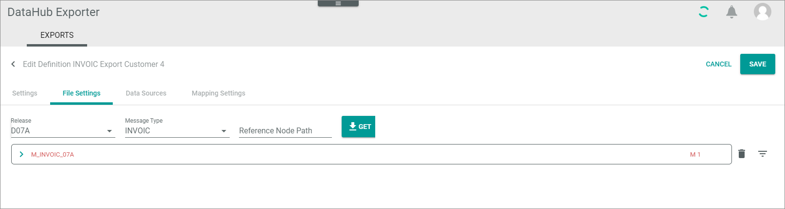
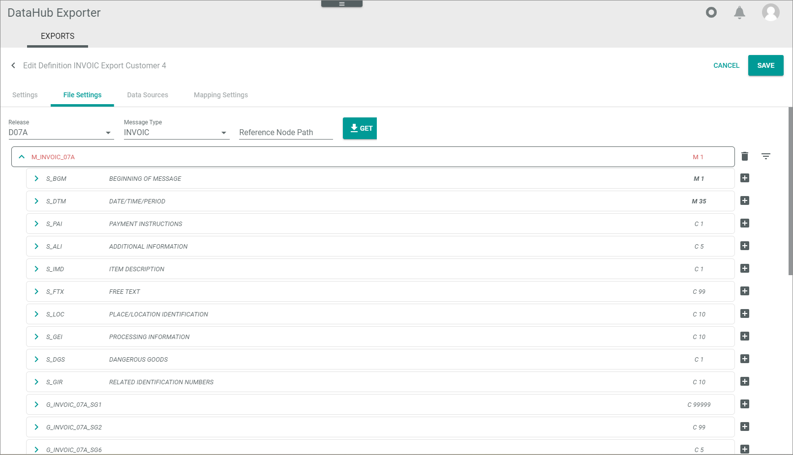

# Specify line item file settings

Enter the reference node path

/M_INVOIC_07A/G_INVOIC_07A_SG26

SG26 = Sequence number

## Get line item segments

Get the line item segments of an EDIFACT message in order to be able to fill them.  
  
You can add constant values as well as strings that are to be determined via attribute mapping later. 

#### Prerequisites

- You have the message specification of your business partner at hand.
- You have created the basic definition settings for this type of message and business partner, see [Create basic definition settings](./01_ManageDefinitions.md#create-basic-definition-settings).

#### Procedure

*DataHub Exporter > EXPORTS tab*

1. Click the definition for which you want to specify the line item settings.
    The *Edit definition "definition name"* view is displayed. The *Settings* tab is displayed by default.

    

2. Click the *File settings* tab.

    BILD ERGÄNZEN MIT OHNE MESSAGE

3. Click the *Release* drop-down list and select the EDIFACT version to which you want to refer. Information on the relevant version is available in the implementation guide of your business partner.

4. Click the *Message type* drop-down list and select the message type which you want to set up, for example INVOIC.

5. Enter the *Reference node path*. Use the following syntax    
    /M_<Message type, for example INVOIC>_<EDIFACT version number (last three digits)>/ G_<Message type, for example INVOIC>_<EDIFACT version number (last three digits)_SG26. 
    /M_INVOIC_07A/G_INVOIC_07A_SG26

5. Click the [GET] button.   
    The *Reference node path* as well as the message is displayed. The message name is highlighted in red because it is still empty.

    

6. Expand the message by clicking the  (Collapsed) button.   
    The message structure with its single segments is displayed. The  (Collapsed) button has changed to an  (Expanded) button.

    
BILD NEU MACHEN OHNE MARKIERUNGEN

## Specify line items

>[INFO] The following procedures show by using examples how to specify specific line item segments of the EDIFACT message. Follow the guidelines of your business partner when specifying the EDIFACT message! 