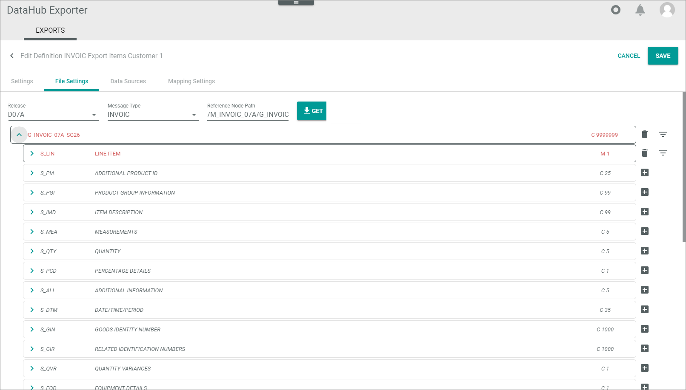

# Specify line item file settings

The following procedures show by using an example how to specify the line item fields required by your business partner. As example the D07A INVOIC message is used.
>[INFO] The following procedures show by using examples how to specify specific line item of the EDIFACT message. Follow the guidelines of your business partner when specifying the EDIFACT message!   

For detailed information on examples how to define constant text values, string attributes, dates, and free texts, see [Specify header file settings](./02_ManageHeaderFileSett.md).

## Get line item segments

Get the line item segments of an EDIFACT message in order to be able to fill them. Example: The document position number is a variable value that must differ for line item. 
You can add constant values as well as strings that are to be determined via attribute mapping later. 

#### Prerequisites

- You have the message specification of your business partner at hand.
- You have created the basic definition settings for the line items for this type of message and business partner, see [Create basic definition settings](./01_ManageDefinitions.md#create-basic-definition-settings).

#### Procedure

*DataHub Exporter > EXPORTS tab*

1. Click the definition for which you want to specify the line item settings.
    The *Edit definition "definition name"* view is displayed. The *Settings* tab is displayed by default.

    

2. Click the *File settings* tab.   
    The *File settings* tab is displayed.

     

3. Enter the *Reference node path*. Use the following syntax:    
    /M_[Message type, for example INVOIC]\_[EDIFACT version number (last three digits)]/ G\_[Message type, for example INVOIC]\_[EDIFACT version number (last three digits)]\_SG[Group number].     
    For example: /M_INVOIC_07A/G_INVOIC_07A_SG26*   
    Alternatively, you can copy the two parts from the header file message structure.   
    >[INOF] Note, depending on the EDIFACT version, the line items (LIN segment) are included in different groups, for example the SG26 or the SG27 group.
 
4. Click the  [GET] button.   
    Both the *Reference node path* and the message structure of the SG26 &frasl; SG27 group is displayed. The segment is highlighted in red because it is still empty.    
    It starts with the SG26 or SG27 element. Note, in the header definition file settings, after saving, you are no longer able to expand the *G_INVOIC_07A_SG26* or *G_INVOIC_07A_SG27* group.

    

6. Expand the message structure by clicking the  (Collapsed) button.   
    The message structure with its single segments is displayed, it starts with the S_LIN segment. The  (Collapsed) button has changed to an  (Expanded) button.

    

7. Click the [SAVE] button.
    You have saved the line item segments. The *Exporter definitions* view is displayed. 

## Specify line item identifier

Start specifying the line item segments by filling out the single elements of the S_LIN (Line item) segment. This procedure shows how to edit the position number on the invoice.

#### Prerequisites

- You have expanded the message structure, see [Get header file segments](#get-header-file-segments).

#### Procedure

*DataHub Exporter > EXPORTS tab > Select message definition > File settings tab > Expand message structure*

 

1. Expand the S_LIN segment by clicking the  (Collapsed) button at the *S_LIN* segment.   
    The S_LIN segment in turn consists of subordinate segments and fields.

    

2. Check the specification for the fields that are required to be filled. In most cases, you must fill the line item identifier in the *D_1082* row (to identify a line item). This is a numerical value that must be unique. For this reason, it is to be determined dynamically by a data source mapping. 

3. Click the  (Add string attribute) button to the right of the *D_1082* row.   
     - To the right of the *D_1082* row only the (Delete attribute) button is available now, with which you can remove the data, if required. The field name and description is no longer displayed in italics.  
    - The *S_LIN* segment is now highlighted in red. This indicates that the segment contains data, but not all required data for the EDIFACT message structure are filled.   
    - The string attribute has been marked for a later data mapping.

    

 4. Click the [SAVE] button to save the message structure.   
    The *Exporter definitions* list is displayed. The defined string attribute is mow added to the attribute mapping function in the *Data source* tab.

5. If desired, check whether the string attribute has been really marked for a later data mapping. For detailed information, see [Map attributes](./04_ManageDataSources.md#map-attributes).   
    The EDI Export LIN/1082 *Destination attribute* has been added to the attributes to be mapped later or directly afterwards, if desired.

    

