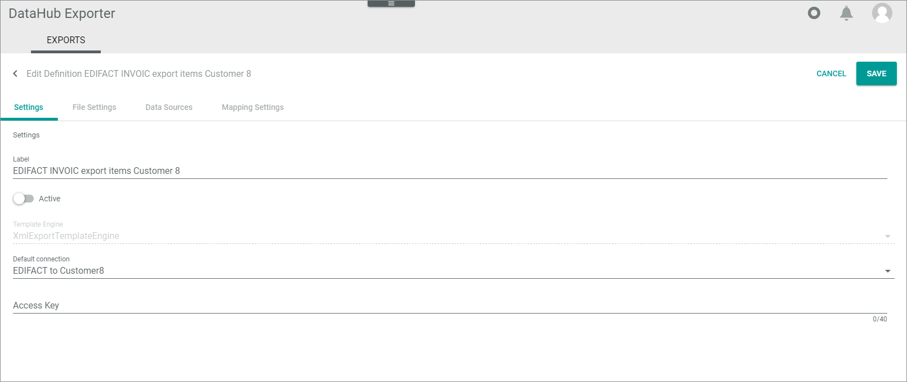
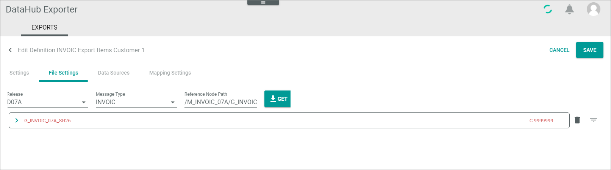

[!!Exports](../UserInterface/01_Exports.md)

# Manage line item file settings

The following procedures show by using an example how to specify the line item section required by your business partner. As example the D07A INVOIC message is used.

For detailed information on examples how to define constant text values, string attributes, dates, and free texts, see [Specify header file settings](./02_ManageHeaderFileSett.md).

## Prepare data mapping for the line items

Prepare the data mapping for the line items so that the relevant data for the mapping is available to retrieve the line items.

#### Prerequisites

- You have defined both the definitions for the header and the line items, see [Create basic definition settings](./01_ManageDefinitions.md#create-basic-definition-settings).
- You have prepared the line item export, see [Prepare line item export](./02_ManageHeaderFileSett.md#prepare-line-item-export).

#### Procedure

*DataHub Exporter > Exports*

1. Click the header export definition for which you want to prepare the data mapping for the line items.   
    The *Edit definition "Definition name"* view is displayed. The *Settings* tab is displayed by default.

2. Click the *Data sources* tab.   
    The *Data sources* tab is displayed.  

    

3. Click the data source, for which you want to map the segment for the line items.   
    - The *Map attributes* wizard window is displayed.     
    - In the *Destination attribute* column, a list of all EDI segment rows is displayed for which you have defined a string attribute.    
    - The EDI export SG26/SG27 is available.

        

6. Click the *EDI Export SG26/SG27* destination attribute and define the mapping.    
   The settings section is displayed on the right.

    
   
     -  Click the *Extension* drop-down list and select the **XML SubExport** extension.   
     Both the "Source attribute" and the *Configuration* section is displayed in the left part of the *Settings* section.

     - Click the *Override change tracking mode* drop-down list and select the desired one.

     -  On the left part of the *Settings* section, click the *Source attribute* drop-down list and select **Positions** or another attribute that represents a line item. 

     -  In the *Configuration* section, click the *Subexport definition* drop-down list and select the required line item definition, for example **EDIFACT INVOIC export items customer 12.**
     
          

7. Click the [SAVE] button in the top right corner of the wizard.   
    The *Please select a destination attribute in the grid on the left to edit the mapping* text is displayed.

8. Finalize the *Map attributes* wizard by clicking the [CONTINUE] button until you can click the [FINALIZE] button.
  
9. Click the [SAVE] button to save the header definition.   
   The *Exporter definitions* view is displayed.

## Get line item segments

Get the line item segments of an EDIFACT message in order to be able to fill them. You can add constant values as well as strings and conditions that are to be determined via attribute mapping later. 

#### Prerequisites

- You have the message specification of your business partner at hand.
- You have created the basic definition settings for the line items for this type of message and business partner, see [Create basic definition settings](./01_ManageDefinitions.md#create-basic-definition-settings).
- You have prepared the line item export in the header file definition, see [Prepare line item export](./02_ManageHeaderFileSett.md#prepare-line-item-export).
- You have prepared the data mapping for the line items, [Prepare data mapping for the line items](#prepare-data-mapping-for-the-line-items).

#### Procedure

*DataHub Exporter > EXPORTS tab*

1. Click the definition for which you want to specify the line item settings.   
    The *Edit definition "definition name"* view is displayed. The *Settings* or the last opened tab is displayed.

    

2. Click the *File settings* tab.   
    The *File settings* tab is displayed.

     

3. Click the *Release* drop down list and select the required EDIFACT release. In our example, it is **D07a**.

4. Click the *Message type* drop-down list and select the required EDIFACT message type. In our example, it is **INVOIC**. You can use the search function on top of the drop-down list.

5. Enter the *Reference node path*. Use the following syntax:    
    /M_[Message type, for example INVOIC]\_[EDIFACT version number (last three digits)]/ G\_[Message type, for example INVOIC]\_[EDIFACT version number (last three digits)]\_SG[Group number].     
    For example: /M_INVOIC_07A/G_INVOIC_07A_SG26   
    Alternatively, you can copy the two parts from the header file message structure.  

    >[Info] Note that the line items (LIN segment) are included in separate groups, such as the SG26 or SG27 group for the INVOIC.

    

 
6. Click the  [GET] button.   
    The message structure of the SG26/SG27 group is displayed. The segment is highlighted in red because it is still empty.    
    It starts with the SG26/SG27 element. Note that in the header definition file settings, after saving, you are no longer able to expand the *G_INVOIC_07A_SG26* or *G_INVOIC_07A_SG27* group.

    

7. If desired, expand the message structure by clicking the  (Collapsed) button.   
    The message structure with its single segments is displayed. It starts with the S_LIN segment. The  (Collapsed) button has changed to an  (Expanded) button.

    

8. Click the [SAVE] button.   
     - The *Exporter definitions* view is displayed.   
     - If you now open the definition again for editing, both the *Data Sources* tab and the *Mapping settings* tab is additionally displayed. 

## Specify line item number

Start specifying the line item segments by filling out the single elements of the S_LIN (Line item) segment. This procedure shows how to edit the line item number on the invoice, so that each invoice line item gets a unique and ascending number.

#### Prerequisites

- You have expanded the message structure of the line item definition, see [Get line item segments](#get-line-item-segments).

#### Procedure

*DataHub Exporter > EXPORTS tab > Select message definition > File settings tab > Expand message structure*

 

1. Expand the S_LIN segment by clicking the  (Collapsed) button at the *S_LIN* segment.   
    The S_LIN segment in turn consists of subordinate segments and fields.

    

2. Check the specification for the fields that are required to be filled. In most cases, you must fill the line item identifier in the *D_1082* row (to identify a line item). This is an ascending numeric value that must be unique for each invoice. For this reason, it is to be determined dynamically by a data source mapping. 

3. Click the  (Add string attribute) button to the right of the *D_1082* row.   
     - To the right of the *D_1082* row only the (Delete attribute) button is available now, with which you can remove the data, if required. The field name and description are no longer displayed in italics.  
    - The *S_LIN* segment is now highlighted in red. This indicates that the segment contains data, but not all required data for the EDIFACT message structure is filled.   
    - The string attribute has been marked for a later data mapping.

    

4. Click the [SAVE] button to save the message structure.   
    The *Exporter definitions* list is displayed. The defined string attribute is now added to the attribute mapping function in the *Data sources* tab.

5. Open the line item definition again and click the *Data sources* tab.   
    The *EDI Export LIN/1082* destination attribute has been added to the attributes to be mapped.

    

 
6. Click the *EDI Export LIN/1082* destination attribute.    
   In the *Settings* section on the right, configuration options are displayed.

     - Click the *Extension* dropdown list and select the **Mathematical expression** (former arithmetic extension) entry.  
         The section for selecting a source attribute is displayed.

     - Click the **Override change tracking** mode and select the desired mode.

     - On the left side of the *Settings* section, click the drop-down list to select a source attribute that specifies the line item number, for example **positionNumber**.

     - In the *Configuration* section, enter **x1+1** in the *Equitation 1* field.

      

7. Click the [SAVE] button in the top right corner of the wizard and finalize the *Map attributes* wizard by clicking the [CONTINUE] button until you can click the [FINALIZE] button.

8. Click the [SAVE] button to save the header definition.   
   The *Exporter definition sources* view is displayed.

9. Continue with specifying the line items file settings. For detailed information on examples how to define constant text values, string attributes, dates, conditions, and free texts, see [Manage header file settings](./02_ManageHeaderFileSett.md#).

